# HNSW图的构建（Faiss 1.8.0）

本篇介绍下[Faiss](https://github.com/facebookresearch/faiss/wiki)中如何基于HNSW图存储向量，同样基于论文：[Efficient and robust approximate nearest neighbor search using Hierarchical Navigable Small World graphs [2018]](https://arxiv.org/abs/1603.09320)，建议先看下在Lucene中实现：[HNSW图的构建（Lucene 9.8.0）](https://amazingkoala.com.cn/Lucene/Index/2024/0118/HNSW图的构建/)，因此一些HNSW中的通用概念不在本文中赘述，例如**入口节点**、**目标层级**等等。[HNSW图的构建（Lucene 9.8.0）](https://amazingkoala.com.cn/Lucene/Index/2024/0118/HNSW图的构建/)偏向于理论的介绍（很重要），而本篇文章更多会介绍代码中的一些数据结构。

NSW图的构建流程图如下所示：

图1：

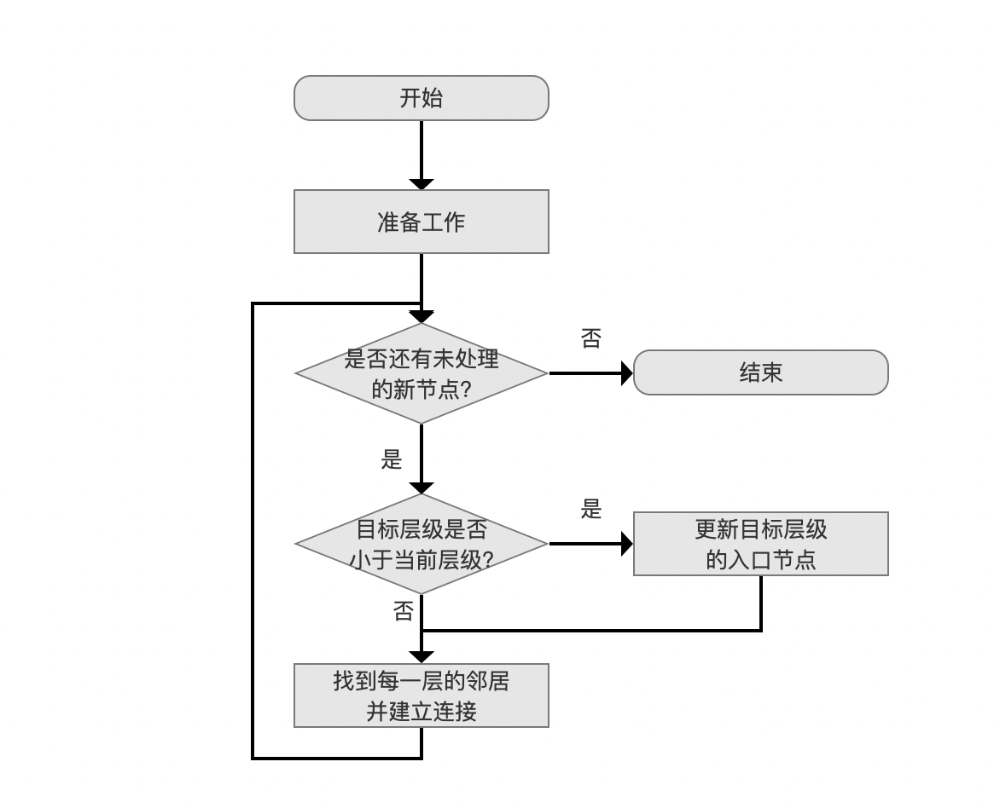

## 准备工作

图2：


节点（向量）插入到图中之前，需要初始化一些数据结构，了解这些数据结构才能掌握写入/读取节点以及节点邻居的过程。需要初始化的结构有以下几个Vector容器：

- **`std::vector<int32_t> neighbors`**：当所有的节点添加到HNSW图中后，所有节点在所有层的邻居使用`neighbors`容器保存，每个节点的所有层的邻居使用`neighbors`中一个**连续**的区间保存，容器元素默认值为`-1`。如下所示：
  - 图3：

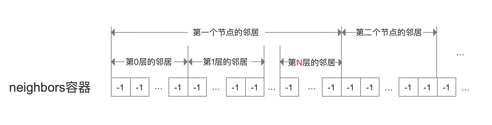

- **`std::vector<int> cum_nneighbor_per_level`**：初始化后，用来获取每一层中，节点的最大邻居数量。其中第0层为`2*M`，其他层为`M`，`M`的默认值为32
  
  - 图4：
  
  - 解释下这个数组：获取每一层中节点的最大邻居数量的计算方式如下所示，其中`layer_no`为**目标层级**：
  
  - ```
    cum_nneighbor_per_level[layer_no + 1] - cum_nneighbor_per_level[layer_no]
    ```
  - 因此如果要获取第0层的最大邻居数量，即：
  
    - ```
      cum_nneighbor_per_level[1] - cum_nneighbor_per_level[0] = 64 - 0 = 64，即64个邻居
      ```
  - **这个容器另外一个作用是可以根据某个节点的目标层级获取这个节点在所有层中的所有最大邻居数量的总和，而这个和值正是图3中连续区间的长度**。没错，它用来定位某个节点在`neighbors`中的邻居位置信息，下文会进行介绍
  
- **`std::vector<int> levels`**：初始化后，用来获取每一个节点的**目标层级**。
  
  - 图5：
    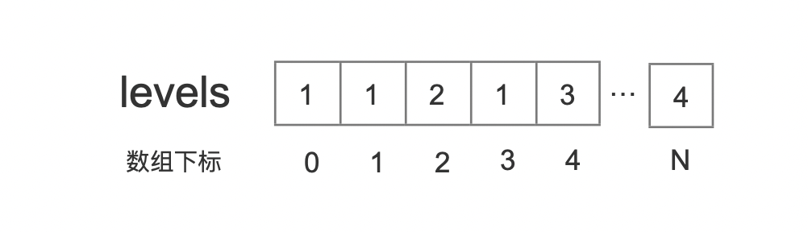
  
  - 图5中描述的是：初始化N+1个待插入的节点，它们各自的目标层级
    - **注意的是，为了方便介绍，文章中levels记录的是目标层级，而在源码中则是会在目标层级的基础上额外加+1，其目的不影响介绍其实现原理，因此需要提及下**
    - 图6：
      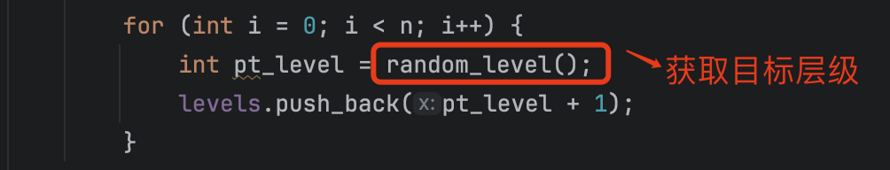
  
- **`std::vector<size_t> offsets`**：初始化后，可以根据节点编号获取该节点的第一个邻居（第0层）在`neighbors`中的起始位置，其中数组下标为**节点编号**
  
  - 图7：
  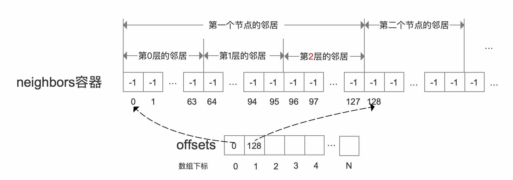
  
  - `offsets`容器的初始化过程不在文中展开，可以查看`HNSW.cpp`中的`prepare_level_tab(...)`方法，简单来说就是根据节点编号、`levels`容器、`cum_nneighbor_per_level`就可以完成`offsets`容器的初始化。

- **`std::vector<int> order(n)`**：使用该容器将节点根据其目标层级进行分桶，调整节点的处理先后顺序。
  
  - 例如[0, 223]为从0层开始插入的节点，[224, 779]为从1层开始插入的节点，[780, 999]为从2层开始插入的节点。
  - 随后从目标层数最高的节点开始，依次插入到HNSW图中
  
### 例子

接下来我们通过一个例子介绍下当我们找到了某个节点在某一层的N个邻居节点后，如何通过上文中介绍的容器之间的配合，将这些邻居节点添加到neighbors中。

下图中描述的是，节点编号为0的节点，在第2层找到了3个邻居节点，分别是2232、23、110，添加到neighbors的示意图。

图8：


图8中，根据节点编号以及层数，结合`offsets`以及`cum_nneighbor_per_level`容器就可以获取在`neighbors`容器中的一个<font color=red>红色标注</font>的区间，区间范围为[begin, end)，随后依次写入2232、23、110这三个邻居。

## 入口节点

图9：

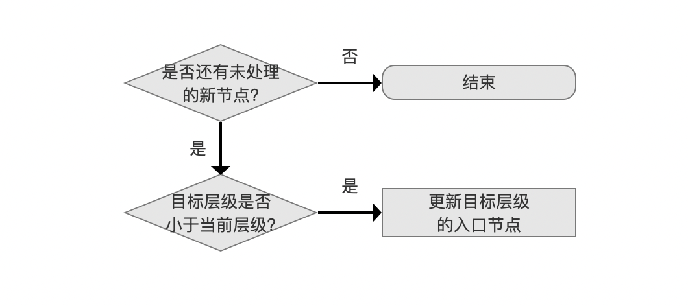

图9中，依次处理每一个节点，直到所有的节点都添加到HNSW图中。每个节点在添加到HNSW图之前会先确定好目标层级，如果目标层级为3，那么这个节点会从高到低依次添加到第3、2、1、0层中，并在每一层中寻找邻居并建立连接。

图10：

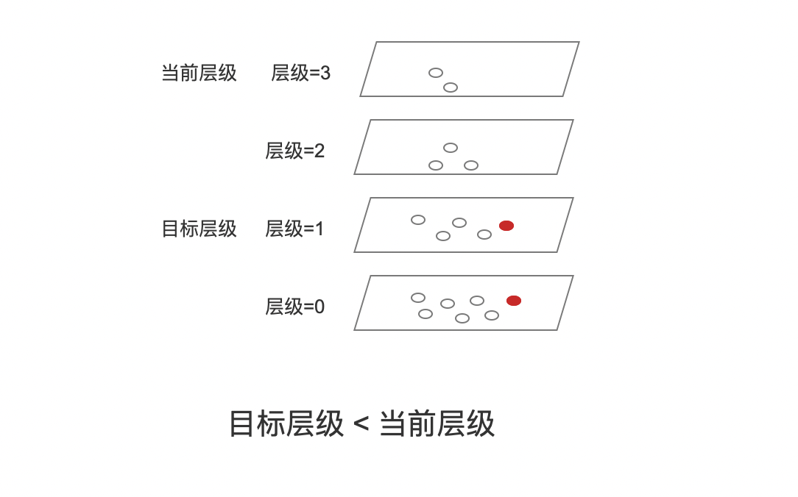

图10中，如果目标层级小于等于当前层级，那么我们需要从当前层级（当前层级的入口节点为**全局入口节点**）开始，到达目标层级之前，从上往下依次找到每一层中跟新节点最近的节点，并作为下一层的入口节点，这个期间不需要建立连接。当到达目标层级时，目标层级的入口节点会被更新为上一层中与新节点最近的节点。

以图10为例，目标层级1的入口节点会被更新为在层级2中与新节点最近的节点。

在图10的流程中，基于入口节点查找某一层中与新节点最近的节点的代码为`HNSW.cpp`中的`greedy_update_nearest(...)`方法。流程点`更新目标层级的入口节点`如下所示：

图11：

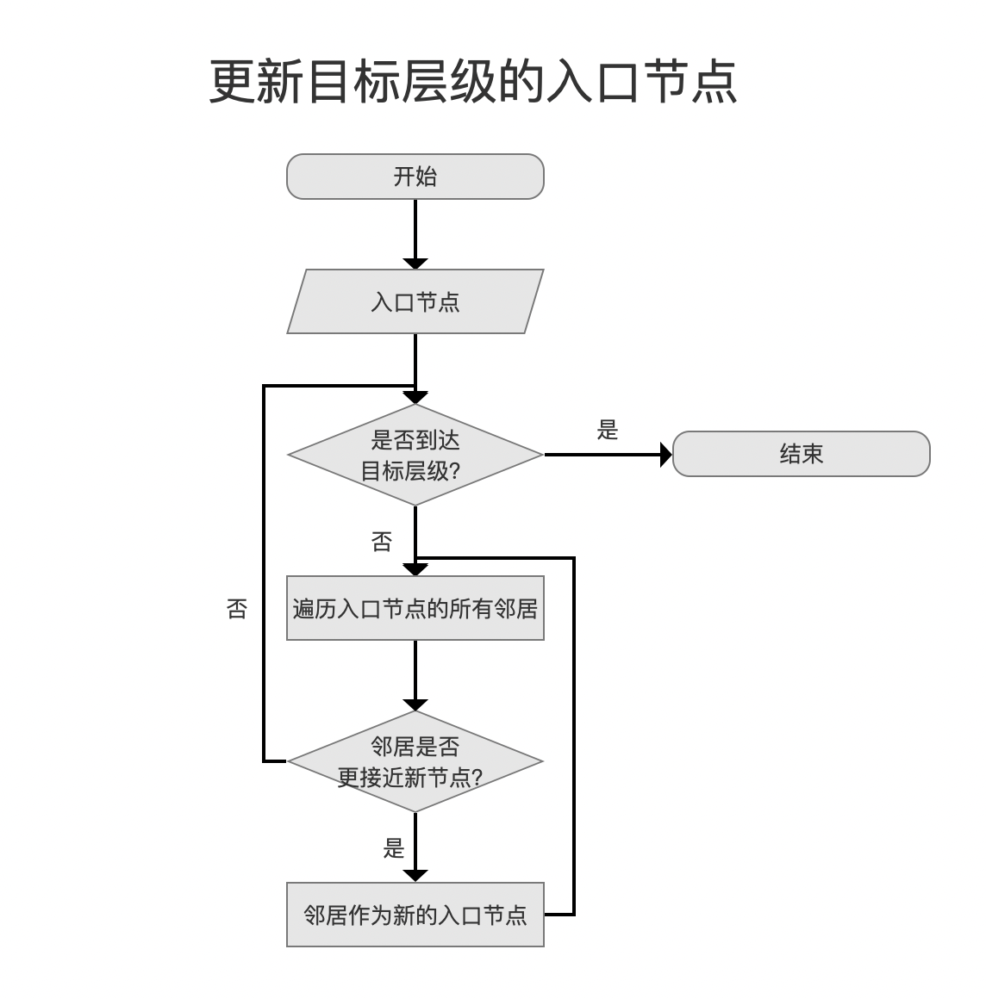

图11中，简单总结，依次处理当前层级与目标层级之间的层，在每一层中：

步骤一：根据入口节点的节点编号以及层数，从`neighbors`容器中找到入口节点在这一层的所有邻居（即图8中的方法）。

步骤二：依次计算这些邻居与新节点的距离，与新节点最接近的邻居如果比入口节点还要接近新节点，那么将入口节点更新为该邻居。如果入口节点被更新为邻居，基于贪心算法继续执行步骤一。


## 与邻居建立连接

图12：

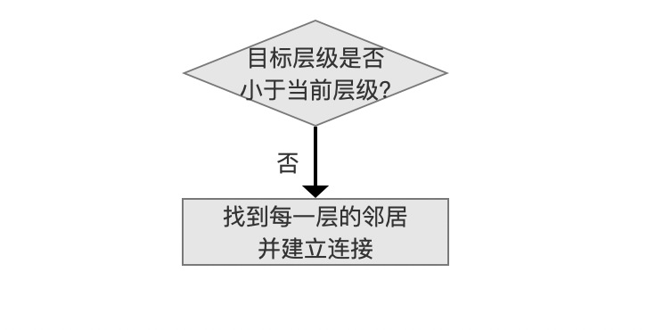

在Faiss中，由于上文中提到的`order`容器，节点插入的先后顺序是按照节点的目标层级由大到小依次处理，即目标层级大的先插入到HNSW图中，意味着在图11的流程中，目标层级只会等于当前层级，不会出现大于当前层级的情况。

### 找到每一层的邻居并建立连接

图13：

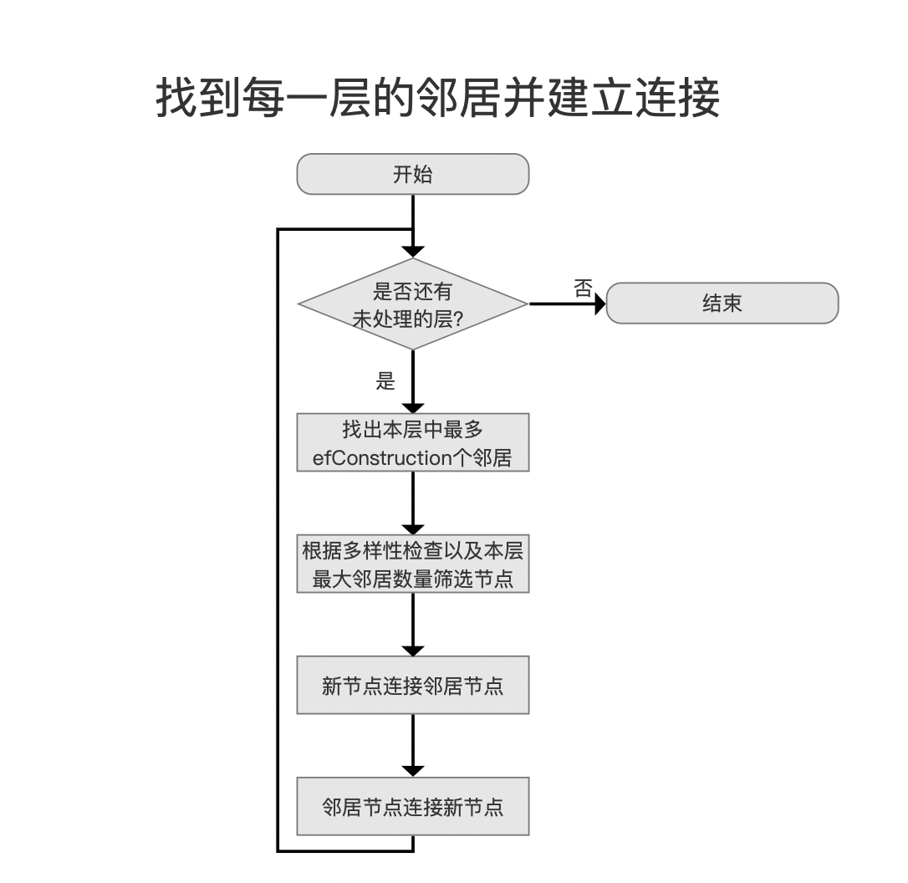

从目标层级开始，将新节点添加到每一层中并与邻居建立连接，直到所有层处理完毕。

#### 找出本层中最多efConstruction个邻居

图14：


这个流程点的处理过程如下所示：

图15：

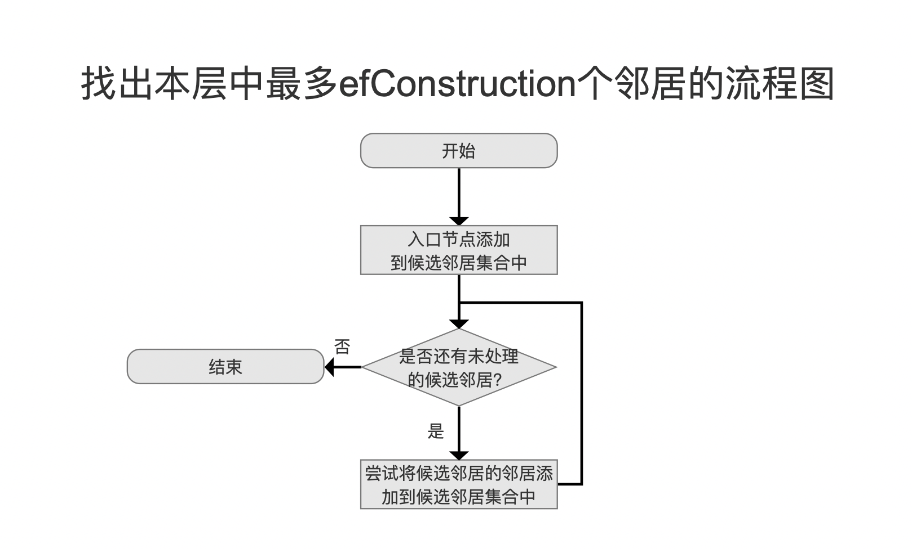

该流程是贪心算法的搜索过程，它从入口节点开始，首先将其作为看起来最接近新节点的节点，如果一个节点的邻居看起来更接近新插入的节点，算法会转向那个邻居节点，并继续探索其邻居。最终找到最多efConstruction个距离**较近**（这些节点不一定是离新节点**最近**的）的节点。

`候选邻居集合`是一个最多拥有efConstruction个节点的最大堆，堆顶元素描述的是`候选邻居集合`中离新节点最远的节点。这是一个临时的邻居集合，efConstruction是一个可配置的值，该值的大小有以下的考量：

- **高** **efConstruction** **值**：
  - **优点**：增加构建图的精度，最终的图更接近于真实的 k-NN 图。因为在每次插入新节点时，搜索过程会考虑更多的候选节点，从而找到更优质的邻居。
  - **缺点**：构建时间更长，因为在每次插入节点时需要处理更多的候选节点。
- **低** **efConstruction** **值**：
  - **优点**：构建速度更快，因为每次插入节点时需要处理的候选节点更少。
  - **缺点**：降低构建图的精度，可能导致搜索结果的质量下降。

### 根据多样性检查以及本层最大邻居数量筛选节点

图16：


由于每一层允许连接的邻居数量是有限的，第0层为`2*M`，其他层为`M`，`M`的默认值为32。因此在上一步收集了`efConstruction`个邻居后，如果`efConstruction`的值超过了限制，则需要根据`多样性`筛选。

#### 多样性检查

多样性检查的目的是确保每个节点的邻居列表中包含多样且合适的节点，避免重复或过于接近的邻居，从而提高 HNSW 图的质量和搜索效率。多样性检查的算法为：

- 从上文中`候选邻居集合`的堆顶元素开始，比较它与集合中其他邻居的距离`d(邻居，新节点的其他邻居)`，如果至少存在一个其他邻居使得`d(邻居，新节点的其他邻居)`小于`d(邻居，新节点)`，则不满足多样性。

### 新节点与邻居相互连接

图17：

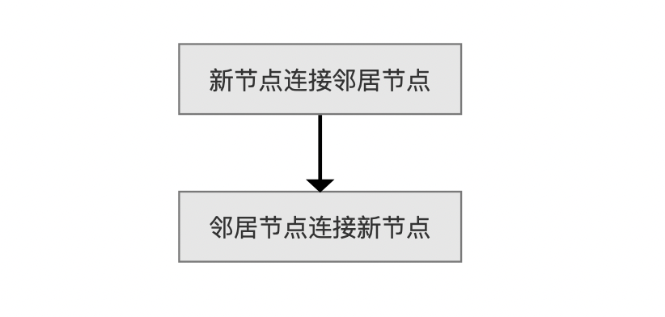

在代码中，两个节点的连接实现为`HNSW.cpp`中的`add_link(...)`方法。这两个流程点分别调用这个方法实现连接。

两个节点的连接流程图如下所示：将目标节点`dest`添加到源节点`src`的邻居集合中，即上文中提到的`neighbors`容器中。

图18：

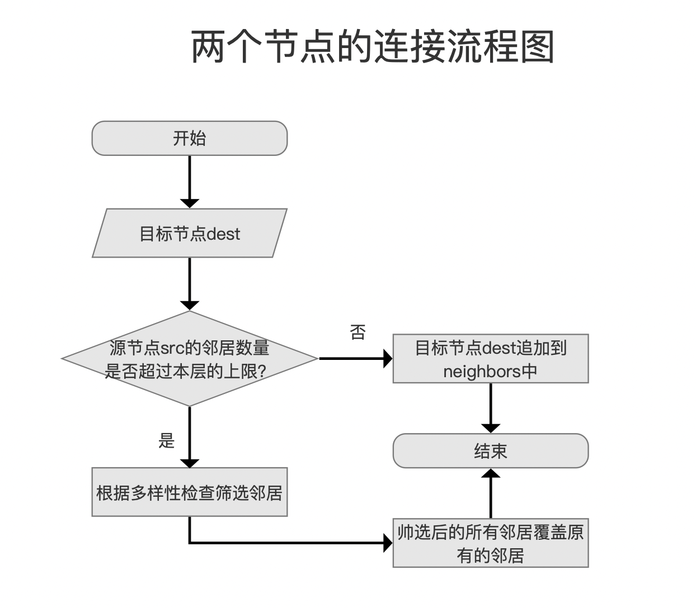

图18中，如果源节点`src`的邻居数量没有达到本层的最大邻居数量，那么直接追加到`neighbors`容器中即可，其添加过程见图8.

否则，我们需要对源节点`src`现有的邻居加上目标节点`dest`进行多样性检查。注意的是，可能会有一个或多个邻居被移除。最后将筛选后的邻居集合覆盖原来的邻居集合。

这里你会发现，这种处理方式可能会导致节点的单向连接，但这在HNSW中是允许的：

- **多层次图结构**：HNSW 图由多层次图组成，每个层次都有不同的邻居集。这种设计使得即使在某个层次上存在单向连接，整体图的搜索性能依然可以得到保证。

- **搜索效率**：单向连接不会显著影响搜索效率，因为在高层次图中，节点之间的连接主要负责长距离跳跃，而在低层次图中，节点之间的连接则负责短距离搜索。

## 全景流程图

图19：

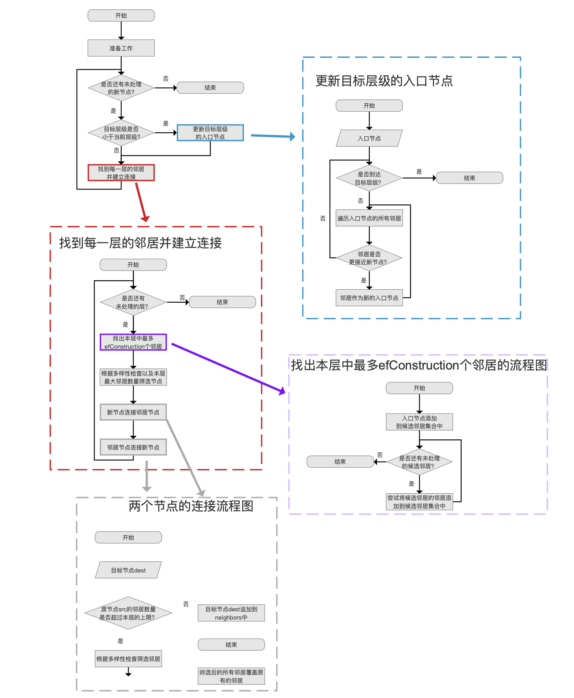

[点击]()查看高清图。
