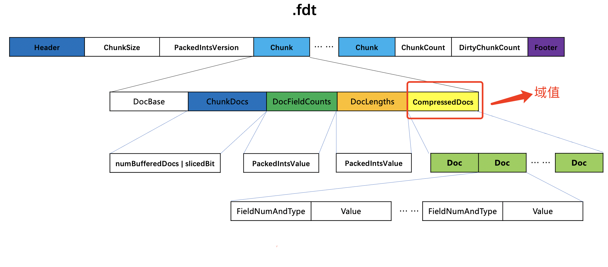
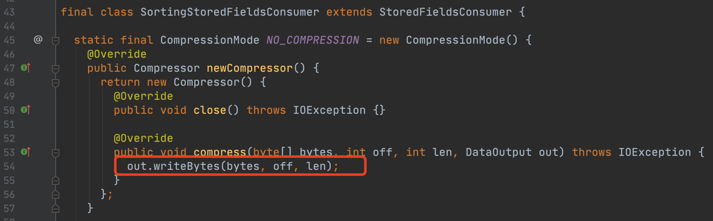

# [Changes](https://www.amazingkoala.com.cn/Lucene/2019/1205/115.html)（Lucene 8.7.0）

&emsp;&emsp;2020年11月3号，Lucene发布了最新的版本8.7.0，本篇文章将会对[Change Log](https://lucene.apache.org/core/8_7_0/changes/Changes.html#v8.7.0.optimizations)中几个变更展开介绍下。

## [LUCENE-9510](https://issues.apache.org/jira/browse/LUCENE-9510)

&emsp;&emsp;该issue的原文如下：

```text
Indexing with an index sort is now faster by not compressing temporary representations of the data. 
```

&emsp;&emsp;上文大意为：当设置了段内排序[IndexSort](https://www.amazingkoala.com.cn/Lucene/Index/2019/1111/106.html)后，索引（Indexing）的速度比以前更快了，因为不再压缩临时的数据。

&emsp;&emsp;这里的`temporary representations of the data`指的是存储域的域值，它最终存储到[索引文件.fdt](https://www.amazingkoala.com.cn/Lucene/suoyinwenjian/2020/1013/169.html)中。在文章[索引文件的生成（二十四）之fdx&&fdt&&fdm](https://www.amazingkoala.com.cn/Lucene/Index/2020/1016/171.html)中我们说到，在添加每篇文档的过程中，当生成一个chunk时，域值会被压缩处理并写入到chunk中。如下所示：

图1：



&emsp;&emsp;如果设置了段内排序，那么在flush阶段会读取chunk中的域值，然后写入到新的chunk中，并生成新的索引文件.fdt（因为持续添加/更新/删除文档的过程中，是无法排序的，所以只能在flush阶段，即生成一个段时才能排序）。这意味着排序后的文档对应的域值分布在不同的`chunk`中，就会导致随机访问，即会出现chunk的重复解压，这将导致索引（Indexing）速度的降低。那么在索引期间生成的用于描述存储域的索引文件就是下文中 temporary files：

```text
We noticed some indexing rate regressions in Elasticsearch after upgrading to a new Lucene snapshot. This is due to the fact that SortingStoredFieldsConsumer is using the default codec to write stored fields on flush. Compression doesn't matter much for this case since these are temporary files that get removed on flush after the segment is sorted anyway so we could switch to a format that has faster random access.
```


&emsp;&emsp;在Lucene 8.7.0中，索引期间使用了一个TEMP_STORED_FIELDS_FORMAT的新的codec来处理存储域，使得不再对域值进行压缩处理：

图2：



&emsp;&emsp;由图2可见，尽管调用了compress接口，实际上就是简单的按字节拷贝而已。

&emsp;&emsp;另外触发生成chunk的条件也被改为处理一篇文档就生成一个`chunk`，目的就是减少处理的时间，因为我们知道，如果chunk中包含多个文档号，这些文档号的信息（即图1中的`chunk`）都是经过编码处理的，读取一个文档的存储域信息就需要把其他文档的存储域信息都执行解码，**关键是这些文档的信息很有可能并不是下一次处理需要的信息**：

图3：


&emsp;&emsp;如果不知道maxDocsPerChunk的作用，请阅读文章[索引文件的生成（二十四）之fdx&&fdt&&fdm](https://www.amazingkoala.com.cn/Lucene/Index/2020/1016/171.html)。

&emsp;&emsp;最终在flush阶段，生成新的索引文件.fdt时，就使用默认的codec，生成过程就跟文章[索引文件的生成（二十四）之fdx&&fdt&&fdm](https://www.amazingkoala.com.cn/Lucene/Index/2020/1016/171.html)一致了。

## [LUCENE-9447](http://issues.apache.org/jira/browse/LUCENE-9447), [LUCENE-9486](http://issues.apache.org/jira/browse/LUCENE-9486)

&emsp;&emsp;从Lucene 8.7.0开始，对生成一个chunk的触发条件进行了修改，即图1中chunk中包含的文档数量上限值、域值的大小上限值得到了提高。这两个issue中解释了原因，并给出了测试数据，感兴趣的可以点进去看下。