# SortedDocValues
SortedDocValues同NumericDocValues、SortedNumericDocValues一样，在实际应用中最多的场景用于提供给搜索结果一个排序规则。本篇文章只讲述使用了SortedDocValues后，其在.dvd、.dvm文件中的索引结构。在以后的介绍例如 facet、join、group等功能时，会详细介绍如何根据.dvd、dvm中的索引数据进行查询的过程。
# 预备知识
下面出现的变量名皆为源码中的同名变量名。

## TermId
在索引阶段，根据IndexWriter中添加的document的顺序，有序的处理每一个document中的SortedDocValuesField。并且对每一个SortedDocValuesField的域值赋予一个从0开始递增的termId，相同的域值具有相同的termId。
图1：
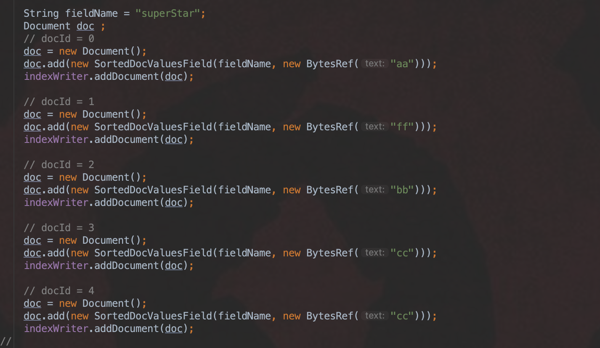
域值与termId的对应关系如下：

|  域值  | aa   | cc   | bb   | ff   |
| :----: | ---- | ---- | ---- | ---- |
| termId | 0    | 3    | 2    | 1    |
## currentValues[]数组
currentValues[]数组中，下标值为文档号docId，数组元素为termId。在索引阶段，由于处理的数据是按照IndexWriter中添加的document的顺序进行的，即按照第一篇文档(document)，文档号为0，文档号递增的顺序。所以在这个过程中，就可以实现通过数组方式来记录 文档号(docId) 跟 termId 的映射关系
图2：
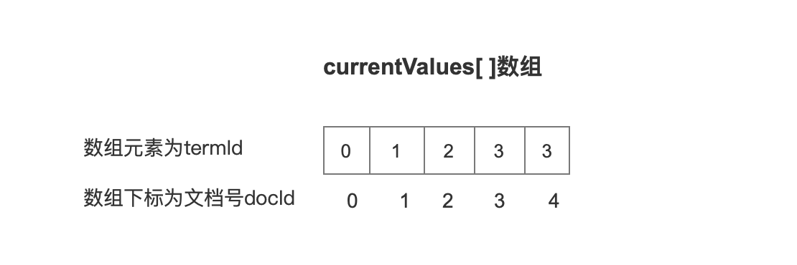

## sortedValues[]数组 && ord
sortedValues[]数组中的数组元素是termId，数组下标是ord值。下面的一句话很重要：数组元素是有序的，但是排序规则不是根据termId的值，而是根据termId对应的域值的字典序。
图3：
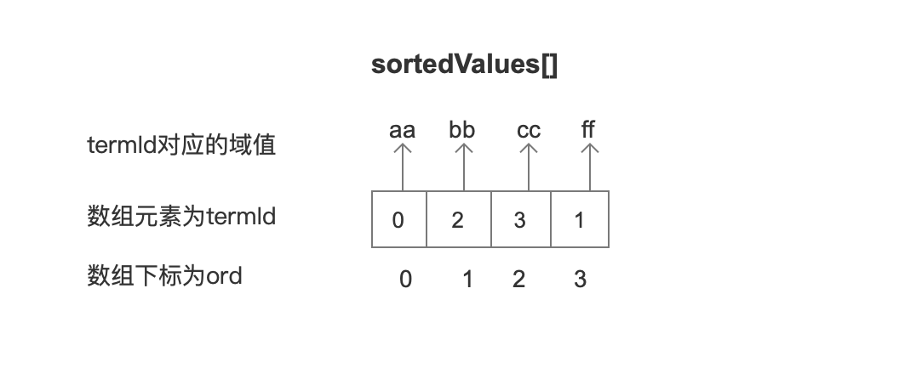

## ordMap[]数组
sortedValues[]数组中实现了 数组下标ord 到 数组元素termId的映射，而ordMap[]数组则是实现了 数组下标termId 到 数组元素 ord的映射。
图4：
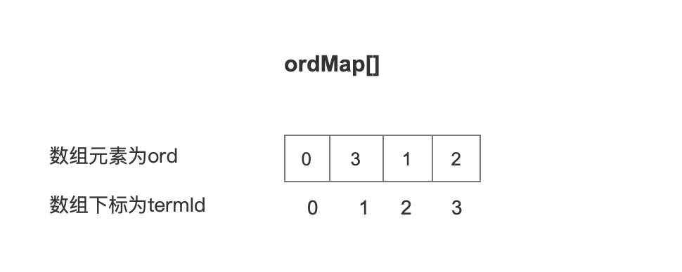

# 数据结构
## dvd
图5：
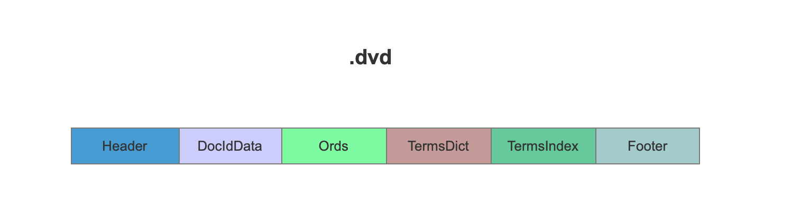

### DocIdData
DocIdData中记录包含当前域的文档号。
如果IndexWriter添加的document中不都包含当前域，那么需要将包含当前域的文档号记录到DocIdData中，并且使用IndexedDISI类来存储文档号，[IndexedDISI](https://www.amazingkoala.com.cn/Lucene/gongjulei/2020/0511/140.html)存储文档号后生成的数据结构单独的作为一篇文章介绍，在这里不赘述。

### Ords
Ords记录了每一篇文档中SortedDocValuesField的域值对应的ord值。这里的ord值即上文中的预备知识中的ord值。
###  TermsDict
TermsDict中根据域值大小，并且按块处理，存储所有的SortedDocValuesField域值。
图6：
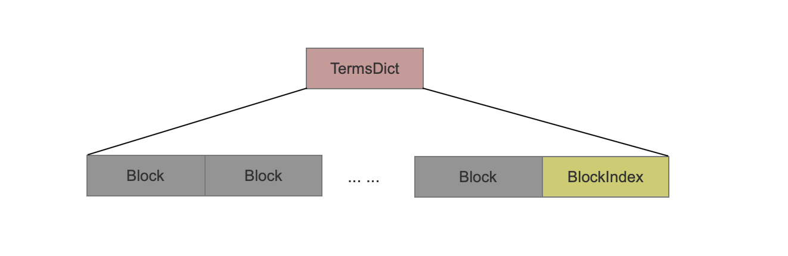

#### Block
存储SortedDocValuesField的域值时，按照域值从小到大的顺序，并且按块处理所有的域值，相同的域值不会重复存储。
每16个域值按照一个块（block）处理，在一个块内，只存储第1个域值的完整值，对于剩余的15个域值，只存储与前一个域值不相同后缀的部分值（所以需要按照域值大小顺序存储才能尽可能减少空间占用），即前缀存储。
图7：
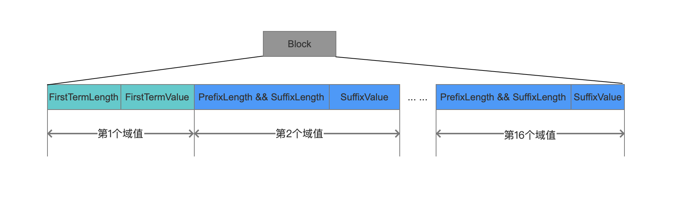

##### FirstTermLength
```
每个block的第1个域值的长度。
```
##### FirstTermValue
```
每个block的第1个域值的完整值。
```
##### PrefixLength && SuffixLength
```
prefixLength是当前域值与前一个域值相同前缀的长度，如果当前当前是第10个域值，那么它跟第9个域值进行prefixLength的计算。
suffixLength是除去相同前缀的剩余部分的长度。
```
##### SuffixValue
```text
除去相同前缀的剩余部分的域值。
```
#### BlockIndex
```
BlockIndex中记录了每一个block相对于第一个block的在.dvd文件中的偏移，在读取阶段，如果需要读取第n个block的数据，那么只要计算 第n个和第n+1个的blockIndex的差值，就可以获得第n个block在.dvd文件中的数据区间，实现随机访问。每一个block的blockIndex采用PackedInts进行压缩存储。
```
#### Block与ord的关系
由于域值是从小到大写入到所有Block中， 而在上文中的预备知识中得知，sortedValues[]数组的ord的值正是描述了域值的大小关系，所以写入到block中的第1个域值就是对应ord的值0，第8个域值就是对应ord的值7，ord的值从0开始递增。
下面的例子描述了我们搜索后的结果只要返回Top3，并且比较规则是根据SortedDocValuesField的域值进行比较。
图8：
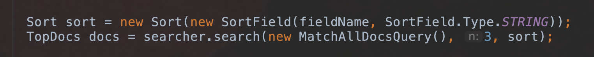
但是满足搜索要求的文档只会将docId传入到Collector类的collect(int doc)方法中，即我们只能知道文档号的信息，无法获得当前文档中SortedDocValuesField的域值来做排序比较。
这时候我们可以根据文档号docId从IndexedDISI中找到**段内编号（见文章[IndexedDISI](https://www.amazingkoala.com.cn/Lucene/gongjulei/2020/0511/140.html)）**。段内编号作为currentValues[]数组下标值，取出数组元素，即termId，然后termId作为ordMap[]数组下标值，取出数组元素，即ord值。根据ord值我们就可以找到当前文档中的 SortedDocValuesField的域值在对应的Block中，然后遍历Block中的16个域值，直到找到我们想要的域值。
图9：
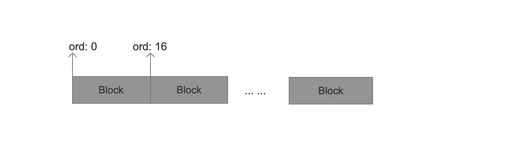

### TermsIndex
TermsDict中每遍历16个域值就处理为一个block，而在TermsIndex中则是每遍历1024个域值就记录一个域值的前缀值。
图10：
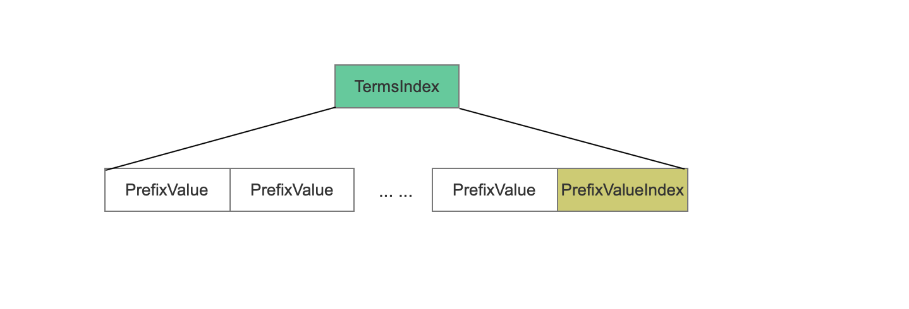

#### PrefixValue
```
与上一个域值的相同的前缀值 加上 后缀值的第一个字节。
```
例如第1个域值为 "ab"、第1023个域值为"**abc**dasdfsaf" 、第1024个域值为"**abce**ftn"、第2047个域值为 "**abcefto**p" 、第2048个域值为 "**abceftoq**e"，那么存储到TermsIndex的数据如下：
图11：
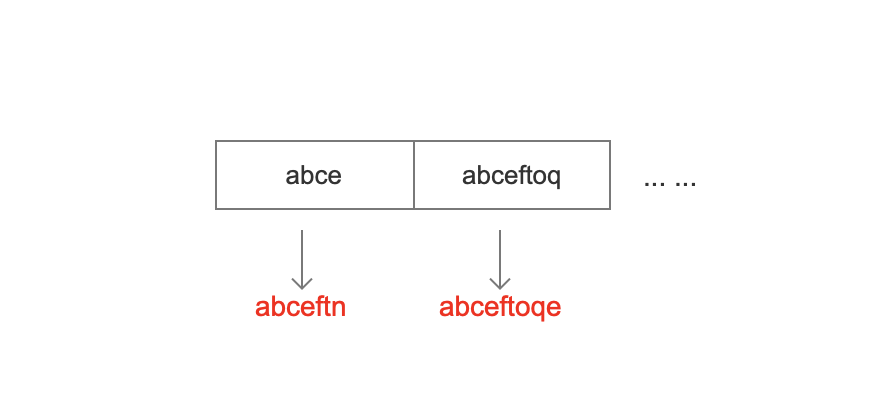

#### PrefixValueIndex
```text
PrefixValueIndex中记录了每一个prefixValue相对于第一个prefixValue的在.dvd文件中的偏移，在读取阶段，如果需要读取第n个prefixValue的数据，那么只要计算 第n个和第n+1个的PrefixValueIndex的差值，就可以获得第n个prefixValue在.dvd文件中的数据区间，实现随机访问。每一个prefixValue的PrefixValueIndex采用PackedInts进行压缩存储。
```
#### PrefixValue有什么用
在TermsDict中，我们可以根据文档号在TermsDict找到对应的SortedDocValuesField的域值，但是通过TermsIndex我们就可以判断 某个域值是不是在SortedDocValuesField中。
例如我们需要判断域值 “abcef” 是否为SortedDocValuesField的一个域值，那么就可以使用二分法遍历PrefixValue，每次跟"abcef"比较，根据上面的例子，我们可以知道 "**abce**f" 大于“"**abce**”，并且小于"**abceft**oq"。
图12：
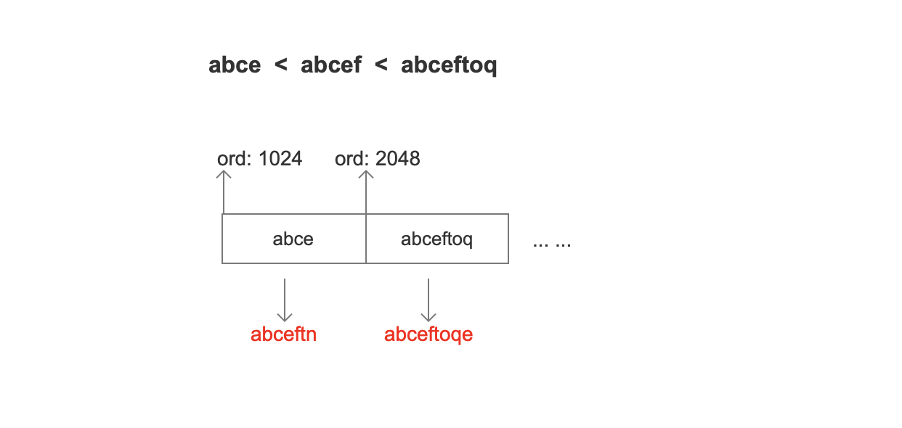
所以我们接着根据两个ord值去TermsDict中继续查找，同样的的使用二分法去遍历Block。

## dvm
图13：
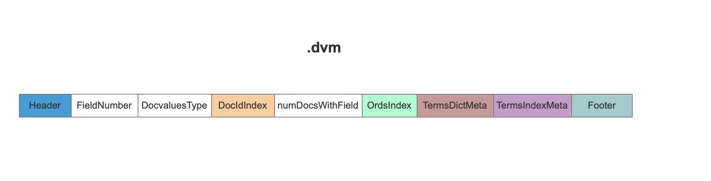
### FieldNumber
```text
域的编号
```
### DocvaluesType
```text
Docvalues的类型，本文中，这个值就是 SORTED。
```
### DocIdIndex
DocIdIndex是对.dvd文件的一个索引，用来描述 .dvd文件中DocIdData在.dvd文件中的开始跟结束位置。
#### 情况1：
图14：

如果IndexWriter添加的document中都包含当前域，那么只需要在DocIdIndex中添加标志信息即可。

#### 情况2：
图15：

如果IndexWriter添加的document中不都包含当前域，那么.dvd文件中需要将包含当前的域的文档号信息都记录下来。

##### offset
```text
.dvd文件中存放文档号的DocIdData在文件中的开始位置。
```
##### length
```text
length为DocIdData在.dvd文件中的数据长度。
```
在读取阶段，通过offset跟length就可以获得所有的DocIdData数据。
### numDocsWithField
```text
包含当前域的文档的个数。
```
### OrdsIndex
#### 情况1：
图16：
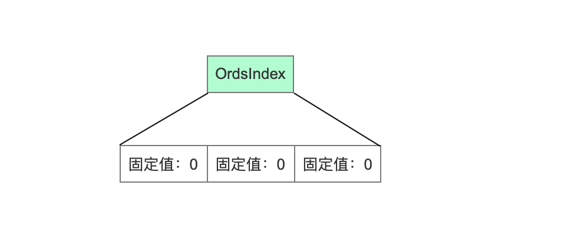
如果只有一种类型的域值，那么写入固定的标志信息即可。

#### 情况2：
图17：
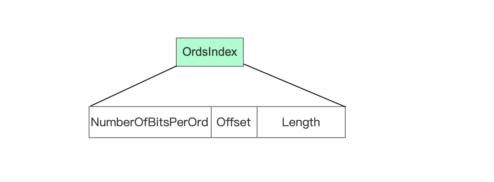
##### numberOfBitsPerOrd
```text
numberOfBitsPerOrd描述了存储ord值的固定bit位个数。
```
##### offset
```text
.dvd文件中存放ord的Ords在文件中的开始位置。
```
##### length
```text
length为Ords在.dvd文件中的数据长度。
```
### TermsDictMeta
图18：
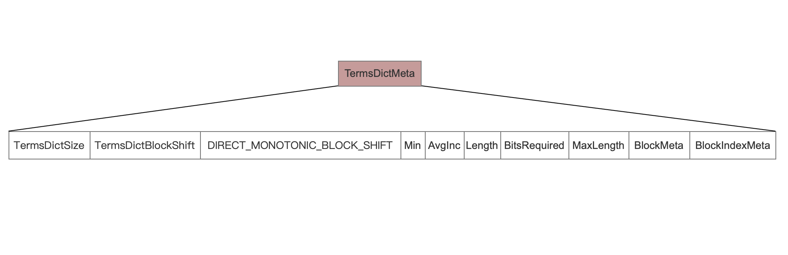
#### TermsDictSize
```text
域值的种类个数(不是域值的个数)
```
#### TermsDictBlockShift
```text
描述了一个block中有多少个域值。
```
#### DIRECT_MONOTONIC_BLOCK_SHIFT
```text
DIRECT_MONOTONIC_BLOCK_SHIFT用来在初始化byte buffer[]的大小，buffer数组用来存放BlockIndex。
```
#### Min
```text
记录一个最小值，在读取阶段用于解码。Min的含义请看我的源码注释。
```
#### AvgInc
```text
记录一个AvgInc，在读取阶段用于解码。AvgInc的含义请看我的源码注释。
```
#### Length
```text
BlockIndex的数据总长度
```
#### BitsRequired
```text
经过DirectMonotonicWriter的数据平缓操作后，每个数据需要的固定bit位个数。
```
#### MaxLength
```text
域值的最大长度
```
#### BlockMeta
图19：

##### offset
```text
Block在.dvd文件中的开始位置。
```
##### length
```text
length为Block在.dvd文件中的数据长度。
```
在读取阶段，通过offset跟length就可以获得所有的所有Block数据。
#### BlockIndexMeta
图20：
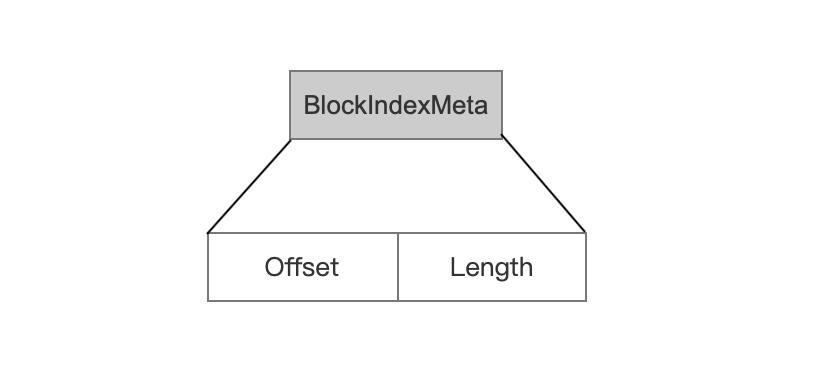
##### offset
```text
BlockIndex在.dvd文件中的开始位置。
```
##### length
```text
length为BlockIndex在.dvd文件中的数据长度。
```
在读取阶段，通过offset跟length就可以获得所有BlockIndex数据。

### TermsIndexMeta
图21：
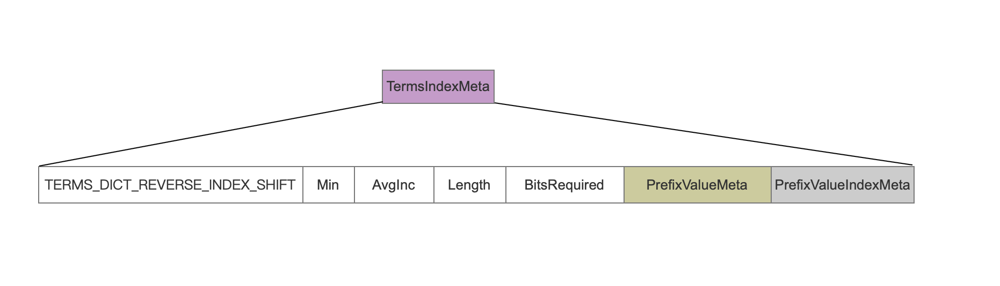
#### TERMS_DICT_REVERSE_INDEX_SHIFT
```text
描述每遍历多少个域值，保存一次PrefixValue。当前版本为1024。
```
#### Min
```text
记录一个最小值，在读取阶段用于解码。Min的含义请看我的源码注释。
```
#### AvgInc
```text
记录一个AvgInc，在读取阶段用于解码。AvgInc的含义请看我的源码注释。
```
#### Length
```text
PrefixValueIndex的数据总长度
```
#### BitsRequired
```text
经过DirectMonotonicWriter的数据平缓操作后，每个数据需要的固定bit位个数。
```
#### PrefixValueMeta
图22：
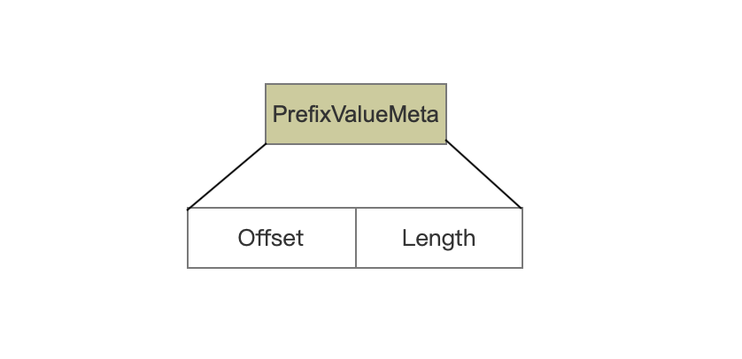
##### offset
```text
PrefixValue在.dvd文件中的开始位置。
```
##### length
```text
length为PrefixValue在.dvd文件中的数据长度。
```
在读取阶段，通过offset跟length就可以获得所有PrefixValue数据。
#### PrefixValueIndexMeta
图23：
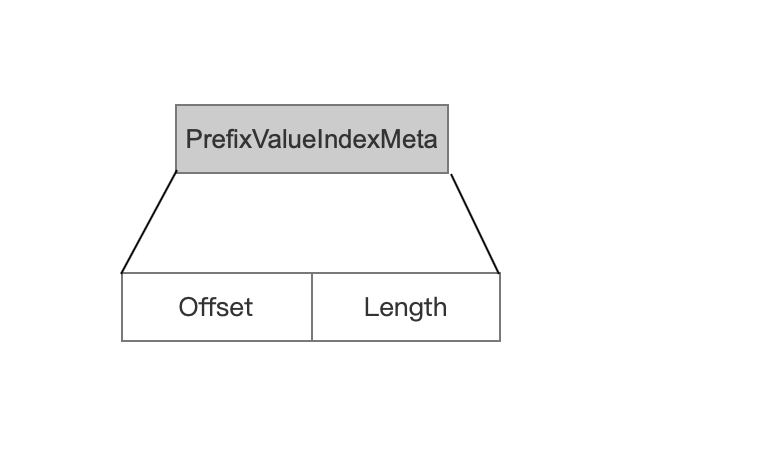
##### offset
```text
PrefixValueIndex在.dvd文件中的开始位置。
```
##### length
```text
length为PrefixValueIndex在.dvd文件中的数据长度。
```
在读取阶段，通过offset跟length就可以获得所有PrefixValueIndex数据。
# 结语
本文详细介绍了SortedDocValues在.dvd、.dvm文件中的数据结构，并简单介绍了为什么要写入TermsDict、TermsIndex的数据。SortedDocValues跟SortedSetDocValues是在所有DocValues中数据结构最为复杂的。另外在预备知识中提到的几个数组，它们都是在SortedDocValuesWriter类中生成，大家可以可看我的源码注释来加快SortedDocValuesWriter类的理解，源码地址：https://github.com/luxugang/Lucene-7.5.0/blob/master/solr-7.5.0/lucene/core/src/java/org/apache/lucene/index/SortedDocValuesWriter.java
