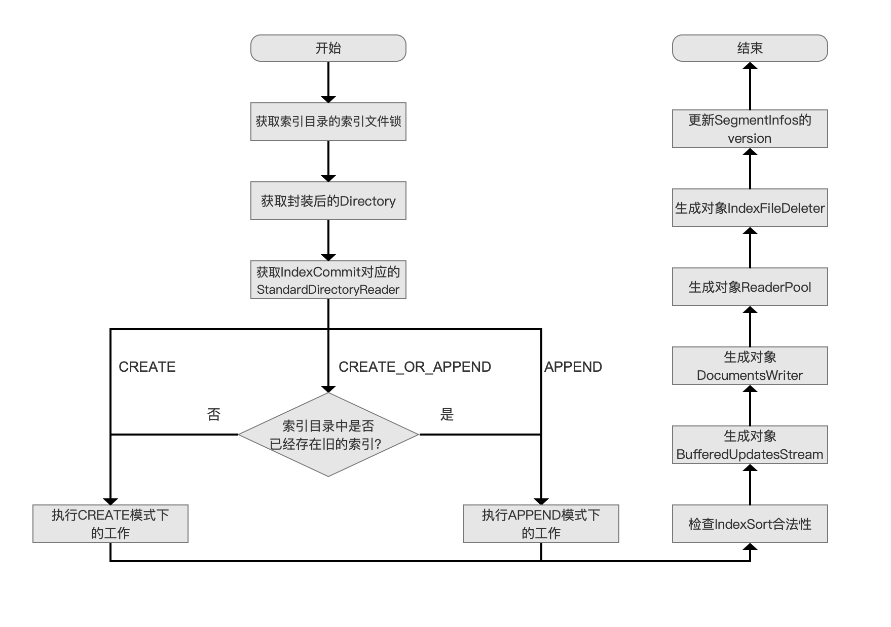
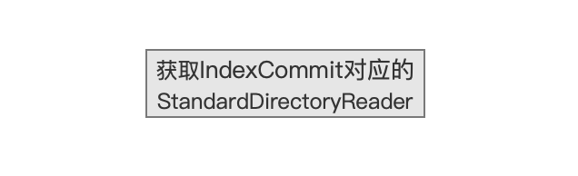
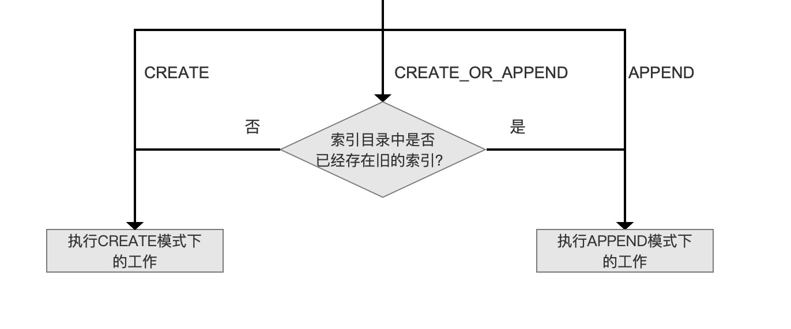
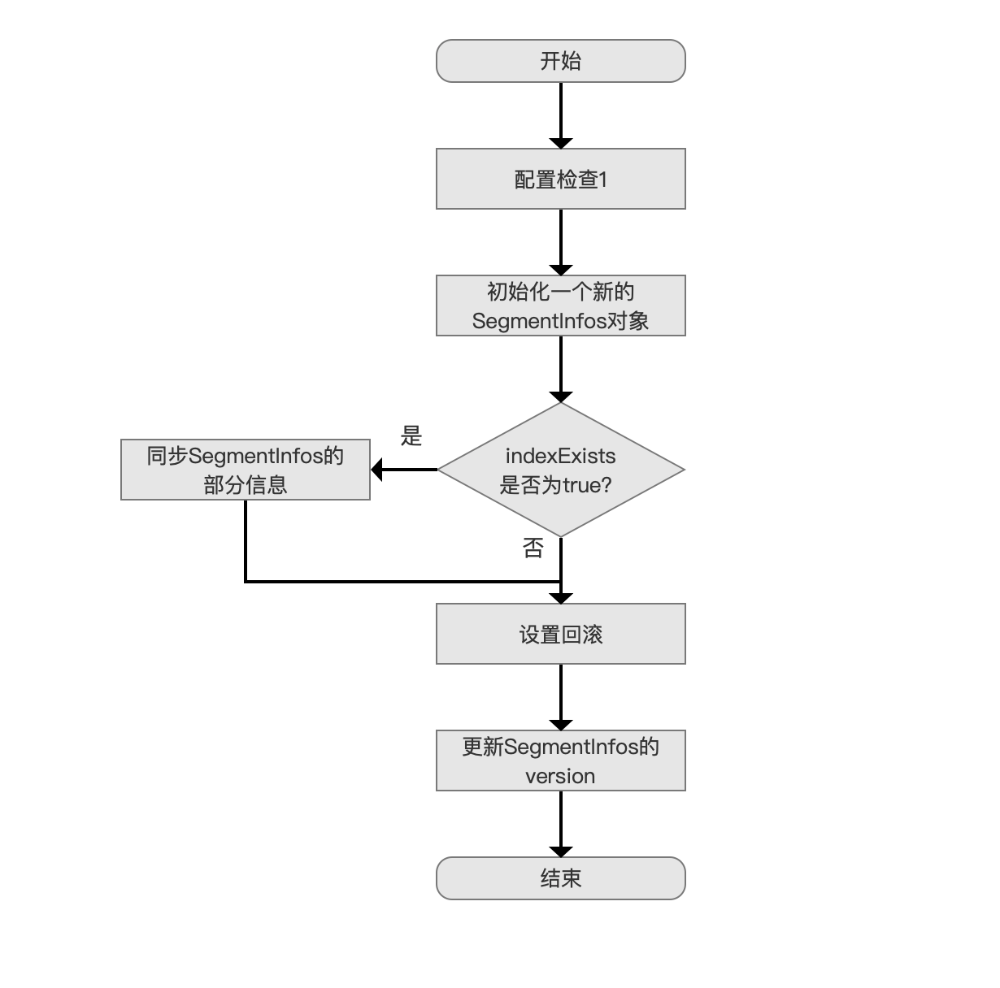
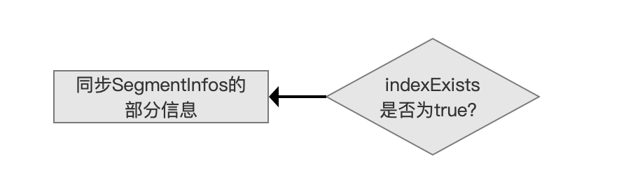
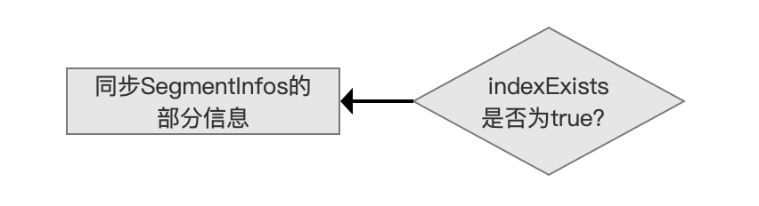
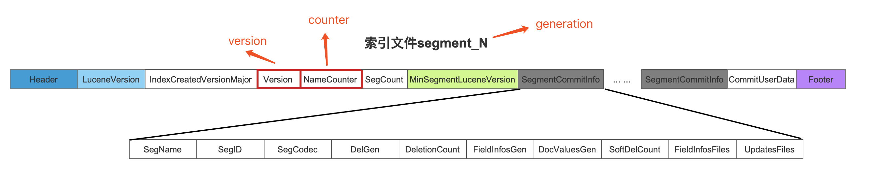

# [构造IndexWriter对象（三）](https://www.amazingkoala.com.cn/Lucene/Index/)

&emsp;&emsp;构造一个IndexWriter对象的流程总体分为下面三个部分：

- 设置索引目录Directory
- 设置IndexWriter的配置信息IndexWriterConfig
- 调用IndexWriter的构造函数

&emsp;&emsp;大家可以查看文章[构造IndexWriter对象（一）](https://www.amazingkoala.com.cn/Lucene/Index/2019/1111/106.html)、[构造IndexWriter对象（二）](https://www.amazingkoala.com.cn/Lucene/Index/2019/1114/107.html)来了解前两部分的内容，我们接着继续介绍最后一个部分，即调用IndexWriter的构造函数。

&emsp;&emsp;IndexWriter类有且仅有一个有参构造函数，如下所示：

```java
public IndexWriter(Directory d, IndexWriterConfig conf) throws IOException {
    ... ...
}
```

&emsp;&emsp;其中参数d以及conf正是分别由`设置索引目录Directory`、`设置IndexWriter的配置信息IndexWriterConfig`两部分获得。

# 调用IndexWriter的构造函数的流程图

图1：



## 获取索引目录的索引文件锁

图2：


&emsp;&emsp;该流程为Lucene使用索引文件锁对索引文件所在的目录进行加锁，使得同一时间总是只有一个IndexWriter对象可以更改索引文件，即保证单进程内(single in-process)多个不同IndexWriter对象互斥更改（多线程持有相同引用的IndexWriter对象视为一个IndexWriter不会受制于LockFactory，而是受制于对象锁（synchronized(IndexWriter)）、多进程内(multi-processes)多个对象互斥更改。

&emsp;&emsp;更多关于索引文件锁的介绍可以看文章[索引文件锁LockFactory](https://www.amazingkoala.com.cn/Lucene/Store/2019/0604/62.html)。

## 获取封装后的Directory

图3：


&emsp;&emsp;该流程中我们需要对Directory通过[LockValidatingDirectoryWrapper](https://www.amazingkoala.com.cn/Lucene/Store/2019/0615/67.html)对象进行再次封装， 使得在对索引目录中的文件进行任意形式的具有"破坏性"（destructive）的文件系统操作（filesystem operation）前尽可能（best-effort）确保索引文件锁是有效的（valid）。

&emsp;&emsp;索引目录中的"破坏性"的文件系统操作包含下面几个内容：

- deleteFile(String name)方法：删除索引目录中的文件
- createOutput(String name, IOContext context)方法：在索引目录中创建新的文件
- copyFrom(Directory from, String src, String dest, IOContext context)方法：在索引目录中，将一个文件中的内容src复制到同一个索引目录中的另外一个不存在的文件dest
- rename(String source, String dest)方法：重命名索引目录中的文件
- syncMetaData()方法：磁盘同步操作
- sync(Collection\<String\> names)方法：磁盘同步操作

## 获取IndexCommit对应的StandardDirectoryReader

图4：



&emsp;&emsp;如果IndexWriter的配置信息IndexWriterConfig设置了IndexCommit配置，那么我们需要获得描述IndexCommit中包含的信息的对象，即StandardDirectoryReader，生成StandardDirectoryReader的目的在后面的流程中会展开介绍，这里只要知道它的生成时机即可。

&emsp;&emsp;IndexCommit的介绍可以查看文章[构造IndexWriter对象（一）](https://www.amazingkoala.com.cn/Lucene/Index/2019/1111/106.html)，而StandardDirectoryReader的介绍可以查看[近实时搜索NRT](https://www.amazingkoala.com.cn/Lucene/Index/2019/0916/93.html)、[SegmentReader](https://www.amazingkoala.com.cn/Lucene/Index/2019/1014/99.html)系列文章，这里不赘述。

## 根据不同的OpenMode执行对应的工作

图5：



&emsp;&emsp;从图5中可以看出，尽管Lucene提供了三种索引目录的打开模式，但实际上只有CREATE跟APPEND两种打开模式的逻辑，三种模式的介绍可以看文章[构造IndexWriter对象（一）](https://www.amazingkoala.com.cn/Lucene/Index/2019/1111/106.html)，这里不赘述。

&emsp;&emsp;在源码中，使用一个布尔值indexExists来描述图5中的流程点`索引目录中是否已经存在旧的索引？`，如果存在，那么indexExists的值为true，反之为false。indexExists在后面的流程中会被用到。

&emsp;&emsp;下面我们分别介绍`执行CREATE模式下的工作`、`执行APPEND模式下的工作`这两个流程。

### 执行CREATE模式下的工作的流程图

图6：



#### 配置检查1

图7：


&emsp;&emsp;该流程会检查用户是否正确设置了IndexCommit跟OpenMode两个配置，由于代码比较简单，故直接给出：

```java
if (config.getIndexCommit() != null) {
    // 条件一
    if (mode == OpenMode.CREATE) {
        throw new IllegalArgumentException("cannot use IndexWriterConfig.setIndexCommit() with OpenMode.CREATE");
    // 条件二
    } else {
        throw new IllegalArgumentException("cannot use IndexWriterConfig.setIndexCommit() when index has no commit");
    }
}
```

&emsp;&emsp;上面的代码描述的是在设置了配置IndexCommit之后对OpenMode进行配置检查，其中config指的是IndexWriter的配置信息IndexWriterConfig对象：

- 条件一：如果用户设置的OpenMode为CREATE，由于该模式的含义是生成新的索引或覆盖旧的索引，而设置IndexCommit的目的是读取已经有的索引信息，故这两种是相互冲突的逻辑，Lucene通过抛出异常的方法来告知用户不能这么配置
- 条件二：如果用户设置的OpenMode为CREATE_OR_APPEND，由于通过图5中的流程点`索引目录中是否已经存在旧的索引？`判断出indexExists的值为false，即索引目录中没有任何的提交，但用户又配置了IndexCommit，这说明用户配置的IndexCommit跟IndexWriter类的有参构造函数中的参数d必须为同一个索引目录

#### 初始化一个新的SegmentInfos对象

图8：


&emsp;&emsp;该流程只是描述了生成SegmentInfos对象的时机点，没其他多余的内容。

&emsp;&emsp;**SegmentInfos是什么：**

- SegmentInfos对象是[索引文件segments_N](https://www.amazingkoala.com.cn/Lucene/suoyinwenjian/2019/0610/65.html)以及[索引文件.si](https://www.amazingkoala.com.cn/Lucene/suoyinwenjian/2019/0605/63.html)在内存中的描述，可以看文章[近实时搜索NRT（一）](https://www.amazingkoala.com.cn/Lucene/Index/2019/0916/93.html)中关于流程点`获得所有段的信息集合SegmentInfos`的介绍，这里不赘述

#### 同步SegmentInfos的部分信息

图9：



&emsp;&emsp;如果索引目录中已经存在旧的索引，那么indexExists的值为true，那么我们先需要获得旧的索引中的最后一次提交commit中的SegmentInfos中的三个信息，即version、counter、generation：

- version：该值用来描述SegmentInfos发生改变的次数，即索引信息发生改变的次数
- counter：它跟下划线“\_”作为一个组合值，用来描述下一次生成（[commit](https://www.amazingkoala.com.cn/Lucene/Index/2019/0906/91.html)、[flush](https://www.amazingkoala.com.cn/Lucene/Index/2019/0716/74.html)操作）的新段对应的索引文件的前缀值，下图中"\_4"、"\_5"的4、5即为counter值，该值为一个从0开始的递增值

图10：



- generation：用来描述执行提交操作后生成的segments_N文件的N值，图10中，generation的值为2

&emsp;&emsp;上述三个信息在[索引文件segments_N](https://www.amazingkoala.com.cn/Lucene/suoyinwenjian/2019/0610/65.html)中的位置如下所示：

图11：



&emsp;&emsp;图11中，generation的值通过索引文件segments_N的文件名来获得。

&emsp;&emsp;接着将version、counter、generation同步到刚刚初始化的新的SegmentInfos对象中。

&emsp;&emsp;**为什么执行同步这三个信息的操作：**

- 使得新生成的索引文件不会跟旧的索引文件有一样的名字，即不会覆盖旧的索引文件，那么其他线程可以正常通过IndexCommit读取旧索引执行搜索。

#### 设置回滚

图12：


&emsp;&emsp;该流程为回滚的初始化，初始化一个叫做rollbackSegments的链表，该链表的定义如下：

```java
private List<SegmentCommitInfo> rollbackSegments;  
```

&emsp;&emsp;如果索引目录中存在旧的索引，那么另旧的索引对应的SegmentInfos对象中的segments对象赋值给回滚内容rrollbackSegments，否则rollbackSegments为null。在执行commit()的过程中，rollbackSegments会被更新为这次提交对应的segments对象。segments对象即图11中所有SegmentCommitInfo在内存中的描述。

#### 更新SegmentInfos的version

图13：


&emsp;&emsp;由于SegmentInfos被同步了version、counter、generation三个信息，说明SegmentInfos发生了变化，那么需要通过更新SegmentInfos的version来描述这次的变化。

&emsp;&emsp;**为什么要记录SegmentInfos的变化：**

- 通过version判断SegmentInfos如果没有发生变化，那么在复用StandardDirectoryReader时可以极大的提高性能，至于为什么能提高性能，以及如何提高性能，在[近实时搜索NRT（一）](https://www.amazingkoala.com.cn/Lucene/Index/2019/0916/93.html)的系列文章中已经介绍，不赘述

# 结语

&emsp;&emsp;基于篇幅，剩余的内容将在下一篇文章中展开。

[点击](http://www.amazingkoala.com.cn/attachment/Lucene/Index/IndexWriter/构造IndexWriter对象（三）/构造IndexWriter对象（三）.zip)下载附件