# [构造IndexWriter对象（九）](https://www.amazingkoala.com.cn/Lucene/Index/)

&emsp;&emsp;本文承接[构造IndexWriter对象（八）](https://www.amazingkoala.com.cn/Lucene/Index/2019/1203/113.html)，继续介绍调用IndexWriter的构造函数的流程。

# 调用IndexWriter的构造函数的流程图

图1：

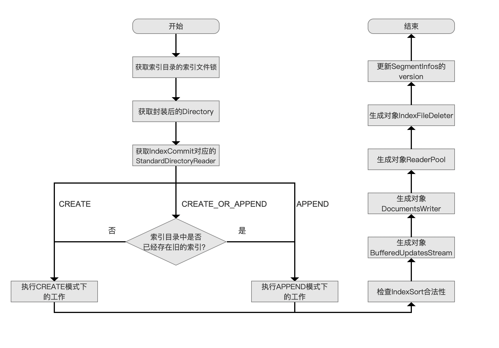

## 生成对象IndexFileDeleter

&emsp;&emsp;我们紧接上一篇文章，继续介绍剩余的流程点，下面先给出IndexFileDeleter的构造函数流程图：

### IndexFileDeleter的构造函数流程图

图2：

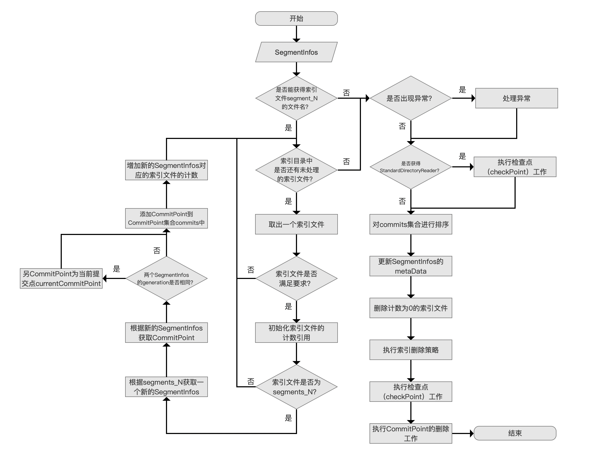

[点击]()查看大图

#### 更新SegmentInfos的metaData

图3：


&emsp;&emsp;我们先介绍下需要更新SegmentInfos的哪些metaData：

- generation：该值该值是一个迭代编号（generation number），用来命名下一次commit()生成的segments_N的N值
- nextWriteDelGen：该值是一个迭代编号，用来命名一个段的下一次生成的[索引文件.liv](https://www.amazingkoala.com.cn/Lucene/suoyinwenjian/2019/0425/54.html)
- nextWriteFieldInfosGen：该值是一个迭代编号，用来命名一个段的下一次生成的[索引文件.fnm](https://www.amazingkoala.com.cn/Lucene/suoyinwenjian/2019/0606/64.html)
- nextWriteDocValuesGen：该值是一个迭代编号，用来命名一个段的下一次生成的[索引文件.dvm&&.dvd](https://www.amazingkoala.com.cn/Lucene/DocValues/)

&emsp;&emsp;我们通过下面的例子来介绍上面的metaData的用途，图4的例子使用的索引删除策略为NoDeletionPolicy，完整的demo见：https://github.com/LuXugang/Lucene-7.5.0/blob/master/LuceneDemo/src/main/java/lucene/index/InflateGenerationTest.java 。

图4：

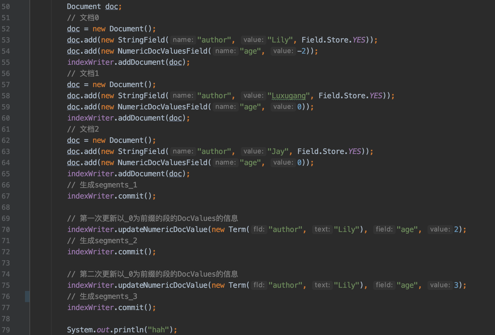

&emsp;&emsp;图4中的例子描述的是，在代码第67行执行IndexWriter.commitI()之后生成一个段，该段的索引信息对应为索引目录中以\_0为前缀的索引文件，如下所示：

图5：


&emsp;&emsp;随后执行了图4中的第70行的DocValues的更新操作，由于以\_0为前缀的段中的文档满足该更新条件，即该段中包含域名为"author"、域值为"Lily"的文档，故在执行完第72行的IndexWriter.commit()操作后，索引目录中的索引文件如下所示：

图6：

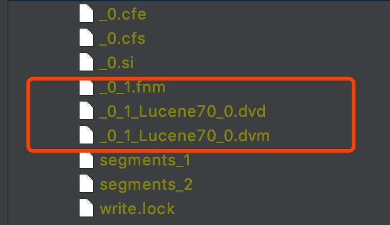

&emsp;&emsp;图6中的三个索引文件\_0\_1.fnm、\_0\_1.Lucene70\_0.dvd、\_0\_1.Lucene70\_0.dvm描述了第一次的DocValue更新后以_0为前缀的段中的DocValues信息，随后继续执行图4中第75行的DocValues的更新操作，同样的以\_0为为前缀的段中的文档仍然满足该更新条件，故在执行完第77行的IndexWriter.commit()操作后，索引目录中的索引文件如下所示：

图7：

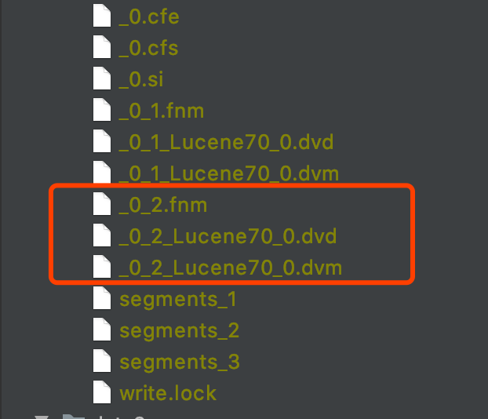

&emsp;&emsp;图7中的三个索引文件\_0\_2.fnm、\_0\_2.Lucene70\_0.dvd、\_0\_2.Lucene70\_0.dvm描述了第二次的DocValue更新后以_0为前缀的段中的DocValues信息。

图8：

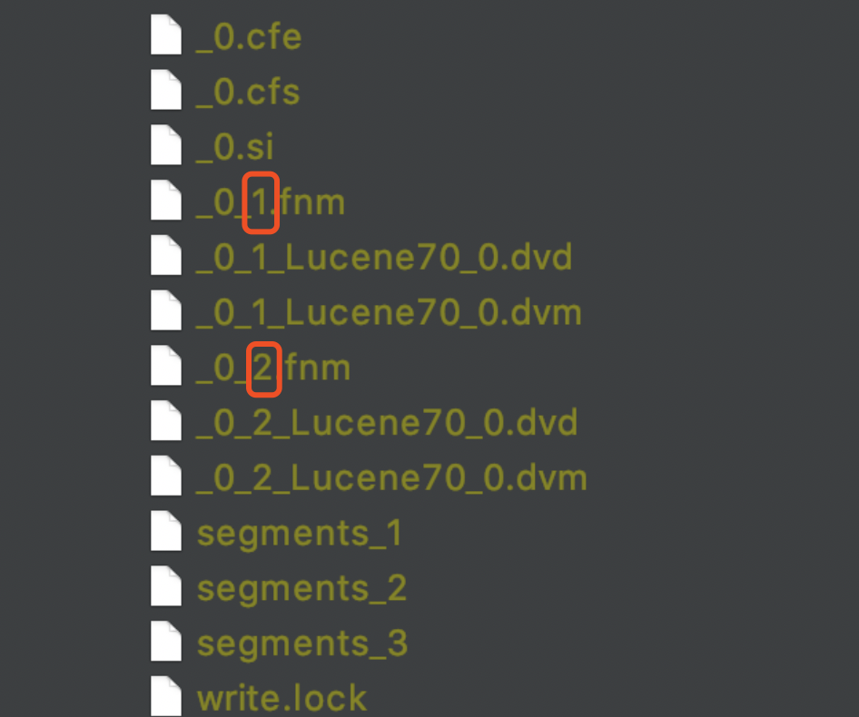

&emsp;&emsp;我们以两次生成索引文件.fnm为例，nextWriteFieldInfosGen用来命名下次生成索引文件.fnm，图8中红框标注的两个值即迭代编号（generation number）通过nextWriteFieldInfosGen来命名，**在生成图8的两个索引文件.fnm后，此时nextWriteFieldInfosGen的值变为3，为下一次生成索引文件.fnm作准备**，nextWriteDocValuesGen是同样的意思，用来命名索引文件.dvd、.dvm。

&emsp;&emsp;我们再给出下面的例子来介绍下nextWriteDelGen，完整demo见：https://github.com/LuXugang/Lucene-7.5.0/blob/master/LuceneDemo/src/main/java/lucene/index/MultiDeleteTest.java 。：

图9：

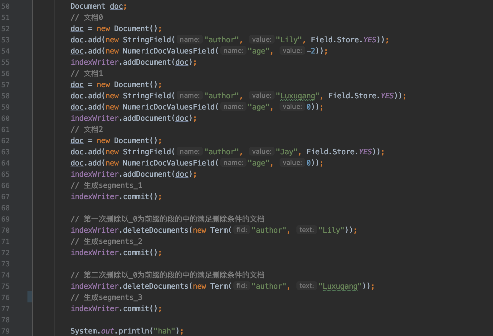

图10：

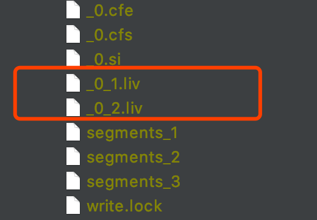

&emsp;&emsp;图10为图9的例子执行结束后的索引目录的内容，可以发现它跟nextWriteFieldInfosGen、nextWriteDocValuesGen是一样的用法。


&emsp;&emsp;我们换一个例子来介绍segments_N文件跟迭代编号之间的关系，该例子的完整demo见 https://github.com/LuXugang/Lucene-7.5.0/blob/master/LuceneDemo/src/main/java/lucene/index/MultiDeleteUpdateTest.java ，本文就不贴出来了，直接给出运行结束后索引目录中的内容：


图11：

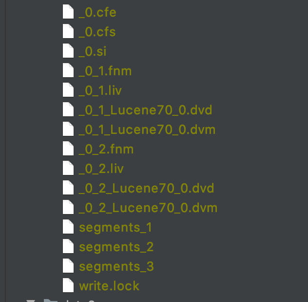

&emsp;&emsp;我们以图11中的segments_3为例，介绍生成的索引文件.fnm、.dvd、.dvm的迭代编号在segments_N文件中的描述：

图12：

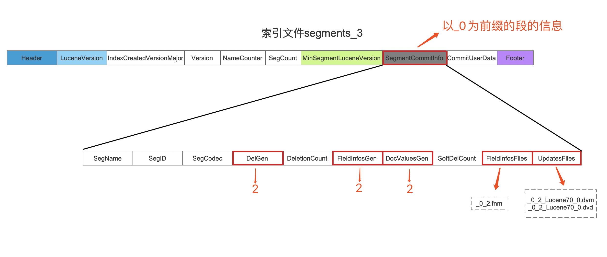

&emsp;&emsp;图12中，DelGen即图11中索引文件\_0\_2.liv的迭代编号，FieldInfosGen即图11中索引文件\_0\_2.fnm的迭代编号，DocValuesGen即图11中索引文件  \_0\_2\_Lucene70\_0.dvd、  \_0\_2\_Lucene70\_0.dvm的迭代编号，而FieldInfosFiles中描述的是以\_0为前缀的段的域信息对应的索引文件名，UpdatesFiles中描述的是以\_0为前缀的段的DocValues的信息对应的索引文件名。

&emsp;&emsp;继续给出segment_2的例子，不作多余的介绍：

图13：

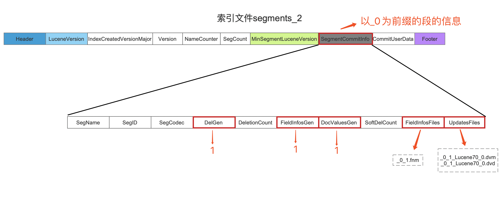


**接着我们继续介绍为什么要执行更新SegmentInfos的metaData的操作**：

&emsp;&emsp;先给出源码中的注释，该流程点对应在源码中的方法为：[IndexFileDeleter.inflateGens(...)](https://github.com/LuXugang/Lucene-7.5.0/blob/master/solr-7.5.0/lucene/core/src/java/org/apache/lucene/index/IndexFileDeleter.java) 。

```text
Set all gens beyond what we currently see in the directory, to avoid double-write in cases where the previous IndexWriter did not gracefully close/rollback (e.g. os/machine crashed or lost power)
```

&emsp;&emsp;上述的注释中，directory即索引目录、gens就是上文中我们提到的4个迭代编号，该注释的大意描述的是，之前的IndexWriter没有“优雅”的退出（操作系统/物理机 崩溃或者断电），导致索引目录中生成了一些“不优雅”的文件，为了避免新的IndexWriter生成的索引文件的文件名与索引目录中的相同（即double-write）可能会引起一些问题，不如先根据索引目录中索引文件找到gens的各自的最大值N，使得随后生成的索引文件的迭代编号从N+1开始。

&emsp;&emsp;看完上文中的注释不然引申出下面的三个问题：

**问题一：“不优雅”的文件有哪些**：

&emsp;&emsp;作者无法列出所有的不优雅的文件，只介绍某些我们可以通过代码演示的文件，并且会给出对应的demo：

- pending_segments_N文件：在[文档提交之commit](https://www.amazingkoala.com.cn/Lucene/Index/2019/0906/91.html)系列文章中，我们知道执行IndexWriter.commit()是一个两阶段提交的过程，如果在二阶段提交的第一阶段成功执行后，即生成了pending_segments_N文件，IndexWriter无法执行二阶段提交的第二阶段，比如操作系统/物理机 崩溃或者断电，那么在索引目录中就会存在pending_segments_N文件，我们可以通过这个demo来演示：https://github.com/LuXugang/Lucene-7.5.0/blob/master/LuceneDemo/src/main/java/lucene/index/UnGracefulIndexFilesTest1.java 

&emsp;&emsp;该demo运行结束后，索引目录中的文件如下所示：

图14：

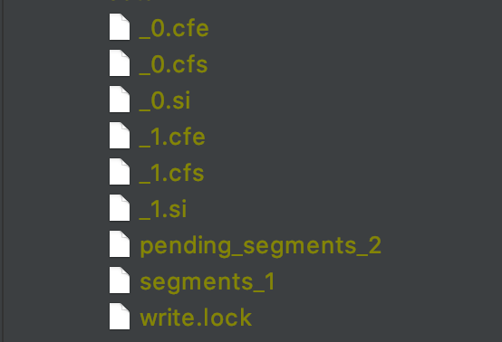

&emsp;&emsp;从图14可以看出，IndexWriter成功的执行了一次commit()操作，即生成了segments_1文件，当再次执行commit()操作时，只成功执行了二阶段提交的第一阶段，即只生成了pending_segments_2文件。

- 修改了索引目录中的内容，但是没有commit：执行了文档的增删改之后，但是没有执行commit()操作就异常退出了，那么上一次commit之后的生成的索引文件都是“不优雅”的
- 无法删除的索引文件：由于本人对文件系统没有深入的理解，这方面的内容不敢妄言，故直接给出Lucene在源码中的解释

```text
On windows, a file delete can fail because there is still an open file handle against it.  We record this in pendingDeletes and try again later.
```


**问题二：为什么新的IndexWriter生成的索引文件的文件名可能会与索引目录中的相同**：

&emsp;&emsp;我们先给出SegmentCommitInfo对象的构造函数：

图15：

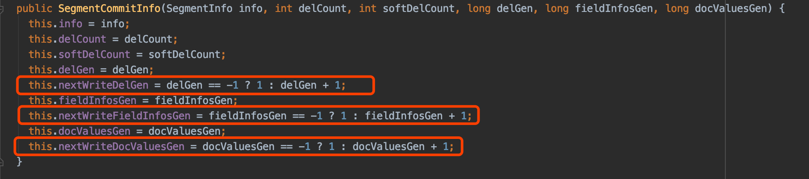

&emsp;&emsp;我们以图11为例，如果我们另segments_2中的内容作为IndexCommit来构造一个新的IndexWriter，此时以\_0为前缀的段的delGen、fieldInfosGen、docValuesGen都为1，那么根据图15的构造函数，nextWriteDelGen、nextWriteFieldInfosGen、nextWriteDocValuesGen都会被初始化为2，也就说如果以\_0为前缀的段在后续的操作中满足删除或者DocValues的更新操作，新生成的.fnm、.dvd、.dvm的迭代编号就是2，那么就会出现与图11中的索引文件有相同的文件名

**问题三：新的IndexWriter生成的索引文件的文件名与索引目录中的相同（即double-write）可能会引起哪些问题**：

&emsp;&emsp;其中一个问题是即将生成的某个索引文件的文件名与索引目录中某个无法删除的索引文件的文件名是一致的，那必然会出问题，另外在Linux平台，如果挂载的文件系统是CIFS（Common Internet File System），也是有可能出现文件无法删除的情况。

&emsp;&emsp;综上所述，能避免这些问题的最好方式就是根据索引目录中索引文件找到gens的各自的最大值N，使得随后生成的索引文件的迭代编号从N+1开始，使得新生成的索引文件不可能与索引目录中的任何索引文件重名。

#### 删除计数为0的索引文件

图16：


&emsp;&emsp;该流程用来删除索引目录中那些计数为0的索引文件，那么问题就来了：

**索引目录中哪些索引文件的计数会为0呢：**：

&emsp;&emsp;我们在文章[构造IndexWriter对象（八）](https://www.amazingkoala.com.cn/Lucene/Index/2019/1203/113.html)中说道，在图17的流程中，会根据索引目录中的segments_N文件，找到对应的所有索引文件，然后增加了这些索引文件的计数，所以他们是不会被删除的，即下面用红框标注的流程点：

图17：

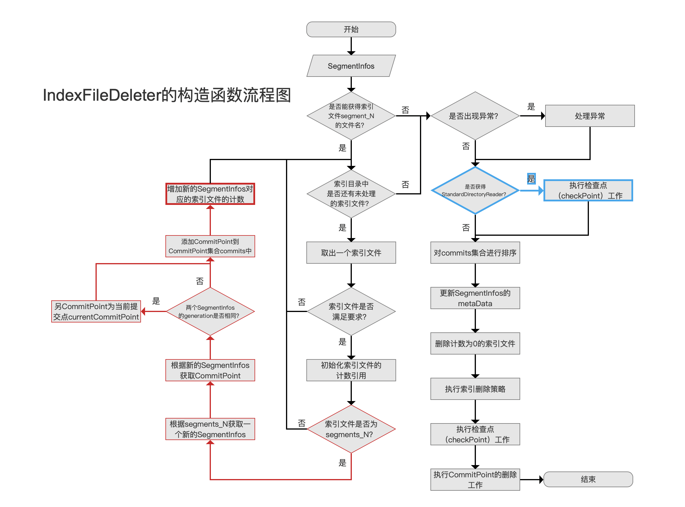

&emsp;&emsp;除去segments_N对应的索引文件，那么此时索引目录中还剩下两种类型的索引文件：

- “不优雅”的索引文件：这些文件的计数肯定为0
- 通过NRT生成的索引文件（见文章[构造IndexWriter对象（八）](https://www.amazingkoala.com.cn/Lucene/Index/2019/1203/113.html)）：这些索引文件是有效的索引信息，不能被删除，这也是解释为什么我们需要执行图17中用蓝色标注的流程点，在这两个流程点中，通过NRT生成的索引文件会被增加计数，故不会被删除

#### 执行索引删除策略

图18：

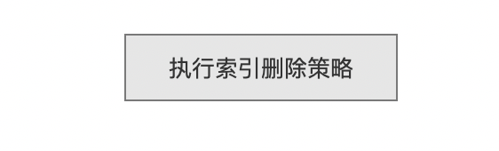

&emsp;&emsp;仍旧以图11中的索引目录为例，如果上一个IndexWriter执行了close()方法后，索引目录中的内容如图11所示，如果我们用segments_2对应的IndexCommit作为新的IndexWriter的配置，那么当执行到当前流程点后，实际是让用户来选择如何处理segments_1跟segments_3这两次的提交，这两次都是有效的提交。根据新的IndexWriter使用的索引删除策略来处理这两个提交。

#### 执行检查点（checkPoint）工作

图19：


&emsp;&emsp;这里的流程点的逻辑跟图17中蓝色标注的流程点是一致的，具体的执行流程在[构造IndexWriter对象（八）](https://www.amazingkoala.com.cn/Lucene/Index/2019/1203/113.html)已介绍，不赘述。

**为什么这里还要执行一次checkPoint的工作**：

&emsp;&emsp;介绍这个问题需要介绍执行索引删除策略的完整流程才能理解，故基于篇幅，剩余的内容将在下一篇文章中展开。

# 结语
&emsp;&emsp;无

[点击](http://www.amazingkoala.com.cn/attachment/Lucene/Index/IndexWriter/构造IndexWriter对象（九）/构造IndexWriter对象（九）.zip)下载附件