# [构造IndexWriter对象（八）](https://www.amazingkoala.com.cn/Lucene/Index/)

&emsp;&emsp;本文承接[构造IndexWriter对象（七）](https://www.amazingkoala.com.cn/Lucene/Index/2019/1202/112.html)，继续介绍调用IndexWriter的构造函数的流程。

# 调用IndexWriter的构造函数的流程图

图1：

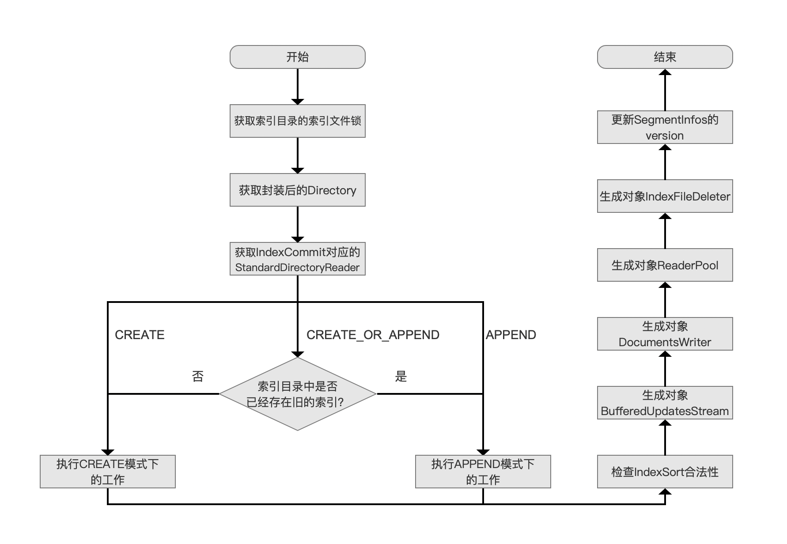

## 生成对象IndexFileDeleter

&emsp;&emsp;我们紧接上一篇文章，继续介绍剩余的流程点，下面先给出IndexFileDeleter的构造函数流程图：

### IndexFileDeleter的构造函数流程图

图2：

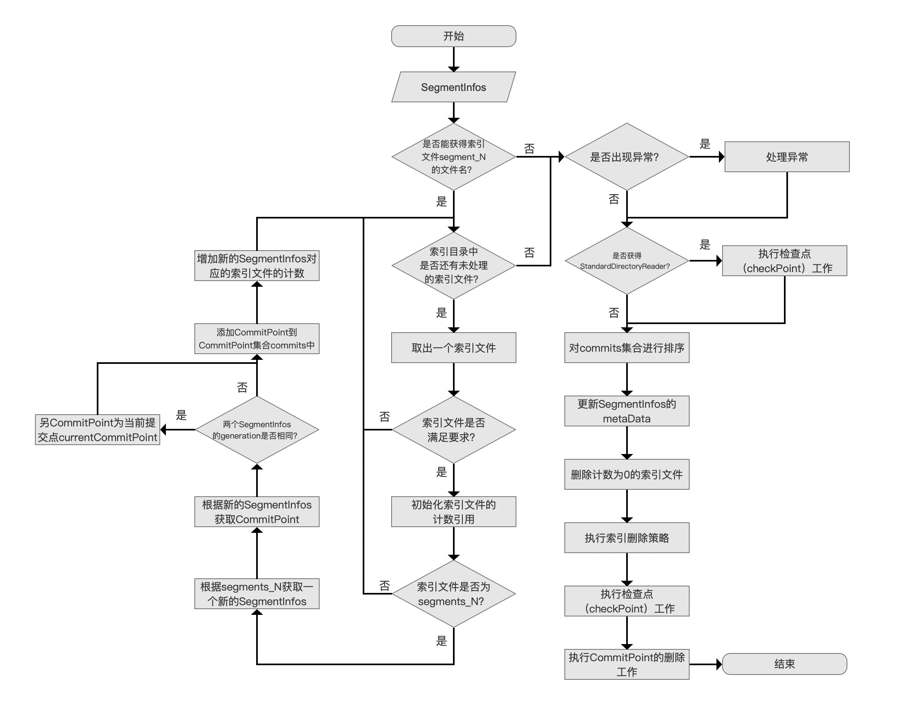

[点击]()查看大图

#### 执行检查点（checkPoint）工作

图3：

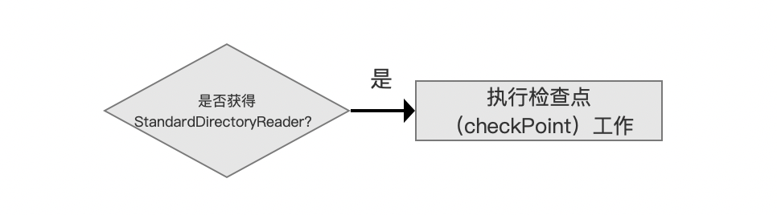

&emsp;&emsp;在介绍当前流程点之前，我们先通过下面的流程图来介绍`执行检查点的工作`这个流程点做了哪些事情。

&emsp;&emsp;另外`执行检查点（checkPoint）工作`在源码中对应的方法方法定义：

```java
public void checkpoint(SegmentInfos segmentInfos, boolean isCommit) throws IOException {
    ... ...
}
```

##### 执行检查点（checkPoint）工作的流程图

图4：

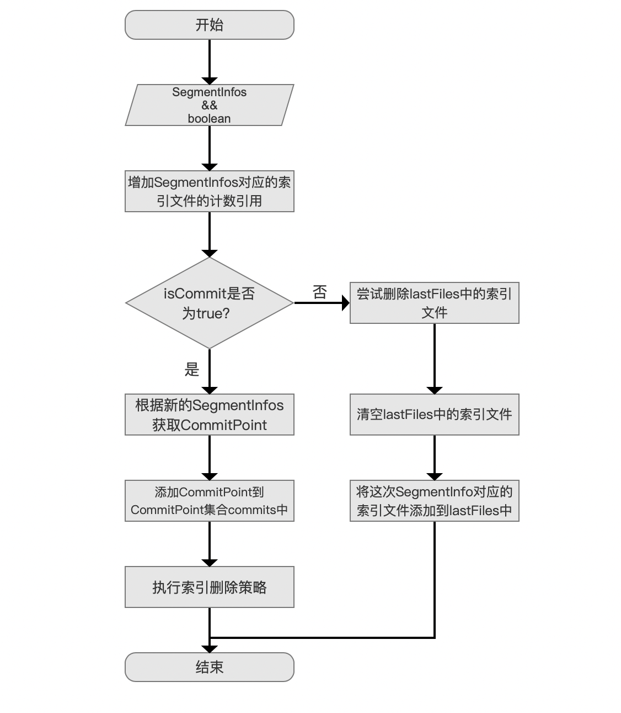

###### 准备数据

图5：

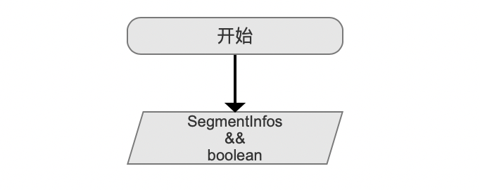

&emsp;&emsp;图4流程图的准备数据就是checkPoint方法的两个参数SegmentInfos以及boolean。

###### 增加SegmentInfos对应的索引文件的计数引用

图6：


&emsp;&emsp;在后面的流程中，可能会执行索引文件的删除，如果某些索引文件被SegmentInfos引用，那么这些索引文件不应该被删除，防止被删除的方法就是增加SegmentInfos对应的索引文件的计数引用。


###### 当isCommit为true时的处理流程

图7：

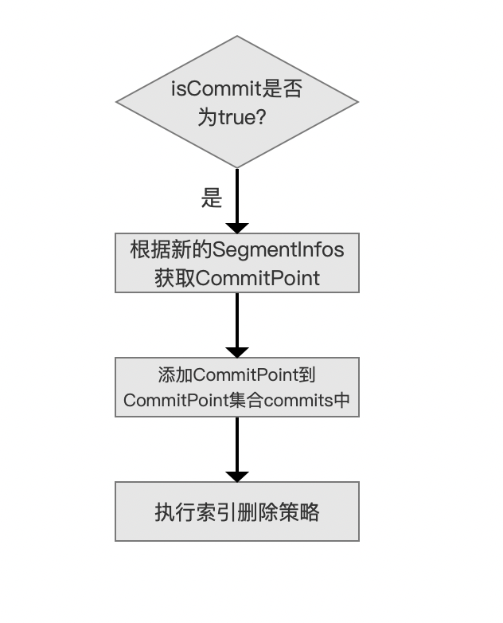

&emsp;&emsp;在执行commit()操作时，也会执行checkPoint的操作，那么此时的isCommit是位true的，在文章[文档提交之commit（二）](https://www.amazingkoala.com.cn/Lucene/Index/2019/0909/92.html)中介绍了这个流程，不赘述。

###### 当isCommit为false时的处理流程

图8：

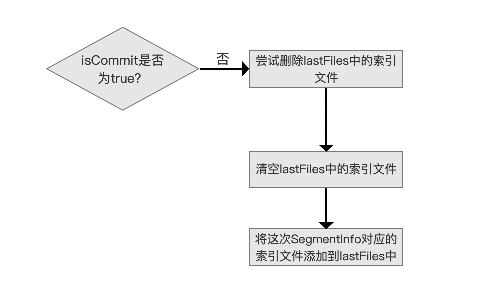

&emsp;&emsp;lastFiles是一个IndexFileDeleter类的成员变量，它用来存放上次执行checkPoint的SegmentInfos中对应的索引文件定义如下：

```java
private final List<String> lastFiles = new ArrayList<>();
```

&emsp;&emsp;所以当isCommit为false时，先尝试删除lastFiles中的索引文件，删除的方式就是减少每一个索引文件的计数引用，如果计数值为0，那么该索引文件就要被删除，否则不删除，最后清空lastFiles中的索引文件后，将这次SegmentInfos对应的索引文件添加到lastFiles中。

&emsp;&emsp;结合图6跟图8我们可以发现这种流程的逻辑设计可以使得，即使对同一个SegmentInfos对象执行**多次**checkPoint的操作时，如果该对象中的段没有发生变化，那么段对应索引文件的计数是不会变的（先增加计数，再减少计数），同样地，如果SegmentInfos中如果增加了段，能通过图6的流程点对该段中的索引文件执行正确的+1计数，如果删除了某个段，能通过图8的流程点`尝试删除lastFiles中的索引文件`对该段中的索引文件执行正确的-1计数。

**为什么要通过checkPoint来实现索引文件的删除**：

&emsp;&emsp;Lucene通过IndexWriter对象中的成员变量SegmentInfos来描述当前IndexWriter对应的索引信息，索引信息的变化通过SegmentInfos对象来反应，但是SegmentInfos对象并不真正的拥有索引文件的数据，它拥有只是这些索引文件的文件名，所以当SegmentInfos对应的信息发生变化时，例如某个段中包含的所有文档满足某个删除操作，该段的信息会从SegmentInfos中移除（段的信息即SegmentCommitInfo，见文章[构造IndexWriter对象（四）](https://www.amazingkoala.com.cn/Lucene/Index/2019/1125/109.html)关于流程点`获得回滚（rollback）信息`的介绍），那么这个段对应的索引文件也应该要删除（如果索引文件的计数引用为0），当然如果其他段同时引用这些索引文件，那么就不会被删除（索引文件的计数引用不为0），也就是为什么图7的流程点`尝试删除lastFiles中的索引文件`为什么要带有`尝试`两个字。

**我们回到当前流程点，介绍下为什么获得StandardDirectoryReader后需要执行`执行检查点（checkPoint）工作`**：

&emsp;&emsp;根据图2的流程，我们是在构造IndexFileDeleter对象的流程中第一次调用checkPoint()方法，那么lastFiles中必定不包含任何的数据，并且在源码中调用checkPoint()方法的参数如下所示：

```java
checkpoint(segmentInfos, false);
```

&emsp;&emsp;segmentInfos即StandardDirectoryReader中对应的索引信息（见文章[构造IndexWriter对象（四）](https://www.amazingkoala.com.cn/Lucene/Index/2019/1125/109.html)中`用StandardDirectoryReader初始化一个新的SegmentInfos对象`流程点的介绍），同时isCommit的值为false，也就说在当前流程点调用checkPoint()方法的目的就是**仅仅**为了增加segmentInfos对应的索引文件的计数，那么就转变为如下的问题：

**为什么获得StandardDirectoryReader后，需要增加segmentInfos对应的索引文件的计数**：

&emsp;&emsp;首先给出源码中的解释：

```java
// Incoming SegmentInfos may have NRT changes not yet visible in the latest commit, so we have to protect its files from deletion too:
```

&emsp;&emsp;我们用一个例子来介绍上文的注释所描述的场景，完整代码见：https://github.com/LuXugang/Lucene-7.5.0/blob/master/LuceneDemo/src/main/java/lucene/index/CheckPointInIndexFileDeleter.java 。

图9：

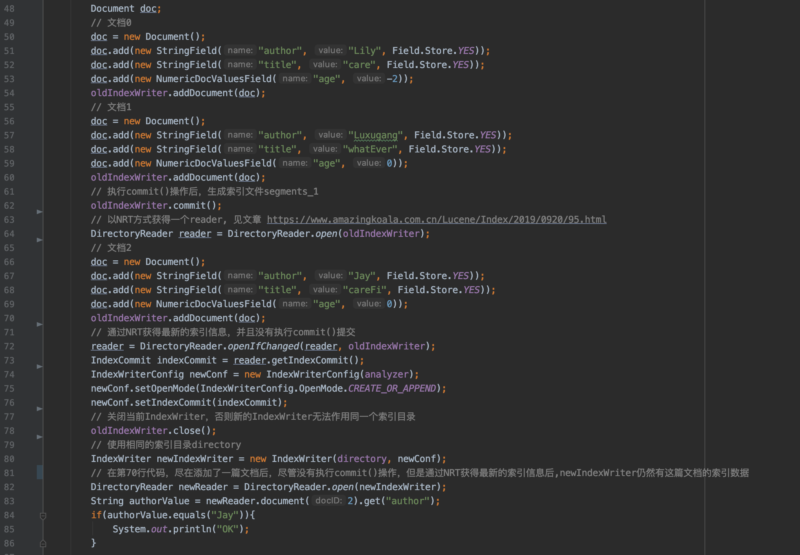

&emsp;&emsp;图9中当第62行的oldIndexWriter.commit()操作执行结束后，索引目录中的索引文件如下所示：

图10：

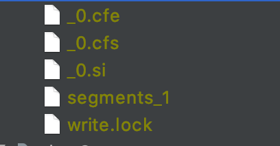

&emsp;&emsp;接着执行完第64行的代码后，我们获得了一个NRT的Reader（见文章[近实时搜索NRT（三）](https://www.amazingkoala.com.cn/Lucene/Index/2019/0920/95.html)的介绍），接着第70行代码结束后，oldIndexWriter新增了一篇文档2，注意的是并没有执行commit()操作（即没有生成新的segments_N文件），随后通过第72行的[openIfChange()](https://www.amazingkoala.com.cn/Lucene/Index/2019/0925/96.html)方法获得一个包含最新索引信息的reader（即StandardDirectoryReader），通过该reader获得一个IndexCommit，IndexCommit中包含了第70行代码增加的索引信息，即图11中以_1为前缀的索引文件，并且在第76行通过IndexWriterConfig.setIndexommit()方法将IndexCommit成为newIndexWriter的配置，在执行完第78行代码后，索引目录中的索引文件如下所示：

图11：

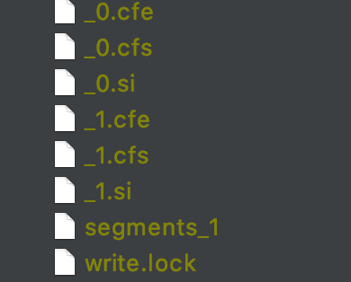

&emsp;&emsp;从图11可以看出，以\_1为前缀的索引文件无法被最后的一次commit()可见，即Incoming SegmentInfos may have NRT changes not yet visible in the latest commit，那么在下面的用红色标注的流程中，就无法通过segments_N文件来增加\_1.cfe、\_1.cfs、\_1.si的计数，这些索引文件就是通过NRT changes获得的，在后面的流程中，我们将会知道计数为0的文件都会被删除：

图12：

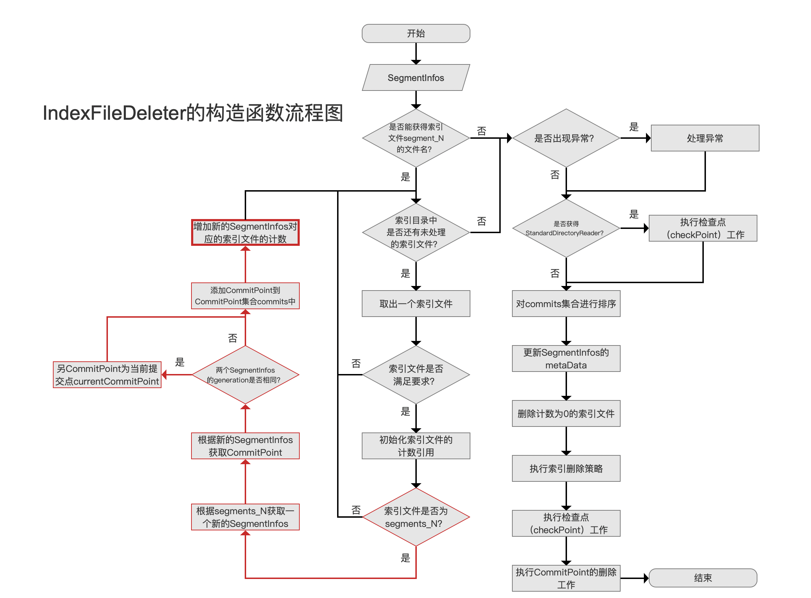

#### 对commits集合进行排序

图13：


&emsp;&emsp;在文章[构造IndexWriter对象（七）](https://www.amazingkoala.com.cn/Lucene/Index/2019/1202/112.html)中，根据索引目录中的segments_N文件，将对应的segments_N对应的SegmentInfos生成CommitPoint，并且添加到CommitPoint集合commits中，添加的过程是无序的，如果构造中的IndexWriter对象使用的是默认的索引删除策略[KeepOnlyLastCommitDeletionPolicy](https://www.amazingkoala.com.cn/Lucene/Index/2019/0909/92.html)，那么就无法正确的处理 了，所以需要按照从早到晚的顺序来排序。

# 结语

&emsp;&emsp;基于篇幅，剩余的内容将在下一篇文章中展开。

[点击](http://www.amazingkoala.com.cn/attachment/Lucene/Index/IndexWriter/构造IndexWriter对象（八）/构造IndexWriter对象（八）.zip)下载附件