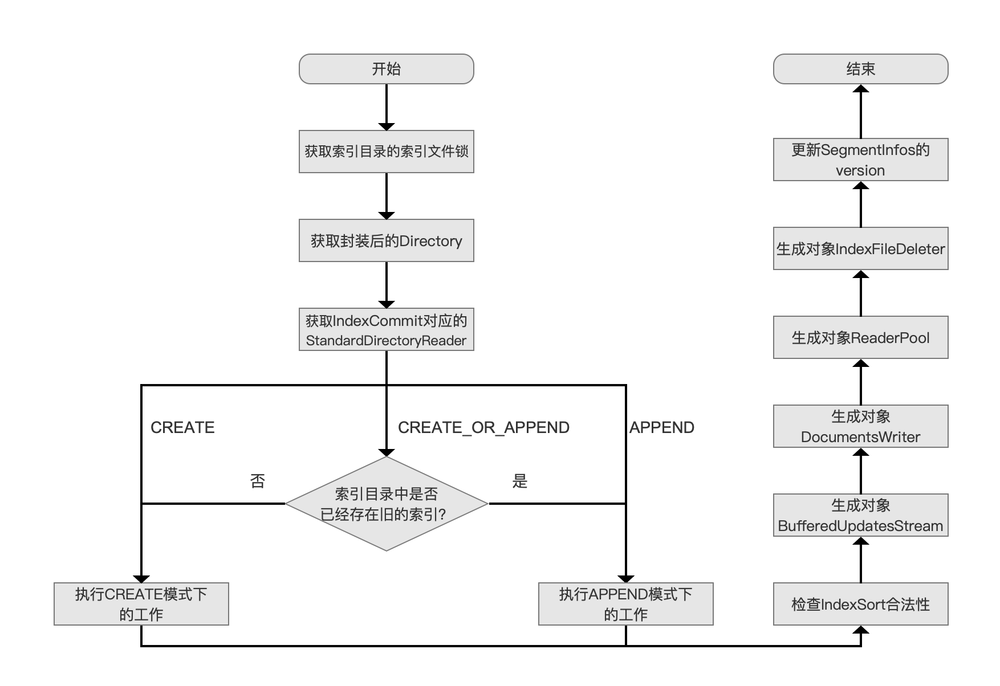
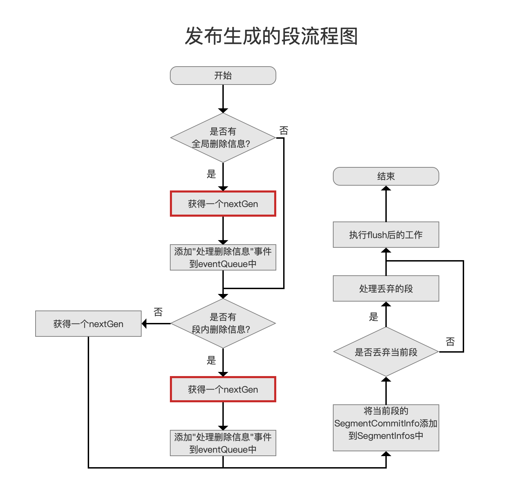
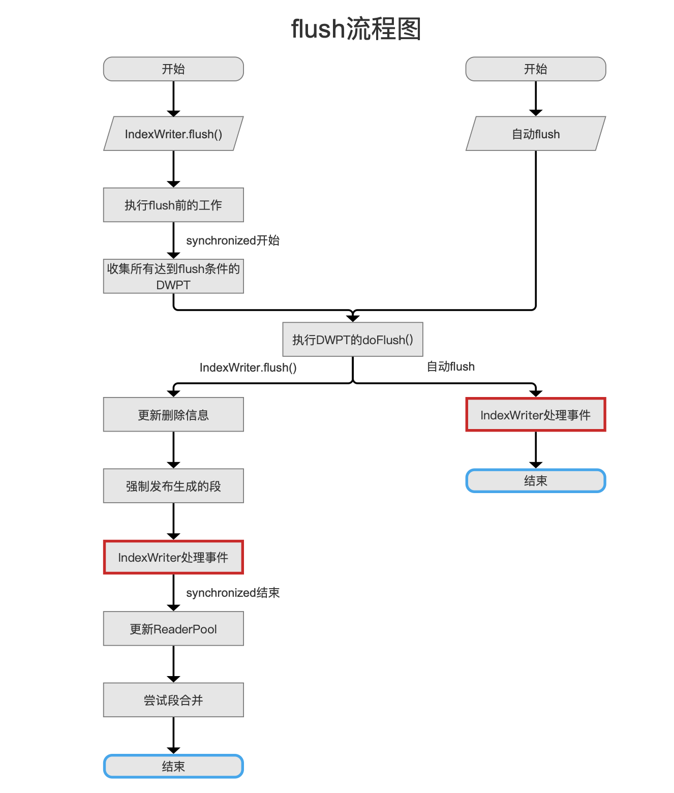
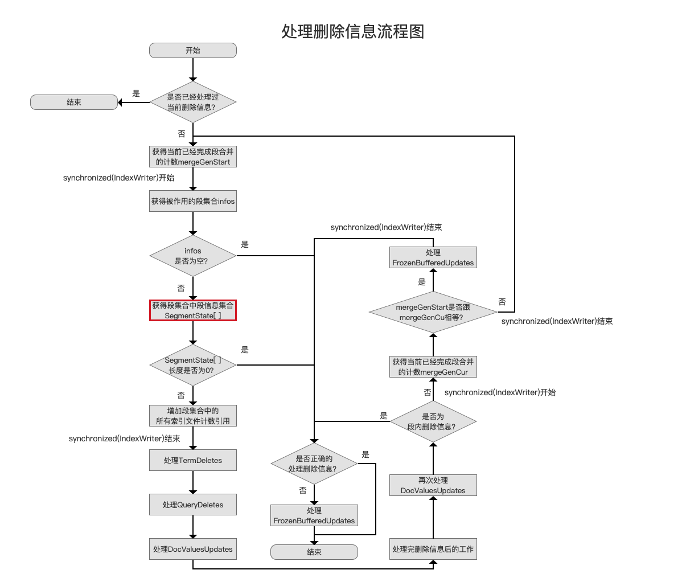
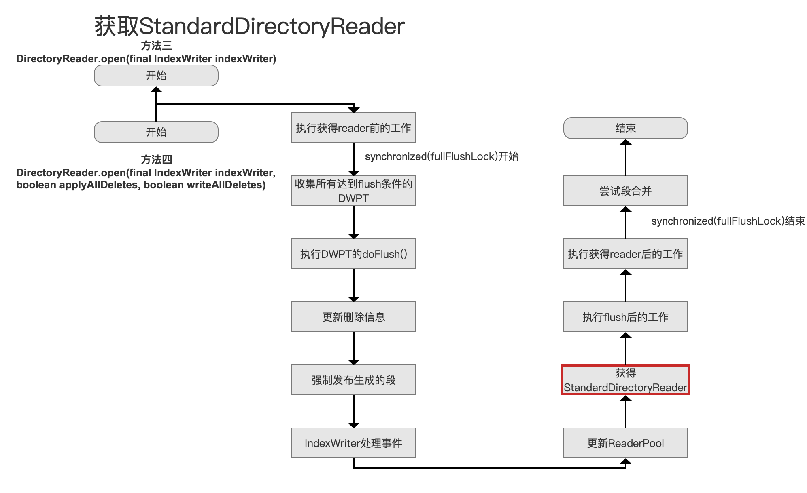
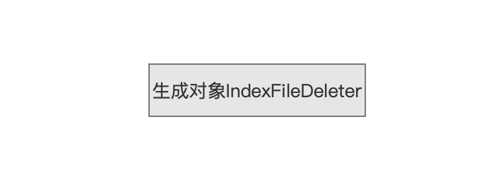

# [构造IndexWriter对象（六）](https://www.amazingkoala.com.cn/Lucene/Index/)

&emsp;&emsp;本文承接[构造IndexWriter对象（五）](https://www.amazingkoala.com.cn/Lucene/Index/2019/1126/110.html)，继续介绍调用IndexWriter的构造函数的流程。

# 调用IndexWriter的构造函数的流程图

图1：



## 生成对象BufferedUpdatesStream

图2：


&emsp;&emsp;**介绍该对象会涉及很多在[文档提交之flush](https://www.amazingkoala.com.cn/Lucene/Index/2019/0716/74.html)系列文章中的知识点，故如果没有看过或者不熟悉flush流程的同学可以跳过下面的内容，只需要知道该对象的生成时机就行了**。

&emsp;&emsp;BufferedUpdatesStream用来追踪（track）FrozenBufferedUpdates，主要负责执行FrozenBufferedUpdates的两个工作：

- 获得nextGen：它用来描述FrozenBufferedUpdates中的删除信息应该作用哪些段，见[文档提交之flush（六）](https://www.amazingkoala.com.cn/Lucene/Index/2019/0805/79.html)文章中的介绍
- 作用（apply）删除信息：FrozenBufferedUpdates中存放了删除信息以及更新信息（DocValues相关），为了方便描述，在下文中 删除信息、更新信息统称为删除信息。删除信息被作用到每一个段称为处理删除信息，根据作用（apply）的目标段，处理删除信息划分为两种处理方式：

  - 全局FrozenBufferedUpdates：根据全局FrozenBufferedUpdates内的nextGen（见[文档提交之flush（六）](https://www.amazingkoala.com.cn/Lucene/Index/2019/0805/79.html)）值，其删除信息将要作用到所有比该nextGen值小的段
  - 段内FrozenBufferedUpdates：在[文档提交之flush（三）](https://www.amazingkoala.com.cn/Lucene/Index/2019/0725/76.html)中我们提到，在生成索引文件的过程中，我们只处理了部分满足删除信息，即只处理了满足删除信息TermArrayNode、TermNode（见[文档的增删改（下）（part 2）](https://www.amazingkoala.com.cn/Lucene/Index/2019/0704/71.html)）的段内部分文档，而如果段内FrozenBufferedUpdates还存在删除信息QueryArrayNode、DocValuesUpdatesNode，那么根据段内FrozenBufferedUpdates就可以找出所有剩余的满足删除的文档

&emsp;&emsp;**获得nextGen**的执行时机点在flush的流程中的位置如下所示，用红框标注：

图3：



&emsp;&emsp;图3的流程图的每个流程点的详细介绍见[文档提交之flush（六）](https://www.amazingkoala.com.cn/Lucene/Index/2019/0805/79.html)。

&emsp;&emsp;**作用（apply）删除信息**的执行时机点在flush的流程中的位置如下所示，用红框标注：

图4：



&emsp;&emsp;从图3的流程中可以知道，在FrozenBufferedUpdates获得nextGen之后就被添加到了eventQueue（见[文档提交之flush（四）](https://www.amazingkoala.com.cn/Lucene/Index/2019/0730/77.html)中的介绍）中，故该**作用（apply）删除信息**的执行时机点在图4的`IndexWriter处理事件`的流程中。

## 生成对象DocumentsWriter

图5：


&emsp;&emsp;DocumentsWriter对象主要负责下面的三个工作：

- 文档的增删改：用户通过IndexWriter对象执行文档的增删改的任务，实际都是IndexWriter通过调用DocumentsWriter对象来实现的，文档的增删改的详细过程可以看[文档的增删改](https://www.amazingkoala.com.cn/Lucene/Index/2019/0626/68.html)的系列文章
- 将DWPT生成（flush）为一个段：该工作即图4中的流程`执行DWPT的doFlush()`
- 执行主动flush以后的收尾工作：该内容见[文档提交之flush（六）](https://www.amazingkoala.com.cn/Lucene/Index/2019/0805/79.html)中关于[DocumentsWriterFlushControl.finishFullFlush( )](https://github.com/LuXugang/Lucene-7.5.0/blob/master/solr-7.5.0/lucene/core/src/java/org/apache/lucene/index/DocumentsWriterFlushControl.java)的方法的介绍

## 生成对象ReaderPool

&emsp;&emsp;跟BufferedUpdatesStream一样，由于个人表达能力有限，无法通过有限的语句来描述ReaderPool，故阅读下面的内容需要很多前置的内容，这些内容会以链接的方式给出，不会作详细的介绍，见谅。

&emsp;&emsp;ReaderPool的命名方式就能完美描述该对象的作用，字面意思就是 存放reader的池子（pool），在源码注释中只用了一句话来描述该对象的作用，如下所示：

```text
Holds shared SegmentReader instances
```

&emsp;&emsp;ReaderPool就是用来缓存SegmentReader对象（SegmentReader用来描述一个段的索引信息，详细介绍可以看[SegmentReader](https://www.amazingkoala.com.cn/Lucene/Index/2019/1014/99.html)系列文章），使得Lucene在执行下面的操作时都会尝试先去ReaderPool取出SegmentReader：

- 作用（apply）删除信息、更新DocValues信息
- 执行段的合并
- 分发（handing out）一个实时的Reader

### 作用（apply）删除信息、更新DocValues信息

&emsp;&emsp;对于索引目录中的某一个段，由于后续有新的删除/更新操作，如果该段中的文档满足删除/更新的条件，那么该段对应的SegmentReader中的索引信息也需要发生更改，那么根据索引信息是否会被更改可以分为下面两类：

- 不会发生变更的索引信息：该索引信息即我们在文章[SegmentReader（一）](https://www.amazingkoala.com.cn/Lucene/Index/2019/1014/99.html)中介绍的SegmentCoreReaders
- 会发生变更的索引信息：该索引信息即描述删除信息的[索引文件.liv](https://www.amazingkoala.com.cn/Lucene/suoyinwenjian/2019/0425/54.html)、描述域信息的[索引文件.fnm](https://www.amazingkoala.com.cn/Lucene/suoyinwenjian/2019/0606/64.html)、以及描述DocValues的[索引文件.dvd&&.dvm](https://www.amazingkoala.com.cn/Lucene/DocValues/)

&emsp;&emsp;生成一个SegmentReader对象的开销是极大的，原因是读取索引信息为磁盘I/O操作，故使用ReaderPool来缓存SegmentReader，当需要作用（apply）删除信息、更新DocValues信息时，只需要从ReaderPool中取出该段对应的SegmentReader（如果不存在则先添加到ReaderPool），并且只修改SegmentReader中会发生变更的索引信息。

&emsp;&emsp;在flush()阶段，DWPT（见文章[文档的增删改（中）](https://www.amazingkoala.com.cn/Lucene/Index/2019/0628/69.html)）被flush为一个段后，并不会马上被添加到ReaderPool中（lazy init机制），而是当该段需要被作用（apply）删除信息、更新DocValues信息时，被添加到ReaderPool的时机点在下图中用红框标注：

图6：



&emsp;&emsp;图6的流程图在文章[文档提交之flush（七）](https://www.amazingkoala.com.cn/Lucene/Index/2019/0807/80.html)中做了详细介绍，感兴趣的同学可以看一看。

### 执行合并

&emsp;&emsp;执行段的合并的过程是通过每个段对应的SegmentReader中包含的索引信息进行合并（见[执行段的合并（三）](https://www.amazingkoala.com.cn/Lucene/Index/2019/1028/103.html)），故在合并期间需要获取待合并段的SegmentReader，而获取的方式就是从ReaderPool获取。

&emsp;&emsp;当然也有可能一个或多个待合并的段对应的SegmentReader并不在ReaderPool（原因是没有 作用（apply）删除信息、更新DocValues信息），那么此时就需要生成新的SegmentReader对象，并添加到ReaderPool中。

### 分发（handing out）一个实时（real time）的Reader

&emsp;&emsp;在文章[近实时搜索NRT（一）](https://www.amazingkoala.com.cn/Lucene/Index/2019/0916/93.html)中我们说到，有下面的四种方法可以获得StandardDirectoryReader：

- 方法一：DirectoryReader.open(final Directory directory)
- 方法二：DirectoryReader.open(final IndexCommit indexCommit)
- 方法三：DirectoryReader.open(final IndexWriter indexWriter)
- 方法四：DirectoryReader.open(final IndexWriter indexWriter, boolean applyAllDeletes, boolean writeAllDeletes)

&emsp;&emsp;其中通过方法三，方法四能获得具有NRT功能的StandardDirectoryReader（见文章[近实时搜索NRT（三）](https://www.amazingkoala.com.cn/Lucene/Index/2019/0920/95.html)），并且在这两个方法的实现过程中，会将StandardDirectoryReader中的SegmentReader缓存到ReaderPool中，这样的做法使得当再次通过方法三、方法四或者性能更高的OpenIfChange()方法（[近实时搜索NRT（四）](https://www.amazingkoala.com.cn/Lucene/Index/2019/0925/96.html)）获得StandardDirectoryReader时，能先从ReaderPool中获得缓存的SegmentReader，即所谓的"分发"。

&emsp;&emsp;实时（real time）的StandardDirectoryReader缓存到ReaderPool的时机点如下红框标注所示所示：

图7：



&emsp;&emsp;图7的流程图的详细介绍见文章[近实时搜索NRT（二）](https://www.amazingkoala.com.cn/Lucene/Index/2019/0917/94.html)。

#### ReaderPool的构造函数

&emsp;&emsp;另外还要说下的是，在ReaderPool的构造函数中，会将图1中流程点`获取IndexCommit对应的StandardDirectoryReader`获得的StandardDirectoryReader中的SegmentReader缓存到ReaderPool中。

## 生成对象IndexFileDeleter

图8：



&emsp;&emsp;IndexFileDeleter用来追踪SegmentInfos是否还"活着（live）"，在文章[构造IndexWriter对象（四）](https://www.amazingkoala.com.cn/Lucene/Index/2019/1125/109.html)中我们介绍了SegmentInfos对象跟索引文件segments_N的关系，简单的概括就是SegmentInfos对象是索引文件segments_N和索引文件.si在内存中的表示。

&emsp;&emsp;当执行索引删除策略时，例如默认的索引删除策略[KeepOnlyLastCommitDeletionPolicy](https://www.amazingkoala.com.cn/Lucene/Index/2019/0909/92.html)，新的提交生成后（即生成新的segments_N文件）需要删除上一次提交，即需要删除上一次提交对应的所有索引信息，而用来描述所有索引信息的正是SegmentInfos，删除SegmentInfos的真正目的是为了删除对应在索引目录中的索引文件，但这些索引文件如果正在被其他SegmentInfos引用，那么就不能被删除，IndexFileDeleter真正的工作就是判断索引目录中的索引文件是否允许被删除。

**IndexFileDeleter如何判断索引目录中的索引文件是否允许被删除**

&emsp;&emsp;使用引用计数的方式。

### IndexFileDeleter的构造函数

&emsp;&emsp;基于篇幅，将在下一篇文章中介绍IndexFileDeleter的构造函数

# 结语

&emsp;&emsp;无

[点击](http://www.amazingkoala.com.cn/attachment/Lucene/Index/IndexWriter/构造IndexWriter对象（六）/构造IndexWriter对象（六）.zip)下载附件


