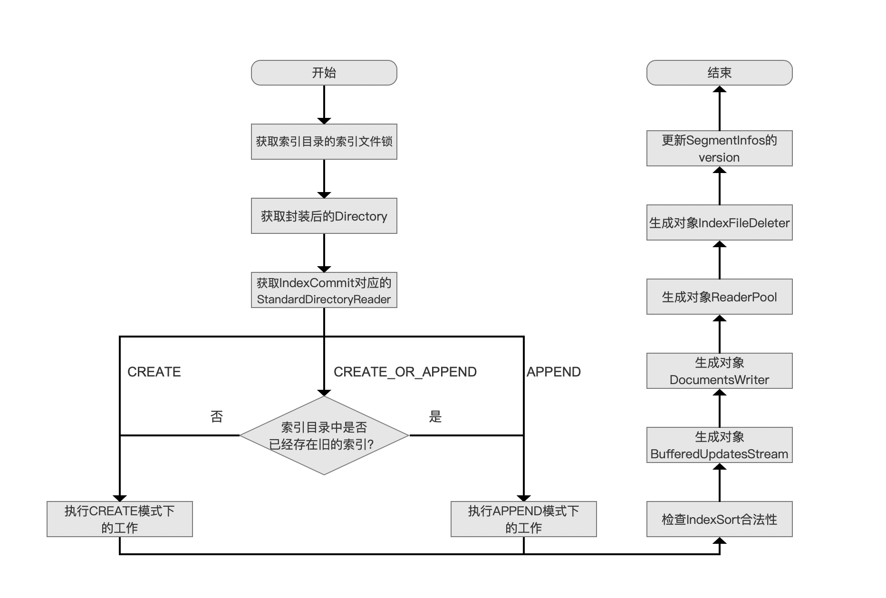
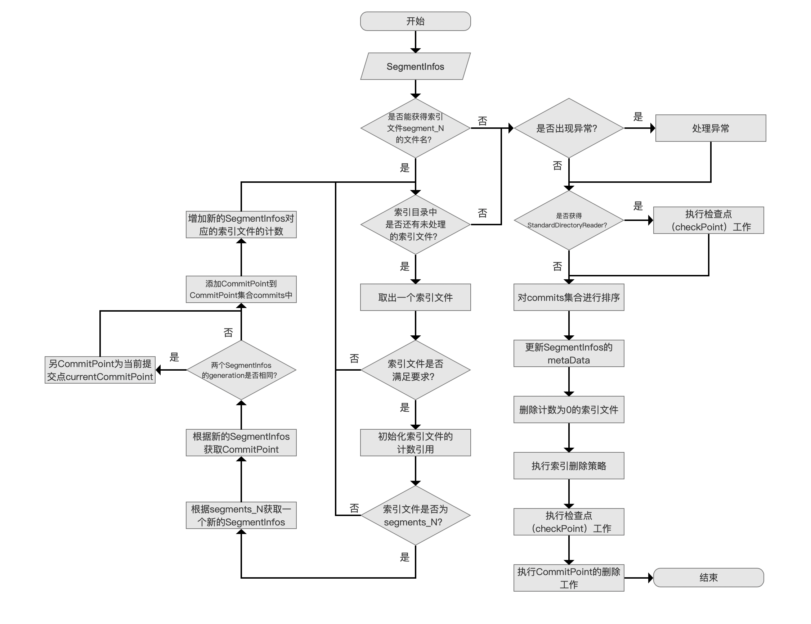
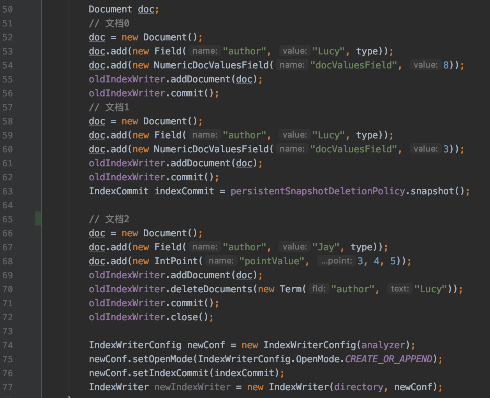
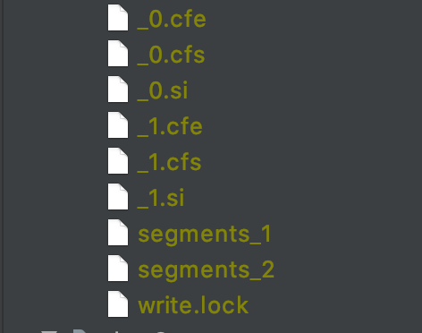
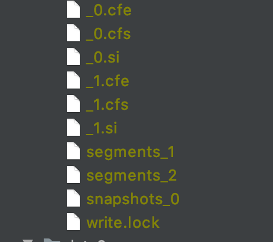
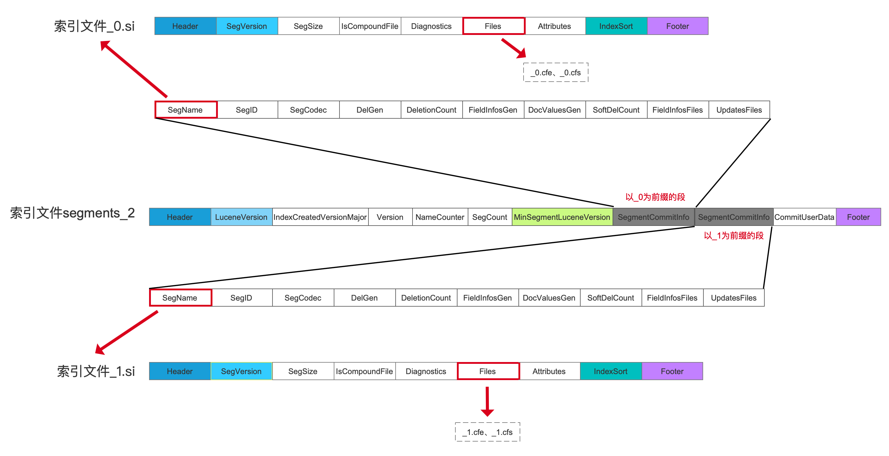
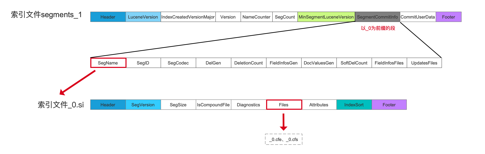
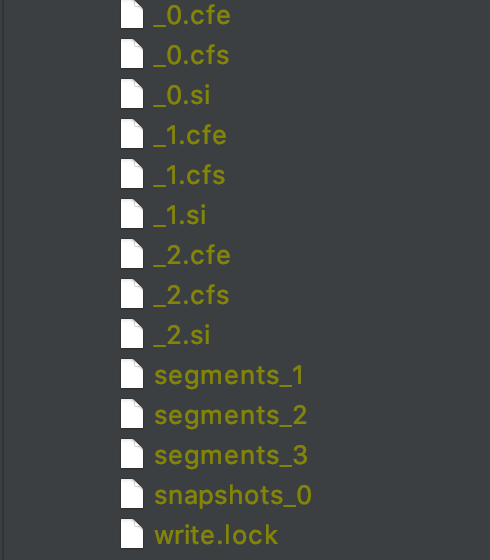
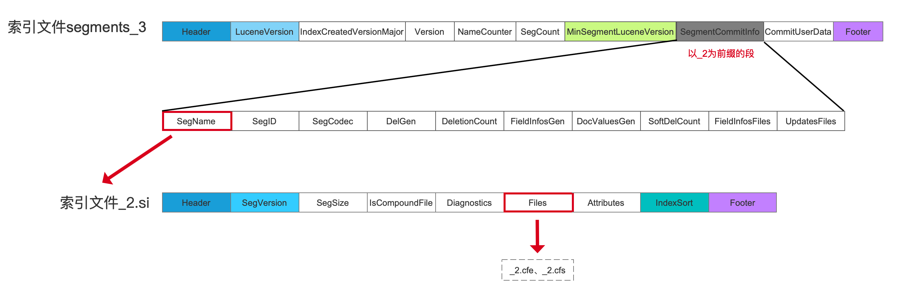

# [构造IndexWriter对象（十）](https://www.amazingkoala.com.cn/Lucene/Index/)

&emsp;&emsp;本文承接[构造IndexWriter对象（九）](https://www.amazingkoala.com.cn/Lucene/Index/2019/1205/114.html)，继续介绍调用IndexWriter的构造函数的流程。

# 调用IndexWriter的构造函数的流程图

图1：



## 生成对象IndexFileDeleter

&emsp;&emsp;我们紧接上一篇文章，继续介绍剩余的流程点，下面先给出IndexFileDeleter的构造函数流程图：

### IndexFileDeleter的构造函数流程图

图2：



[点击]()查看大图

#### 执行检查点（checkPoint）工作

&emsp;&emsp;在上一篇文章中，我们简单提了一下该流程点，其中checkPoint的作用及其逻辑在文章[构造IndexWriter对象（八）](https://www.amazingkoala.com.cn/Lucene/Index/2019/1203/113.html)已经介绍，不赘述，我们关注问题是为什么在当前流程点还要执行checkPoint的工作，这也是上一篇文章遗留的问题。

**为什么这里还要执行一次checkPoint的工作**：

&emsp;&emsp;先给出源码中的注释：

```text
Always protect the incoming segmentInfos since sometime it may not be the most recent commit
```

&emsp;&emsp;上述注释中的segmentInfos即图2流程图中的准备数据`SegmentInfos`，该段注释展开后的具体内容描述的是如果最后一次commit（索引目录segments_N中N值最大的那次提交）中不包含该SegmentInfos信息，那么为了防止SegmentInfos对应的索引信息因为某些索引删除策略IndexDeletionPolicy被删除，故需要执行checkPoint的工作。

&emsp;&emsp;我们以一个例子来描述对应的场景，该例子中的oldIndexWriter使用的索引删除策略是NoDeletionPolicy，完整demo见：https://github.com/LuXugang/Lucene-7.5.0/blob/master/LuceneDemo/src/main/java/lucene/index/PersistentSnapshotDeletionPolicyTest.java 。

图3：



&emsp;&emsp;图3中，在执行了第56行以及第62行的代码的oldIndexWriter.commit()方法后，索引目录中生成了两个段，如下所示：

图4：



&emsp;&emsp;接着在执行了第63行的代码后，我们通过索引删除策略PersistentSnapshotDeletionPolicy对索引目录中最新的一次提交生成一个快照，该提交即segments_2，并通过[PersistentSnapshotDeletionPolicy.snapshot()](https://github.com/LuXugang/Lucene-7.5.0/blob/master/solr-7.5.0/lucene/core/src/java/org/apache/lucene/index/PersistentSnapshotDeletionPolicy.java)方法获得一个IndexCommit对象，并且在第75行我们将这个IndexCommit对象作为构造newIndexWriter的配置，此时索引目录中的内容如下所示：

图5：



&emsp;&emsp;图5中snapshots_0即生成的快照。

&emsp;&emsp;IndexCommit对象中的索引信息即快照对应的索引信息，即segments_2对应的索引信息，对应的索引文件即\_0.cfe、\_0.cfs、\_0.si、\_1.cfe、\_1.cfs、\_1.si，如下图所示：

图6：



[点击]()查看大图

&emsp;&emsp;图6中，根据SegmentCommitInfo的SegName字段获得对应的[索引文件.si](https://www.amazingkoala.com.cn/Lucene/suoyinwenjian/2019/0605/63.html)。

&emsp;&emsp;我们顺便给出segments_1包含的索引信息，在后面的流程中会用到：

图7：



[点击]()查看大图

&emsp;&emsp;接着在执行了第70行的删除文档操作后，由于文档0跟文档1都满足该删除条件，即文档0跟文档1中都包含域名为"author"，域值为"Lucy"的信息，那么在执行了第71行的oldIndexWriter.commit()后，生成的第三个段中就不会包含文档1以及文档2的信息，即不会包含以\_0为前缀和以\_1为前缀的段的信息，索引目录中的内容如下所示：

图8：



&emsp;&emsp;segments_3包含的索引信息如下所示：

图9：



[点击]()查看大图

&emsp;&emsp;图9中以\_2为前缀的段的索引信息即在图3中文档2对应的内容。

&emsp;&emsp;接着执行图3中第77行代码构造newIndexWriter，执行完下图中<font color=Red>红色框</font>标注的流程后，会根据索引目录中的segments_N文件对其对应的索引文件执行计数+1的操作：

图10：


&emsp;&emsp;根据图8的索引目录中的内容，有segments_1、segments_2、segments_3共三个segments_N文件，他们对应的索引文件的计数如下所示：

表1：

| 段名/索引文件 | \_0.cfs |  \_0.cfe    |  \_0.si  |   \_1.cfs   | \_1.cfe | \_1.si | \_2.cfs | \_2.cfe | \_2.si |
| :--------: | :----: | :--: | :--: | :--: | :--: | :--: | :--: | :--: | ---------- |
| segments_1 | 1 | 1 | 1 | 0 | 0 | 0 | 0 | 0 | 0 |
| segments_2 | 1 | 1 | 1 | 1 | 1 | 1 | 0 | 0 | 0 |
| segments_3 | 0 | 0 | 0 | 0 | 0 | 0 | 1 | 1 | 1 |
| 计数和值 | 2 | 2 | 2 | 1 | 1 | 1 | 1 | 1 | 1 |

&emsp;&emsp;根据图6、图7、图9，每个segments_N文件对应的索引文件计数和如上所示，它描述了这些索引文件被引用的次数，故称为计数引用。

&emsp;&emsp;在继续介绍之前，我们先介绍下图10中<font color=#008000>绿色</font>标注的流程点`执行CommitPoint的删除工作`：

- 根据索引删除策略，那些应该被删除的提交在<font color=Blue>蓝色</font>标注的流程点`执行索引删除策略`执行结束后，这些提交只是被添加到**待删除队列**中，并没有正在被删除，真正的删除工作是在流程点`执行CommitPoint的删除工作`完成的

**如何执行删除工作**：

&emsp;&emsp;其过程就是对所有待删除的提交对应的索引文件执行计数-1的操作，如果计数值为0，那么索引文件就会被删除。

&emsp;&emsp;我们回到图3的例子，当执行到图10中的<font color=Blue>蓝色</font>标注的`流程时`，如果图3中的newIndexWriter使用的是KeepOnlyLastCommitDeletionPolicy，该索引删除策略描述的是只保留最新的提交，即只保留segments_3对应的索引信息，segments_1跟segments_2对应的索引信息都需要被删除，故这两个段在流程点`执行索引删除策略`中被添加到**待删除**队列，**如果不执行`执行检查点(checkPoint)工作`**，而是直接执行<font color=#008000>绿色</font>标注的流程点，那么根据表1中的内容，索引文件\_1.cfs、\_1.cfe、\_1.si由于在执行计数-1的操作后，计数值都变为0而被删除，但由于构造当前newIndexWriter对象使用了IndexCommit（快照snapshot的索引信息）配置，该对象对应的索引信息是segments_2，而segments_2中包含索引文件\_1.cfs、\_1.cfe、\_1.si的索引信息，如果被删除，那么索引信息就会被破坏，所以我们必须在`执行CommitPoint的删除工作`之前先执行`执行检查点（checkPoint）`来增加segments_2对应的索引文件的计数值，而这就是注释所谓的"Always protect the incoming segmentInfos since sometime it may not be the most recent commit"。

&emsp;&emsp;在执行完`执行检查点（checkPoint）工作`工作后，索引文件的计数值如下所示：

表2：

| 计数值/索引文件 | \_0.cfs |  \_0.cfe    |  \_0.si  |   \_1.cfs   | \_1.cfe | \_1.si | \_2.cfs | \_2.cfe | \_2.si |
| :--------: | :----: | :--: | :--: | :--: | :--: | :--: | :--: | :--: | ---------- |
| checkPoint前的计数值 | 2 | 2 | 2 | 1 | 1 | 1 | 1 | 1 | 1 |
| checkPoint后的计数值 | <font color=Red>3</font> | <font color=Red>3</font> | <font color=Red>3</font> | <font color=Red>2</font> | <font color=Red>2</font> | <font color=Red>2</font> | 1 | 1 | 1 |

&emsp;&emsp;由表2可以看出，只有segments_2对应的索引文件的计数值都被+1，而segments_3对应的索引文件则不变。

&emsp;&emsp;最后在执行`执行CommitPoint的删除工作`的流程点之后，索引文件的计数值如下所示：

表3：

| 计数值/索引文件 | \_0.cfs |  \_0.cfe    |  \_0.si  |   \_1.cfs   | \_1.cfe | \_1.si | \_2.cfs | \_2.cfe | \_2.si |
| :--------: | :----: | :--: | :--: | :--: | :--: | :--: | :--: | :--: | ---------- |
| checkPoint前的计数值 | 3 | 3 | 3 | 2 | 2 | 2 | 1 | 1 | 1 |
| checkPoint后的计数值 | <font color=Red>1</font> | <font color=Red>1</font> | <font color=Red>1</font> | <font color=Red>1</font> | <font color=Red>1</font> | <font color=Red>1</font> | 1 | 1 | 1 |

&emsp;&emsp;由表3可以看出，由于索引文件\_0.cfs、\_0.cfe、\_0.si被segments_1跟segments_2计数引用，所以他们被执行了两次计数-1操作，而索引文件\_1.cfs、\_1.cfe、\_1.si只被segments_2计数引用，故只执行了一次计数-1操作，那么快照信息，即segments_2对应的索引信息就能被正确的保留了下来。

# 结语

&emsp;&emsp;基于篇幅，剩余的内容将在下一篇文章中展开。

[点击](http://www.amazingkoala.com.cn/attachment/Lucene/Index/IndexWriter/构造IndexWriter对象（十）/构造IndexWriter对象（十）.zip)下载附件