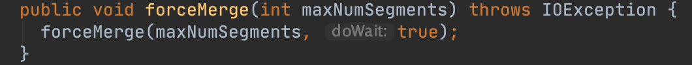
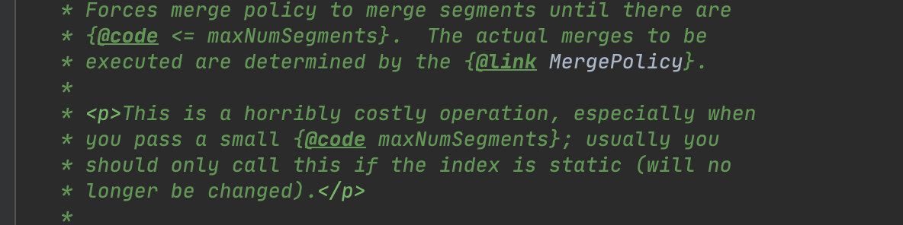
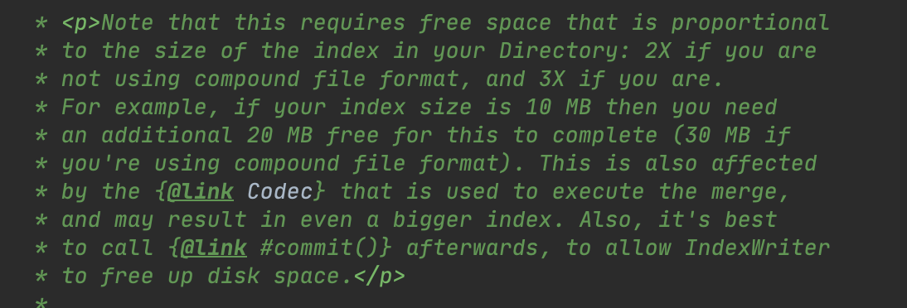
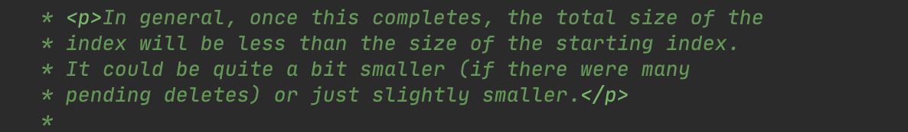
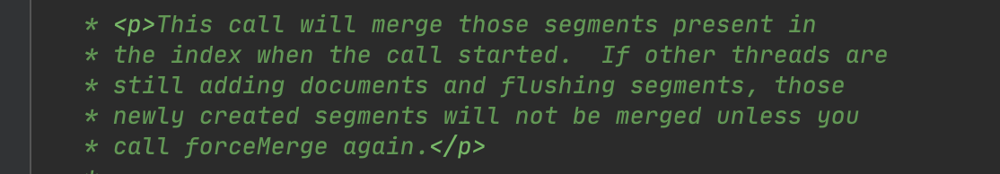
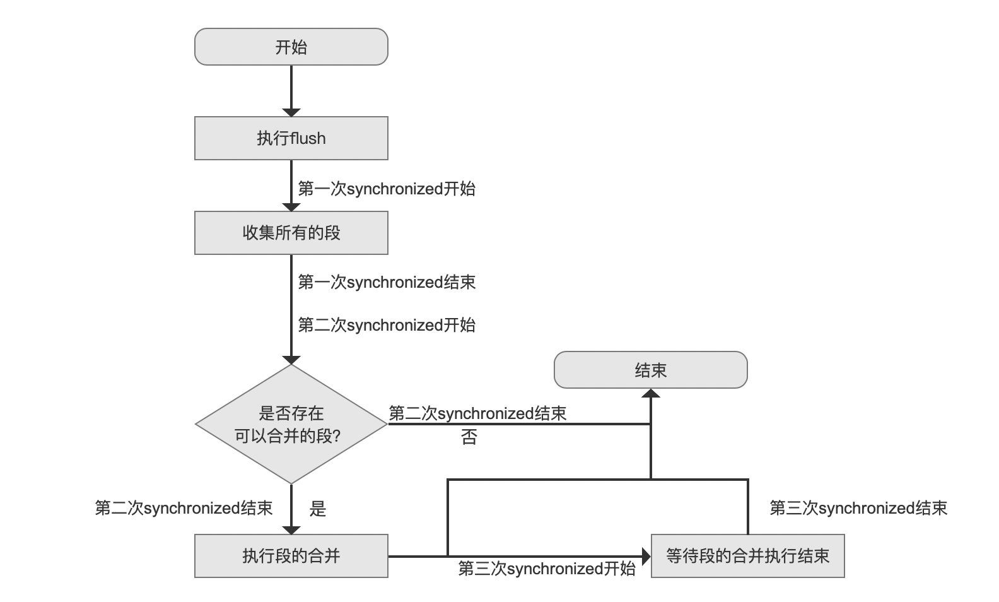

## [ForceMerge（一）](https://www.amazingkoala.com.cn/Lucene/Index/)（Lucene 8.8.0）

&emsp;&emsp;在执行了[flush](https://www.amazingkoala.com.cn/Lucene/Index/2019/0716/74.html)、[commit](https://www.amazingkoala.com.cn/Lucene/Index/2019/0906/91.html)等方法后，Lucene会基于[段的合并策略](https://www.amazingkoala.com.cn/Lucene/Index/2019/0516/59.html)对索引目录中的段集合进行合并操作。Lucene在IndexWriter类中也提供了额外的方法允许用户可以主动去执行段的合并操作。

### ForceMerge概述

&emsp;&emsp;本篇文章将基于IndexWriter类中的下面两个方法来介绍下强制合并的内容。

图1：

图2：

&emsp;&emsp;在图1中的方法实际是另参数doWait为true，随后调用了图2中的方法。该参数的作用在下文中会展开。

我们先通过源码中该方法的部分注释来描述下ForceMerge的概念：

图3：

&emsp;&emsp;图3中的注释说到，强制合并ForceMerge是通过合并策略进行段的合并，并将段的数量减少到maxNumSegments以下，maxNumSegments即图1中的参数，即用户期望的合并后的段的数量。

&emsp;&emsp;接着还提到了一方面ForceMerge操作是开销极大的，特别是maxNumSe gments的值被设置的很小的场景。另一方面建议最好是对那些不会再发生更改的段进行强制合并。在随后的介绍中我们将会明白这段注释的含义。

图4：

&emsp;&emsp;图4中的注释说到，如果使用了索引文件采用了[复合模式](https://www.amazingkoala.com.cn/Lucene/suoyinwenjian/2019/0710/73.html)，那么在ForceMerge期间，索引目录中要求额外2倍的存储空间，如果没有采用复合模式，那么需要额外的3倍的存储空间。

&emsp;&emsp;接着还提到建议在ForceMerge后执行一次commit操作，能减少索引目录的存储占用。原因是在ForceMerge后，被合并的段仍然会被保留在索引目录中，故索引目录中同时存在新段跟旧段，意味着索引目录中有冗余的索引数据。但是在执行了commit后，会对索引目录进行检查（见文章[文档提交之commit（二）](https://www.amazingkoala.com.cn/Lucene/Index/)中的`执行检查点(checkPoint)工作`介绍），如果旧段（被合并的段）不被任何reader占用，IndexWriter会删除这些旧段，达到free up disk space的目的。

图5：

&emsp;&emsp;图5中的注释说到，一般情况下，强制合并后可以降低索引的大小，一方面是小段被合并了，另一方面是那些段中被标记为删除的文档会**真正**的从段中移除（不明白？请看[索引文件之liv](https://www.amazingkoala.com.cn/Lucene/suoyinwenjian/2019/0425/54.html)的介绍）。

图6：

&emsp;&emsp;图5中的注释说到，强制合并开始后，其他线程新增的段不会参与这次的强制合并。同样的，下文中将会解释这段注释的含义。

### ForceMerge的流程图

图7：

#### 执行flush

图8：

&emsp;&emsp;该流程点执行了一次flush，该流程点操作跟直接调用IndexWriter.flush()方法是一致的，其详细过程可以阅读系列文章[文档提交之flush（一）](https://www.amazingkoala.com.cn/Lucene/Index/2019/0716/74.html)。

**为什么在强制合并前要执行一次flush操作**

&emsp;&emsp;其最重要的一个原因是，在多线程下，其他线程的文档增删改操作可能尚未flush成段，这些操作中可能包含删除信息（文档删除信息、DocValues的更新信息），并且这些删除信息可能会作用（apply）到索引目录中的段，有助于在随后的合并中能生成更小的段。当然这是一个try best的过程，因为在执行了当前流程点后可能其他线程又会产生新的删除信息，这也是解释了为什么图3的注释中建议只对不会再发生变化的段进行强制合并。

#### 收集所有的段

图9：

&emsp;&emsp;介绍该流程点前，我们需要先了解三个知识点：oneMerge、pendingMerges、runningMerges。

##### oneMerge

&emsp;&emsp;oneMerge的概念在文章[LogMergePolicy](https://www.amazingkoala.com.cn/Lucene/Index/2019/0513/58.html)已经详细介绍，这里我们可以简单的理解为：在段的合并过程中，根据[段的合并策略](https://www.amazingkoala.com.cn/Lucene/Index/2019/0513/58.html)会从索引目录中找到n个待合并的段集合，其中每个待合并的段集合用一个oneMerge来描述。换句话说就是oneMerge的数量描述了IndexWriter需要执行合并的次数，每个oneMerge中包含了将要合并为一个新段(New Segment)的段集合。

##### pendingMerges

&emsp;&emsp;pendingMerges是一个线程共享的容器（List对象）。根据段的合并策略获取了一个或多个oneMerge后，这些oneMerge会被暂时保存到pendingMerges。

##### runningMerges

&emsp;&emsp;对于某个正在执行段的合并的线程，该线程会**依次**获取pendingMerges中的每一个oneMerge，对oneMerge中的段集合执行合并操作。同时会将这个oneMerge添加到runningMerges中。runningMerges正是用来描述哪些段正在合并中，在合并结束后，runningMerges会移除这个oneMerge。runningMerges也是一个线程共享的容器（Set对象）。

**pendingMerges、runningMerges的使用场景**

- 场景一
  - 由于段的合并操作是允许后台线程执行的（取决于[段的合并调度](https://www.amazingkoala.com.cn/Lucene/Index/2019/0519/60.html)），所以如果线程A正在执行段的合并，此时线程B调用了IndexWriter.close()方法，那么在这个方法中会通过判断pendingMerges跟runningMerges是否为空来判断线程B是否能正确的关闭。线程B会等待所有的合并操作结束后再关闭。详细可以见这个方法： https://github.com/LuXugang/Lucene-7.5.0/blob/master/solr-8.4.0/lucene/core/src/java/org/apache/lucene/index/IndexWriter.java 中的 waitForMerges()方法
- 场景二
  - 在多线程下，当执行段的合并操作的线程数量大于阈值maxThreadCount（默认6，允许配置）并且pendingMerges不为空，说明合并进度太慢了（merging has fallen too far behind），并且只有maxThreadCount个线程正在执行合并操作（见文章[段的合并调度MergeScheduler](https://www.amazingkoala.com.cn/Lucene/Index/2019/0519/60.html)中maxThreadCount的介绍），故当前线程将被stall（调用Object.wait(250)方法）。

&emsp;&emsp;OK，我们继续介绍图9的流程点。在这个流程点中通过一个segmentsToMerge容器来收集当前内存中所有的段，包含IndexWriter的segmentInfos(见文章[构造IndexWriter对象（三）](https://www.amazingkoala.com.cn/Lucene/Index/2019/1118/108.html)中SegmentInfos的概念)、pendingMerges、runningMerges包含的段。

&emsp;&emsp;至此会有同学会产生这样的疑问，把pendingMerges、runningMerges也添加到此次的强制合并，会不会出现旧段被多次用于合并的问题。这个问题在图7中的流程点`是否存在可以合并的段`说明原因。

&emsp;&emsp;另外在图9中，执行当前流程点使用了synchronized关键字，这里使用同步的目的是确定了此次强制合并的IndexWriter的segmentInfos。其他线程的flush、commit操作可能会修改segmentInfos，故这里实现了segmentInfos的读写同步。同时这里使用同步机制的解释了图6中的注释。

## 结语

&emsp;&emsp;基于篇幅，剩余内容将在下一篇文章中展开。

[点击](http://www.amazingkoala.com.cn/attachment/Lucene/Index/ForceMerge/ForceMerge（一）.zip)下载附件

