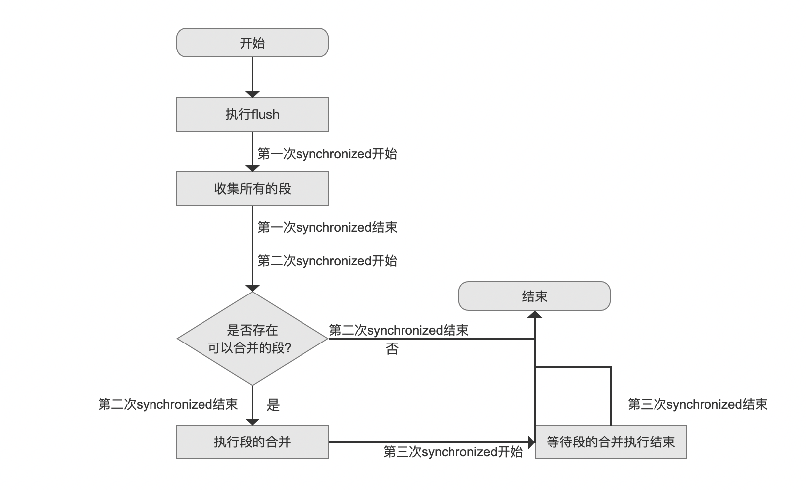
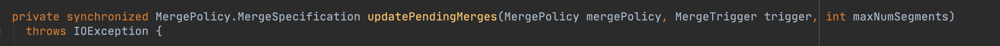
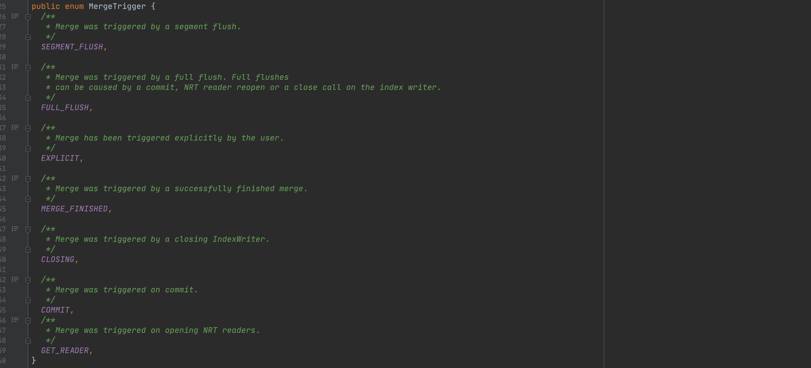
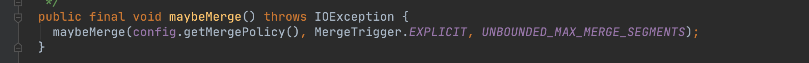
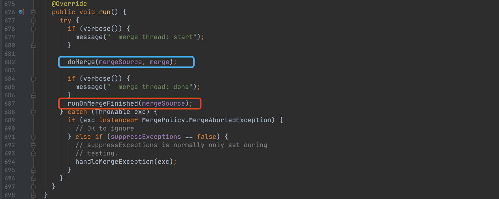
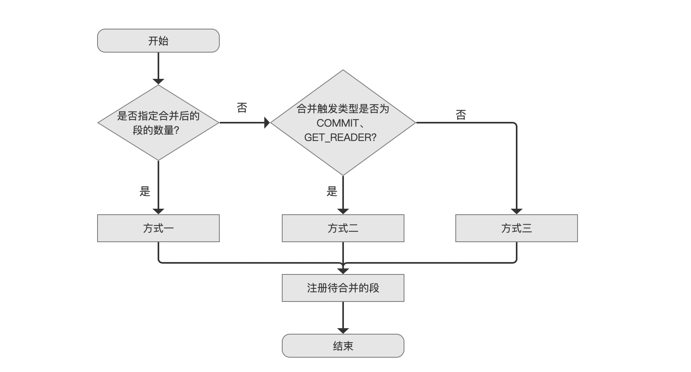
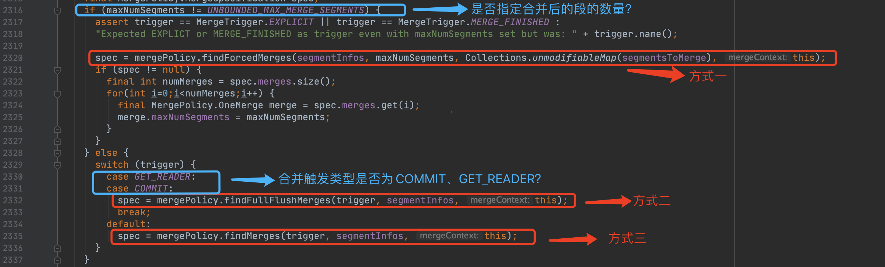
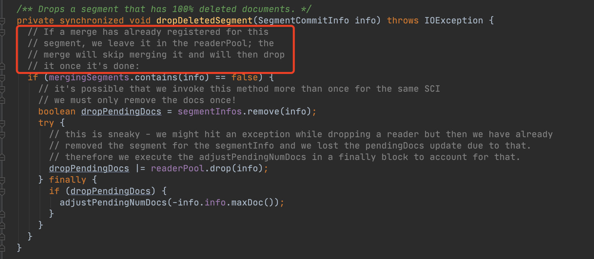

# [ForceMerge（二）](https://www.amazingkoala.com.cn/Lucene/Index/)（Lucene 8.8.0）

&emsp;&emsp;我们紧接文章[ForceMerge（一）](https://www.amazingkoala.com.cn/Lucene/Index/2021/0527/191.html)，继续介绍剩余的内容，先给出强制合并的流程图：

图1：

## 是否存在可以合并的段？

图2：

&emsp;&emsp;当前流程点的内容对应为源码中IndexWriter类的updatePendingMerges(...)方法，如下所示：

图3：

&emsp;&emsp;如果用一句话描述该方法的用途，那就是：**根据段的合并策略从上一个流程点（`收集所有的段`）收集的段集合中筛选出真正参与合并的段集合**（段集合由一个或者多个OneMerge（见文章[ForceMerge（一）](https://www.amazingkoala.com.cn/Lucene/Index/2021/0527/191.html)的介绍）组成）。

&emsp;&emsp;图3中，这个方法使用synchronized修饰，对应为图1中的第二次synchronized。

&emsp;&emsp;另外根据不同的合并触发类型，该方法中会有三种方式来获得段集合。我们先了解下合并的触发类型。

### 合并触发类型

图4：

#### SEGMENT_FLUSH

&emsp;&emsp;该类型对应的注释在当前版本已经是不准确的描述了。在早期版本中，以Lucene 6.6.0为例，在执行了doFlush( )期间，会调用IndexWriter的doAfterSegmentFlushed( )方法，在这个方法中如果需要进行合并，那么此时的合并触发类型为**SEGMENT_FLUSH**，而在文章[文档提交之flush（一）](https://www.amazingkoala.com.cn/Lucene/Index/2019/0716/74.html)中我们知道，doFlush( )描述的正是DWPT（见文章[文档的增删改（中）](https://www.amazingkoala.com.cn/Lucene/Index/2019/0628/69.html)的介绍） flush成一个段的过程。

&emsp;&emsp;在当前版本中（Lucene 8.8.0），仅仅是在执行了修改索引（见文章[文档的增删改（上）](https://www.amazingkoala.com.cn/Lucene/Index/2019/0626/68.html)）的操作后，并且如果产生的删除信息超过了阈值（见文章[文档的增删改（下）（part 3）](https://www.amazingkoala.com.cn/Lucene/Index/2019/0709/72.html)中flushDeletes、流程点`执行flush策略，设置flushDeletes`的介绍），那么在执行完这次修改索引的操作后会触发**SEGMENT_FLUSH**的合并。

#### FULL_FLUSH

&emsp;&emsp;这种类型的注释是正确的，即当执行了IndexWriter类中的[flush()](https://www.amazingkoala.com.cn/Lucene/Index/2019/0716/74.html)、[commit()](https://www.amazingkoala.com.cn/Lucene/Index/2019/0906/91.html)、getReader()方法以及[NRT](https://www.amazingkoala.com.cn/Lucene/Index/2019/0916/93.html)（NRT中会调用getReader()方法）操作后，会触发合并。

#### EXPLICIT

&emsp;&emsp;用户主动的合并操作属于这种类型。比如IndexWriter类中提供了maybeMerge( )的方法允许用户主动调用合并操作，如图5所示。另外强制合并的操作也属于当前的类型。

图5：

#### MERGE_FINISHED

&emsp;&emsp;由于允许多线程执行段的合并操作，对于某个线程来说，在执行完操作后，会再次尝试执行段的合并操作。例如在段的调度策略[ConcurrentMergeScheduler](https://www.amazingkoala.com.cn/Lucene/Index/2019/0519/60.html)会使用到这种类型：

图6：

&emsp;&emsp;在文章[段的合并调度MergeScheduler](https://www.amazingkoala.com.cn/Lucene/Index/2019/0519/60.html)中我们知道，ConcurrentMergeScheduler会开启一个后台线程进行段的合并，即图6的描述。图6中蓝框标注的doMerge(...)方法即执行段的合并。该方法执行结束后，在红框标注的runOnMergeFinished(...)方法中会再次尝试进行段的合并。上述方法在ConcurrentMergeScheduler类中。

#### CLOSING

&emsp;&emsp;在IndexWriter类中，提供了shutdown( )的方法表示当前IndexWriter即将关闭，不再提供索引的增删改等操作。由于段的合并的操作可以是后台线程执行（取决于[段的合并调度MergeScheduler](https://www.amazingkoala.com.cn/Lucene/Index/2019/0519/60.html)），那么Lucene会在IndexWriter关闭前执行这种类型的段的合并操作。如果是CLOSING类型，那么执行段的合并操作的线程将会按照最大的磁盘写入量执行（见文章[段的合并调度MergeScheduler](https://www.amazingkoala.com.cn/Lucene/Index/2019/0519/60.html)中关于最大磁盘写入量的概念）。

#### COMMIT、GET_READER

&emsp;&emsp;这两种合并触发类型在Lucene 8.6.0之后开始依次添加的。在Lucene8.6.0版本之前，我们知道每次执行flush()、commit()、getReader()(比如NRT操作)**之后**会进行段的合并操作。然而在Lucene8.6.0之后，Lucene开始支持在执行commit()、getReader()**期间**就进行了段的合并，这些合并的触发类型就是COMMIT或GET_READER。

&emsp;&emsp;关于在执行commit()、getReader()**期间**进行段的合并的内容，感兴趣的同学可以看文章[Changes（Lucene 8.7.0）](https://www.amazingkoala.com.cn/Lucene/Changes/2020/1106/176.html)中关于[LUCENE-8962](http://issues.apache.org/jira/browse/LUCENE-8962)的介绍。

### 流程图

&emsp;&emsp;上文中我们说到，图3中的方法，它描述的功能是根据不同的合并触发类型，使用三种方式来获得段集合。其不同方式的选择逻辑如下所示：

图7：

#### 三种方式的选择

&emsp;&emsp;图7的流程图中，三种方式的选择对应于源码中的代码块如下所示：

图8：

&emsp;&emsp;图8中第2320行代码的findForcedMerges(...) 方法即`方式一`，通过该方法将会获得段集合。并且这种方式正是段的强制合并获得段集合的入口方法。对于其他两种方式，方式二以及方式三，本系列文章暂不展开介绍。

#### 注册待合并的段

图9：

&emsp;&emsp;当通过三种方式中的一种获取了待合并的段集合（一个或多个OneMerge）后，这些OneMerge会依次进行注册操作。**如果**注册成功，OneMerge中包含的段将用一个称为**mergingSegments**的容器存放。该容器的作用可以理解成这些段添加了一个状态，该状态描述的是这些段正在执行段的合并操作。同时还会添加到pendingMerges（见文章[ForceMerge（一）](https://www.amazingkoala.com.cn/Lucene/Index/2021/0527/191.html)）容器中。

**什么情况下会注册失败**

&emsp;&emsp;在注册的过程中，会判断每一个段是否已经处于其他线程的合并操作中，即通过mergingSegments是否包含这个段来判断。如果OneMerge中至少一个段已经在mergingSegments中，那么注册将会失败，意味着将不会被添加到pendingMerges容器中，那么就不会进行合并操作。这里需要再次重复下在文章[ForceMerge（一）](https://www.amazingkoala.com.cn/Lucene/Index/2021/0527/191.html)中提到的内容，即**pendingMerges是线程共享的容器，执行合并的所有线程总是同步的从这个容器中取出一个OneMerge来执行段的合并操作**。

&emsp;&emsp;上文的内容同时描述了这么一个事实：**多个线程在执行图7中的三个方式中的任意一个后获得了一个或多个OneMerge，这些OneMerge不一定能参与段的合并操作**

**注册待合并的段还有什么其他作用**

&emsp;&emsp;由于允许并发执行索引的增删改跟段的合并操作，那么存在这么一种场景，在索引提交阶段，如果某个段中的所有文档都满足删除的条件，这个段会被直接删除。如果此时这个段正在执行段的合并操作，那么就会出现空指针问题。所以在删除某个段前可以通过检查mergingSegments中是否包含此段来判断是否要删除这个段。
  - 在文章[文档提交之flush（六）](https://www.amazingkoala.com.cn/Lucene/Index/2019/0805/79.html)介绍流程点`发布FlushedSegment`时我们知道，某些段在索引提交阶段会被丢弃。我们可以看下源码中这个方法来直观的理解：

图10：

&emsp;&emsp;如果一个段的文档都满足删除信息（has 100% deleted documents）时，该方法将被调用。红框标注的注释解释了mergingSegments的作用：如果当前段正在合并中，那么把这个段留在[readerPool](https://www.amazingkoala.com.cn/Lucene/Index/2020/1208/183.html)中即可。

&emsp;&emsp;注意的是，图10的方法属于IndexWriter类型，并且也用synchronized修饰了。

## 结语

&emsp;&emsp;在下一篇文章中，我们将继续介绍图7中的方式一的实现方式。

[点击](http://www.amazingkoala.com.cn/attachment/Lucene/Index/ForceMerge/ForceMerge（二）.zip)下载附件