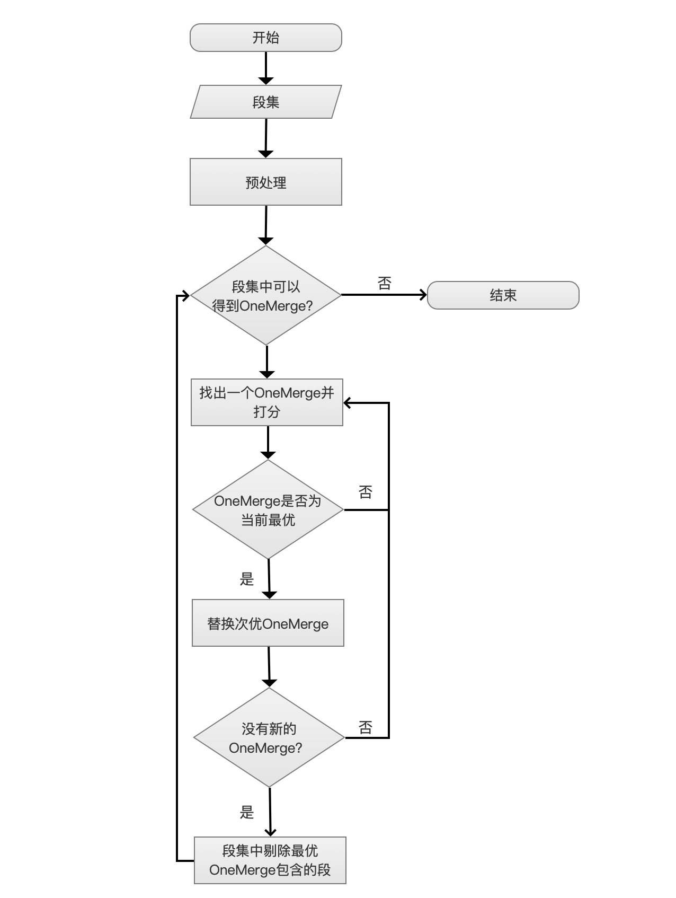
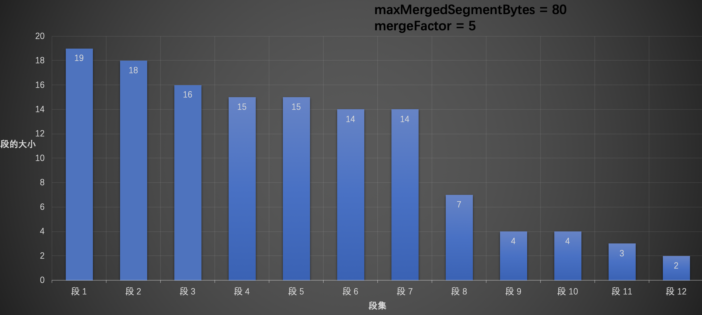
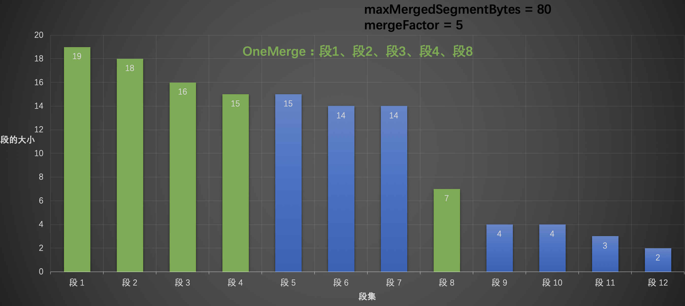
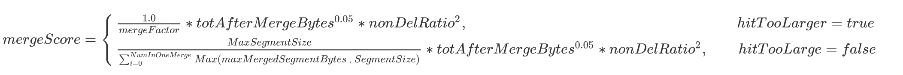
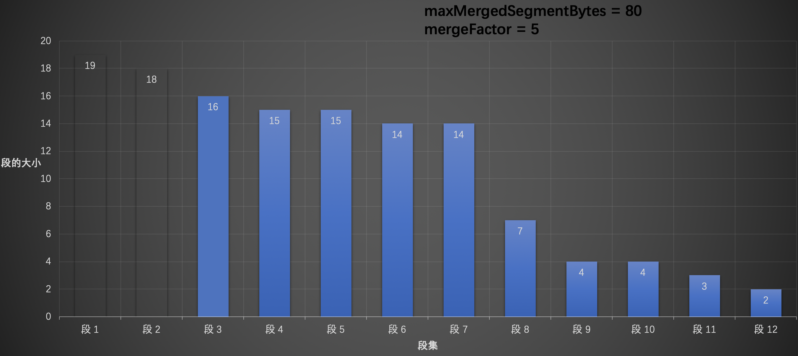
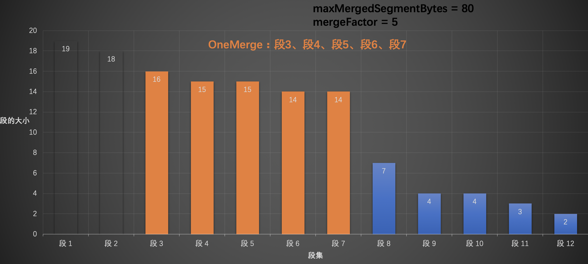
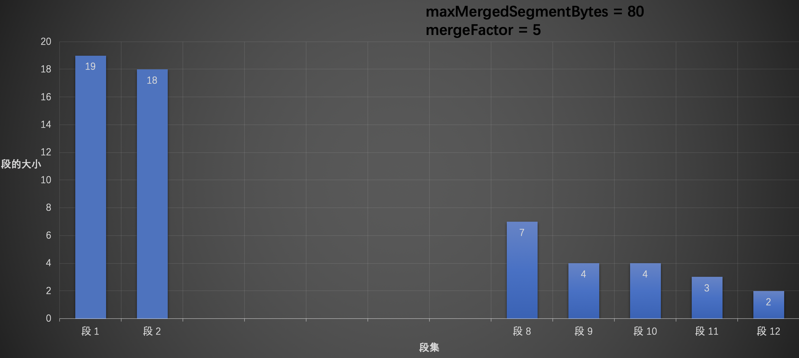

# [TieredMergePolicy](https://www.amazingkoala.com.cn/Lucene/Index/)
&emsp;&emsp; 这篇文章介绍TieredMergePolicy，它是Lucene4以后的默认段的合并策略，之前采用的合并策略为[LogMergePolicy](https://www.amazingkoala.com.cn/Lucene/Index/2019/0513/58.html)，建议先熟悉LogMergePolicy后再了解TieredMergePolicy，这样对于两种合并策略的优缺点能一目了然，使得在不同业务使用对应的策略，其中两种合并策略最大的不同是：

- LogMergePolicy总是合并相邻的段文件，合并相邻的段文件（Adjacent Segment）描述的是对于IndexWriter提供的段集，LogMergePolicy会选取连续的部分(或全部)段集区间来生成一个待合并段集
- TieredMergePolicy中会先对IndexWriter提供的段集进行排序，然后在排序后的段集中选取部分（可能不连续）段来生成一个待合并段集，即非相邻的段文件（Non-adjacent Segment）。

&emsp;&emsp; 如果用一句话来描述合并策略TieredMergePolicy的特点的话，那就是：找出大小接近且最优的段集。在下文中，通过介绍一些参数以及找出合并段集的逻辑自然就理解这句话的含义。
# TieredMergePolicy的一些参数
## MERGE_TYPE
&emsp;&emsp; MERGE_TYPE中描述了IndexWriter在不同状态下调用合并策略的三种类型：

- NATURAL：IndexWriter对索引执行变更操作后调用合并策略
- FORCE_MERGE：IndexWriter需要将索引中包含所有的段集数量（total set of segments in the index）合并为指定数量
- FORCE_MERGE_DELETES：IndexWriter需要将索引中包含所有的段中的被删除文件进行抹去（expunge）操作

&emsp;&emsp; 由于逻辑大同小异，下文中只介绍NATURAL。
## maxMergeAtOnce(可配置)
&emsp;&emsp; maxMergeAtOnce的默认值为10，描述了在NATURA类型下执行一次合并操作最多包含的段的个数(Maximum number of segments to be merged at a time during "normal" mergin)。

## segsPerTier(可配置)
&emsp;&emsp; segsPerTier的默认值为10，描述了每一层（层级的概念类似[LogMergePolicy](https://www.amazingkoala.com.cn/Lucene/Index/2019/0513/58.html)，这里不赘述）中需要包含segsPerTier个段才允许合并，例外情况就是当段集中包含的被删除的文档数量达到某个值（下文会介绍），就不用考虑segsPerTier中的段的个数。

## mergeFactor
&emsp;&emsp; mergeFactor描述了执行一次合并操作**最多**包含的段的个数，它的计算方式为：
```java
final int mergeFactor = (int) Math.min(maxMergeAtOnce, segsPerTier);
```
## 段大小(SegmentSize)
&emsp;&emsp; SegmentSize描述了一个段的大小，它是该段中除去被删除文档的索引信息的所有[索引文件](https://www.amazingkoala.com.cn/Lucene/suoyinwenjian/)的大小的总和，
## maxMergedSegmentBytes(可配置)
&emsp;&emsp; maxMergedSegmentBytes默认值为5G，它有两个用途：

- 限制合并段集大小总量：待合并的段集大小总和不能超过该值
- 限制大段（Segment with huge size）合并：该值的一半，即（maxMergedSegmentBytes / 2）用来描述某个段如果大小超过就不参与合并(限制大段还要同时满足被删除文档的条件，在下文中会介绍)

## hitTooLarge
hitTooLarge是一个布尔值，当OneMerge中所有段的大小总和接近maxMergedSegmentBytes，hitTooLarge会被置为true，该值影响OneMerge的打分，下文件中会详细介绍打分。

## deletesPctAllowed(可配置)
&emsp;&emsp; deletesPctAllowed的默认值为33（百分比），自定义配置该值时允许的值域为[20，50]，该值有两个用途：

- 限制大段合并：限制大段参与合并需要满足该段的SegmentSize ≥ (maxMergedSegmentBytes / 2) 并且满足 段集中的被删除文档的索引信息大小占总索引文件大小的比例totalDelPct ≤ deletesPctAllowed 或 该段中被删除文档的索引信息大小占段中索引文件大小的比例segDelPct ≤ deletesPctAllowed，如下：

```java
(SegmentSize > (maxMergedSegmentBytes / 2)) && (totalDelPct <= deletesPctAllowed || segDelPct <= deletesPctAllowed)
```

- 计算allowedDelCount：计算公式如下，其中totalMaxDoc描述了段集中除去被删除文档的文档数量总和，allowedDelCount的介绍见下文：

```java
int allowedDelCount = (int) (deletesPctAllowed * totalMaxDoc / 100);
```

## allowedSegCount、allowedDelCount
- allowedSegCount：该值描述了段集内每个段的大小SegmentSize是否比较接近(segments of approximately equal size)，根据当前索引大小来估算当前索引中"应该"有多少个段，如果实际的段个数小于估算值，那么说明索引中的段不满足差不多都相同（approximately equal size），那么就不会选出OneMerge (这里不赘述该名词含义，见[LogMergePolicy](https://www.amazingkoala.com.cn/Lucene/Index/2019/0513/58.html))   。allowedSegCount的最小值为segsPerTier，allowedSegCount的值越大，索引中会堆积更多的段，说明IndexWriter提交的段集（不包含大段）中最大的段的MaxSegmentSize跟最小的段MinSegmentSize相差越大，或者最小的段MinSegmentSize占段集总大小totalSegmentSize的占比特别低，一个原因在于有些flush()或者commit()的文档数相差太大，另一个原因是可配置参数floorSegmentBytes值设置的太小。
- allowedDelCount：描述了IndexWriter提交的段集（不包含大段）中包含的被删除文档数量，在NATURAL类型下，当某个段集中的成员个数不满足allowedSegCount时，但是如果该段集（不包含大段）中包含的被删除的文档数量大于allowedDelCount，那么该段集还可以继续参与剩余的合并策略的处理（因为执行段的合并的一个非常重要的目的就是"干掉"被删除的文档号），否则就该段集**此次**不生成一个oneMerge。

## floorSegmentBytes(可配置，重要！！！)
&emsp;&emsp; floorSegmentBytes默认值为2M(2 * 1024 * 1024)，该值描述了段的大小segmentSize小于floorSegmentBytes的段，他们的segmentSize都当做floorSegmentBytes（源码原文：Segments smaller than this are "rounded up" to this size, ie treated as equal (floor) size for merge selection），使计算出来的allowedSegCount较小，这样能尽快的将小段（tiny Segment）合并，另外该值还会影响OneMerge的打分(下文会介绍)。
&emsp;&emsp;  设置了不合适的floorSegmentBytes后会发生以下的问题：

- floorSegmentBytes的值太小：导致allowedSegCount很大

$$
（allowedSegCount = n * segsPerTier + m \qquad 0 ≤ m≤ segsPerTier，n ≥ 1）
$$
特别是段集中最小的段MinSegmentSize占段集总大小totalSegmentSize的占比特别低，最终使得索引中一段时间存在大量的小段，因为段集的总数小于等于allowedSegCount是不会参与段合并的(如果不满足allowedDelCount的条件)。源码中解释floorSegmentBytes的用途的原文为： This is to prevent frequent flushing of tiny segments from allowing a long tail in the index
- floorSegmentBytes的值太大：导致allowedSegCount很小$（最小值为segsPerTier）$，即较大的段合并可能更频繁，段越大，合并开销(合并时间，线程频繁占用)越大（在后面的文章中会介绍索引文件的合并）

&emsp;&emsp; Lucene7.5.0版本的Tiered1MergePolicy.java中380行~392解释了上面的结论，这里不通过源码解释的原因是，换成我也不喜欢在文章中看源码。。。

&emsp;&emsp; SegmentSize多小为小段（tiny Segment），这个定义取决于不同的业务，如果某个业务中认为小于TinySegmentSize的段都为小段，那么floorSegmentBytes的值大于TinySegmentSize即可。

# 流程图

图1：

## 开始
图2：

&emsp;&emsp; 当IndexWriter对索引有任意的更改都会调用合并策略。
## 段集
图3：

&emsp;&emsp; IndexWriter会提供一个段集(段的集合)提供给合并策略。
## 预处理
图4：

&emsp;&emsp; 预处理的过程分为4个步骤，分别是排序、过滤正在合并的段、过滤大段、计算索引最大允许段的个数。

### 排序
&emsp;&emsp;排序算法为TimSort，排序规则为比较每个段中[索引文件](https://www.amazingkoala.com.cn/Lucene/suoyinwenjian/)的大小，不包括被删除的文档的索引信息。
### 过滤正在合并的段
&emsp;&emsp;当IndexWriter获得一个oneMerge后，会使用后台线程对oneMerge中的段进行合并，那么这时候索引再次发生更改时，IndexWriter会再次调用TieredMergePolicy，可能会导致某些已经正在合并的段被处理为一个新的oneMerge，为了防止重复合并，需要过滤那些正在合并中的段。后台合并的线程会将正在合并的段添加到Set对象中，在IndexWriter调用合并策略时传入。

### 过滤大段(Large Segment)
&emsp;&emsp;在[LogMergeolicy](https://www.amazingkoala.com.cn/Lucene/Index/2019/0513/58.html)中，如果某个段的大小大于一个阈值则视为大段，而在TieredMergePolicy中，判断是否为大段需要同时满足两个条件，在上文介绍deletesPctAllowed参数时候已经说明，不赘述。

### 计算索引最大允许段的个数(Compute max allowed segments in the index)
&emsp;&emsp;即计算上文中已经介绍的allowedSegCount，不赘述。

## 段集中可以得到OneMerge？
图5：

&emsp;&emsp;如果同时满足下面三个条件，那么说明无法段集中可以得到OneMerge：

- MergeType：合并类型，即上文中的MERGE_TYPE，必须是NATURAL类型
- SegmentNumber：段集中段的个数，如果SegmentNumber ≤ allowedSegCount
- remainingDelCount：剩余段集中被删除文档的总数，如果remainingDelCount ≤ allowedDelCount

&emsp;&emsp;为什么叫做剩余段集，从流程图中可以看出，当前已经进入了迭代流程，当前流程点有可能不是第一次迭代（iterations），即段集中的段的个数可能已经小于从预处理过来的段集中的段的个数了，并且从此流程开始称为层内处理，当再次进入此流程，则为下一层处理。

## 找出一个OneMerge并打分
图6：

&emsp;&emsp;在这个流程中，需要做两个处理：找出一个OneMerge、OneMerge打分。

### 找出一个OneMerge
&emsp;&emsp; 找出一个OneMerge会遇到下面几种情况，OneMerge中段的个数记为NumInOneMerge：

- NumInOneMerge = 1：段集中的第一个段大小≥maxMergedSegmentBytes，但是这并不意味着就不会去合并这个段，因为如果该段中被删除的文档，那么还是有必要作为一个OneMerge，毕竟段的合并的目的不仅仅是为了减少索引中段的个数，剔除被删除的文档号是很重要的
- 1 ＜NumInOneMerge ≤ mergeFactor： OneMerge中段的总量 非常接近 maxMergedSegmentBytes，hitTooLarge的值为被置为true。这里的逻辑得说明下，因为它是**[装箱问题](https://en.wikipedia.org/wiki/Bin_packing_problem)(bin packing)**的一个具体实现

```text
顺序遍历段集，先预判下添加一个新的段后，OneMerge的大小是否会超过maxMergedSegmentBytes，如果超过，那么就跳过这个段，继续添加下一个段，目的是使这个OneMerge的大小尽量接近maxMergedSegmentBytes，因为段集中的段是从大到小排列的，当前前提是OneMerge中段的个数不能超过mergeFactor。
```
&emsp;&emsp;假设我们有以下的数据，其中maxMergedSegmentBytes = 80，mergeFactor = 5：

图7：

&emsp;&emsp;从段1开始，逐个添加到OneMerge中，当遍历到段5时发现，如果添加段5，那么OneMerge的大小，即19 (段1) + 18 (段2)+ 16 (段3) + 15 (段4) + 15 (段5) = 83，该值大于 maxMergedSegmentBytes (80)，那么这时候需要跳过段5，往后继续找，同理段6、段7都不行，直到遍历到段8，OneMerge的大小为19 (段1) + 18 (段2)+ 16 (段3) + 15 (段4) + 7 (段8) = 75，那么可以将段8添加到OneMerge中，尽管段9添加到OneMerge以后，OneMerge的大小为 19 (段1) + 18 (段2)+ 16 (段3) + 15 (段4) + 7 (段8) + 4 (段9) = 79，还是小于maxMergedSegmentBytes (80)，但是由于OneMerge中段的个数会超过mergeFactor (5)，所以不能添加到OneMerge中，并且停止遍历，如下图：

图8：

&emsp;&emsp;在这里我们可以看到了TieredMergePolicy跟[LogMergePolicy](https://www.amazingkoala.com.cn/Lucene/Index/2019/0513/58.html)另一个差异，那就是LogMergePolicy每次合并的段的个数都是固定的。而TieredMergePolicy中则不是，所以为什么在上文中介绍mergeFactor的概念时，对"最多"两个字进行加黑操作。

### OneMerge打分
&emsp;&emsp;对刚刚找出的OneMerge进行打分，打分公式为：$ mergeScore = skew * totAfterMergeBytes^{0.05} * nonDelRatio^2$ ，mergeScore越小越好（smaller mergeScore is better）。

- skew：粗略的计算OneMerge的偏斜值(Roughly measure "skew" of the merge)，衡量OneMerge中段之间大小的是否都差不多相同，如果OneMerge中段的大小接近maxMergedSegmentBytes，即hitTooLarge为true，那么 $skew = \frac {1.0}{mergeFactor}$，否则 $skew = \frac {MaxSegmentSize}     {\sum_{i=0}^{NumInOneMerge} Max(maxMergedSegmentBytes，SegmentSize)}$, 其中MaxSegment为OneMerge中最大的段的大小，SegmentSize为每一个段的大小，maxMergedSegmentBytes在上文中已经介绍。
- totAfterMergeBytes：该值是OneMerge中所有段的大小，这个参数描述了段合并比较倾向于(Gently favor )较小的OneMerge
- nonDelRatio：该值描述了OneMerge中所有段包含被删除文档比例，这里就不详细给出计算公式了，nonDelRatio越小说明OneMerge中包含更多的被删除的文档，该值相比较totAfterMergeBytes，对总体打分影响度更大，因为段合并的一个重要目的就是去除被删除的文档(Strongly favor merges that reclaim deletes)

故最终的打分公式:

$
mergeScore = \begin{cases} \frac {1.0}{mergeFactor} * totAfterMergeBytes^{0.05} * nonDelRatio^2,\qquad \qquad \qquad \qquad \qquad \qquad \qquad \qquad \qquad hitTooLarger = true\\  \frac {MaxSegmentSize}     {\sum_{i=0}^{NumInOneMerge} Max(maxMergedSegmentBytes，SegmentSize)}* totAfterMergeBytes^{0.05} * nonDelRatio^2,\qquad hitTooLarge = false\end{cases}
$

&emsp;&emsp;再贴个图，怕上面的公式显示不出来，不过在我家27寸4K显示器上看的蛮清楚的~😄
图9：

[下载](http://www.amazingkoala.com.cn/uploads/lucene/index/MergePolicy/TieredMergePolicy/9.png)图9

### 替换次优OneMerge
图10：

&emsp;&emsp;当前层中只允许选出一个OneMerge，即mergeScore最低的OneMerge。

### 没有新的OneMerge？
图11：

&emsp;&emsp;在图9中，我们遍历的对象是 段1~段12，并且选出了一个OneMerge，接着我们需要再次从 段2~段12 中选出一个OneMerge后，再从段3~段12中再找出一个OneMerge，如此往复直到找不到新的OneMerge，没有新的OneMerge的判定需要同时满足三个条件：

```java
bestScore != null && hitTooLarge == false && SegmentNum < mergeFactor
```

- bestScore != null：bestScore如果为空，说明当前还没有产生任何的OneMerge，那么肯定会生成一个OneMerge
- hitTooLarge == false：如果bestScore不为空，hitTooLarge为true，也要生成一个OneMerge。
- 剩余段集个数：bestScore不为空，hitTooLarge为false，如果剩余段集个数SegmentNum小于mergeFactor就不允许生成一个OneMerge

&emsp;&emsp;下图表示从段3~段12中选出的一个OneMerge
图12：


图13：



#### 段集中剔除最优OneMerge包含的段
图14：

&emsp;&emsp;一层内只能选出一个OneMerge，那么从段集中剔除最优，即打分最低的OneMerge中包含的段，新的段集作为新的一层继续处理。
假如当前层内最优的OneMerge是从段3~段12中选出的，那么下一层的可处理的段集如下图所示：
图15：


## 结语
TieredMergePolicy作为默认的合并策略，深入了解其原理能解决业务中的一些问题，在最后的文章中会继续介绍IndexWriter合并段的过程。

[点击下载](http://www.amazingkoala.com.cn/attachment/Lucene/Index/MergePolicy/TieredMergePolicy/TieredMergePolicy.zip)Markdown文件