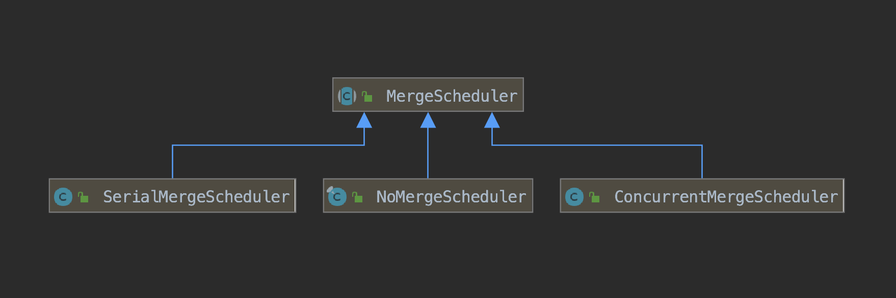
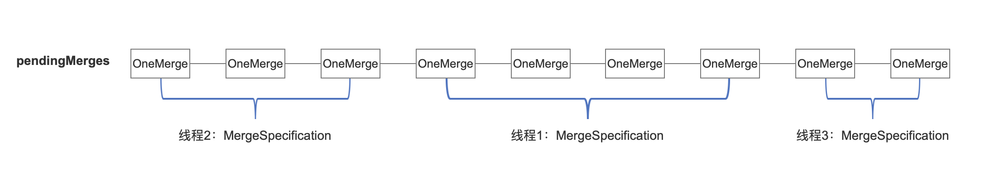
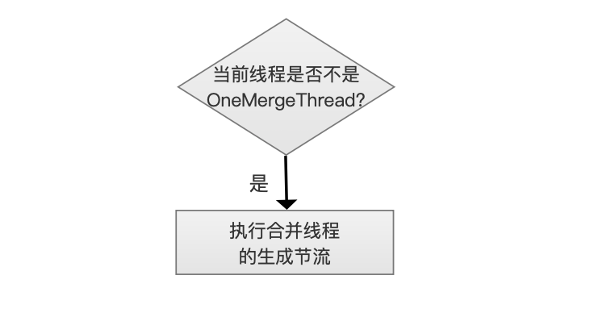
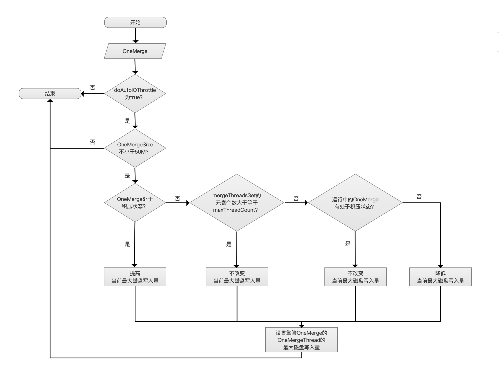

# [MergeScheduler](https://www.amazingkoala.com.cn/Lucene/Index/)
&emsp;&emsp;MergeScheduler用来定义如何执行一个或多个段的合并，当合并策略[TieredMergePolicy](https://www.amazingkoala.com.cn/Lucene/Index/2019/0516/59.html)提供了一个或多个OneMerge(这个名词的概念在[LogMergePolicy](https://www.amazingkoala.com.cn/Lucene/Index/2019/0513/58.html)已经介绍，不赘述)后，MergeScheduler来安排这些OneMerge的合并，比如执行先后顺序，磁盘IO限制。

&emsp;&emsp;Lucene7.5.0中有三种MergeScheduler的实现，分别是NoMergeScheduler、SerialMergeScheduler、ConcurrentMergeScheduler，其中ConcurrentMergeScheduler是默认的MergeScheduler。

图1：

## NoMergeScheduler
&emsp;&emsp;如果你不希望执行任何的段合并，那么可以使用这种MergeScheduler，即使你定义了合并策略，也不会执行段合并，当然如果你的合并策略是NoMergePolicy（NoMergePolicy不会返回任何的OneMerge），那么使用任意的MergeScheduler也能达到一样的效果。

&emsp;&emsp;在实际业务中，出于自身业务需要， 希望某个时间段内不要执行段的合并，那么就可以使用该MergeScheduler，因为MergeScheduler可以通过LiveIndexWriterConfig在索引阶段随时切换，不过你得重新生成一个新的IndexWriter对象，如果你还是想使用原来的IndexWriter，那么只能通过LiveIndexWriterConfig更改合并策略为NoMergePolicy。

## SerialMergeScheduler
&emsp;&emsp;从这个MergeScheduler字面意思就可以看出，当有多个OneMerge时，顺序执行段合并：

- 多个OneMerge间的顺序：由于可能存在多个线程使用同一个IndexWriter对象来生成索引，所以当他们分别执行flush、commit操作后，就各自的(separately)从合并策略中得到MergeSpecification，如果你看过了[TieredMergePolicy](https://www.amazingkoala.com.cn/Lucene/Index/2019/0516/59.html)或者[LogMergePolicy](https://www.amazingkoala.com.cn/Lucene/Index/2019/0513/58.html)，就能知道调用完合并策略后，可以获得一个或多个OneMerge的集合，该集合即MergeSpecification，接着MergeSpecification中的OneMerge被添加到pendingMerges中，pendingMerges是一个有序列表，IndexWriter通过synchronized关键字有序的将所有线程中获得的OneMerge添加到pendingMerges链表中，故OneMerge被执行的顺序取决于被添加到pendingMerges中的顺序

图2：

图3：

- 获取OneMerge：当IndexWriter执行合并操作时，从pendingMerges中取出一个OneMerge进行合并。同样的，合并操作也有可能是多个线程同时调用，SerialMergeScheduler通过synchronized关键字来使得同一时间只允许一个线程执行合并操作，该线程依次取出OneMerge执行合并，当pendingMerges为空后该线程才会退出，实现了OneMerge的顺序合并，此时其他等待合并的线程允许执行合并操作，但由于pendingMerges中OneMerge都已经被上一个线程处理了，所以可以直接退出。

## ConcurrentMergeScheduler
&emsp;&emsp;ConcurrentMergeScheduler作为默认的MergeScheduler，它允许多个线程并行的执行合并操作，并且通过一些参数来控制每个线程的执行进度。

### ConcurrentMergeScheduler的一些参数
#### maxThreadCount(可配置)
&emsp;&emsp;maxThreadCount：正在执行合并的线程最多并发数。

&emsp;&emsp;IndexWriter执行合并操作后，会根据pendingMerges中的OneMerge个数生成对应个数的子线程，我们称之为**OneMergeThread**，去掌管(handle)每一个OneMerge，但是只有最多maxThreadCount个OneMergeThread同时执行合并操作。

&emsp;&emsp;第一个至第maxThreadCount个OneMergeThread掌管OneMerge后可以开始合并操作，但当第maxThreadCount + 1 个OneMergeThread掌管OneMerge以后，由于当前OneMergeThread个数大于 maxThreadCount，就会暂停(pause)那些掌管较大OneMerge size的OneMergeThread的运行，使得只能最多maxThreadCount个OneMergeThread执行合并操作，这属于**合并线程的I/O节流**(I/O Throttle)的一种处理方式，还有其他的方式会在下文中会详细介绍。
#### maxMergeCount(可配置)
&emsp;&emsp;maxMergeCount：限制生成新的OneMergeThread前，允许最大OneMergeThread的个数(Max number of merges we accept before forcefully throttling the incoming threads)

&emsp;&emsp;掌管IndexWriter的线程，我们称之为**IndexWriterThread**，它调用合并操作后，会根据pendingMerges中的OneMerge个数生成对应个数的子线程OneMergeThread去掌管OneMerge，直到为每一个OneMerge生成一个OneMergeThread才会**退出**。当OneMergeThread个数达到maxMergeCount后，那么之后会拖延(stall)IndexWriterThread生成子线程的速度，这属于**合并线程的生成节流**(Creation Throttle)，下文中会详细介绍。

#### AUTO_DETECT_MERGES_AND_THREADS(不可配置)
AUTO_DETECT_MERGES_AND_THREADS默认值为-1，用来判断用户是否自定义了maxThreadCount跟maxMergeCount的值，如果没有，那么Lucene会根据当前的操作系统以及磁盘种类来初始化maxThreadCount跟maxMergeCount的值。

在Lucene7.5.0中，AUTO_DETECT_MERGES_AND_THREADS仅支持对[Linux发行版](https://zh.wikipedia.org/wiki/Linux发行版列表)的操作系统，如果是其他类型的操作系统，那么默认操作系统使用的磁盘种类是传统的旋转存储(traditional rotational storage)，即机械硬盘。否则根据Directory对象来检测是否为非机械硬盘，比如说固态硬盘。如何根据Directory来判断磁盘类型在本篇文章中不展开，在以后的文章中介绍Directory时会涉及。

- 机械硬盘：maxThreadCount = 1、maxMergeCount = 6
- 固态硬盘：maxThreadCount = Math.max(1, Math.min(4, coreCount/2))、maxMergeCount = maxThreadCount+5，其中coreCount描述的是JVM可用的处理器核心数(the number of processors available to the Java virtual machine)

#### doAutoIOThrottle(可配置)
&emsp;&emsp;doAutoIOThrottle描述了是否需要对每一个合并线程OneMergeThread执行**合并线程的I/O节流**(下文中会详细介绍)，OneMergeThread在创建时，它允许写入磁盘的大小是Double.POSITIVE_INFINITY，即没有写入数量的限制，而在doAutoIOThrottle为true的情况下，磁盘的写入量在运行期间可能会被修改多次(别急，下文会详细介绍😁)。
#### MIN_BIG_MERGE_MB(不可配置)
&emsp;&emsp;默认值50M，用来定义OneMerge是否为一个**大合并**(big Merge)，即判断OneMerge中所有段的索引大小，我们称之为**OneMergeSize**，总和是否超过50M。
####  MIN_MERGE_MB_PER_SEC(不可配置)

&emsp;&emsp;默认值5M，在doAutoIOThrottle = true的情况下，被节流的OneMergeThread最少能保证写入5M，但如果OneMergeThread中的OneMerge大小OneMergeSize ＜ MIN_BIG_MERGE_MB，那么不会受到**合并线程的I/O节流**的限制，即Double.POSITIVE_INFINITY。
####  MAX_MERGE_MB_PER_SEC(不可配置)

&emsp;&emsp;默认值10G，在doAutoIOThrottle = true的情况下，被节流的OneMergeThread最多允许写入10G。
#### START_MB_PER_SEC(不可配置)

&emsp;&emsp;默认值20M，它只用来初始化在targetMBPerSec。
#### targetMBPerSec(不可配置)

&emsp;&emsp;最初的值为START_MB_PER_SEC，在doAutoIOThrottle = true的情况下，刚刚创建结束的OneMergeThread的磁盘的写入量会被置为targetMBPerSec，而targetMBPerSec的值在每一次新增一个OneMergeThread后发生变化，或变大或减少，在合并线程的I/O节流下也会用到该值，影响正在运行的OneMergeThread的最大磁盘可写入量，同样地，下文会详细介绍😄。

#### forceMergeMBPerSec(可配置)

&emsp;&emsp;默认值当Double.POSITIVE_INFINITY，IndexWriter执行forceMerge时，即使OneMerge是一个大合并，也不会受到合并线程的I/O节流的限制。

# ConcurrentMergeScheduler流程图

图4：

[点击下载]()图4

## 开始

图5：

&emsp;&emsp;IndexWriter的多种行为都会触发合并流程，例如commit()、flush()、close()、NRT(nearly real time) Reader open等，这些内容在后面介绍IndexWriter的时候会涉及。
## 初始化

图6：

&emsp;&emsp;初始化的过程即上文中提到的根据AUTO_DETECT_MERGES_AND_THREADS初始化maxThreadCount，maxMergeCount。

## 是否执行合并线程的生成节流

图7：

&emsp;&emsp;执行合并线程的生成节流的条件需要同时满足两个：

- pendingMerges链表中还有未处理的OneMerge
- mergeThreadCount ≥ maxMergeCount：mergeThreadCount即当前OneMergeThread的线程个数，注意的是处于abort状态的OneMergeThread不会纳入计数，所以mergeThreadCount是一个小于等于maxThreadCount的值，abort是IndexWriter执行回滚操作的概念，这里不展开

&emsp;&emsp;满足了合并线程的生成节流条件意味着当前段合并的进度远远落后（merging has fallen too far behind），即合并速度赶不上OneMerge的生成速度，如果不考虑abort的情况，那么说明已经有maxThreadCount个OneMergeThread正在执行段的合并操作，还有**至少**(maxMergeCount - maxThreadCount)个OneMergeThread线程由于合并线程的I/O节流处于暂停状态(Thread.sleep(...)方法实现)。

## 当前线程是否不是OneMergeThread?

图8：

&emsp;&emsp;在上一步流程中，如果需要执行合并线程的生成节流，那么还要根据当前线程是否为OneMergeThread来作不同的处理。

&emsp;&emsp;从图4的流程图可以看到，进入该流程的线程有两种类型：

- 执行commit()、flush()、close()、NRT(nearly real time) Reader open的线程：该线程不断的从pendingMerges链表中取出ONeMerge，直到pendingMerges为空才退出
- 完成了合并任务OneMergeThread：当OneMergeThread完成了合并任务，它不直接退出，而是重新返回到流程中执行同样的操作

## 调整部分运行中的OneMergeThread的最大磁盘写入量

图9：

&emsp;&emsp;到此流程说明需要执行合并线程的生成节流并且当前线程是OneMergeThread，由于当前合并进度很慢，所以通过让OneMergeThread退出的方式来减少新的OneMergeThread的生成，由于OneMergeThread退出，需要调节正在执行合并操作的部分或所有OneMergeThread的最大磁盘写入量

&emsp;&emsp;执行合并任务的OneMergeThread集合中发生任意的变化后都需要执行调整操作，变化可以有以下几种情况：

- IndexWriter调用了close()
- 执行完合并任务的OneMergeThread退出
- 切换doAutoIOThrottle的值
- 新增一个OneMergeThread

&emsp;&emsp;调整部分运行中的OneMergeThread的最大磁盘写入量的流程图如下：
### 流程图

图10：

#### 开始

&emsp;&emsp;每次新增一个OneMergeThread，会被添加到一个集合中，我们称之为**mergeThreadsSet**

#### OneMergeThread集合排序

&emsp;&emsp;对mergeThreadsSet中的元素排序

- 排序规则：ONeMergeThread掌管的OneMerge的大小，即OneMergeSize
- 排序算法：TimSort
- 排序顺序：从大到小

#### 统计出bigMergeCount

&emsp;&emsp;如果OneMergeSize ≥ MIN_BIG_MERGE_MB(50M)，那么认为它是一个大合并(big merge)，bigMergeCount描述了mergeThreadsSet中大合并的数量。

#### 是否还有未处理的OneMergeThread？

&emsp;&emsp;每次从mergeThreadsSet中取出一个OneMergeThread，调整最大磁盘写入量，当所有的OneMergeThread处理结束，流程退出。

#### 获得调整值

&emsp;&emsp;OneMergeThread获得一个新的最大磁盘写入量，我们称之为**newMBPerSec**，该值根据不同的情况可以获得下面几种值：

- 0：如果当前bigMergeCount ≥ maxThreadCount，并且OneMergeThread掌管的OneMerge是一个大合并，那么意味着OneMergeThread不允许写入，进入暂停(pause)状态，暂停时间与OneMergeThread已写入的字节数成正比，这里不具体展开，[MergeRateLimiter.java](https://github.com/luxugang/Lucene-7.5.0/blob/master/solr-7.5.0/lucene/core/src/java/org/apache/lucene/index/MergeRateLimiter.java)的maybePause(long, long)方法有 字节数 换算 暂时时间 的逻辑。newMBPerSec置为0的目的是使得OneMergeSize较小的OneMerge先执行合并(smaller merges are guaranteed to run before larger ones)
- forceMergeMBPerSec：IndexWriter执行forceMerge时，即使OneMerge是一个大合并，也不会受到合并线程的I/O节流的限制，该值默认值是Double.POSITIVE_INFINITY
- Double.POSITIVE_INFINITY：如果doAutoIOThrottle为false，即使OneMerge是一个大合并，也不会受到合并线程的I/O节流的限制，或者OneMergeThread中的OneMerge不是一个大合并
- targetMBPerSec：如果达不到上面几种newMBPerSec的值，那么就调整为targetMBPerSec

一个OneMergeThread的newMBPerSec值按照上面列出顺序依次判断来获得，公式如下：

$
newMBPerSec = \begin{cases} 0, \qquad\qquad\qquad\qquad\qquad\qquad\qquad\qquad bigMergeCount ≥ maxThreadCount\qquad and \qquad OneMergeSize > 50M \\ forceMergeMBPerSec,\qquad\qquad\qquad indexWriter.close() \\ 无限制, \qquad \qquad \qquad \qquad \qquad \qquad \qquad doAutoIOThrottle = false \qquad or \qquad OneMergeSize ≤ 50M\qquad  \\ targetMBPerSec,\qquad \qquad \qquad \qquad other\end{cases}
$

## 执行非OneMergeThread合并线程的生成节流

图11：

&emsp;&emsp;不是OneMergeThread的线程的节流方式相对简单，就是执行简单的Object.wait(250)方法，即等待0.25秒后再去下一步流程。

&emsp;&emsp;为什么同样是合并线程的生成节流，OneMergeThread选择直接退出，而不是等待0.25秒，因为拖延OneMergeThread实际上就是拖延了该线程的结束，该线程的结束过程首先是从mergeThreadsSet移除，然后调整部分运行中的OneMergeThread的最大磁盘写入量，拖延该线程并不能对缓解段合并进度缓慢的问题。

## 是否还有OneMerge？

图12：

&emsp;&emsp;创建一个子线程OneMergeThread来掌管一个OneMerge。

## 是否执行合并线程的I/O节流？

图13：

&emsp;&emsp;如果doAutoIOThrottle = false，那么就不需要执行合并线程的I/O节流，也就是刚创建的OneMergeThread允许的最大磁盘写入量是不受限制的。

## 调整OneMergeThread最大磁盘写入量

图14：

&emsp;&emsp;每当新增一个OneMergeThread，那么就要重新调整targetMBPerSec的值，targetMBPerSec不但会定义当前这条新增的OneMergeThread的最大磁盘的写入量，还会影响其正在运行的部分OneMergeThread。调整OneMergeThread最大磁盘写入量的流程图如下：

### 流程图

图15：

#### OneMerge

&emsp;&emsp;从pendingMerges链表中取出一个OneMerge交给OneMergeThread线程掌管。

#### doAutoIOThrottle为true？

&emsp;&emsp;如果doAutoIOThrottle不为true，那么可以直接退出，即掌管当前OneMerge的OneMergeThread允许的写入量是没有上限限制的。

#### OneMergeSize不小于50M？

&emsp;&emsp;如果oneMerge的大小oneMergeSize小于50M，即小于MIN_BIG_MERGE_MB，那么也不用限制其I/O。

#### OneMerge处于积压状态？

&emsp;&emsp;对于单个OneMerge来讲，满足下面的条件，那么该OneMerge被认为是处于积压（backlog）状态：

- mergeThreadsSet集合中，至少有一个OneMergeThread运行时间已经超过了3秒(固定值，不可变)，并且该OneMergeThread掌管的OneMerge的OneMergeSize跟当前流程中的OneMerge的OneMergeSize差不多大（similar size），即两者的OneMergeSize的比例(ratio)在区间[0.3，3.0]内

&emsp;&emsp;如果满足上面的条件，说明当前段的合并进度落后（falling behind）了，上述条件中的3秒，描述的是从添加到mergeThreadsSet开始已经过了3秒，这个段还是没有合并结束，原因是总有优先级更高（OneMergeSize较小）的OneMergeThread添加到mergeThreadsSet中，那么我们需要提高当前最大磁盘写入量，即提高targetMBPerSec的值。

$$
targetMBPerSec = Min(targetMBPerSec * 1.2，10G)
$$

&emsp;&emsp;其中10G即MAX_MERGE_MB_PER_SEC。

#### mergeThreadsSet的元素个数大于等于maxThreadCount？
&emsp;&emsp;流程中的OneMerge不处于积压状态，那么如果mergeThreadsSet的元素个数大于等于maxThreadCount，说明当前运行中的mergeThreadsSet处于积压状态，强调的是，这里的积压状态描述的是mergeThreadsSet，而不是上文中某个OneMerge的积压状态，此时不改变targetMBPerSec的值。

#### 运行中的OneMerge有处于积压状态？

&emsp;&emsp;如果运行中的OneMerge存在积压状态，不改变targetMBPerSec的值。否则就降低当前最大磁盘写入量。

#### 设置掌管OneMerge的OneMergeThread的最大磁盘写入量
&emsp;&emsp;将最新的targetMBPerSec设置为流程中的OneMergeThread的最大磁盘写入量。

&emsp;&emsp;调整OneMergeThread最大磁盘写入量的流程图可以看出，提高targetMBPerSec只考虑新增的OneMerge的情况，降低targetMBPerSec是为了减少段合并的I/O使用，可见在正常的段合并的情况下总体上不是那么要求尽快完成合并，而在forceMerge的情况下，不会考虑OneMerge的OneMergeSize，都是一视同仁的置targetMBPerSec为forceMergeMBPerSec，此时是希望尽快完成所有的段合并，正如上文中介绍的，比如IndexWriter.close()调用就会调用forceMerge。

## 执行段的合并
&emsp;&emsp;在调整OneMergeThread最大磁盘写入量后， 子线程OneMergeThread就可以开始执行段的合并， 段的合并这一块在后面的文章会介绍，这里不展开。

# 结语
本文章介绍了在IndexWriter从合并策略那边获得待合并的段集后，MergeScheduler如何去安排执行段的合并，在介绍玩段的合并后，会把整个从合并策略->MergeScheduler->合并进行一次总结，来加强熟悉整体逻辑。

[点击下载](http://www.amazingkoala.com.cn/attachment/Lucene/Index/MergeScheduler/MergeScheduler.zip)Markdown文件