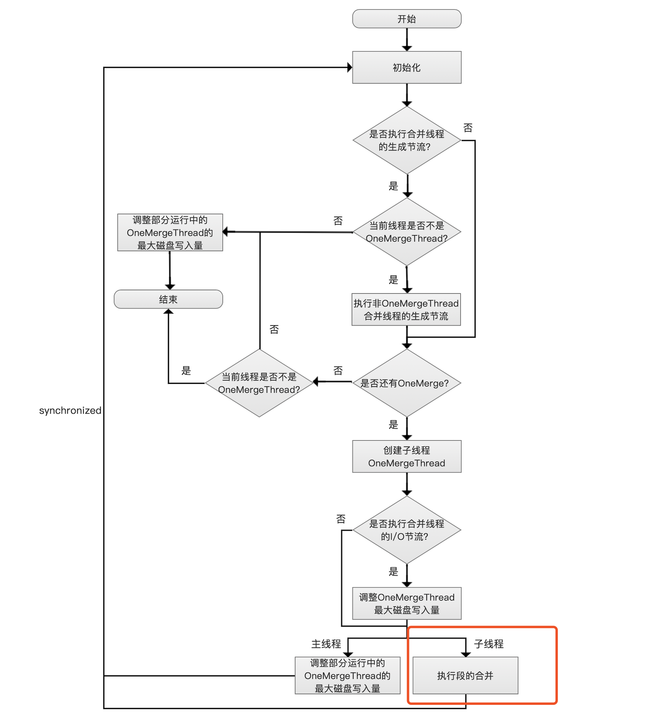
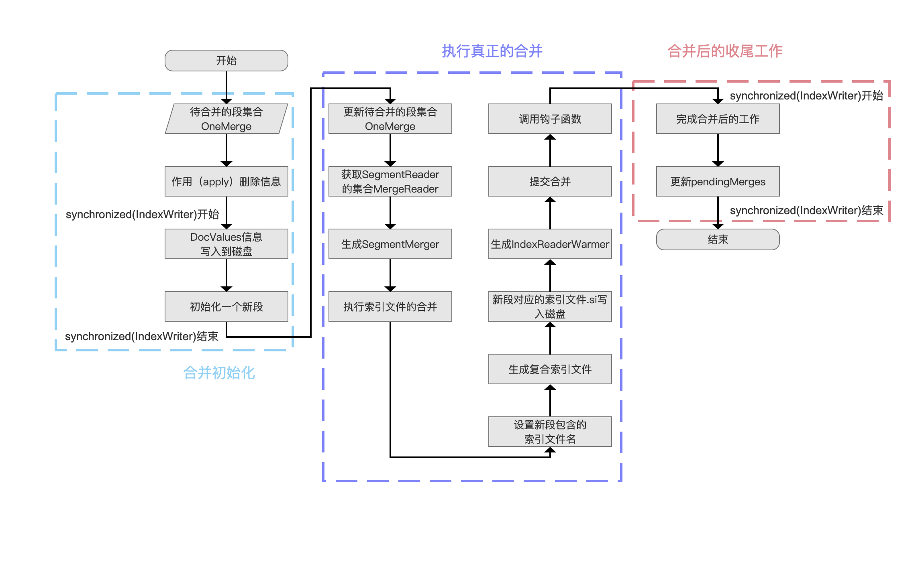
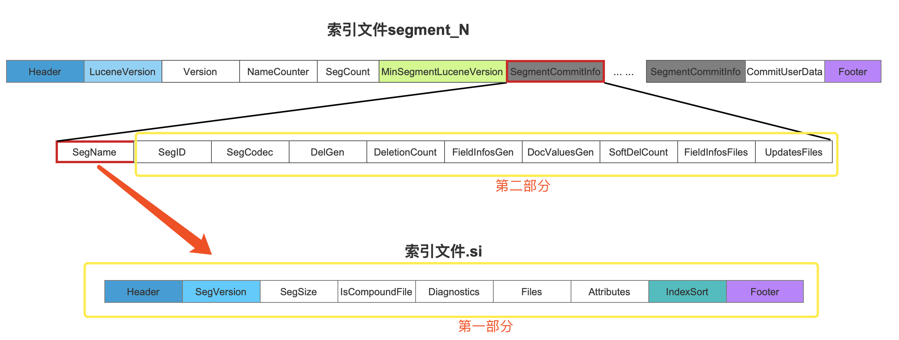
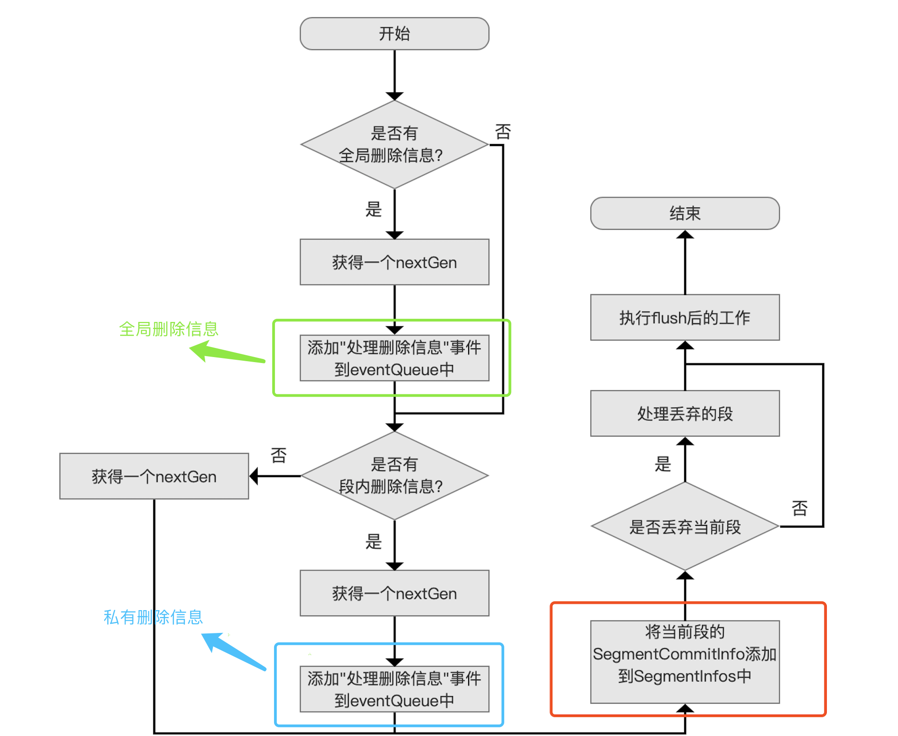

# [执行段的合并（一）](https://www.amazingkoala.com.cn/Lucene/Index/)

&emsp;&emsp;在前面的文章中，我们介绍了段的合并策略[TieredMergePolicy](https://www.amazingkoala.com.cn/Lucene/Index/2019/0516/59.html)、[LogMergePolicy](https://www.amazingkoala.com.cn/Lucene/Index/2019/0513/58.html)，讲述了如何从索引目录中挑选出满足合并条件的一个或多个段的集合OneMerge，另外还介绍了段的合并调度[MergeScheduler](https://www.amazingkoala.com.cn/Lucene/Index/2019/0519/60.html)，讲述了如何用不同的调度策略分配一个或多个线程来调度段的合并，比如执行先后顺序，磁盘IO限制。

&emsp;&emsp;图1是文章[MergeScheduler](https://www.amazingkoala.com.cn/Lucene/Index/2019/0519/60.html)中的调度策略ConcurrentMergeScheduler的流程图，其中红色框标注的流程点描述的是一个线程执行段的合并的过程，然而基于篇幅我们并没有展开介绍，故从本篇文章开始，将通过数篇文章来介绍该流程点的逻辑：

&emsp;&emsp;为了能更好的理解图1中每一个流程点，强烈建议先看下[文档提交之flush](https://www.amazingkoala.com.cn/Lucene/Index/2019/0716/74.html)系列文章。

图1：



# 执行段的合并的流程图

图2：



[点击]()查看大图

&emsp;&emsp;我们首先概述下图2中三个阶段：

- 合并初始化：该阶段能很快的执行结束，但是有些流程点需要获得对象为IndexWriter的对象锁，即在合并初始化阶段，一些IndexWriter的操作会同步等待，例如IndexWriter的关闭操作（shutdown()方法）、发布生成的段（见[文档提交之flush](https://www.amazingkoala.com.cn/Lucene/Index/2019/0716/74.html)的系列文章）等等
- 执行真正的合并：该阶段是最耗时（time-consuming）的，故大部分的操作都不需要同步，即不需要获得对象为IndexWriter的对象锁
- 合并后的收尾工作：该阶段跟合并初始化一样能很快的执行结束，但是所有的流程都需要在临界区内执行，即需要获得对象为IndexWriter的对象锁

&emsp;&emsp;接下来我们介绍图2中的每一个流程点

## 待合并的段集合OneMerge

&emsp;&emsp;该流程点即流程图的输入数据，该数据为OneMerge，它描述了待合并的段的信息，包含的几个重要的信息如下所示：

- List\<SegmentCommitInfo\> segments：使用一个链表存放所有待合并的段信息SegmentCommitInfo，其中SegmentCommitInfo用来描述一个段的完整信息（除了删除信息），它包含的信息以及对应在索引文件的内容如下图所示：

图3：



&emsp;&emsp;SegmentCommitInfo的信息由图3中黄框标注的两部分组成，其中根据[索引文件segments_N](https://www.amazingkoala.com.cn/Lucene/suoyinwenjian/2019/0610/65.html)中红框标注的SegName（见文章[索引文件segments_N](https://www.amazingkoala.com.cn/Lucene/suoyinwenjian/2019/0610/65.html)）找到对应的[索引文件si](https://www.amazingkoala.com.cn/Lucene/suoyinwenjian/2019/0605/63.html)。

&emsp;&emsp;图3中两个索引文件中的字段已经在前面的文章中介绍，在这里不赘述。

- SegmentCommitInfo info：该字段在当前阶段是null，在后面的流程中会被赋值，它描述的是合并后的新段的信息
- List\<SegmentReader\> readers：该字段在当前阶段是null，在后面的流程中会被赋值，readers中的每一个SegmentReader描述的是某个待合并的段的信息，SegmentReader的介绍可以看[SegmentReader](https://www.amazingkoala.com.cn/Lucene/Index/)系列文章
- List\<Bits\> hardLiveDocs：该字段在当前阶段是null，在后面的流程中会被赋值，hardLiveDocs中的每一个Bits描述的是某个待合并的段中被标记为删除的文档号集合

## 作用（apply）删除信息

&emsp;&emsp;在[文档提交之flush（二）](https://www.amazingkoala.com.cn/Lucene/Index/2019/0718/75.html)中我们提到，DWPT（见[文档的增删改（中）](https://www.amazingkoala.com.cn/Lucene/Index/2019/0628/69.html)）转化为一个段的期间，DWPT中包含的删除信息会被处理为两种BufferedUpdates（不用关心BufferedUpdates具体包含哪些信息），如下所示：

- 全局BufferedUpdates：作用其他段的删除信息
- 私有BufferedUpdates：作用段自身的删除信息

&emsp;&emsp;由于段的合并操作会合并掉删除信息，故我们必须在合并之前将待合并的段包含的删除的信息正确的作用到其他段以及自身段。

&emsp;&emsp;作用（apply）删除信息的具体过程可以查看[文档提交之flush（七）](https://www.amazingkoala.com.cn/Lucene/Index/2019/0807/80.html)中的`处理删除信息的流程图`，本文就不赘述了。

&emsp;&emsp;**为什么我们已经能获得待合并段的信息，但段中的删除信息在这个流程点可能还未作用删除信息？**

- 这个问题需要拆分成两个子问题：

&emsp;&emsp;**子问题一：执行合并的操作时，我们是如何获得待合并段的信息：**

- IndexWriter对象中持有一个SegmentInfos对象，该对象中的一个重要数据如下所示：

```java
private List<SegmentCommitInfo> segments = new ArrayList<>();
```

- 链表segments中存放的是SegmentCommitInfo，上文中说道SegmentCommitInfo即一个段的完整信息（除了删除信息），段的合并策略（[TieredMergePolicy](https://www.amazingkoala.com.cn/Lucene/Index/2019/0516/59.html)、[LogMergePolicy](https://www.amazingkoala.com.cn/Lucene/Index/2019/0513/58.html)）根据IndexWriter对象中的SegmentInfos对象中的链表segments中找出满足合并条件的一个或多个段的集合OneMerge，在文章[文档提交之flush（六）](https://www.amazingkoala.com.cn/Lucene/Index/2019/0805/79.html)的`发布FlushedSegment的流程图`中，详细的介绍了一个段的信息SegmentCommitInfo被添加到链表segments的时机点，下图中用红色框标注：

图4：



&emsp;&emsp;**子问题二：为什么段中的删除信息在这个流程点可能还未作用删除信息：**

- 从图4中可以看到，处理删除信息的方式为将全局删除信息跟私有删除信息作为一个`事件`添加到eventQueue中，等待线程去执行eventQueue中的事件，即并不是马上作用（apply）删除信息，故当我们从链表segments 中得到待合并的段后，并不意味保证作用删除信息了，为了防止合并后删除信息的丢失，需要先作用删除信息
- 事件、eventQueue的概念、为什么将全局删除信息跟私有删除信息作为一个事件添加到eventQueue中的问题见[文档提交之flush（四）](https://www.amazingkoala.com.cn/Lucene/Index/2019/0730/77.html)，这里不赘述

# DocValues信息写入到磁盘

&emsp;&emsp;这个流程点的过程相对复杂，基于篇幅，我们将在下一篇文档中展开。

# 结语

&emsp;&emsp;由于执行段的合并跟[文档的增删改](https://www.amazingkoala.com.cn/Lucene/Index/2019/0626/68.html)，文档提交（[commit](https://www.amazingkoala.com.cn/Lucene/Index/2019/0906/91.html)、[flush](https://www.amazingkoala.com.cn/Lucene/Index/2019/0716/74.html)）是并发的操作，所以在介绍执行段的合并过程中肯定会有同步操作，也就是会把文档的增删改，文档提交（commit、flush）的知识点串起来讲解，故如果你不熟悉这些两个知识点，不是很适合看执行段的合并的系列文章。。。

[点击](http://www.amazingkoala.com.cn/attachment/Lucene/Index/执行段的合并/执行段的合并（一）/执行段的合并（一）.zip)下载附件


