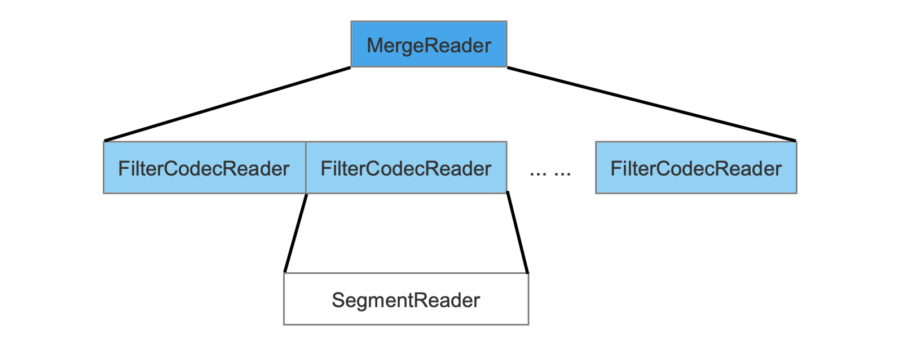
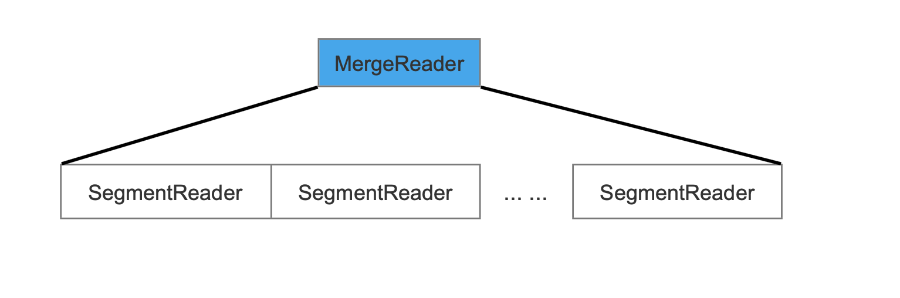
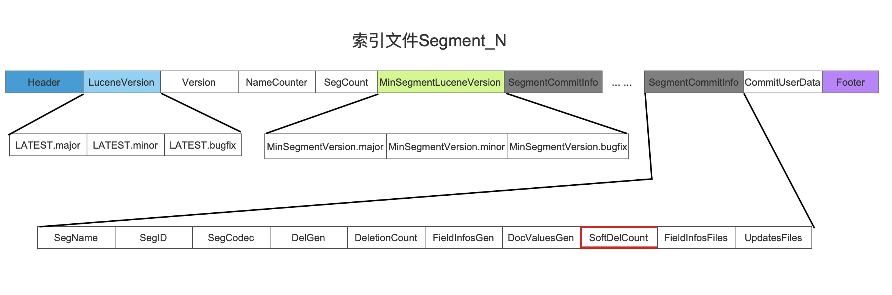
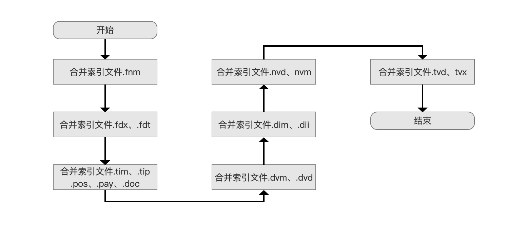
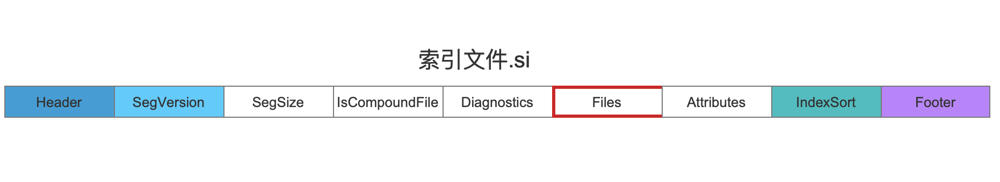
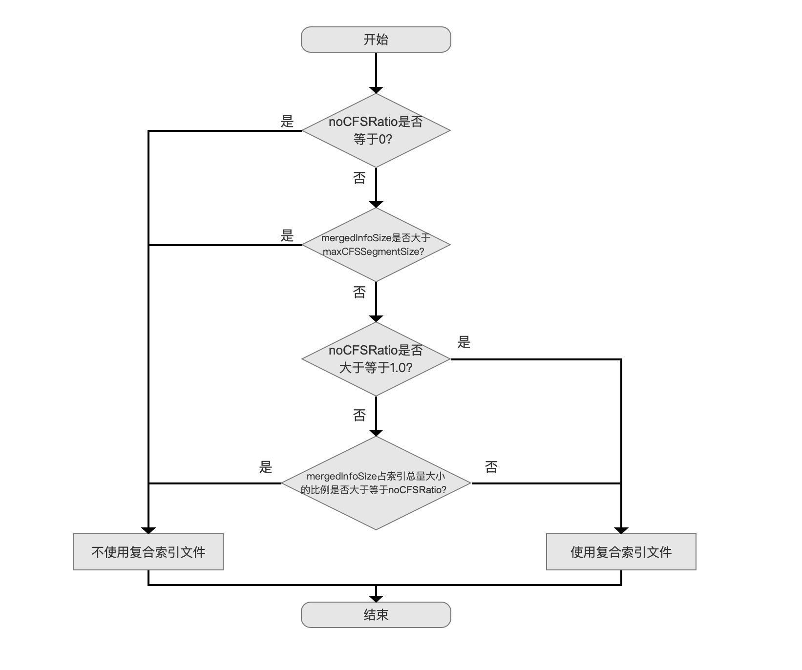
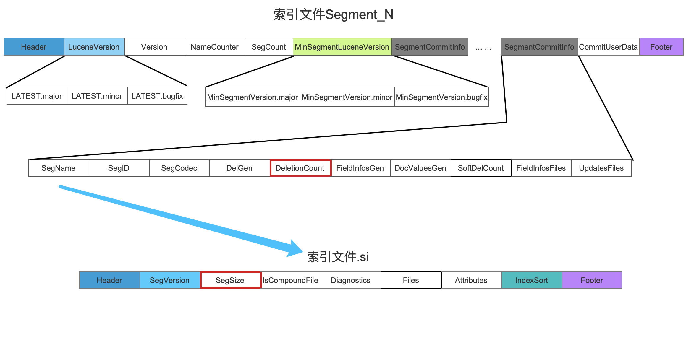
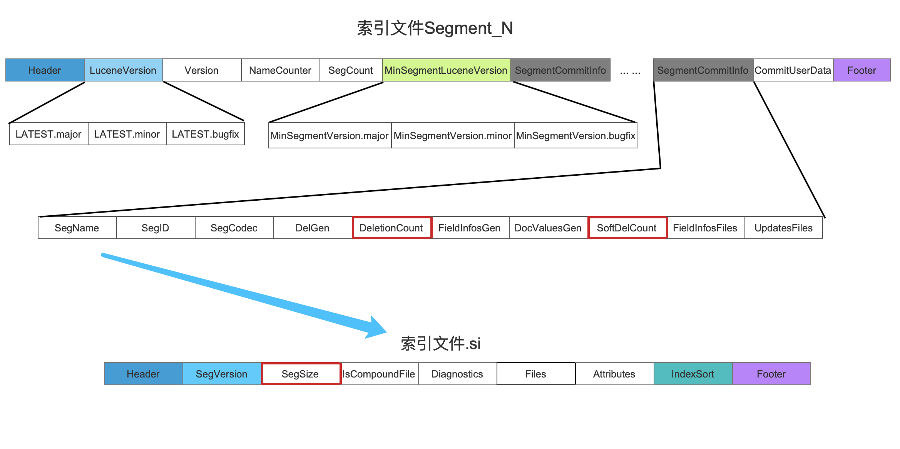

# [执行段的合并（三）](https://www.amazingkoala.com.cn/Lucene/Index/)

&emsp;&emsp;本文承接[执行段的合并（二）](https://www.amazingkoala.com.cn/Lucene/Index/2019/1024/101.html)，继续介绍执行段的合并的剩余的流程，下面先给出执行段的合并的流程图：

图1：


[点击]()查看大图

## 获取SegmentReader的集合MergeReader

&emsp;&emsp;我们在文章[执行段的合并（二）](https://www.amazingkoala.com.cn/Lucene/Index/2019/1025/102.html)介绍`更新待合并的段集合OneMerge`的内容中提到，我们需要更新OneMerge中的一个变量List\<SegmentReader\> readers，readers中的每一个SegmentReader描述的是某个待合并的段的信息，而在此流程点，我们需要对readers中的每一个SegmentReader再封装为FilterCodecReader，封装后的SegmentReader用集合MergeReader描述，如下图所示：

图2：



&emsp;&emsp;不过该流程只有在使用了软删除（soft delete）的机制后才会执行上述的操作，在后面的文章中会专门介绍软删除机制，届时再详细介绍当前流程。

&emsp;&emsp;如果不使用软删除机制，那么MergeReader中的SegmentReader跟OneMerge中的是一致的，即无需进行封装，如下图所示：

图3：



## 生成SegmentMerger

&emsp;&emsp;在此流程点，我们用在前面的流程中生成的信息来生成一个SegmentMerger，SegmentMerger包含的主要信息如下所示：

- MergeReader：即上一个流程中生成的SegmentReader的集合MergeReader，它包含了待合并的段的信息
- SegmentInfo：即在`初始化一个新段`的流程中生成的SegmentInfo对象，在后面的流程中，合并后的索引信息将会被写入到该对象中
- MergeState：该信息将会在下一篇文章中介绍，这里我们只需要知道它生成的时机

&emsp;&emsp;在后面的流程中，将通过MergeReader中包含的索引信息，将合并后的索引信息写入到SegmentInfo对象中。另外如果使用了软删除的机制，那么在上一个流程点执行结束后，我们就获得了被标记为软删除的文档的数量softDeleteCount，此时需要将softDeleteCount写入到SegmentCommitInfo对象（见[近实时搜索NRT（四）](https://www.amazingkoala.com.cn/Lucene/Index/2019/0925/96.html)中关于SegmentCommitInfo对象的介绍）中。

图4：



## 执行索引文件的合并

&emsp;&emsp;此流程开始真正的对每一个待合并的段中包含的索引文件执行合并操作，图5只列出索引文件间的合并先后顺序，每一种索引的详细合并过程不展开介绍，这里提供了该流程在源码中的入口，感兴趣的可以看看：https://github.com/LuXugang/Lucene-7.5.0/blob/master/solr-7.5.0/lucene/core/src/java/org/apache/lucene/index/SegmentMerger.java 中的下面这个方法：

```java
MergeState merge() throws IOException {
    ... ... 
}
```

图5：



&emsp;&emsp;对索引文件结构感兴趣的同学可以看这个链接：[Lucene7.50 索引文件介绍](https://www.amazingkoala.com.cn/Lucene/suoyinwenjian/)。

## 设置新段包含的索引文件名

&emsp;&emsp;在上一个流程执行结束后，我们就获得了合并后的新的索引文件集合，那么在当前流程我们需要将这些新的索引文件名写入到新段中，即写入到新段的SegmentInfo对象中。

&emsp;&emsp;**SegmentInfo对象是什么**：

- [索引文件si](https://www.amazingkoala.com.cn/Lucene/suoyinwenjian/2019/0605/63.html)中包含的索引信息读取到内存后就用SegmentInfo对象来描述，反之生成[索引文件si](https://www.amazingkoala.com.cn/Lucene/suoyinwenjian/2019/0605/63.html)的过程就是将SegmentInfo对象中的信息持久化到磁盘

&emsp;&emsp;新的索引文件名在索引文件si中的位置如下所示，用红框标注：

图6：



## 生成复合索引文件

&emsp;&emsp;无论待合并的段是否使用了复合索引文件，无论是否通过[IndexWriterConfig.setUseCompoundFile](https://github.com/LuXugang/Lucene-7.5.0/blob/master/solr-7.5.0/lucene/core/src/java/org/apache/lucene/index/IndexWriterConfig.java)方法设置生成复合索引文件，合并生成的新段需要额外的判断方法来决定是否生成复合索引文件，判断流程图如下：

### 是否使用复合索引文件流程图

图7：



[点击]()查看大图

&emsp;&emsp;在介绍图7的流程之前，我们先对图中出现的名词做下解释：

- mergedInfoSize：该值为合并后的新段的大小，根据不同的合并策略，mergedInfoSize的含义各不相同
  - [LogMergePolicy](https://www.amazingkoala.com.cn/Lucene/Index/2019/0513/58.html)：该合并策略细分下面两个策略
    - LogByteSizeMergePolicy：mergedInfoSize的值为新段对应的每一个索引文件（图6中的新的索引文件）的大小和值，通过JDK提供的File.size(Path)的方法来计算单个索引文件的大小。注意的是该合并策略还提供了[setCalibrateSizeByDeletes()](https://github.com/LuXugang/Lucene-7.5.0/blob/master/solr-7.5.0/lucene/core/src/java/org/apache/lucene/index/LogMergePolicy.java)方法来让用户选择mergedInfoSize的值是否要剔除被删除的文档的索引大小（计算方式在下文介绍）

    - LogDocMergePolicy：mergedInfoSize的值为新段中文档的数量maxDoc，该合并策略也提供了[setCalibrateSizeByDeletes()](https://github.com/LuXugang/Lucene-7.5.0/blob/master/solr-7.5.0/lucene/core/src/java/org/apache/lucene/index/LogMergePolicy.java)方法来让用户选择mergedInfoSize的值是否要剔除被删除的文档的数量（计算方式在下文介绍）
  - [TieredMergePolicy](https://www.amazingkoala.com.cn/Lucene/Index/2019/0516/59.html)：mergedInfoSize的计算方式跟LogByteSizeMergePolicy一样，**差别在于mergedInfoSize的值必须扣除掉被删除的文档的索引大小**
- noCFSRatio：该值为一个阈值（用户可配置），新段的大小mergedInfoSize占索引目录中所有段的大小的百分比如果超过该值，那么就不使用复合索引文件
- maxCFSSegmentSize：该值为一个阈值（用户可配置），如果新段的大小mergedInfoSize大于该值，那么就不使用复合索引文件

&emsp;&emsp;**如何计算被删除的文档的索引大小**：

- 通过一个段对应的索引文件计算出的新段大小mergedInfoSize中是包含被删除的文档的索引大小的，所以只需要计算出被删除文档的数量numDelete占总的文档数量maxDoc就可以算出索引大小，其中numDelete跟maxDoc在索引文件中的位置如下所示：

图8：



&emsp;&emsp;图8中，蓝色箭头描述的是根据SegName可以映射到对应索引文件.si，原因在前面的文章中已经介绍，不赘述，另外numDelete和maxDoc的值分别对应DeletionCount和SegSize，mergedInfoSize的计算公式为：

```java
mergedInfoSize*(1.0 - numDelete/maxDoc)
```

- 如果使用软删除机制，并且使用了SoftDeletesRetentionMergePolicy合并策略，那么numDelete为DeletionCount跟SoftDelCount的差值，maxDoc为SegSize：

图9：



&emsp;&emsp;至于为什么使用软删除机制后，导致numDelete的差异性，将在后面介绍软删除的文章中展开，本篇文章中我们只需要知道它会影响mergedInfoSize的计算就行了。

&emsp;&emsp;在熟悉了图7中的名词后，应该不需要介绍展开介绍每一个流程点了。

&emsp;&emsp;如果需要使用复合索引文件，那么生成[复合索引文件cfs&&cfe](https://www.amazingkoala.com.cn/Lucene/suoyinwenjian/2019/0710/73.html)即可。

## 新段对应的索引文件.si写入磁盘

&emsp;&emsp;该流程为SegmentInfo对象中的信息持久化到磁盘，生成[索引文件si](https://www.amazingkoala.com.cn/Lucene/suoyinwenjian/2019/0605/63.html)的过程，具体的写入过程个人觉得没有什么好讲的。。。

# 结语

&emsp;&emsp;基于篇幅，剩余的流程点将在下一篇文章中展开介绍。

[点击](http://www.amazingkoala.com.cn/attachment/Lucene/Index/执行段的合并/执行段的合并（三）/执行段的合并（三）.zip)下载附件


