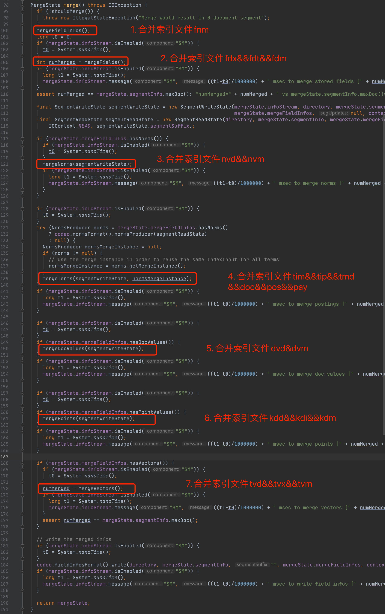
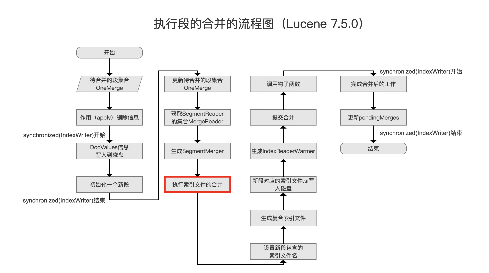
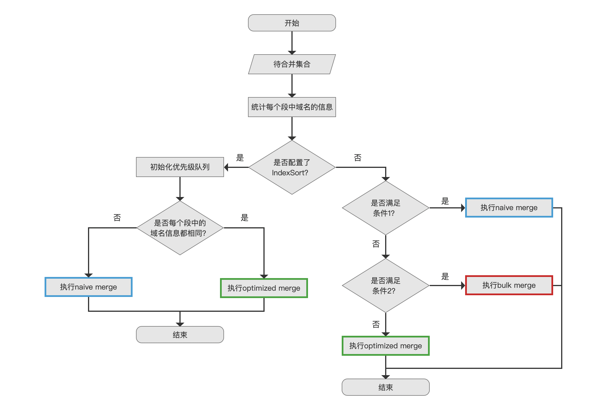
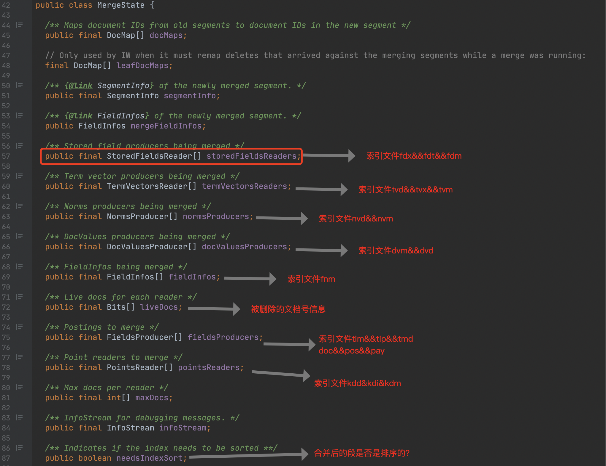
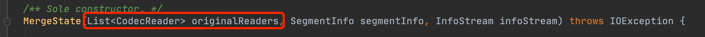
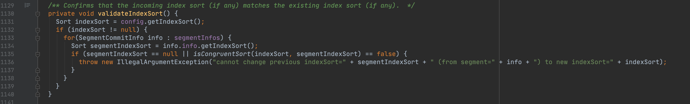

# [索引文件的合并（一）](https://www.amazingkoala.com.cn/Lucene/Index/)（Lucene 8.7.0）

&emsp;&emsp;从本篇文章开始介绍索引文件合并的过程，其中[合并策略](https://www.amazingkoala.com.cn/Lucene/Index/2019/0516/59.html)、[合并调度](https://www.amazingkoala.com.cn/Lucene/Index/2019/0519/60.html)在之前的文章中已经介绍，没有阅读过这些文章并不会影响对本篇文章的理解。

&emsp;&emsp;由于本篇文章是索引文件的合并的开篇文章，故我们先给出各类索引文件合并的先后顺序，如下所示：

图1：

&emsp;&emsp;图1中第96行的merge( )方法在被调用后，就开始依次对各种类型的索引文件进行合并，该方法被调用的时机点如下图所示：

图2：

&emsp;&emsp;图2中的流程图是执行段的合并的完整流程，其介绍可以阅读系列文章[执行段的合并](https://www.amazingkoala.com.cn/Lucene/Index/2019/1024/101.html)。在红框标注的流程点`执行索引文件的合并`中会调用图1中的第96行的merge( )方法，开始索引文件的合并。我们先介绍索引文件fdx&&fdt&&fdm的合并。

## 索引文件fdx&&fdt&&fdm的合并流程图

图3：

### 待合并集合

图4：

&emsp;&emsp;无论执行哪种索引文件的合并，其输入参数都是同一个MergeState对象，该对象中包含了不同索引文件对应的''reader''数组，数组中的某一个"reader"描述了某个段的索引文件信息，如下图所示：

图5：

&emsp;&emsp;所以对于索引文件fdx&&fdt&&fdm的合并，会使用到图5中的StoredFieldsReader[ \]数组，它即是图4中的待合并集合。

&emsp;&emsp;**MergeState对象是何时以及如何生成的：**

- 在图2的流程点`生成SegmentMerge`中生成MergeState对象

图6：

- 图6中MergeState的构造函数的参数之一是每个待合并的段对应的SegmentReader（CodecReader的实现类）的集合，而在文章[SegmentReader（一）](https://www.amazingkoala.com.cn/Lucene/Index/2019/1014/99.html)中我们知道，SegmentReader中有一个SegmentCoreReaders对象，它包含了段中所有索引文件对应的reader：

  - StoredFieldsReader：从[索引文件之fdx&&fdt&&fdm](https://www.amazingkoala.com.cn/Lucene/suoyinwenjian/2020/1013/169.html)中读取存储域的索引信息
  - FieldsProducer：从[索引文件tim&&tip](https://www.amazingkoala.com.cn/Lucene/suoyinwenjian/2019/0401/43.html)、[索引文件doc](https://www.amazingkoala.com.cn/Lucene/suoyinwenjian/2019/0324/42.html)、[索引文件pos&&pay](https://www.amazingkoala.com.cn/Lucene/suoyinwenjian/2019/0324/41.html)中读取域的索引信息
  - TermVectorsReader：从[索引文件之tvd&&tvx&&tvm](https://www.amazingkoala.com.cn/Lucene/suoyinwenjian/2020/1117/178.html)读取词向量的索引信息
  - PointsReader：从[索引文件之kdd&kdi&kdm](https://www.amazingkoala.com.cn/Lucene/suoyinwenjian/2020/1027/172.html)中读取域值为数值类型的索引信息
  - NormsProducer：从[索引文件nvd&&nvm](https://www.amazingkoala.com.cn/Lucene/suoyinwenjian/2019/0305/39.html)中读取域的打分信息
  - FieldInfos：从[索引文件fnm](https://www.amazingkoala.com.cn/Lucene/suoyinwenjian/2019/0606/64.html)读取域的信息

- 所以图5中MergeState对象中所有索引文件对应的''reader''信息都是通过深拷贝从SegmentCoreReaders对象中获取的

### 统计每个段中域名的信息

图7：

&emsp;&emsp;执行该流程点的目的是为了给后续流程中的合并方式给出依据条件，合并方式即图3中的naive merge、optimized merge、bulk merge。这三种合并方式描述了合并后生成的新的索引文件fdx&&fdt&&fdm的生成方式以及读取待合并的索引文件的方式。

&emsp;&emsp;统计的逻辑为判断所有的段对应的域名与域的编号的映射关系是否都相同（Computes which segments have identical field name to number mappings）。至于在什么情况下会出现不一致的情况，我们将在介绍**索引文件的合并之fnm**中展开。

### 是否配置了IndexSort？

图8：

&emsp;&emsp;该流程点通过判断IndexWriter的配置信息[IndexWriterConfig](https://www.amazingkoala.com.cn/Lucene/Index/2019/1111/106.html)来确定是否配置了IndexSort。如果配置了段内排序，那么合并后的段将会段内有序，即段内的文档将会根据IndexWriterConfig中的一个或者多个排序规则进行排序。

##### 段内排序

&emsp;&emsp;待合并的段集合中，要么所有段有相同的段内排序规则，要么都没有段内排序，也就是不存在只有部分段有段内排序，也不存在不同的段有不同的排序规则。

&emsp;&emsp;在IndexWriter构造阶段，配置信息IndexSort属于[不可变配置](https://www.amazingkoala.com.cn/Lucene/Index/2019/1111/106.html)，使得通过该IndexWriter对象生成的段总是拥有相同的段内排序规则。另外IndexWriter的构造函数中包含一个[Directory](https://www.amazingkoala.com.cn/Lucene/Store/2019/0613/66.html)对象，如果构造IndexWriter时配置的[OpenMode](https://www.amazingkoala.com.cn/Lucene/Index/2019/1111/106.html)模式为CREATE_OR_APPEND或者APPEND，会先读取Directory对应的索引目录中"旧的"段，它们是其他IndexWriter对象生成的，可能这些"旧的"段中的段内排序规则跟当前IndexWriter中的不一致，那么Lucene不允许读取这些"旧的"的索引文件，会下图的validateIndexSort方法中抛出以下的异常：

图9：

&emsp;&emsp;图9中segmentIndexSort为"旧的"索引文件中的段内排序规则，IndexSort为当前IndexWriter的段内排序规则。

&emsp;&emsp;**为什么Lucene不允许配置了IndexSort的IndexWriter读取段内排序规则不相同的"旧的"段**：

- 如果允许读取，那么这个"旧的"段在跟新的段合并时，需要对这个"旧的"段按照IndexWriter中的排序规则进行重新排序，在这个issue中指出，在内存中进行重新排序是不安全或者影响合并性能的，详细的介绍见：https://issues.apache.org/jira/browse/LUCENE-8505 。

- 在Lucene 8.0.0之前，如果"旧的"段没有段内排序规则，并且是Lucene 6.5.0或之前的版本生成的段，那么在段的合并期间会对这些"旧的"段先进行排序，然后再合并。原因是段内排序这个功能是Lucene 6.5.0新加入的，出于兼容的目的才允许这么做。而在Lucene 8.0.0之后则取消了，正如图9所示，"旧的"段中没有排序规则或者跟IndexWriter中的排序规则不一致就抛出异常，同样的上述的issue中说明了原因。如果一定要使用"旧的"索引文件，只能reIndex。注意的是IndexWriter.addIndexes(...)方法中同样进行跟图9中一样的非法验证。

- 当然如果当前IndexWriter中没有配置段内排序，那么它就不会去检查"旧的"段中是否有段内排序， 正如图9中第1131行代码所示。

## 结语

&emsp;&emsp;无

[点击]()下载附件
