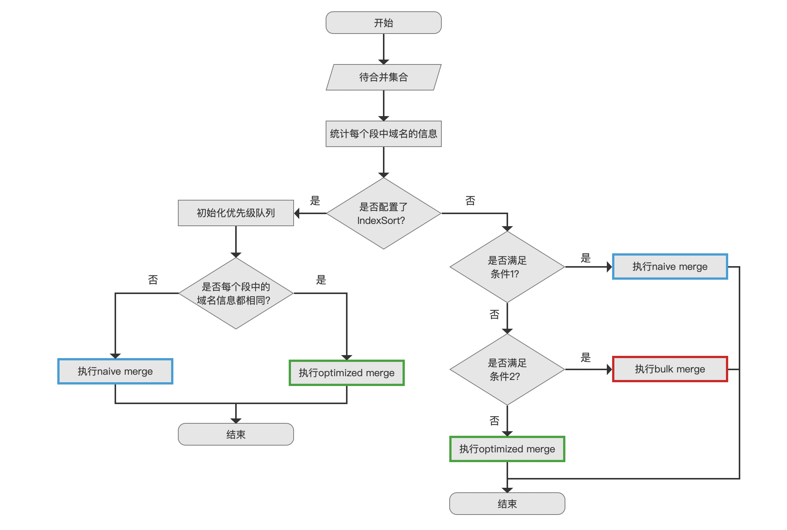
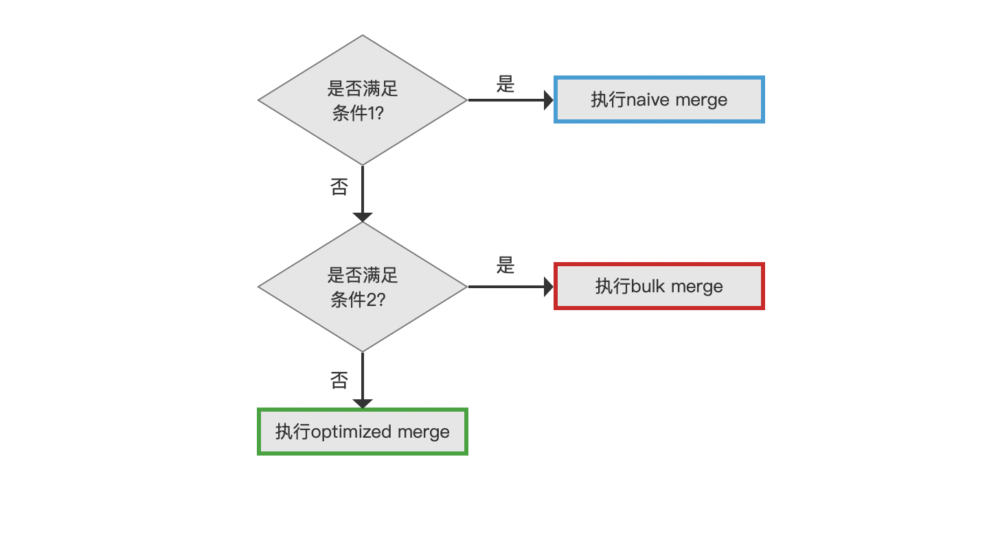
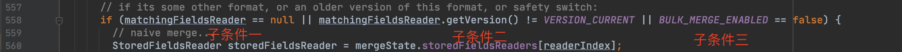
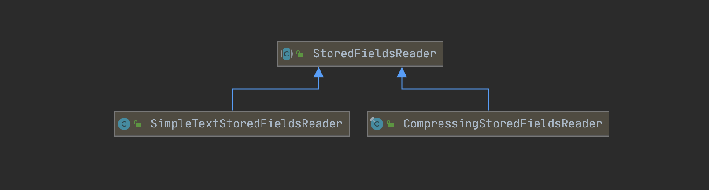
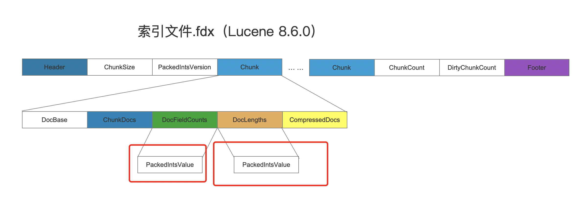
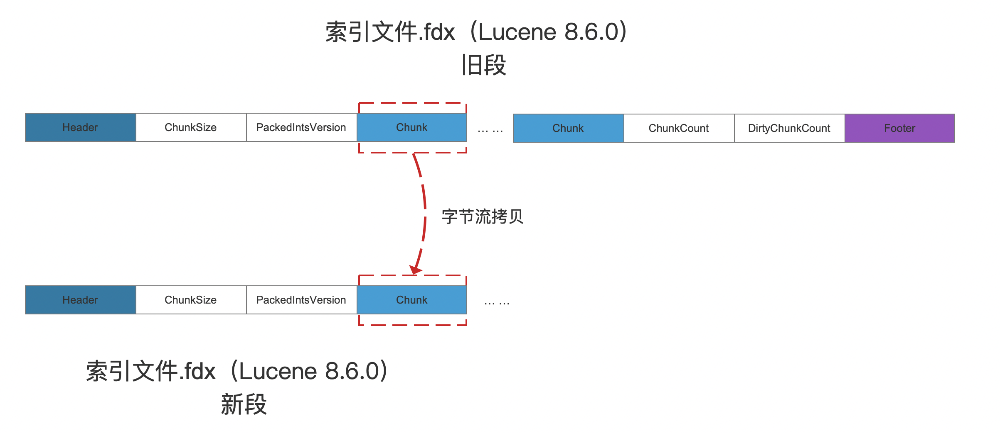
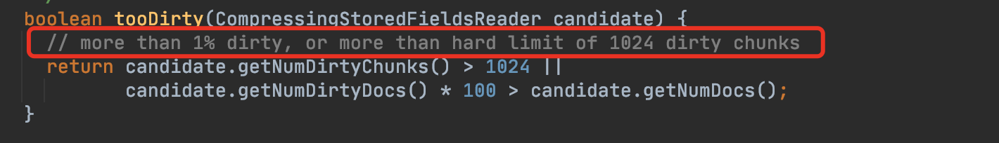
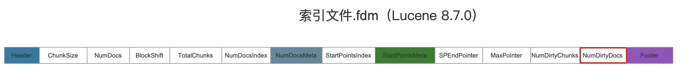
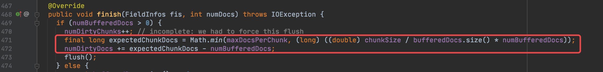

# [索引文件的合并（三）](https://www.amazingkoala.com.cn/Lucene/Index/)（Lucene 8.7.0）

&emsp;&emsp;本文承接文章[索引文件的合并（二）之fdx&&fdt&&fdm](https://www.amazingkoala.com.cn/Lucene/Index/2020/1202/181.html)，继续介绍剩余的内容，下面先给出索引文件fdx&&fdt&&fdm的合并流程图。

## 索引文件fdx&&fdt&&fdm的合并流程图

图1：

### 未配置IndexSort

图2：

&emsp;&emsp;如果当前执行合并操作的IndexWriter中没有配置[IndexSort](https://www.amazingkoala.com.cn/Lucene/Index/2019/1111/106.html)，那么依次读取每一个待合并的段，依次读取段中的每篇文档的索引信息即可。回顾下在文章[索引文件的合并（二）之fdx&&fdt&&fdm](https://www.amazingkoala.com.cn/Lucene/Index/2020/1202/181.html)中，当IndexWriter设置了IndexSort，处理过程为从一个优先级队列中的待合并的段中选出一个优先级最高的段，并从这个段的选出一篇文档作为下一次处理的候选者。

&emsp;&emsp;根据**当前正在处理的某个待合并的段的一些信息**，下文中我们称这个段为**"旧段"**，去匹配图2中的两个条件来选择不同的合并方式。合并方式描述的是如何读取旧的索引文件以及如何生成新的索引文件。

#### 满足bulk merge的条件

&emsp;&emsp;图2中的两个条件都是为了筛选出能使用bulk merge的旧段。条件1筛选出能使用bulk merge/optimized merge的旧段，条件2在条件一的基础上筛选出能使用bulk merge的旧段。

##### 是否满足条件1？

&emsp;&emsp;条件1由三个子条件组成，他们之间是或"||"的关系，满足三个子条件中的任意一个即认为是满足条件1，那么随后使用 naive merge：

- 子条件一：读取旧段对应使用的reader是否为CompressingStoredFieldsReader对象，只有这种类型的对象才可以使用bulk merge/optimized merge的合并方式，如果不是那么满足子条件一
- 子条件二：在满足子条件一的前提下，如果读取旧段对应使用的reader与新段的版本不一致，那么满足子条件二
  - 版本不同，意味着新段跟旧段的索引文件fdx&&fdt&&fdm的数据结构是不一致的，即无法使用bulk merge（下文中会介绍bulk merge为什么需要索引文件的数据结构是一致的）
- 子条件三：在满足子条件一、二的前提下，如果设置了不允许使用bulk merge的参数，那么满足子条件三

&emsp;&emsp;这三个条件的判断对应源码 https://github.com/LuXugang/Lucene-7.5.0/blob/master/solr-8.4.0/lucene/core/src/java/org/apache/lucene/codecs/compressing/CompressingStoredFieldsWriter.java 中的下面的代码：

图3：

&emsp;&emsp;图3中，matchingFieldReader为null说明旧段不是CompressingStoredFieldsReader对象，即557行代码的注释中所谓的other format。

**还有哪些其他的format：**

图4：

&emsp;&emsp;图4中读取段的reader在Lucene core的模块中主要有两种读取方式，对应上述的两种StoredFieldsReader的实现。

&emsp;&emsp;当满足条件一后，旧段中所有文档对应的合并方式都是用naive merge，该合并方式在文章[索引文件的合并（二）之fdx&&fdt&&fdm](https://www.amazingkoala.com.cn/Lucene/Index/2020/1202/181.html)中已经介绍，不赘述。

##### 是否满足条件2？

&emsp;&emsp;条件2由5个子条件组成，并且它们需要同时满足。如果满足条件2则使用bulk merge，否则使用optimized merge。另外随后会介绍为什么条件2会由这5个子条件组成：

- 子条件一：旧段中的压缩模式（compressionMode）是否跟新段的一致，如果一致则满足子条件一
  - 压缩模式决定了索引文件.fdx中存储域的域值信息的压缩方式。例如在Lucene 8.7.0中引入了两种[新的压缩模式](https://www.amazingkoala.com.cn/Lucene/Changes/2020/1106/176.html)，在Lucene 8.7.0版本中合并低版本的段时，条件一就不会满足
- 子条件二：旧段中生成一个Chunk的触发条件之一的chunkSize是否跟新段的一致，如果一致则满足子条件二
  - 在文章[索引文件的生成（二十四）之fdx&&fdt&&fdm](https://www.amazingkoala.com.cn/Lucene/Index/2020/1016/171.html)中介绍了chunkSize的概念，chunkSize会影响域值信息的压缩，不赘述
- 子条件三：旧段中的PackedInts的版本是否跟新段的一致，如果一致则满足子条件三
  - 在文章[索引文件之fdx&&fdt&&fdm](https://www.amazingkoala.com.cn/Lucene/suoyinwenjian/2020/1013/169.html)中我们说到，Chunk中的DocFieldCounts跟DocLengths字段最终用[PackedInts](https://www.amazingkoala.com.cn/Lucene/yasuocunchu/2019/1217/118.html)压缩的，如下所示：

&emsp;&emsp;&emsp;&emsp;图5：

&emsp;&emsp;&emsp;&emsp;

- 子条件四：旧段中不能有被标记为删除的文档，如果没有那么满足子条件四
  - 也就是说旧段中不能有[索引文件.liv文件](https://www.amazingkoala.com.cn/Lucene/suoyinwenjian/2019/0425/54.html)
- 子条件五：这个子条件我们暂时不讨论，在介绍玩bulk merge的合并过程后再作介绍 

#### 执行bulk merge

&emsp;&emsp;当同时满足了图2的条件1、条件2之后，旧段中就可以通过bulk merge的方式写入到新的索引文件中，其执行过程分为下面的步骤：

##### 第一步：从旧段中找到Chunk在索引文件.fdx中开始跟结束位置

&emsp;&emsp;从旧段中的第一个Chunk开始，第一个Chunk中的第一篇文档为旧段中的第一篇文档，我们称之为preChunkFirstDocId，这篇文档的文档号必定是 0，在文章[索引文件的读取（十五）之fdx&&fdt&&fdm](https://www.amazingkoala.com.cn/Lucene/Search/2020/1113/177.html)中我们介绍了如何通过文档号找到该文档所属的Chunk在索引文件.fdx的**开始位置**。随后通过读取这个Chunk中的ChunkDocs字段（见文章[索引文件之fdx&&fdt&&fdm](https://www.amazingkoala.com.cn/Lucene/suoyinwenjian/2020/1013/169.html)的介绍），就可以获得当前Chunk中的文档数量bufferedDocs，那么下一个Chunk中的第一篇文档的文档号，我们称之为nextChunkFirstDocId，$nextChunkFirstDocId = preChunkFirstDocId + bufferedDocs$，通过nextChunkFirstDoc就可以知道下一个Chunk在索引文件.fdx中的**开始位置**，该位置也就是上一个Chunk的**结束位置**。

##### 第二步：将Chunk的信息写入到新的索引文件中

&emsp;&emsp;获取了一个Chunk在旧段中的开始跟结束位置之后，就可以通过字节流拷贝实现所谓的bulk merge：

图6：

&emsp;&emsp;bulk merge与naive merge/optimized merge相比，它不用读取Chunk中的内容，意味着免除了Chunk中各个字段的解压解码的过程，即不需要额外的内存来暂存解压解码后的Chunk的信息。关于Chunk中各个字段的编码压缩的介绍见文章[索引文件的读取（十五）之fdx&&fdt&&fdm](https://www.amazingkoala.com.cn/Lucene/Search/2020/1113/177.html)。

&emsp;&emsp;我们回顾下满足bulk merge的条件2，合并后的索引文件.fdx在读取阶段如果不满足子条件一、子条件二，那么会因为不同的压缩模式无法读取域值信息；如果不满足子条件三，那么会因为不同的压缩算法无法读取Chunk中的DocFieldCounts跟DocLengths字段；如果不满足子条件四，源码中给出的解释为：its not worth fine-graining this if there are deletions，个人感觉是为了符合索引文件合并的设计初衷之一：处理被删除的信息、LSM的设计原则？或者是需要额外生成一个新段对应的索引文件.liv来记录删除信息是not worth fine-graining的？这个我没有深刻的明白这个子条件的用意；

#### 子条件五

&emsp;&emsp;在了解了bulk merge的合并过程后，我们可以讨论条件2中的子条件五了，它描述的是旧段中的dirty chunk满足下文的两个条件之一后，这个旧段就不满足子条件五，则不能使用bulk merge。

##### dirty chunk

&emsp;&emsp;在文章[索引文件的生成（二十四）之fdx&&fdt&&fdm](https://www.amazingkoala.com.cn/Lucene/Index/2020/1016/171.html)中我们说到，在生成索引文件.fdx的过程中，索引阶段跟flush阶段都会生成Chunk，其中flush阶段生成的Chunk即dirty chunk。dirty chunk中包含的文档数量或者域值信息的大小没有达到maxDocsPerChunk或者chunkSize所以被认为是"脏"的Chunk（maxDocsPerChunk跟chunkSize的概念见[索引文件的生成（二十四）之fdx&&fdt&&fdm](https://www.amazingkoala.com.cn/Lucene/Index/2020/1016/171.html)）。

&emsp;&emsp;对于DWPT（见文章[文档的增删改（中）](https://www.amazingkoala.com.cn/Lucene/Index/2019/0628/69.html)）生成的段，它包含的索引文件.fdx中的dirty chunk的数量最多是1个，而通过bulk merge合并了多个这样的旧段生成的新段就有可能包含多个dirty chunk。当dirty chunk满足下面任意一个条件后，这个新段在下一次作为待合并的段时就不能使用bulk merge：

- 条件一：dirty chunk的数量大于1024个
- 条件二：dirty docs的数量占段中文档总数的比例超过1%
  - 上述条件以注释方式写在源码中

&emsp;&emsp;&emsp;&emsp;图7：

&emsp;&emsp;&emsp;&emsp;

&emsp;&emsp;&emsp;图7中，candidate描述的就是待合并的某个段。

###### dirty docs

&emsp;&emsp;每当DWPT生成一个段或者合并后生成的新段后，会统计一个dirty docs的数量，它将被写入到索引文件中：

图8：

&emsp;&emsp;**如何计算dirty docs的数量**

&emsp;&emsp;先给出在源码中的计算公式：

&emsp;&emsp;&emsp;&emsp;图9：

&emsp;&emsp;&emsp;&emsp;

&emsp;&emsp;图9的公式中：

- maxDocsPerChunk描述的是一个Chunk中最多允许存储的文档数量
- chunkSize表示一个Chunk最多允许存储的域值信息的大小
- numBufferedDocs描述的是dirty chunk中包含的文档数量
- bufferedDocs.size()描述的是dirty chunk中存储的域值信息的大小

&emsp;&emsp;图9中471行描述了通过dirty chunk中numBufferedDocs与bufferedDocs.size()的比例来推算 如果Chunk中存储chunkSize大小的域值信息对应的文档数量，即expectedChunkDocs，随后用expectedChunkDocs与numBufferedDocs的差值作为dirty docs，用dirty docs的数量来描述了dirty chunk的dirty程度。

&emsp;&emsp;dirty chunk的数量越大，说明dirty chunk的dirty程度越高，意味着这个dirty chunk的域值信息的大小越小，那么压缩率就会降低，因为域值信息越大，越可能从中找出相同的字节流区间（见文章[LZ4算法（上）](https://www.amazingkoala.com.cn/Lucene/yasuocunchu/2019/0226/37.html)），从而提高压缩率。

&emsp;&emsp;如果dirty chunk中的dirty docs数量很小，比如说每次新增1023（比非dirty chunk包含的文档数量少一篇）篇文档生成一个段，使得条件二很难满足，如果没有条件一，那么待合并的段总是可以bulk merge，使得新段中存在多个dirty chunk，降低压缩率。故结合条件一，当dirty chunk的数量达到1024的阈值，使得这个新段在下一次作为待合并的段时使用optimized merge。optimized merge使得生成的新段最多包含一个dirty chunk（不明白？请阅读文章[索引文件的合并（二）之fdx&&fdt&&fdm](https://www.amazingkoala.com.cn/Lucene/Index/2020/1202/181.html)）。

## 结语

&emsp;&emsp;我们利用三篇文章介绍了索引文件fdx&&fdt&&fdm的合并，在不同的合并模式下，索引文件.fdx的生成方式各有不同，然而对于索引文件fdm&&fdx，并不会因为不同合并模式有不同的生成方式，还是跟系列文章[索引文件的生成（二十三）之fdx&&fdt&&fdm](https://www.amazingkoala.com.cn/Lucene/Index/2020/1015/170.html)中的一样。
