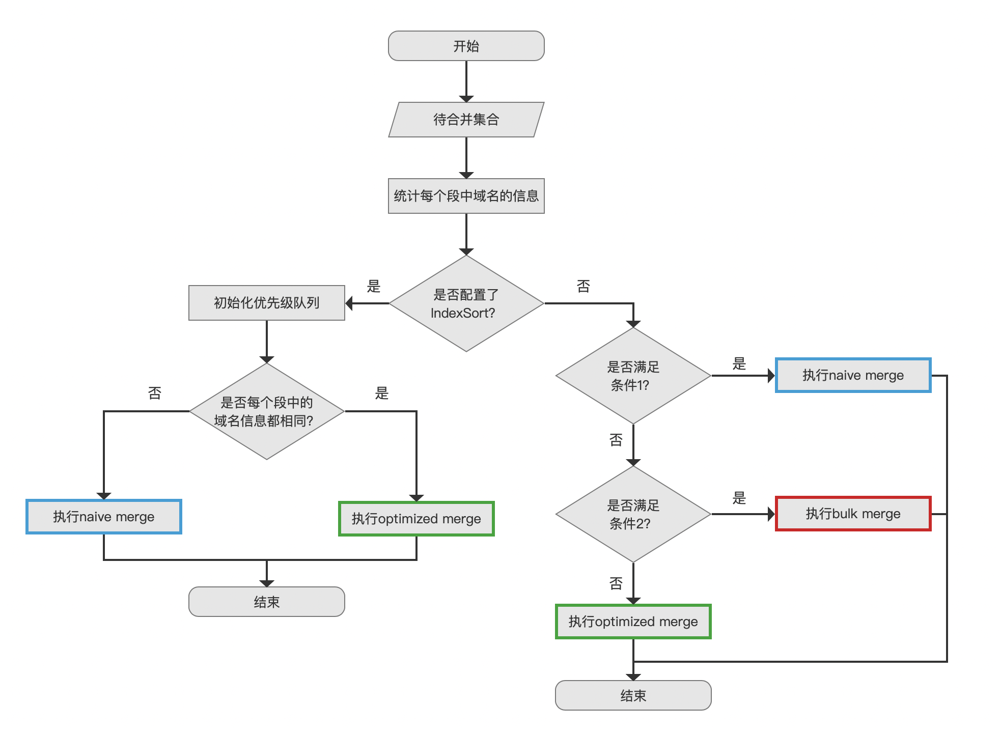
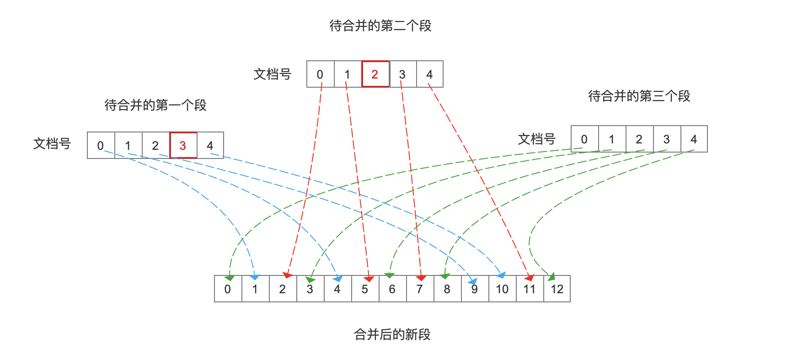
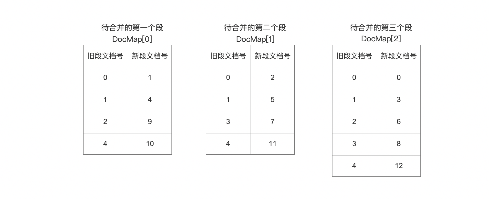
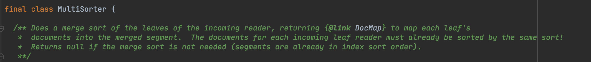
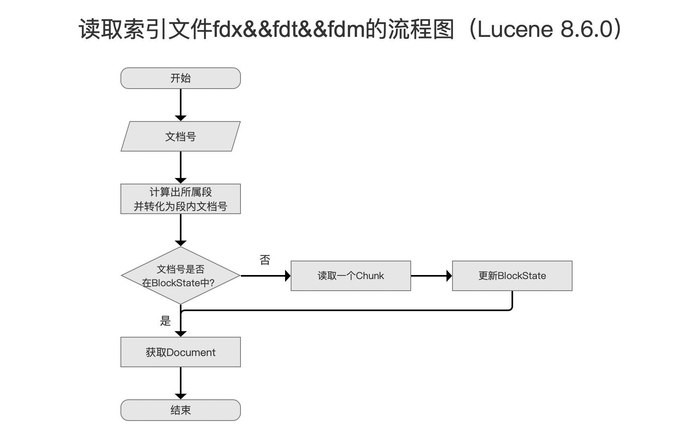
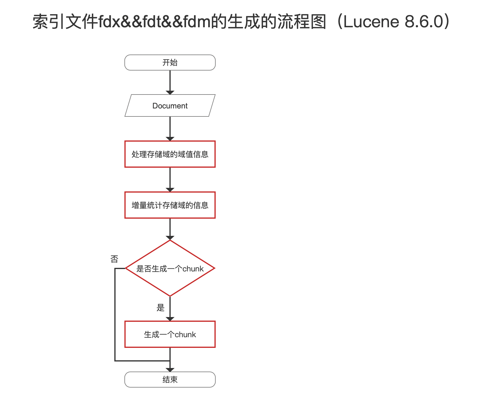
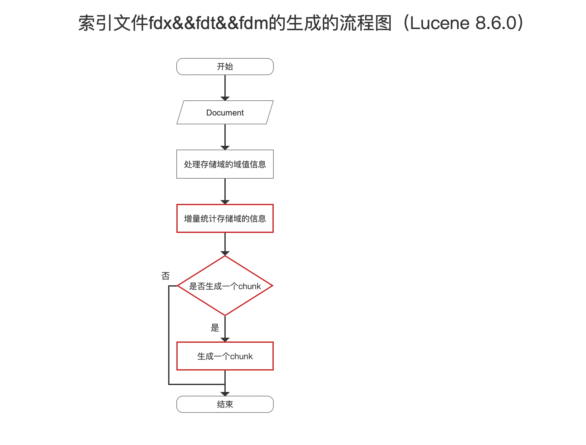
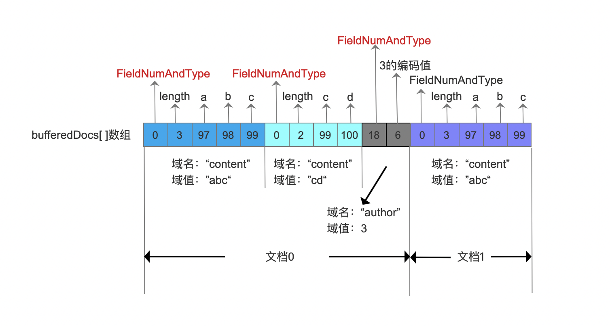

# [索引文件的合并（二）](https://www.amazingkoala.com.cn/Lucene/Index/)（Lucene 8.7.0）

&emsp;&emsp;本文承接文章[索引文件的合并（一）之fdx&&fdt&&fdm](https://www.amazingkoala.com.cn/Lucene/Index/2020/1130/180.html)，继续介绍剩余的内容，下面先给出索引文件fdx&&fdt&&fdm的合并流程图。

## 索引文件fdx&&fdt&&fdm的合并流程图

图1：

### DocMap[ ]数组

&emsp;&emsp;继续介绍图1的流程点之前，我们先介绍下DocMap[ \]数组，如果合并后的段是段内排序的，那么需要在构造MergeState（见文章[索引文件的合并（一）之fdx&&fdt&&fdm](https://www.amazingkoala.com.cn/Lucene/Index/2020/1130/180.html)的介绍）对象期间生成DocMap[ ]数组，数组中的数组元素描述了某个待合并的段的一个映射关系，它描述了段中文档号到新段文档号的映射关系。

图2：

&emsp;&emsp;图2中描述了待合并的段中的文档号映射到新段后的文档号。其中待合并的第一个段中的文档号3以及待合并的第二个段的文档号2用红框额外标注，它们表示这两篇文档号是被标记为删除的，在合并后的新段中不会出现这两个文档号映射关系（代码中其实有删除文档号到新段文档号的映射，只是在合并的过程中会通过[索引文件之liv](https://www.amazingkoala.com.cn/Lucene/suoyinwenjian/2019/0425/54.html)过滤，所以相当于没有映射关系）。图2中的映射关系使用DocMap[ ]数组存储：

图3：

**图2中的映射关系是如何生成的：**

&emsp;&emsp;回答这个问题前必须再次强调在文章[索引文件的合并（一）之fdx&&fdt&&fdm](https://www.amazingkoala.com.cn/Lucene/Index/2020/1130/180.html)中的内容：待合并的段中的文档号是段内有序的，并且所有的段的排序规则都是相同的。

&emsp;&emsp;生成图2的映射关系的大概逻辑就是：

- 把所有的段丢进一个优先级队列中，所以这个队列中的元素数量为待合并的段的数量
- 优先级队列的排序规则为比较文档中的一个或者多个排序域（排序域即跟IndexWriter中的[IndexSort](https://www.amazingkoala.com.cn/Lucene/Index/2019/1111/106.html)相同域名的域），如果排序域仍然无法比较出结果，那么就根据文档所属段的编号（生成一个段的生成是同步的，先生成的段对应的编号小），编号越小则胜出。
- 每个段按照文档号大小的顺序，每次取出一篇文档中的排序域参与比较，如果胜出，那么这篇文档的文档号建立与新段中的文档号的映射，接着这个段取出下一篇文档中的排序域继续参与比较，随后优先级队列重排

&emsp;&emsp;详细的过程可以看源码，实现方式易读易懂：https://github.com/LuXugang/Lucene-7.5.0/blob/master/solr-8.4.0/lucene/core/src/java/org/apache/lucene/index/MultiSorter.java  。虽然是Lucene 8.4.0的链接，但是跟Lucene 8.7.0中的实现是一样的。

图4：

&emsp;&emsp;我们看下MultiSorter的注释，它提到所有的leaf reader必须是有序的并且使用相同的排序规则，即上文中提到的待合并的段中的文档号是段内有序的，并且所有的段的排序规则都是相同的。

### 初始化优先级队列

图5：

&emsp;&emsp;当前流程点需要初始化了一个优先级队列，目的在于随后的剩余的流程中我们将通过这个优先级队列有序的取出获得一个文档号，它对应的索引文件信息将被写入到新的索引文件。

&emsp;&emsp;初始化优先级队列的大概逻辑为：

- 把所有的段丢这个优先级队列中
- 优先级队列的排序规则为比较段中的文档号映射到新段的文档号，我们称之为mappedDocID（源码中的变量名），mappedDocID越小优先级越高。获得mappedDocID的方式正是上文中提到的DocMap[ ]数组

### 是否每个段中的域名信息都相同？

图6：

&emsp;&emsp;域名信息的概念在文章[索引文件的合并（一）之fdx&&fdt&&fdm](https://www.amazingkoala.com.cn/Lucene/Index/2020/1130/180.html)中以及介绍，不赘述。如果当前流程点为true，那么能使用比naive merger性能较高的optimized merge。

### 执行naive merge

图7：

&emsp;&emsp;naive merge同图2中的optimized merge、bulk merge属于索引文件的合并方式。由于索引文件的合并实际是读取旧的索引文件以及生成新的索引文件的过程，所以我们结合[索引文件fdx&&fdt&&fdm的生成](https://www.amazingkoala.com.cn/Lucene/Index/2020/1015/170.html)过程来介绍这几种合并方式的差异。

&emsp;&emsp;执行naive merge的过程可以划分下面几个步骤：

#### 第一步：从图5的优先级队列中找到优先级最高的段对应的文档号

&emsp;&emsp;由于新的段也是段内排序的，所以我们从优先级队列中有序的取出后再写入到新段，使得新的段也能保持有序

#### 第二步：根据文档号从索引文件.fdt中读取一个Chunk，然后这个Chunk中找到这个文档号对应的存储域信息

&emsp;&emsp;其读取过程正如文章[索引文件的读取（十四）之fdx&&fdt&&fdm](https://www.amazingkoala.com.cn/Lucene/Search/2020/1102/174.html)中的内容，按照下面的流程图读取：

图8：

&emsp;&emsp;图8中根据文档号从一个段中取出了对应的存储域的信息，Document描述。

#### 第三步：将存储域的信息写入到新的索引文件中

&emsp;&emsp;其写入过程正如文章[索引文件的生成（二十三）之fdx&&fdt&&fdm](https://www.amazingkoala.com.cn/Lucene/Index/2020/1015/170.html)中的内容，按照下面的流程图写入：

图9：

&emsp;&emsp;图9中用红框标注的流程点描述了当前步骤需要执行的写入操作。这里标注的目的是为了与其他的合并方式相比较，下文中会展开介绍。

&emsp;&emsp;重复上述3个步骤，直到所有待合并的段中的文档号都被处理结束。

### 执行optimized merge

图10：

&emsp;&emsp;执行optimized merge的过程同naive merge一样可以划分为下面的步骤：

#### 第一步：从图5的优先级队列中找到优先级最高的段对应的文档号

&emsp;&emsp;同naive merge。

#### 第二步：根据文档号从索引文件.fdt中读取一个Chunk，然后这个Chunk中找到这个文档号对应的存储域信息

&emsp;&emsp;同naive merge。

#### 第三步：将存储域的信息写入到新的索引文件中

&emsp;&emsp;其写入过程正如文章[索引文件的生成（二十三）之fdx&&fdt&&fdm](https://www.amazingkoala.com.cn/Lucene/Index/2020/1015/170.html)中的内容，按照下面的流程图写入：

图11：

&emsp;&emsp;相比较图9，发现optimized merge不需要执行`处理存储域的域值信息`这步骤。

**为什么不用执行`处理存储域的域值信息`这两个流程：**

&emsp;&emsp;我们先看下存储域的域值信息包含了什么信息，如下所示：

图12：

&emsp;&emsp;图12中，使用bufferedDocs[ \]数组存放存储域的域值信息（该数组的详细介绍见文章[索引文件的生成（二十三）之fdx&&fdt&&fdm](https://www.amazingkoala.com.cn/Lucene/Index/2020/1015/170.html)），可见包含了红框标注的域的编号的信息。如果待合并的段集合中某一个或多个段的域的编号信息跟MergeState中的域的编号mergeFieldInfos（见文章[索引文件的合并（一）之fdx&&fdt&&fdm](https://www.amazingkoala.com.cn/Lucene/Index/2020/1130/180.html)的图4）不一致，就需要重新获取域的编号信息，意味着图12中的存储域的域值信息会发生变化。反之，如果某个待合并的段中的域的编号跟MergeState中的域的编号信息一致，则可以**复用**图12中的域值信息。那么只要**拷贝**文档对应在图12中的存储域的域值信息（字节流）到新段的bufferedDoc[ \]数组中即可，即不用通过执行`处理存储域的域值信息`给新段的bufferedDoc[ \]数组赋值。

图13：

&emsp;&emsp;上文中我们提到合并过程是依次处理段中的每篇文档，那么如何根据某个待合并的段中的文档号，找到它对应的存储域的域值信息呢，即如果当前处理的文档号0，如何从找到图13中找到文档号0的存储域的域值信息在索引文件.fdx的数据区间呢？

&emsp;&emsp;在图8中，当我们执行了流程点`读取一个Chunk`之后，即获得了图13中的DocFieldCounts以及DocLengths字段信息，根据这两个信息就可以获得某篇文档的存储域的信息在索引文件.fdx的数据区间。感兴趣的朋友可以阅读文章[索引文件的生成（二十三）之fdx&&fdt&&fdm](https://www.amazingkoala.com.cn/Lucene/Index/2020/1015/170.html)中的介绍，本文中不赘述。

## 结语

&emsp;&emsp;通过上文介绍，我们了解s了为什么要执行不同的合并方式以及naive merge以及optimized merge的区别，其实差别并不是太大。

[点击](https://www.amazingkoala.com.cn/attachment/Lucene/Index/索引文件的合并/索引文件的合并（二）/索引文件的合并（二）.zip)下载附件

