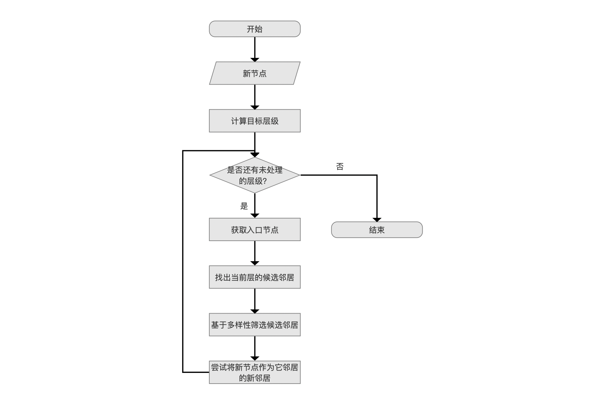
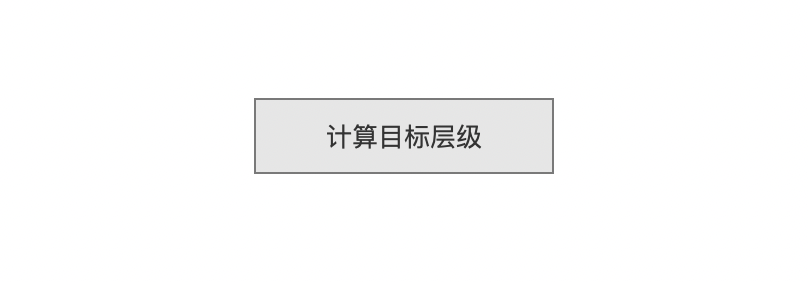
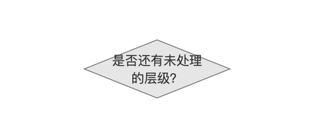
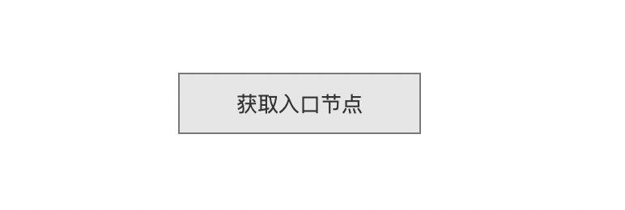
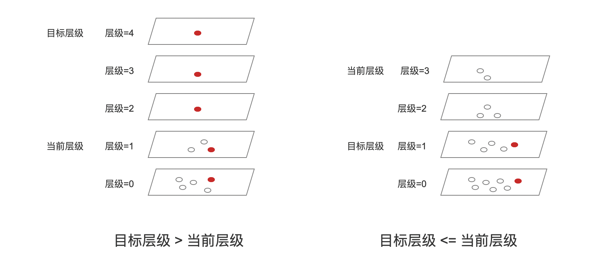
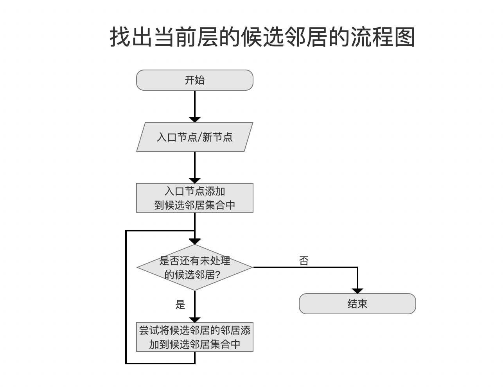
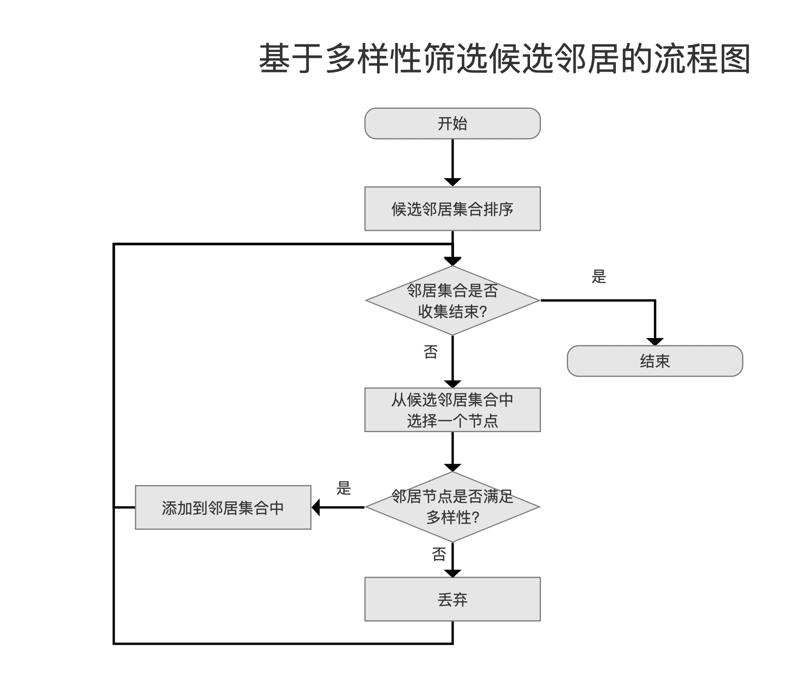
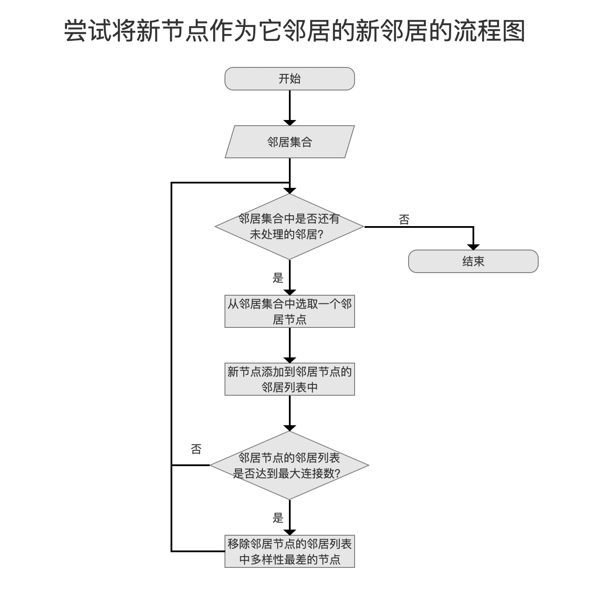

# HNSW图的构建（Lucene 9.8.0）

&emsp;&emsp;Lucene基于论文[Efficient and robust approximate nearest neighbor search using Hierarchical Navigable Small World graphs [2018]](https://arxiv.org/abs/1603.09320)实现了HNSW的逻辑，本篇文章结合[ChatGPT-4](https://chat.openai.com/share/04690eb3-4b9d-4382-a796-2efa381b443f)跟Lucene源码介绍构建过程中的实现细节，另外构建HNSW使用的索引数据结构可以参考文章[索引文件之vec&vem&vex（Lucene 9.8.0）](https://amazingkoala.com.cn/Lucene/suoyinwenjian/2023/1023/索引文件之vec&vem&vex/)。

## 概述

图1：

&emsp;&emsp;我们先通过论文中的这张图，简要的介绍下构建完成的HNSW图的一些基本知识：

1. **层次结构**：HNSW图具有多层结构，每一层都是一个独立的图。层数通常是根据数据集的大小和复杂性确定的。在最高层（即图中的layer=2），节点数量最少，但每个节点覆盖的范围最广；而在最低层（即图中的layer=0），节点数量最多，但每个节点覆盖的范围相对较小。
2. **节点连接**：在每一层中，节点通过边与其邻居相连接。这些连接是基于距离或相似性度量的，意味着每个节点倾向于与离它最近的其他节点相连。
3. **邻居的选择**：选择哪些节点作为邻居是基于一定的启发式规则的，这些规则旨在平衡搜索效率和准确性。通常，这涉及到保持邻居的**多样性（Diversity）**和限制每个节点的邻居数量。
4. **搜索路径**：构建/查询HNSW图都有一个搜索过程，搜索路径会从最高层的**全局入口节点**开始，然后逐层下降，直到达到最低层。在每一层中，搜索会根据当前层的连接结构来寻找离目标节点最近的节点。

## 实现原理

&emsp;&emsp;我们通过一个新节点的添加/插入过程来介绍下Lucene中HNSW图的构建：

图2：

### 新节点

图3：

&emsp;&emsp;Lucene中每一个Document只能有一个相同域名的向量，并且按照添加顺序为每一个向量映射一个节点编号（nodeId），它是一个从0开始递增的值。新节点在源码中即节点编号，当我们需要计算两个节点之间的距离时，就可以通过映射关系找到节点对应的向量值进行计算。

### 计算目标层级

图4：

&emsp;&emsp;目标层级是通过一个遵循指数分布计算出的随机数。

&emsp;&emsp;HNSW图具有多层结构，目标层级意味着新节点将被添加到哪些层中，并且在每一层与其他节点建立连接。

&emsp;&emsp;例如目标层级为3，那么这个节点将被依次添加到第3、2、1、0层中。

#### 计算公式

&emsp;&emsp;源码中通过公式：`−ln⁡(unif(0,1)) * ml` 计算目标层级，其中`unif(0,1)`表示从0到1之间均匀分布的一个随机值，`ml`定义为` 1/ln(M)`，其中`M`是最大连接数，即最多可以跟M个节点进行连接。源码中M的默认值为16。

&emsp;&emsp;使用该公式基于的理论以及实验基础在论文有详细的介绍，本文不详细展开。

### 是否还有未处理的层级？

图5：

&emsp;&emsp;计算出目标层级后，将从最高层开始，从上往下逐层处理，直到新节点添加到所有层并建立与其他节点的连接，就完成了新节点的插入。

### 获取入口节点

图6：

&emsp;&emsp;入口节点（entry point）是指导新节点插入到某一层中的起始点（可能存在多个入口节点，见下文介绍）。

&emsp;&emsp;将新节点插入到某一层的目的是建立它在这层中跟其他节点的连接。因此一方面**首先**跟入口节点进行连接，另一方面基于贪心算法尝试与入口节点的邻居、入口节点的邻居的邻居等等建立连接。其过程将会在流程点`找出当前层的候选邻居`中详细展开。

#### 入口节点的类型

&emsp;&emsp;入口节点的类型可以分为：全局入口节点和层级入口节点。

- 层级入口节点：在插入过程中，每一层都可能有一个或多个入口节点（每一个新节点在每一层的入口节点可能是不同的）。这些节点是在逐层下降过程中确定的，用于在每个层级上引导搜索。也就说当前层的入口节点是**上一层**中与新节点连接的节点集合中TopK个节点（下文会介绍）。如果当前层已经是最高层，那么该层的入口节点为全局入口节点
- 全局入口节点：又名**初始入口节点**，是单一的一个节点，用于最高层的入口节点。添加新节点时，并且当新节点的目标层级大于当前HNSW图中的层数时，该节点将作为新的全局入口节点

#### 获取层级入口节点概述

&emsp;&emsp;获取层级入口节点可以概括为两种情况，如下所示：

图7：

- **目标层级 > 当前层级（图中最高层）**：在层级4、3、2中，添加新节点引入了新层，因此直接将新节点添加到这几层即可。添加过程中不需要考虑获取入口节点的问题；在层级1、0中，获取方式跟下面的另一种情况相同
- **目标层级 <= 当前层级**：
  - 层级3：由于是最高层，因此全局入口节点将作为该层的入口节点，并找到新节点在这层中的候选邻居，并且将候选邻居集合中的**Top1**节点（称为**ep3**）作为层级2的入口节点
  - 层级2：**ep3**作为当前层的入口节点，找到新节点在这层中的候选邻居，并且将候选邻居集合中的**Top1**节点（称为**ep2**）作为层级1的入口节点
  - 层级1：**ep2**作为当前层的入口节点，找到新节点在这层中的候选邻居，并且将候选邻居集合中的**TopK****节点集合**（称为**ep1**）作为层级0的入口节点
  - 层级0：**ep1**这个**节点集合**将作为当前层的入口节点

&emsp;&emsp;注意到的是，上文中层级1、2只将上一层中新节点邻居中的**Top1（最近的邻居）**作为入口节点，而在层级0中选择了上一层的**TopK****节点集合**，其理由是搜索效率和准确性的需求平衡：

- **选择最近的邻居**：侧重于快速缩小搜索范围，并尽可能快地接近目标节点。

- **使用多个邻居**：提高搜索的全面性，特别是在复杂或高维的数据空间中。使用多个入口节点可以从不同的路径探索空间，增加找到最佳匹配的机会。

#### 为什么逐层下降，而不是直接到达目标层级

&emsp;&emsp;图7中，当`目标层级<=当前层级`时，是从当前层级逐层下降，而不是直接从目标层级开始开始，考虑的因素有：

- **高层的快速导航**：在高层，节点之间的连接覆盖了更大的距离。这意味着在高层进行搜索可以快速跳过不相关的区域，迅速接近新节点的目标区域。如果直接跳到目标层，可能会错过这种快速接近的机会。
- **逐步精细化搜索**：从高层开始并逐层下降允许搜索过程逐步变得更加精细。在每一层，搜索都会根据该层的连接结构调整方向，以更精确地接近新节点的位置。这种逐层精细化的过程有助于找到更准确的最近邻。
- **避免局部最小值**：如果直接在目标层进行搜索，可能会陷入局部最小值，即找到的最近邻并不是全局最近的邻居。逐层下降有助于避免这种情况，因为在每一层的搜索都是基于上一层的结果，从而提供了更全面的视角。
- **平衡搜索成本**：虽然逐层下降可能看起来比直接跳到目标层更耗时，但实际上它通常更高效。这是因为在高层进行的搜索步骤较少，而直接在密集的低层进行搜索可能需要更多的步骤来找到最近邻。

### 找出当前层的候选邻居

图8：

&emsp;&emsp;`找出当前层的候选邻居`是一个贪心算法的**搜索过程**，它从入口节点卡开始，首先将其作为看起来最接近新节点的节点，如果一个节点的邻居看起来更接近新插入的节点，算法会转向那个邻居节点，并继续探索其邻居。最终找到TopN个距离**较近**（TopN中不一定是离新节点**最近**的节点），流程图如下：

图9：

#### 候选邻居集合

&emsp;&emsp;候选节点集合的数据结构是一个最小堆，按照`节点距离`打分值排序，距离越近，打分值越高。`节点距离`描述的是新节点跟候选邻居的距离。

##### 贪心算法的搜索过程中的一些知识点

- 距离打分值阈值：搜索过程中会一直更新一个名为minCompetitiveSimilarity的阈值，即最小堆堆顶元素，如果某个邻居与新节点的距离小于该阈值，则不再处理跟这个邻居相连接的节点。
- 记录已经访问过的节点：由于节点之间的相互连接，贪心算法很容易重复访问相同的节点，通过记录已经访问过的节点，提高搜索性能
- 下一层的入口节点：当前层的候选邻居集合中的TopN将作为下一层的入口节点，即上文中提到的Top1跟TopK（这里的K在源码中是通过名为beamWidth的变量定义，默认值为100）。

#### **足够近的邻居和绝对最近的邻居**

&emsp;&emsp;贪心算法的搜索过程意味着它可能不会找到绝对最近的邻居，但通常会找到足够接近的邻居：
- 算法的目标是找到与新节点足够接近的邻居节点。这里的“足够接近”意味着虽然找到的邻居可能不是绝对意义上最近的邻居（即有些离新节点更近的节点没有成为邻居），但它们与新节点的距离足够近，可以有效地代表新节点在图中的位置。
- 效率与准确性的平衡：在实际应用中，寻找绝对最近的邻居可能非常耗时，特别是在大规模或高维的数据集中。因此，算法通常会寻找一个平衡点，即在可接受的计算成本内找到足够近的邻居。
- 贪心搜索策略：HNSW使用贪心算法来逐步逼近新节点的最近邻居。这意味着在每一步，算法都会选择当前看起来最接近新节点的邻居。这种方法通常能快速找到足够近的邻居，但不保证总是找到绝对最近的邻居。
- 实用性考虑：在大多数情况下，找到“足够近”的邻居已经能够满足大部分应用场景的需求，如近似最近邻搜索。这种方法在保证搜索效率的同时，也能够提供相对高的搜索准确性。
- 限制邻居数量：为了控制图的复杂性，通常会限制每个节点的邻居数量。这意味着即使存在更近的节点，也可能因为邻居数量限制而不被选为新节点的邻居。

### 基于多样性筛选候选邻居

图10：

&emsp;&emsp;尽管在上一个流程点`找出当前层的候选邻居`中已经找到了TopN个"足够近"的邻居，但基于下面几个因素考虑，我们还要对这些邻居进行多样性的考察，不满足多样性的邻居则不会进行连接，并且通过计算邻居之间的距离实现多样性的检查：

- 覆盖不同区域：如果一个节点的邻居彼此之间距离较远，这意味着它们覆盖了该节点周围的不同区域。这种分布有助于在搜索过程中快速定位到不同的区域，从而提高搜索的效率和准确性。
- 避免局部最小值：在高维空间中，如果所有邻居都非常接近，可能会导致搜索过程陷入局部最小值，即找到的最近邻并不是全局最近的邻居。邻居间的距离差异有助于提供更多的搜索路径，从而避免这种情况。
- 增强图的连通性：具有距离差异的邻居节点可以增强图的连通性，使得从一个节点到另一个节点的路径更加多样化。这对于在图中快速传播信息或找到最优路径非常重要。
- 适应不同的数据分布：在实际应用中，数据往往不是均匀分布的。通过确保邻居间的距离差异，可以更好地适应这些不均匀的数据分布，确保图结构能够有效地覆盖整个数据空间。
- 平衡探索和利用：在搜索算法中，需要平衡探索（探索未知区域）和利用（利用已知信息）之间的关系。邻居间的距离差异有助于这种平衡，因为它允许算法从一个节点出发探索多个方向，而不是仅限于最近的邻居。
- 提高鲁棒性：在动态变化的数据集中，数据点的分布可能会随时间变化。如果节点的邻居具有一定的距离差异，这有助于图结构适应这些变化，保持其搜索效率。

#### 多样性检查

&emsp;&emsp;检查流程图如下所示：

图11：

##### 邻居集合

&emsp;&emsp;邻居集合中的元素是从候选邻居集合中进行多样性检查后，筛选出的N个节点，它们将做新节点的正式邻居。

&emsp;&emsp;注意的是，第0层中，节点最多可以连接`2*maxConn`个邻居节点，其他层最多可以连接`maxConn`个，也就是邻居集合的大小。其中`maxConn`的默认值为16。

&emsp;&emsp;源码中通过NeighborArray对象来表示节点的邻居信息：

图12：

- **size**：邻居的数量
- **score**：节点跟邻居的距离打分值数组
- **node**：邻居的节点编号数组
- **scoresDescOrder**：`node`跟`score`数组按照距离打分值的升序还是降序排序
- **sortedNodeSize**：本篇文章不需要关注这个

##### 候选邻居集合排序

&emsp;&emsp;上文中我们提到候选邻居集合是一个最小堆，即堆顶为距离最远的元素。由于后续`节点是否满足多样性`要求从距离最近（打分越高）的开始，因此这里的`候选邻居集合排序`在源码中是将堆中元素写入到一个NeighborArray中，我们称之为`scratch`，并且按照距离打分值升序排序。

##### 逐个候选邻居进行多样性检查

&emsp;&emsp;从`scratch`中距离**打分值最高**的元素开始，比较它与邻居集合中**每一个**邻居的距离`d(邻居，新节点的其他邻居)`，如果至少存在一个其他邻居使得`d(邻居，新节点)`小于`d(邻居，新节点的其他邻居)`，则不满足多样性，如果满足则把这个候选邻居节点添加到邻居集合中，它将作为新节点在该层中的正式邻居。

### 尝试将新节点作为它邻居的新邻居

图13：

&emsp;&emsp;这个流程点与图的更新策略密切相关。当新节点被添加到图中时，需要根据特定的规则或策略来更新图的结构。这包括上文中已经介绍的新节点的邻居列表应该包括哪些节点以及决定哪些现有节点应该将新节点加入其邻居列表。这些更新策略通常考虑以下几个方面：

- **保持图的连通性**：更新策略旨在保持图的良好连通性，确保可以从任一节点有效地导航到其他节点。
- **优化搜索效率**：通过适当地更新邻居列表，可以优化图的结构，从而提高后续搜索操作的效率。
- **维护邻居多样性**：更新策略通常旨在保持邻居的多样性，这有助于提高搜索的全面性和准确性。
- **控制图的大小和复杂性**：为了避免图变得过于复杂，更新策略可能包括限制节点的最大邻居数量。
- **适应数据变化**：在动态变化的数据集中，更新策略有助于图适应新数据的加入，保持其反映数据集当前状态的能力。

图14：

&emsp;&emsp;邻居集合中包含了新节点的正式邻居，并且已经跟他们建立了**单向的**连接。如果新节点的邻居的邻居列表还未达到连接数上限，即第0层的`2*maxConn`和其它层的`maxConn`，那么新节点就可以作为它邻居的邻居。否则先添加到邻居的邻居列表后，再进行多样性检查（检查逻辑同上文中的描述），移除多样性最差的节点，当然这个最差的节点可能是新节点，也有可能是其他节点。

## 结语

&emsp;&emsp;无