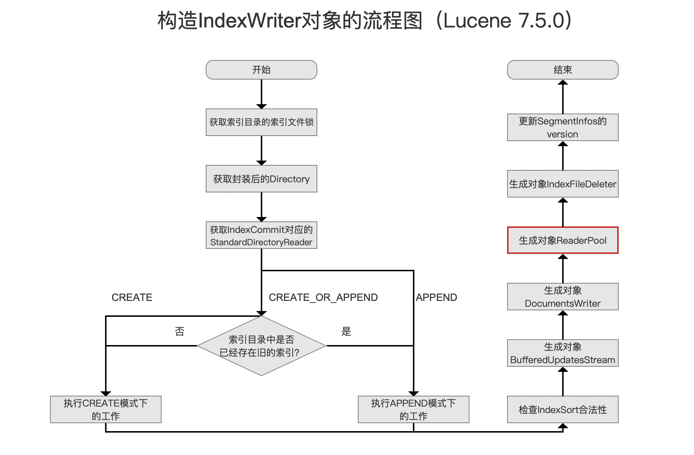
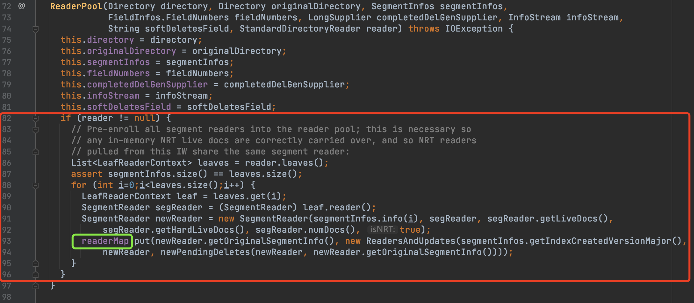
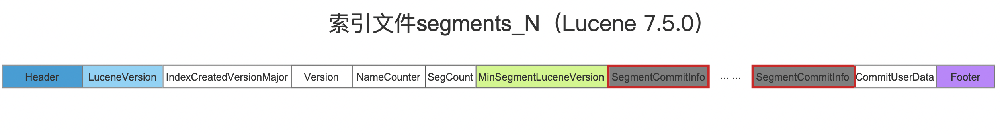
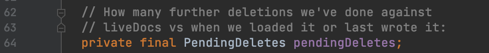
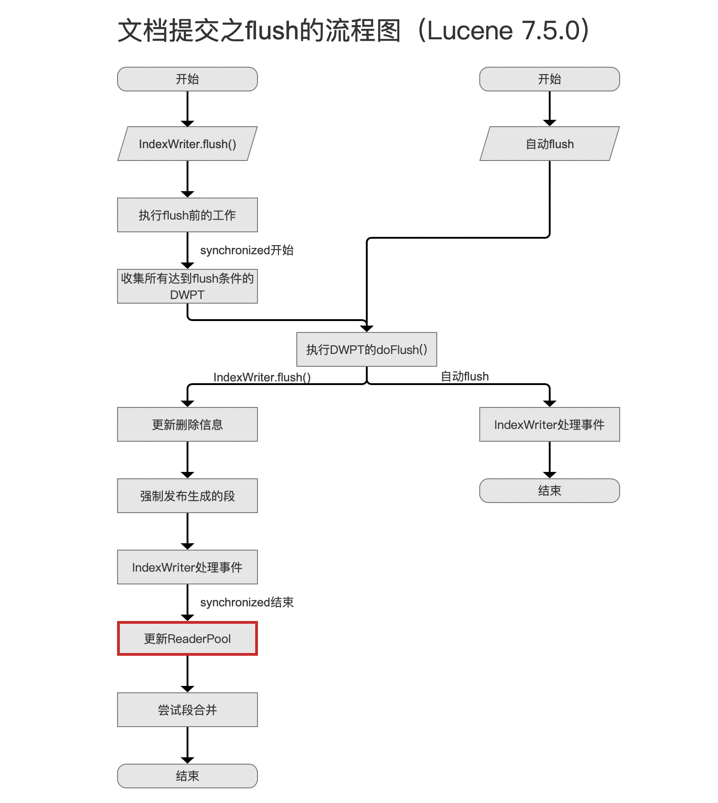
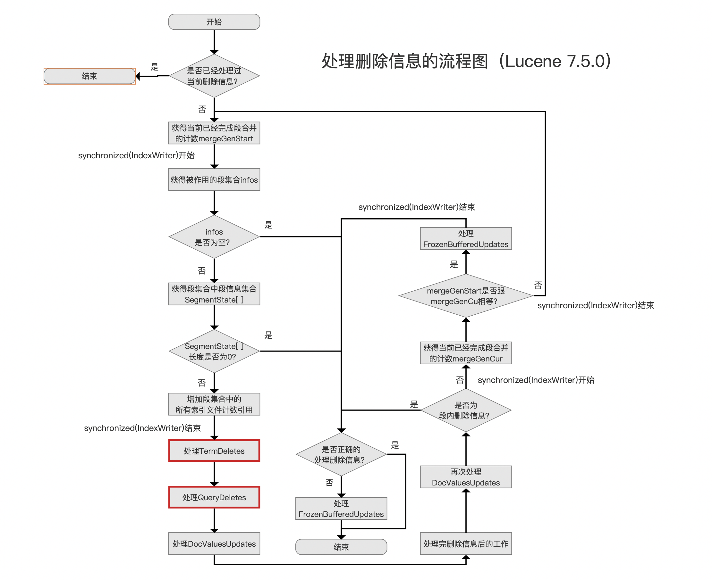
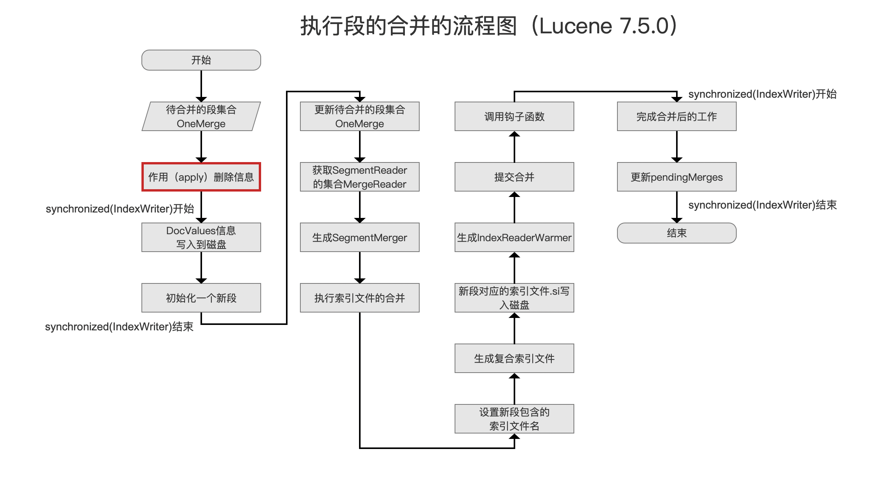

# [ReaderPool（一）](https://www.amazingkoala.com.cn/Lucene/Index/)（Lucene 8.7.0）

&emsp;&emsp;ReaderPool类对于理解Lucene的一些机制起到了极其关键的作用，这些机制至少包含段的合并、作用（apply）删除信息、NRT（near real-time）、flush/commit与merge的并发过程中的删除信息的处理等等，所以有必要单独用一篇文章来介绍这个类。下面先给出源码中对于这个类的介绍：

图1：

&emsp;&emsp;图1的javadoc中这样描述ReaderPool类：该类持有一个或多个[SegmentReader](https://www.amazingkoala.com.cn/Lucene/Index/2019/1014/99.html)对象的引用，并且是shared SegmentReader，share描述的是在flush阶段、合并阶段、NRT等不同的场景中都共用ReaderPool对象中的SegmentReader。另外IndexWriter还会使用这些shared SegmentReaders来实现例如作用（apply）删除信息、[执行段的合并](https://www.amazingkoala.com.cn/Lucene/Index/2019/1024/101.html)、[NRT搜索](https://www.amazingkoala.com.cn/Lucene/Index/2019/0916/93.html)。

## 构造ReaderPool对象

&emsp;&emsp;ReaderPool对象只在[构造IndexWriter对象](https://www.amazingkoala.com.cn/Lucene/Index/2019/1127/111.html)期间生成，正如图1中的Javadoc所描述的那样，它用来被IndexWriter使用。

图2：

&emsp;&emsp;我们通过ReaderPool的构造函数来介绍在构造ReaderPool对象期间一些主要的内容：

图3：

&emsp;&emsp;我们看下图3中红框标注的部分内容，它描述的是通过参数StandardDirectoryReader reader，从中依次读取它包含的SegmentReader，然后将每个SegmentReader的信息存储到代码第93行的readerMap中。

**构造函数的参数StandardDirectoryReader reader是哪里来的？**

&emsp;&emsp;通过图2的流程点`获取IndexCommit对应的StandardDirectoryReader`获得StandardDirectoryReader，在随后流程点`生成对象ReaderPool`中传递给ReaderPool的构造函数。

**代码第93行的readerMap是什么？**

&emsp;&emsp;readerMap是一个map容器，它是ReaderPool对象的实例变量。其中key为SegmentCommitInfo对象，value为ReadersAndUpdates对象，如下所示：

图4：

&emsp;&emsp;**SegmentCommitInfo对象是什么？**

&emsp;&emsp;SegmentCommitInfo用来描述一个段元数据（metadata）。它是[索引文件segments_N](https://www.amazingkoala.com.cn/Lucene/suoyinwenjian/2019/0610/65.html)的字段：

图5：

&emsp;&emsp;索引文件segments_N中用来保存描述每个段的信息的元数据SegmentCommitInfo。在图2的流程点`获取IndexCommit对应的StandardDirectoryReader`中通过读取索引目录中的索引文件segments_N获取每个段对应的SegmentCommitInfo，并且将它作为readerMap的key，用来区分不同的段。

&emsp;&emsp;另外readerMap的value，即ReadersAndUpdates对象，它同样描述了段中的数据，下文中我们再对其展开介绍。

&emsp;&emsp;故在构造ReaderPool的过程中，其最重要的过程就是记录当前索引目录中所有段的信息，在下文中，会介绍被记录的信息在什么情况下会被使用。

## 读取ReaderPool对象

&emsp;&emsp;我们先看下readerMap中的value，即ReaderAndUpdates对象中包含了哪些内容：

图6：

&emsp;&emsp;图6中红框标注的实例变量是我们关心的内容，我们一一介绍。

### SegmentReader reader

图7：

&emsp;&emsp;reader中包含的内容在文章[SegmentReader（一）](https://www.amazingkoala.com.cn/Lucene/Index/2019/1014/99.html)已经做了介绍，不赘述。

### PendingDeletes pendingDeletes

图8：

&emsp;&emsp;正如图8的注释描述的一样，pendingDeletes用来存储段中**"新的"**被删除的信息，注释中further deletions即"新的"被删除的信息。

&emsp;&emsp;**为什么要加黑突出"新的"这两个字？**

&emsp;&emsp;以在构造ReaderPool对象期间为例，图7中的SegmentReader中可能包含删除信息，这些删除信息是在图的流程点`获取IndexCommit对应的StandardDirectoryReader`通过读取索引目录中一个段对应的[索引文件.liv](https://www.amazingkoala.com.cn/Lucene/suoyinwenjian/2019/0425/54.html)获得的，我们称之为"旧的"删除信息。

&emsp;&emsp;当后续索引（Indexing）过程中，如果存在删除操作，并且当前段满足这个删除条件，那么删除信息必须作用（apply）到这个段，这些删除信息称之为**"新的"**被删除信息，它们会被添加到pendingDeletes中，更准确的描述应该是这些"新的"删除信息被**暂存**到pendingDeletes。

&emsp;&emsp;**为什么是暂存"新的"的删除信息？**

&emsp;&emsp;如果不是暂存，那么就是持久化到磁盘，即生成新的索引文件.liv。但是每次有删除信息就执行I/O磁盘操作，这显然不是合理的设计。

&emsp;&emsp;**什么时候将"新的"删除信息持久化到磁盘？**

&emsp;&emsp;例如在执行[flush](https://www.amazingkoala.com.cn/Lucene/Index/2019/0718/75.html)、commit、获取NRT reader时。

图9：

&emsp;&emsp;图9中，当用户调用了[主动flush](https://www.amazingkoala.com.cn/Lucene/Index/2019/0716/74.html)（执行IndexWriter.flush()操作），当执行到流程点[更新ReaderPool](https://www.amazingkoala.com.cn/Lucene/Index/2019/0812/81.html)，说明这次flush产生的"新的"删除都已经实现了apply，那么此时可以将"新的"删除信息生成新的索引文件.liv。

&emsp;&emsp;**什么时候一个段会被作用（apply）"新的"删除信息**

&emsp;&emsp;还是以图9的flush为例，在`IndexWriter处理事件`的流程中，会执行一个[处理删除信息](https://www.amazingkoala.com.cn/Lucene/Index/2019/0807/80.html)的事件，其流程图如下所示：

图10：

&emsp;&emsp;图10中红框标注的两个流程点将会从段中找到满足删除条件的文档号，然后将删除信息暂存到pendingDeletes中。

&emsp;&emsp;另外在[执行段的合并过程](https://www.amazingkoala.com.cn/Lucene/Index/2019/1024/101.html)中，待合并的段在图11的流程点`作用（apply）删除信息`被作用"新的"删除信息：

图11：

## 结语

&emsp;&emsp;基于篇幅，剩余的内容将在下一篇文章中展开。

[点击]()下载附件

