# 倒排表（上）（Lucene 7.5.0）
本篇文章介绍如何生成倒排表，通过一个简单的例子来讲解倒排表的底层存储结构。文章中不会给出详细的源码介绍，只有一些必要的对象，感兴趣的朋友可以看我的GitHub，对构建倒排表的源码给出了详细的注释：https://github.com/luxugang/Lucene-7.5.0/blob/master/solr-7.5.0/lucene/core/src/java/org/apache/lucene/index/DefaultIndexingChain.java ，此类中的该方法是开始构建倒排表的入口。
另外如果某些域使用了词向量(TermVector)，它会额外的生成倒排表，虽然写入的逻辑是类似的，但最终的倒排表的数据结构还是有区别，在后面的文章中会详细介绍。

```java
public void invert(IndexableField field, boolean first) throws IOException {...}
```
# 例子
图1：
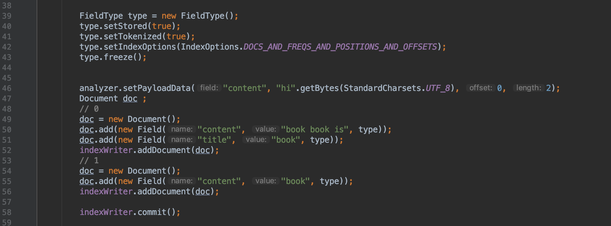
上图说明：
- 代码第42行表示倒排表中会存放 文档号、词频、位置、偏移信息
```java
 type.setIndexOptions(IndexOptions.DOCS_AND_FREQS_AND_POSITIONS_AND_OFFSETS);
```
- 代码第46行表示我们为域名为"content"的域值分词后"book"添加一个值为"hi"的 payload值，而域名为"title"的中的"book"以及其他term都没有payload信息，
- 通过自定义分词器来实现payload，当前例子中的分词器代码可以看[PayloadAnalyzer](https://github.com/luxugang/Lucene-7.5.0/blob/master/LuceneDemo/src/main/java/lucene/AnalyzerTest/PayloadAnalyzer.java)
```text
我们也可以为不同的term提供不同的payload。
```

# 三个关键类
构建倒排表的过程中，主要用到下面三个类：
## ByteBlockPool类
此类中用一个二维数组用来存放term的倒排表数据。
```java
public byte[][] buffers;
```
## IntBlockPool类
此类中同样用一个二维数组来存储索引信息，由于所有term的倒排表数据都紧凑的存放在ByteBlockPool对象的buffers[][]二维数组中，并且一个term的倒排表数据并非存储在一块连续的空间中，所以我们需要IntBlockPool对象中的一个二维数组来存储映射到ByteBlockPool对象的索引。
```java
public byte[][] buffers;
```
## ParallelPostingsArray类
在这个类中我们只要关心下面几个重要的数组。该类的对象用来处理同一种域名的数据，有几种域名就有对应数量的ParallelPostingsArray对象，也就是说下面的数组对于不同文档的相同的域是共用的，这点很重要。
**<u>下面所有的数组的下标值都是termID，termID用来区分不同term的唯一标识，它是一个从0开始递增的值，每个term按照处理的先后顺序获得一个termID</u>**。

#### int[] termFreqs；
记录每一个term在一篇文档中的词频frequencies。
#### int[] lastDocIDs；
记录每一个term上次出现是在哪一个文档中。
```text
对于同一个term来说，在某一篇文档中，只有所有该term都被处理结束才会写到倒排表中去，否则的话，term在当前文档中的词频frequencies无法正确统计。所以每次处理同一个term时，根据它目前所属的文档跟它上一次所属的文档来判断当前的操作是统计词频还是将它写入到倒排表。
另外包含某个term的所有文档号是用差值存储，该数组用来计算差值。
```
### int[] lastDocCodes；
记录每一个term上一次出现是在哪一个文档中。跟lastDocIDs[]数组不同的是，数组元素是一个组合值，相同的是当term在新的文档中出现后，才将它上一次的文档号写入到倒排表中。
```text
基于压缩存储，如果一个term在一篇文档中的词频只有1，那么文档号跟词频的信息组合存储，否则文档号跟词频分开存储。
```
例子：
```text
文档号5中某个term的词频为1，那么组合存储，将文档号左移一位，然后跟1执行或操作
(5 << 1) | 1 == 11。
```
图2：
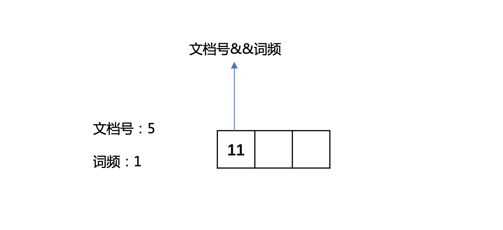

```text
文档号5中某个term的词频为6，将文档号左移一位，5 << 1 = 10, 然后分开存储。
```
图3：
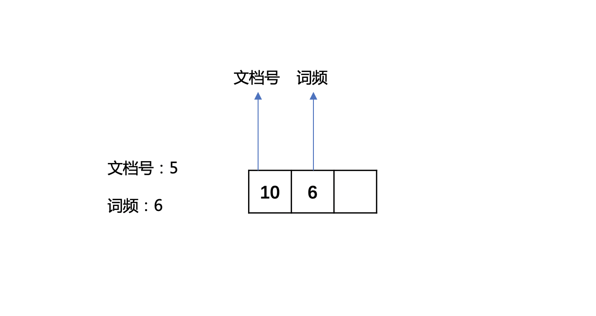

### int[] lastPositions；
记录每一个term在当前文档中上一次出现的位置。
```text
基于压缩存储，倒排表中的位置(position)信息是一个差值，这个值指的是在同一篇文档中，当前term的位置和上一次出现的位置的差值。
每次获得一个term的位置信息，就马上写入到倒排表中。
注意的是，实际存储到倒排表时，跟存储文档号一样是一个组合值，不过这个编码值是用来描述当前位置的term是否有payload信息。
```
例子
```text
没有payload信息, 将位置的值左移1位：8 << 1, 在读取倒排表时，如果position的二进制值最低位为0，说明没有payload的信息。
```
图4：
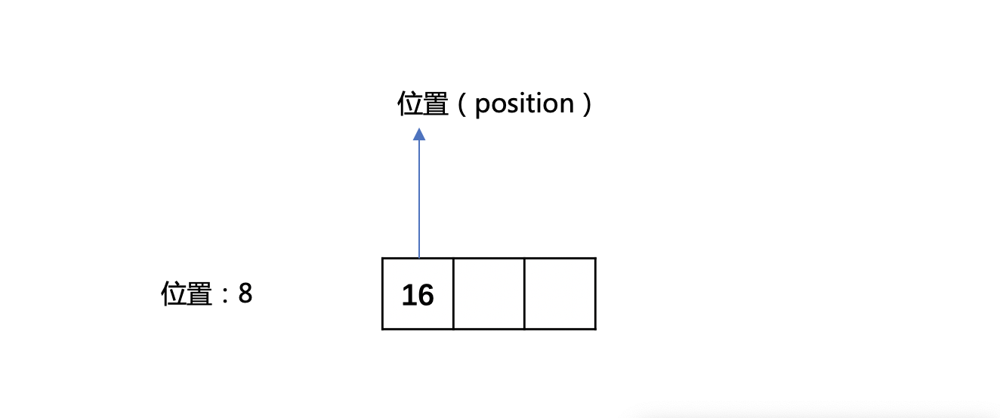
```text
带有payload信息, 将位置的值左移1位,并与1执行或操作：(8 << 1)| 1, 在读取倒排表时，如果position的二进制值最低位为1，说明带有payload的信息。
```
图5：
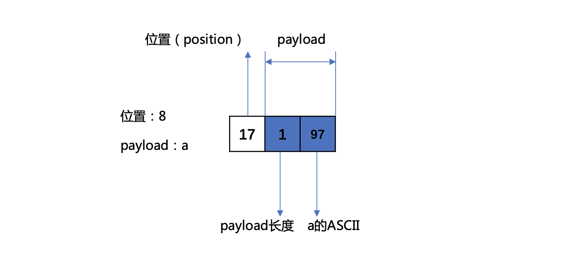
### int[] textStarts；
每一个term在ByteBlockPool对象的buffers [ ] [ ]二维数组中的起始位置。
### int[] intStarts；
数组元素为每一个term在IntBlockPool对象的buffers[ ] [ ] 二维数组中的位置。
```text
写倒排表时候，IntBlockPool对象的buffers[][] 二维数组中的数据描述了对于某一个term我们应该往ByteBlockPool对象的buffers[][] 二维数组中的哪个位置写，而intStarts[]则是描述我们如何通过termID找到在IntBlockPool对象的buffers[][] 二维数组中的数据。
```
在这里还需要重复的时候， 我们在当前文档第一次处理某个term时，才会将这个term上次出现的文档号跟词频写入到倒排表中， 而这个term的位置跟payload，则是马上写入。
## 存储空间的分配和扩容
每次处理一个term，需要考虑分配跟扩容问题。
### 分配
该term第一次处理，那么需要新分配一个连续的固定大小的存储空间，分配规则如下：
```java
总是预分配两块大小都为5个字节的分片，其中第一块分片存放term的文档号、词频信息，第二块分片存放term的位置、payload、offset信息。
// 分片层级
public final static int[] NEXT_LEVEL_ARRAY = {1, 2, 3, 4, 5, 6, 7, 8, 9, 9};
// 分片大小
public final static int[] LEVEL_SIZE_ARRAY = {5, 14, 20, 30, 40, 40, 80, 80, 120, 200};
```
#### 例子
图6：
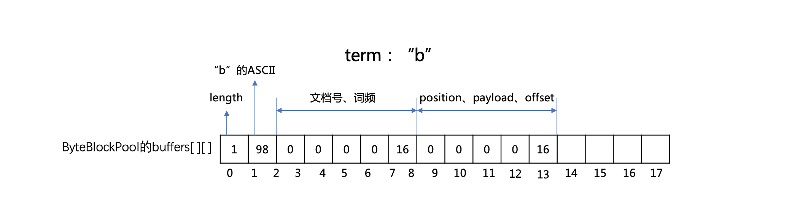
### 扩容
在图6中，对于存储position、payload、offset信息的分片，如果前4个字节都被记录了，那么此时就会遇到哨兵值16，表示我们需要扩容了。
图7：
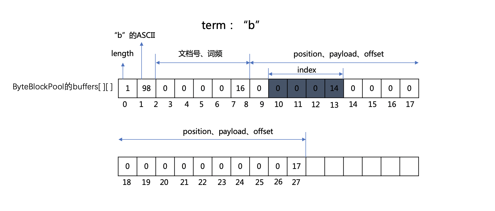
根据分片规则，扩容后获得的新分片大小为14，所以上图中下标值14~27的部分为新的分片。
并且旧分片中下标值10~13这四个字节作为一个索引值，在读取阶段，通过读取该索引值就可以知道下一个分片在ByteBlockPool对象的buffers [ ] [ ]二维数组中的偏移位置。

## 写入过程
### 处理文档0
#### 处理域名“content”
例子中使用的是自定义分词器[PayloadAnalyzer](https://github.com/luxugang/Lucene-7.5.0/blob/master/LuceneDemo/src/main/java/lucene/AnalyzerTest/PayloadAnalyzer.java),所以对于域名“content”来说，我们需要处理 “book”、“is”、"book"共三个term。
##### 处理 “book”
图8：
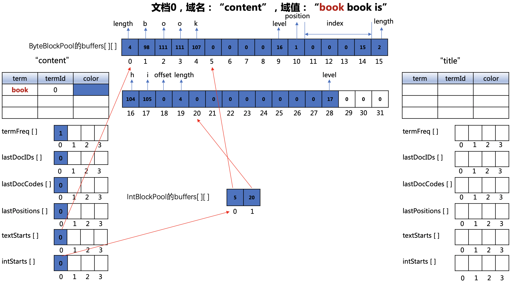

###### ByteBlockPool对象的buffers数组
- 下标值0~4：文档0中第一个"book"的长度以及对应的ASCII
- 下标值10：第一个"book"在文档0中的位置，即0，由于有payload信息，组合存储后，位置值为（0 << 1 | 1）,即1
- 下标值11~14：索引值
- 下标值15~17：payload的长度以及对应的ASCII
- 下标值18~19：文档0中第一个"book"在文档0中的偏移位置以及term的长度
###### IntBlockPool对象的buffers数组
- 下标值0：包含"book"的文档号、词频信息在ByteBlockPool对象的buffers数组写入的起始位置
- 下标值1：下一次遇到"book"时，它的position、payload、offset信息在ByteBlockPool对象的buffers数组写入的起始位置
###### lastPositions[]数组
- lastPositions[]数组下标值为"book"的termId(0)的数组元素更新为0。
###### termFreq[]数组
- termFreq[]数组下标值为"book"的termId(0)的数组元素更新为2。
###### 注意点
- 由于文档0中的所有term没有都处理结束，所以我们还不知道"book"在文档0中的词频，所以上图中并没有记录 文档号、词频信息（组合存储）。

##### 处理“book”
图9：
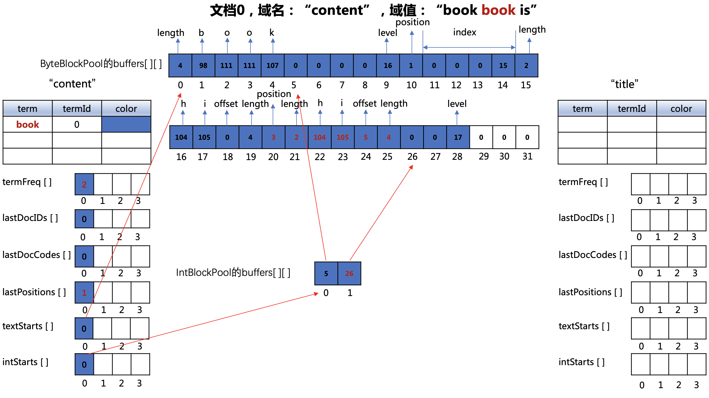
###### ByteBlockPool对象的buffers数组
- 下标值20：第二个"book"在文档0中的位置，根据图8中，上一个"book"的位置是0，所以差值存储就是 (1 - 0) = 1，带有payload，位置信息即为 (1 << 1 | 1)，即3，并且 lastPositions[]数组下标值为当前term的termId(0)的数组元素更新为1。
- 下标值21~23：payload的长度以及对应的ASCII
- 下标值24~25：第二个"book"在文档0中的偏移位置以及term的长度
###### IntBlockPool对象的buffers数组
- 下标值值1：下一次遇到"book"时，它的position、payload、offset信息在ByteBlockPool对象的buffers数组写入的起始位置**(下文不赘述这个数组的更新)**
###### lastPositions[]数组
- lastPositions[]数组下标值为"book"的termId(0)的数组元素更新为1 **(下文不赘述这个数组的更新)**
###### termFreq[]数组
- termFreq[]数组下标值为"book"的termId(0)的数组元素更新为2 **(下文不赘述这个数组的更新)**
##### 处理“is”
图10：
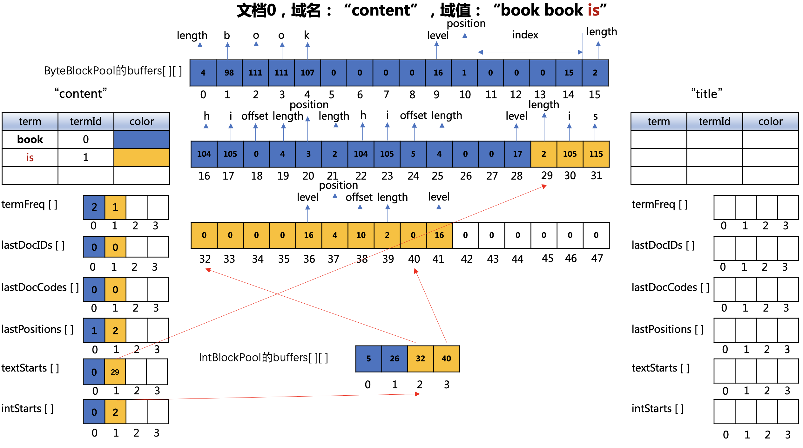
###### ByteBlockPool对象的buffers数组
- 下标值29~31：文档0中的"is"的长度以及对应的ASCII
- 下标值37："is"在文档中的位置，即2，由于没有payload，位置信息即为 (2 << 1 | 0)，即4
- 下标值38~39："is"在文档0中的偏移位置以及term的长度

#### 处理域名“author”
##### 处理“book”
图11：
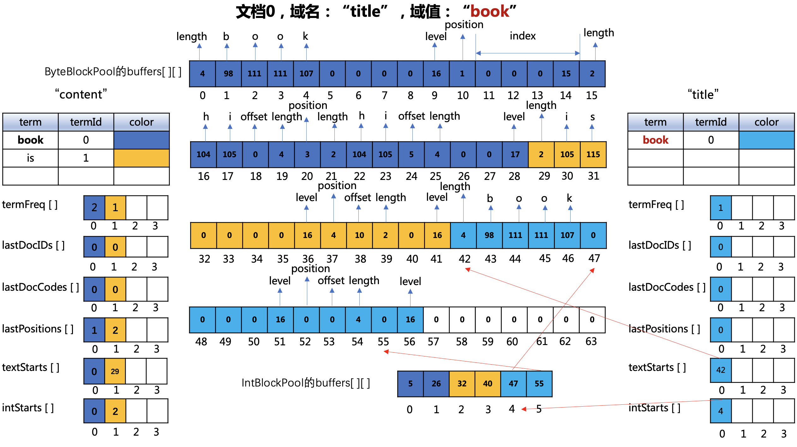
###### ByteBlockPool对象的buffers数组
- 下标值42~46：文档0中的域名"title的"book"的长度以及对应的ASCII
- 下标值52："book"在文档中的位置，即0，由于没有payload，位置信息即为 (0 << 1 | 0)，即4
- 下标值53~54：域名"title的"book"在文档0中的偏移位置以及term的长度
##### 注意点
由于是文档0中的另一个域"title"，所以即使在"content"中我们处理过"book"，在"title"域中属于一个新的term。即域之间的倒排表是独立的，尽管数据都存放在同一个ByteBlockPool对象的buffers数组中

### 处理文档1
#### 处理域名“content”
##### 处理“book”
图12：
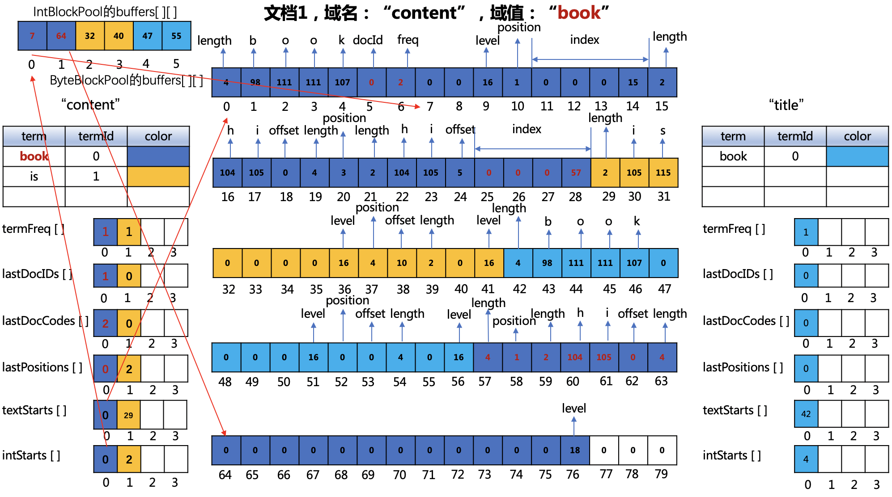

###### ByteBlockPool对象的buffers数组
- 下标值5~6：由于文档0已经处理结束，所以"book"在文档0中的词频也确定了，故可以将"book"在文档0中的文档号跟词频freq写入到倒排表中，由于词频值为2，故不需要组合存储，用两个字节分别存储文档号跟词频。
- 下标值25~28：从图11中我们可以看出只剩下下标值26、27两个字节，无法存储"tem"在当前文档1中的position、payload、offset的信息，故需要扩容，获得的新的分片的范围为下标值57~76的区间，故下标值25~28的4个字节成为一个索引(index)，并且索引值为57。由于在图11中下标值25记录了一个length的值，所以需要把这个值放到新的分片中，即下标值57的位置。
- 下标值58："book"在文档1中的位置，即0，由于有payload信息，组合存储后，位置值为（0 << 1 | 1）,即1
- 下标值59~61：payload的长度以及对应的ASCII
- 下标值62~63："book"在文档1中的偏移位置以及term的长度
###### termFreq[]数组
- termFreq[]数组下标值为"book"的termId(0)的数组元素由图11中的2更新为1，因为这里开始存储"book"在文档1中的词频值了。
###### 注意点
- 从图12中，文档0中"is"跟"title"域中的"book"的文档号跟词频信息还没有写入到倒排表中，那是因为还没有在新的文档中遇到"is"跟"title"中的"book"。

### 文档处理结束
从图12中，文档0中"is"跟"title"域中的"book"的文档号跟词频信息还没有写入到倒排表中，那是因为还没有在新的文档中遇到"is"跟"title"中的"book"。但是这些信息都保存在ParallelPostingsArray类数组中，所以不用写入到倒排表中。


# 结语
本篇文章介绍了如何构建倒排表，逻辑简单易懂，尽管我们只添加了两篇文档，但是倒排表的所有逻辑都已经涉及了。
[点击下载](http://www.amazingkoala.com.cn/attachment/Lucene/Index/%E6%9E%84%E5%BB%BA%E5%80%92%E6%8E%92%E8%A1%A8/%E5%80%92%E6%8E%92%E8%A1%A8.zip)Markdown文件
