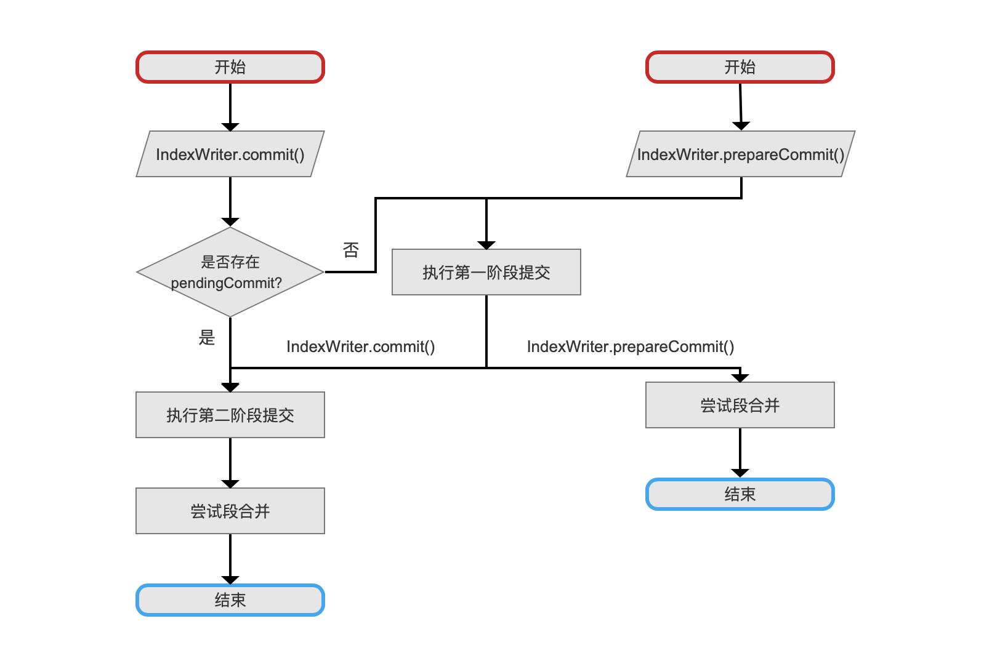
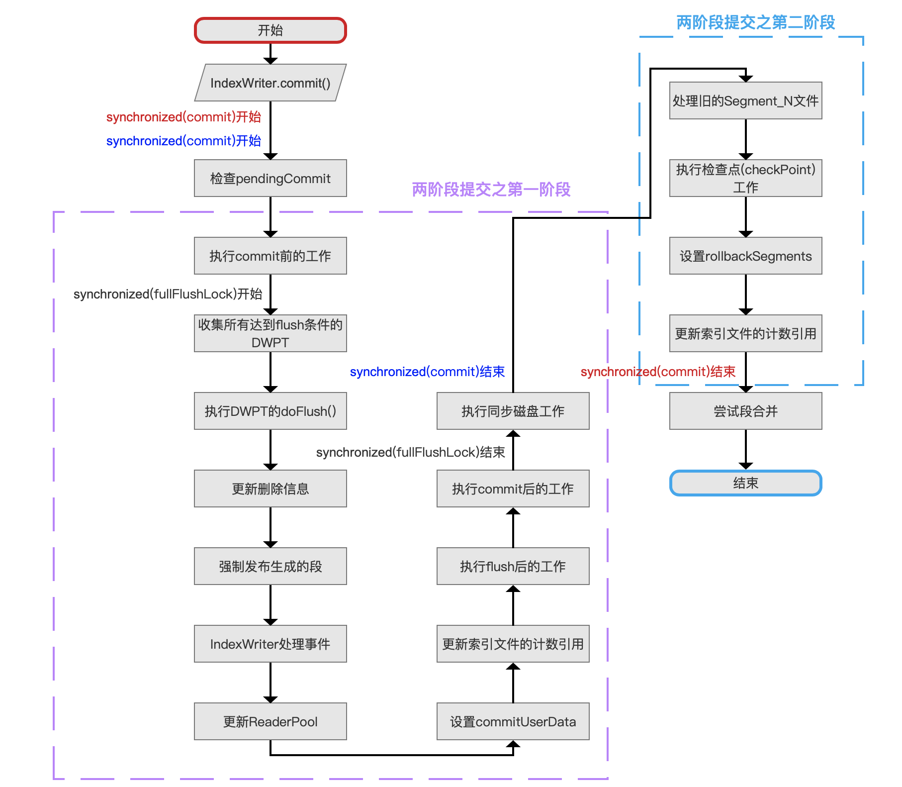
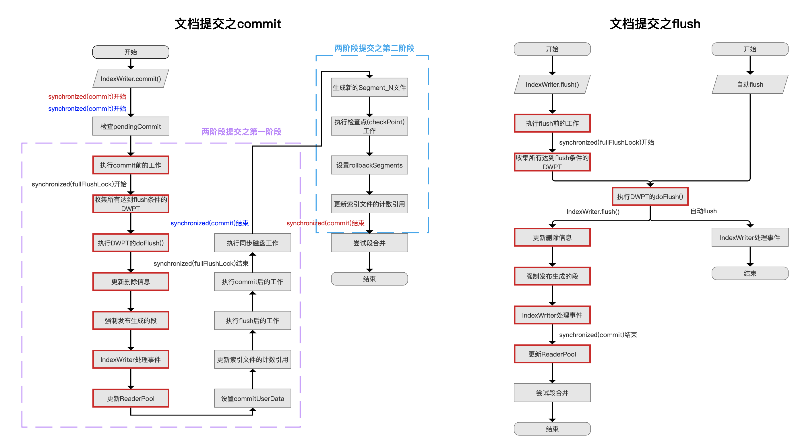
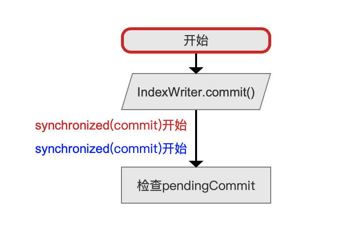
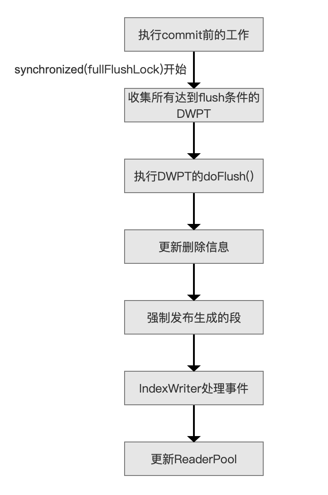
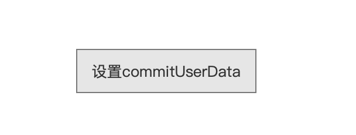
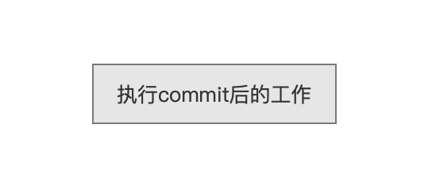
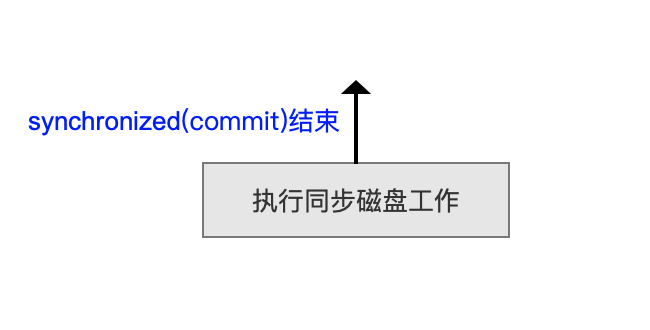

# [文档提交之commit（一）](https://www.amazingkoala.com.cn/Lucene/Index/)

&emsp;&emsp;阅读本文章（**必须**）需要前置知识：[文档提交之flush](https://www.amazingkoala.com.cn/Lucene/Index/2019/0716/74.html)、[文档的增删改](https://www.amazingkoala.com.cn/Lucene/Index/2019/0626/68.html)的系列文章，**下文中出现的未展开介绍的变量说明已经这些文章中介绍**，本文中不赘述。

&emsp;&emsp;Lucene提供了TwoPhaseCommit接口（看这里：https://github.com/LuXugang/Lucene-7.5.0/blob/master/solr-7.5.0/lucene/core/src/java/org/apache/lucene/index/TwoPhaseCommit.java），支持两阶段提交（2-phase commit），在这个接口中提供了3个接口方法：

- prepareCommit()：该方法为**两阶段提交的第一阶段**，在这个阶段，会完成大部分的工作，包括处理新增的文档（Document）、删除的文档、生成所有的索引文件、生成[Segment_N文件](https://www.amazingkoala.com.cn/Lucene/suoyinwenjian/2019/0610/65.html)、保证索引文件持久化到磁盘操作，等等
- commit()：该方法为**两阶段提交的第二阶段**，在这个阶段，处理一些简单的工作，包括删除旧的Segment_N文件（egment_N文件可能有多个，取决于[索引删除策略](https://github.com/LuXugang/Lucene-7.5.0/blob/master/solr-7.5.0/lucene/core/src/java/org/apache/lucene/index/IndexDeletionPolicy.java)，见[Segment_N文件](https://www.amazingkoala.com.cn/Lucene/suoyinwenjian/2019/0610/65.html)）、备份这次提交的内容到rollbackSegments（后面的文章会介绍）中
- rollback()：在执行prepareCommit()后，如果出现错误，可以通过该方法实现回滚到备份rollbackSegments

# 两阶段提交流程图

图1：



&emsp;&emsp;上图中并没有给出rollback()方法的流程图，在介绍完文档提交之commit的系列文章后，会展开介绍。

图1中，用户如果调用一个prepareCommit()方法实现二阶段提交的第一阶段，会生成pendingCommit，然后执行`尝试段合并`流程后退出；用户如果直接调用commit()方法，会先检查是否执行了第一阶段的提交操作，即判断是否存在pendingCommit，如果不存在则先执行`执行第一阶段提交`的流程，随后执行`执行第二阶段提交`交操作，最后执行`尝试段合并`流程后退出。

&emsp;&emsp;接下来我们就IndexWriter.commit()方法来介绍详细的文档提交之commit的过程。

# 文档提交之commit的整体流程图

图2：



[点击]()查看大图

&emsp;&emsp;介绍每一个流程点之前，先给出文档提交之flush的整体流程图，其中红框标注的流程点属于两个流程图相同的部分，这些内容不会赘述，已在[文档提交之flush](https://www.amazingkoala.com.cn/Lucene/Index/2019/0716/74.html)系列文章中介绍。

图3：



[点击]()查看大图

## 检查pendingCommit

图4：



&emsp;&emsp;**pendingCommit是什么**：

- pendingCommit是SegmentInfos类的对象，在SegmentInfos类中最重要的一个信息如下所示，在后面的文章中我们会逐步介绍该类包含的其他信息

```java
public final class SegmentInfos  {
     private List<SegmentCommitInfo> segments;
}
```

- SegmentCommitInfo描述了一个段内的索引信息（见[文档提交之flush（六）](https://www.amazingkoala.com.cn/Lucene/Index/2019/0805/79.html)），在`强制发布生成的段`的流程点生成，同时被保存到SegmentInfos中，SegmentInfos中的信息在后面的流程中会生成[Segment_N](https://www.amazingkoala.com.cn/Lucene/suoyinwenjian/2019/0610/65.html)的索引文件

&emsp;&emsp;当多个线程持有相同的IndexWriter对象引用进行操作时，当前线程执行IndexWriter.commit()时会先检查其他线程或自己本身之前是否生成了pendingCommit对象，如果不存在那么执行`二阶段提交的第一阶段`的操作，否则直接执行`二阶段提交的第二阶段`的操作，即跳过图3中紫色虚线划分的所有流程点，直接执行蓝色虚文件`处理旧的Segment_N文件`流程点。

&emsp;&emsp;在Lucene7.5.0版本中，只允许一个pendingCommit存在，否则会抛出异常，异常内容如下：

```java
    throw new IllegalStateException("prepareCommit was already called with no corresponding call to commit");
```

&emsp;&emsp;上面的异常描述了，当生成一个prepareCommit后，必须有线程执行`二阶段提交的第二阶段`后 才能再次生成一个新的prepareCommit，故使用synchronized(commitLock)来实现同步IndexWriter.prepareCommit()操作，其中commitLock对象没有实际意义，只是用来实现Java对象锁的功能：

```java
    private final Object commitLock = new Object()
```

&emsp;&emsp;**为什么使用两个synchronized(commitLock)同步操作**：

- 红色字体的**synchronized(commitLock)开始**用来同步IndexWriter.commit()操作，对应图3中红色字体的**synchronized(commitLock)结束**

- 蓝色字体的**synchronized(commitLock)开始**用来同步IndexWriter.prepareCommit()操作，对应图3中蓝色字体的**synchronized(commitLock)结束**

## 生成完整的段信息

图5：



&emsp;&emsp;这几个流程点是生成完整的段信息的过程， 即DWPT（见[文档的增删改](https://www.amazingkoala.com.cn/Lucene/Index/2019/0628/69.html)（中））生成对应段的过程（见[文档提交之flush](https://www.amazingkoala.com.cn/Lucene/Index/2019/0716/74.html)系列文章），不赘述。

&emsp;&emsp;在图5中，流程点`执行commit前的工作`跟图3中的`执行flush前的工作`是相同的操作，作者只是为了区分commit跟flush两种不同的操作而对流程点的名称作了区分，Lucene在该流程点提供了钩子函数doBeforeFlush ()，定义如下：

```java
/**
  * A hook for extending classes to execute operations before pending added and
  * deleted documents are flushed to the Directory.
  */
protected void doBeforeFlush() throws IOException {}
```

## 设置commitUserData

图6：



&emsp;&emsp;用户调用prepareCommit()或者commit()方法前通过调用IndexWriter.setLiveCommitData(...)来记录自定义的信息，即commitUserData，比如说记录一些业务信息来描述这次提交操作。

&emsp;&emsp;例如Git操作时，我们可以通过命令git commit -m "add README"来记录这次git提交的messages信息，commitUserData好比是"add README"。

## 更新索引文件的计数引用

&emsp;&emsp;在这个流程点，需要执行两个操作：

- 操作一：**拷贝SegmentInfos对象segmentInfos**，segmentInfos包含了当前索引目录中所有段的信息，由于当前线程获得了对象锁synchronized(commit)跟synchronized(fullFlushLock)，所以在这个时机下能获得一个不会被改变的并且此时的segmentInfos是我们这次commit处理的内容，故执行拷贝操作，获得一份拷贝信息，获得一个新的SegmentInfos对象toCommit，在后面的处理中，我们只对（只能对）toCommit进行处理，当前线程在后续的流程中释放对象锁synchronized(fullFlushLock)之后（见图3中的**synchronized(fullFlushLock)结束**），其他线程就可以通过flush（主动flush或者自动flush，见[文档提交之flush](https://www.amazingkoala.com.cn/Lucene/Index/2019/0716/74.html)）生成新的段，并添加到segmentInfos中，使得在多线程下提高并发性能（**commit跟flush并发执行**）
- 操作二，**增加toCommit对应的索引文件的计数引用**，由于[段合并](https://www.amazingkoala.com.cn/Lucene/Index/2019/0516/59.html)属于并发操作，其他线程执行完合并操作后，合并前的旧段（old segment）对应的索引文件也需要被删除，其删除的机制即`计数引用`，一个段被其他对象有N次引用时，其索引文件对应的计数引用为N，当该段没有被任何对象引用后，那么就可以删除该段对应的索引文件，故增加索引文件计数引用，使得段不会被删除，所以在当前流程中，需要增加toCommit对应的索引文件的计数引用

## 执行flush后的工作

图7：


&emsp;&emsp;该流程在前面的文章已经介绍，在源码中调用[DocumentsWriterFlushControl.finishFullFlush( )](https://github.com/LuXugang/Lucene-7.5.0/blob/master/solr-7.5.0/lucene/core/src/java/org/apache/lucene/index/DocumentsWriterFlushControl.java)的方法，详细的介绍见[文档提交之flush（六）](https://www.amazingkoala.com.cn/Lucene/Index/2019/0805/79.html)文章中的`IndexWriter处理事件`章节的内容。

## 执行commit后的工作

图8：



&emsp;&emsp;Lucene在当前流程点提供一个钩子函数doAfterFlush()方法，用户可以实现自己的业务逻辑，定义如下：

```java
/**
 * A hook for extending classes to execute operations after pending added and
 * deleted documents have been flushed to the Directory but before the change
 * is committed (new segments_N file written).
 */
  protected void doAfterFlush() throws IOException {}
```

## 执行同步磁盘工作

图9：



&emsp;&emsp;图3中红色标注为commit跟flush相同的流程点，在执行完这些流程点之后，索引文件已经写到了磁盘，但由于文件I/O缓冲机制，索引文件的信息（部分或全部）可能暂时被保存在内核缓冲区高速缓存中，并没有持久化到磁盘，当出现类似断电的异常，且磁盘没有备用电源的情况，索引信息可能会丢失。

&emsp;&emsp;为什么使用文件I/O缓冲机制：

- 系统调用在操作磁盘文件时不会直接发起磁盘访问，而是仅仅在用户空间缓冲区与内和缓冲区高速缓存（kernel buffer cache）之间复制数据，在后续的某个时刻，内核会将其缓冲区的数据写入至磁盘，另外如果此时另一进程试图读取该文件的这几个字节，那么内核将自动从缓冲区高速缓存中提供这些数据，而不是从文件中。**使用这个机制使得Lucene的flush()操作在将数据写入缓冲区后能直接返回而不用等待（缓慢的）磁盘操作**
- 对文件I/O缓冲机制感兴趣的同学可以查看书籍 &lt;&lt;**Linux/UNIX系统编程手册（上册）&gt;&gt;第13章，作者：Michael Kerrisk**

&emsp;&emsp;在commit()操作中，执行同步磁盘操作，缓冲数据和与打开文件描述符fd相关的所有元数据都刷新到磁盘，仅在对磁盘设备的传递后，即等待索引文件都被持久化到磁盘后才会返回，故**这是一个相对耗时的操作**。

&emsp;&emsp;另外在执行完流程点`执行同步磁盘工作`后，释放对象锁synchronized(commitLock)，离开IndexWriter.prepareCommit()操作的临界区。

# 结语

&emsp;&emsp;本篇文章介绍了二阶段提交的第一阶段，基于篇幅，剩余内容将在下一篇文章中展开。

[点击](http://www.amazingkoala.com.cn/attachment/Lucene/Index/文档提交/文档提交之commit（一）/文档提交之commit（一）.zip)下载附件


