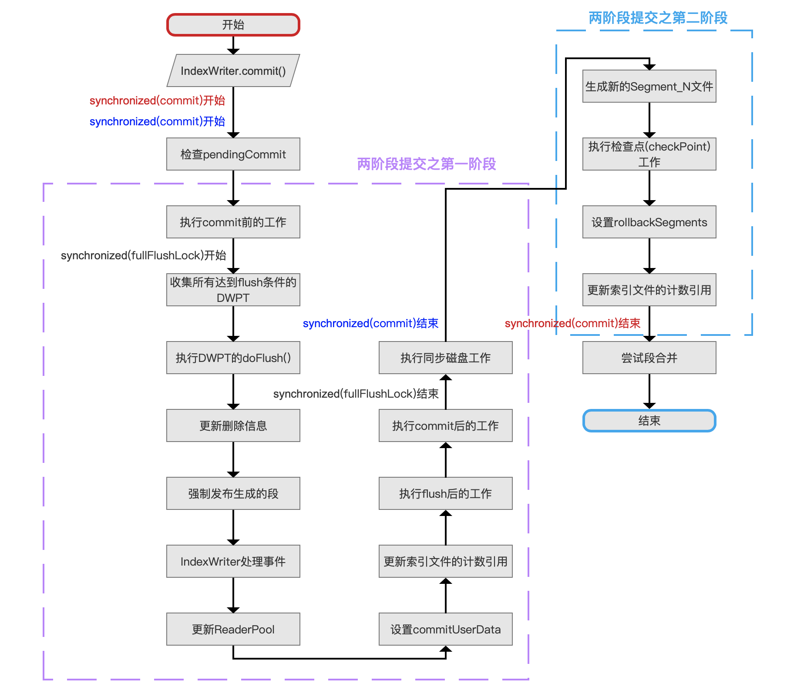
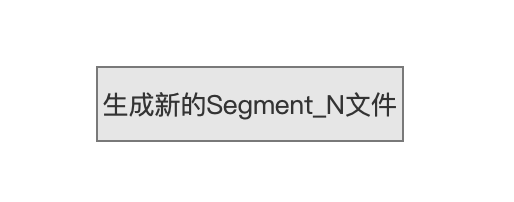
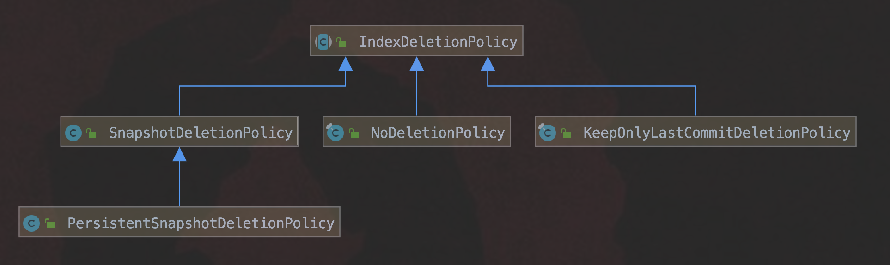
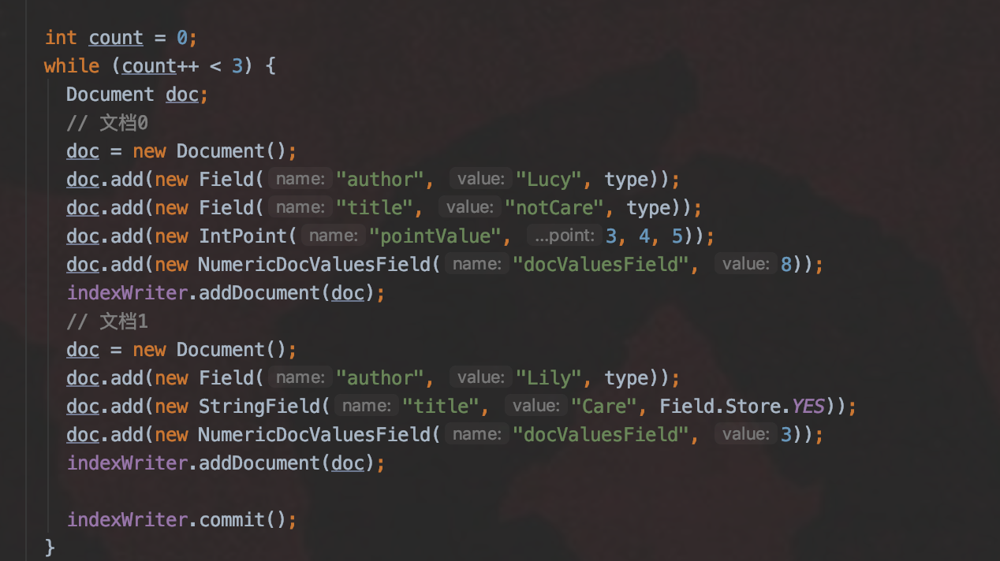
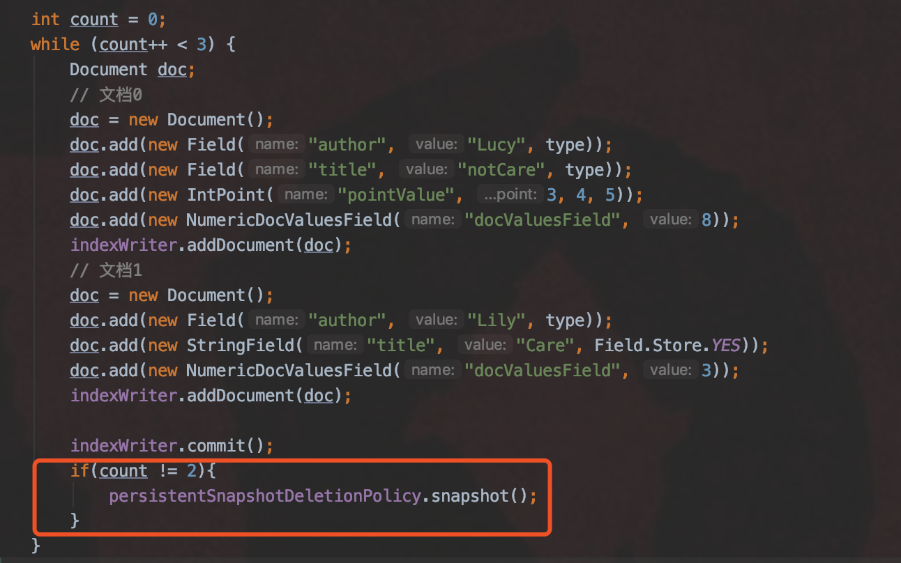
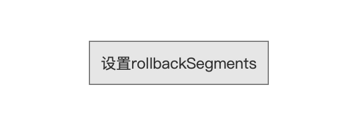

# [文档提交之commit（二）](https://www.amazingkoala.com.cn/Lucene/Index/)

&emsp;&emsp;本篇文章承接[文档提交之commit（一）](https://www.amazingkoala.com.cn/Lucene/Index/2019/0906/91.html)，继续介绍文档提交之commit的剩余流程点。

# 文档提交之commit的整体流程图

图1：



[点击]()查看大图

## 生成新的Segment_N文件

图2：



&emsp;&emsp;在[文档提交之commit（一）](https://www.amazingkoala.com.cn/Lucene/Index/2019/0906/91.html)中，我们介绍了图1的`执行同步磁盘工作`的流程点，在这个流程点中，最重要的一个任务是保证所有的索引文件被持久化到磁盘上，另外还需要生成一个pending_segments_N文件，其中N描述了当前索引目录中索引文件的被提交的最新的一个迭代数（generation），这是一个从数值1开始递增的值，例如我们第一次执行两阶段提交之第一阶段后，会生成pending_segments_1，第二次执行两阶段提交之第一阶段后，会生成pending_segments_2，以此类推，由于图1的两个同步机制，使得N在临界区内递增，所以更新并获得N值的实现很简单：

```java
private long getNextPendingGeneration() {
    // generation == -1 说明是第一次执行两阶段提交之第一阶段
    if (generation == -1) {
        return 1;
    } else {
        return generation+1;
    }
```

&emsp;&emsp;**pending_segments_N文件是什么**：

- pending_segments_N就是[segments_N](https://www.amazingkoala.com.cn/Lucene/suoyinwenjian/2019/0610/65.html)文件，在当前流程点`生成新的Segment_N文件`只是简单的将pending_segments_N重命名为segments_N，最后再次同步磁盘，保证重命名正确被执行

## 执行检查点(checkPoint)工作

&emsp;&emsp;在这个流程中，顺序执行以下的操作：

- 操作一：增加这次提交对应的索引文件的计数引用（计数引用的概念见[文档提交之commit（一）](https://www.amazingkoala.com.cn/Lucene/Index/2019/0906/91.html)）
- 操作二：执行索引删除策略（IndexDeletionPolicy）
- 操作三：减少被删除的提交对应的索引文件的计数引用

### 操作二：执行索引删除策略（IndexDeletionPolicy） 

&emsp;&emsp;为了便于理解，我们先介绍操作二：执行索引删除策略（IndexDeletionPolicy） 。

&emsp;&emsp;IndexDeletionPolicy描述了当新的提交发生后，如何处理旧的提交，下图给出了Lucene7.5.0中核心包core中的IndexDeletionPolicy类的类图：

图3：



#### NoDeletionPolicy

&emsp;&emsp;该策略描述了无论有多少次新的提交，旧的提交都不会被删除，下图展示了执行5次IndexWriter.commit()方法后索引目录中部分文件：

图4：


&emsp;&emsp;使用这种索引删除策略的优点在于，配合segments_N文件和commitUserData（见[文档提交之commit（一）](https://www.amazingkoala.com.cn/Lucene/Index/2019/0906/91.html)）我们可以将索引信息恢复到任意一个提交状态；缺点在于索引目录需要保留大量的索引文件，特别是多线程下执行flush()操作较多的场景下，如果你看过[文档的增删改](https://www.amazingkoala.com.cn/Lucene/Index/2019/0626/68.html)的系列文章，索引文件的数量与DPWT对象的个数成正比。

#### KeepOnlyLastCommitDeletionPolicy

&emsp;&emsp;该策略是Lucene7.5.0中默认的策略，它描述了当有新的提交，则**删除**上一个提交，即索引目录中最多只存在一个segment_N文件。

#### SnapshotDeletionPolicy

&emsp;&emsp;SnapshotDeletionPolicy用来保留提交的快照，它封装了其他的索引删除策略，由于NoDeletionPolicy保留了每一次的提交，所以封装该策略没有什么意义，当封装了KeepOnlyLastCommitDeletionPolicy，那么可以通过**主动调用**[SnapshotDeletionPolicy.snapshot()]([SnapshotDeletionPolicy.java](https://github.com/LuXugang/Lucene-7.5.0/blob/master/solr-7.5.0/lucene/core/src/java/org/apache/lucene/index/SnapshotDeletionPolicy.java))的方法来实现快照功能，使得新的提交产生后，上一个提交能以快照的方式保留在**内存**中，这种策略的缺点在于需要额外一份索引信息大小的内存。

#### PersistentSnapshotDeletionPolicy

&emsp;&emsp;该策略跟SnapshotDeletionPolicy一样提供快照功能，区别在于SnapshotDeletionPolicy的快照信息保留在内存中，而该策略则持久化（persist）到磁盘，并且生成snapshot_N文件，该文件中描述了快照信息，不展开介绍：

图5：


&emsp;&emsp;另外SnapshotDeletionPolicy跟PersistentSnapshotDeletionPolicy都可以设置多个快照，只需要在每次提交后，执行[SnapshotDeletionPolicy.snapshot()]([SnapshotDeletionPolicy.java](https://github.com/LuXugang/Lucene-7.5.0/blob/master/solr-7.5.0/lucene/core/src/java/org/apache/lucene/index/SnapshotDeletionPolicy.java))方法即可。

&emsp;&emsp;使用了封装KeepOnlyLastCommitDeletionPolicy的SnapshotDeletionPolicy或者PersistentSnapshotDeletionPolicy策略，控制了KeepOnlyLastCommitDeletionPolicy处理上一个提交的方式，上文中我们说到，每当一个新的提交产生，根据KeepOnlyLastCommitDeletionPolicy，旧的提交就会删除，即引目录中最多只存在一个segment_N文件文件，通过封装后，在每次执行IndexWriter.commit()后，主动调用了[SnapshotDeletionPolicy.snapshot()]([SnapshotDeletionPolicy.java](https://github.com/LuXugang/Lucene-7.5.0/blob/master/solr-7.5.0/lucene/core/src/java/org/apache/lucene/index/SnapshotDeletionPolicy.java))的方法后，能使得上一个提交不再被删除，**即保留旧的segment_N文件，这既是快照的实现本质**。

##### 例子1

&emsp;&emsp;图6中，我们只使用KeepOnlyLastCommitDeletionPolicy策略，并且执行三次commit()操作：

图6：



&emsp;&emsp;图7为图6中执行了三次commit()操作后索引目录中segment_N文件，由于使用了KeepOnlyLastCommitDeletionPolicy策略，故segment_1、segment_2文件分别被删除，只留下segments_3：

图7：


###### 例子2

&emsp;&emsp;图6中，我们使用了封装KeepOnlyLastCommitDeletionPolicy的PersistentSnapshotDeletionPolicy策略，并且执行三次commit()操作，并且当count == 2时不生成快照，也就是不对segment_2生成快照：

图8：



&emsp;&emsp;图9为图8中执行了三次commit()操作后索引目录中segment_N文件，由于使用了PersistentSnapshotDeletionPolicy策略，故只有segment_2被删除，留下segments_1跟segments_3：

图9：


&emsp;&emsp;通过上面的例子我们可以看出以下的内容：

- 可以选择性的执行快照功能：图8中我们没有对segments_2执行快照功能
- 快照功能的实现方式：通过保留segment_N文件的方式

&emsp;&emsp;另外我们也可以选择性的删除某个或者某些快照，主动调用[SnapshotDeletionPolicy.release(long)]([SnapshotDeletionPolicy.java](https://github.com/LuXugang/Lucene-7.5.0/blob/master/solr-7.5.0/lucene/core/src/java/org/apache/lucene/index/SnapshotDeletionPolicy.java))或者[SnapshotDeletionPolicy.release(IndexCommit)]([SnapshotDeletionPolicy.java](https://github.com/LuXugang/Lucene-7.5.0/blob/master/solr-7.5.0/lucene/core/src/java/org/apache/lucene/index/SnapshotDeletionPolicy.java))的方法，这个就不展开介绍了。

&emsp;&emsp;上述例子的demo看这里：https://github.com/LuXugang/Lucene-7.5.0/tree/master/LuceneDemo/src/main/java/lucene/index/IndexDeletePolicyTest.java。

&emsp;&emsp;最后，对于PersistentSnapshotDeletionPolicy策略，**生成跟删除快照**都有磁盘同步操作（见[文档提交之commit（一）](https://www.amazingkoala.com.cn/Lucene/Index/2019/0906/91.html)关于同步磁盘的介绍），这是需要注意的地方。

## 操作一：增加这次提交对应的索引文件的计数引用

&emsp;&emsp;在操作二中，我们了解到，有些索引删除策略会删除上一个提交，删除提交的过程实质是减少该提交对应的索引文件的计数引用，为了防止本次提交对应的索引文件被误删，所以需要增加这次提交对应的索引文件的计数引用。

&emsp;&emsp;**在[文档提交之commit（一）](https://www.amazingkoala.com.cn/Lucene/Index/2019/0906/91.html)中，我们已经增加了新的提交对应的索引文件的计数引用（图1中，二阶段提交之第一阶段的`更新索引文件的计数引用`），为什么这里还要增加**：

- 二阶段提交之第一阶段的`更新索引文件的计数引用`目的是防止执行段合并的其他线程导致索引文件被删除，操作一中的更新操作对应的是**操作二**中的情况，两次的更新操作目的不一样。

## 操作三：减少被删除的提交对应的索引文件的计数引用

&emsp;&emsp;基于索引删除策略，当旧的提交被删除后，通过减少其对应的索引文件的计数引用来正确删除索引目录中的部分索引文件。

## 设置rollbackSegments

图10：



&emsp;&emsp;这里对本次提交对应的索引信息进行备份，使得可以实现回滚操作，该操作在后面的文章中会介绍，rollbackSegments的定义如下

```java
    private List<SegmentCommitInfo> rollbackSegments; 
```

&emsp;&emsp;该流程将pendingCommit（见[文档提交之commit（一）](https://www.amazingkoala.com.cn/Lucene/Index/2019/0906/91.html)）中最重要的信息备份到rollbackSegments中。

## 更新索引文件的计数引用

图11：


&emsp;&emsp;从图1中的流程中我们知道，本次提交对应的索引文件一共增加了两次计数引用，到此流程点时，我们已经完成了commit的工作，故需要减少本次提交对应的索引文件的计数引用。

&emsp;&emsp;另外释放对象锁，使得其他线程可以执行commit()的操作，至此二阶段提交之第二阶段的流程都已完成。

## 尝试段合并

&emsp;&emsp;每一次索引发生变化，都会尝试判断是否需要执行段的合并操作，其判断条件依据不同的合并策略而有所不同，合并策略的文章可以看这里：[LogMergePolicy](https://www.amazingkoala.com.cn/Lucene/Index/2019/0513/58.html)、[TieredMergePolicy](https://www.amazingkoala.com.cn/Lucene/Index/2019/0516/59.html)。

# 结语

&emsp;&emsp;至此我们介绍完了文档提交之commit的整体流程图，由于最复杂的部分跟flush()操作是一样的，所以相比较[文档提交之flush](https://www.amazingkoala.com.cn/Lucene/Index/)的8篇系列文章，只用2篇文档就搞定了。在下一篇文章中，将会介绍commit()跟flush()的区别，这也是面试官经常会问的内容。

[点击](http://www.amazingkoala.com.cn/attachment/Lucene/Index/文档提交/文档提交之commit（二）/文档提交之commit（二）.zip)下载附件