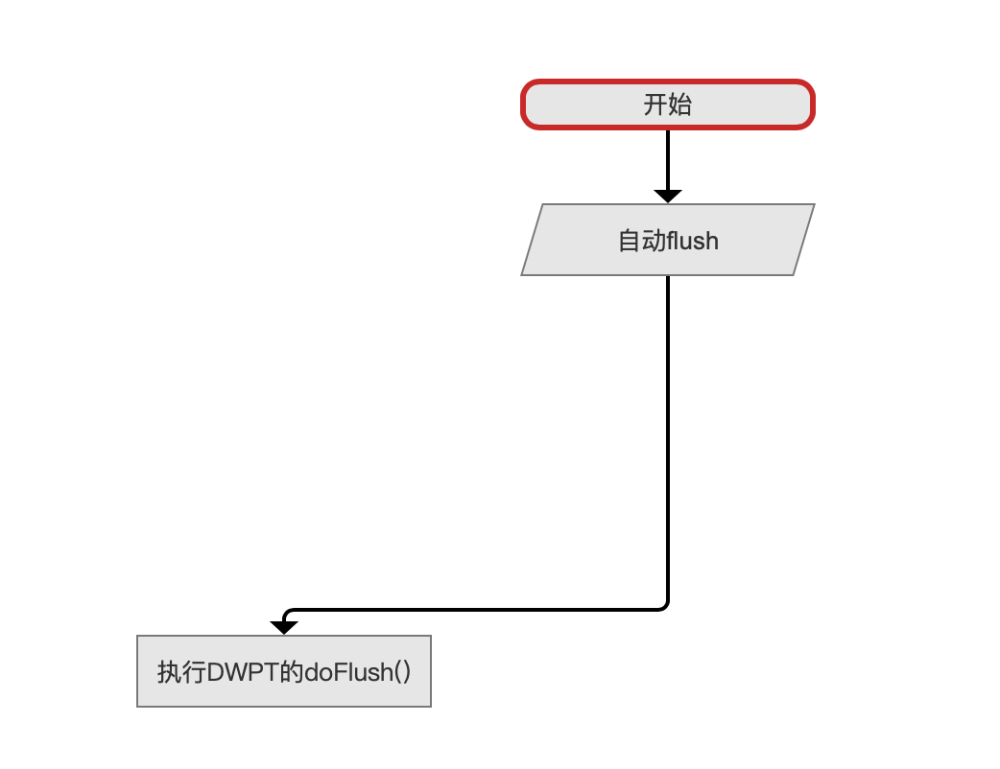
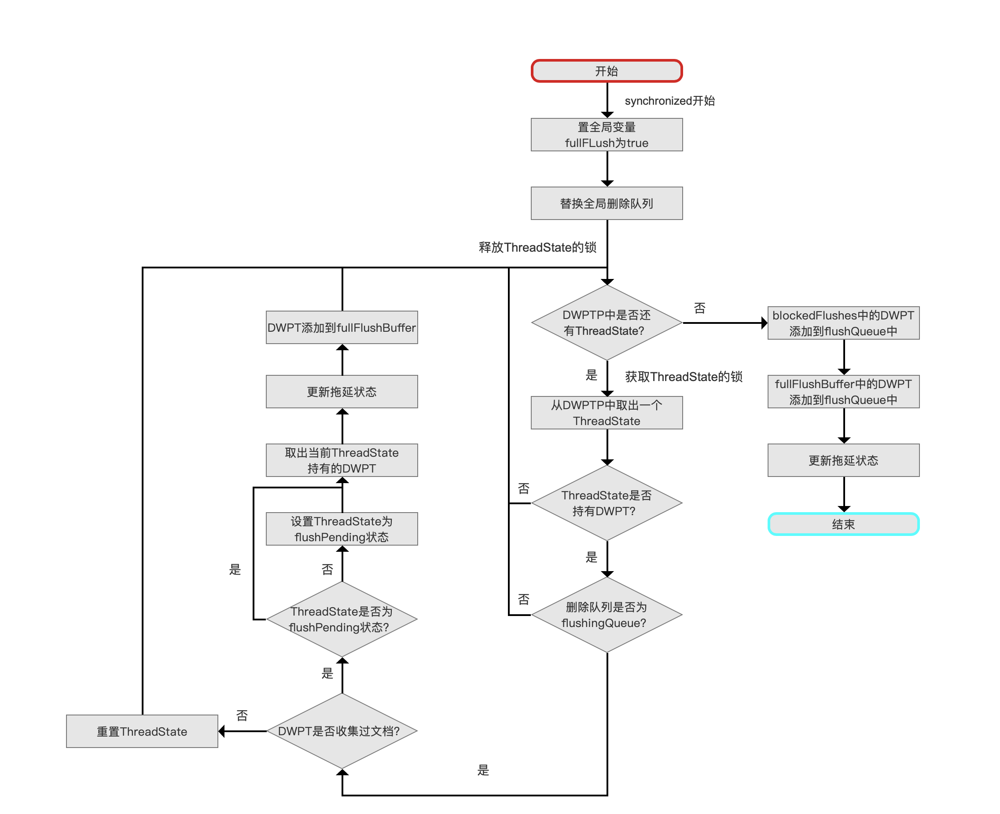
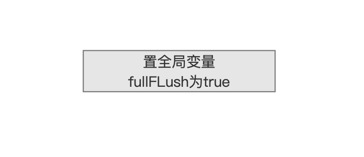
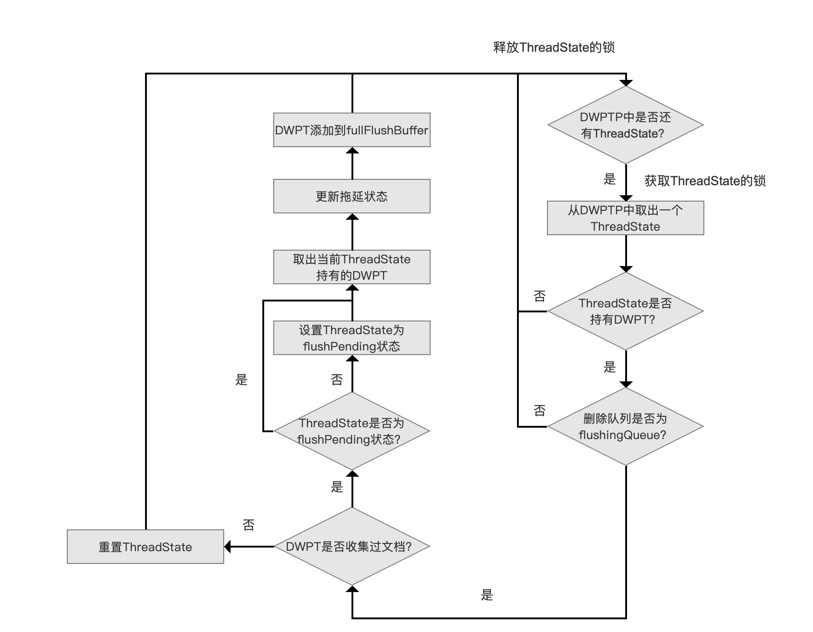
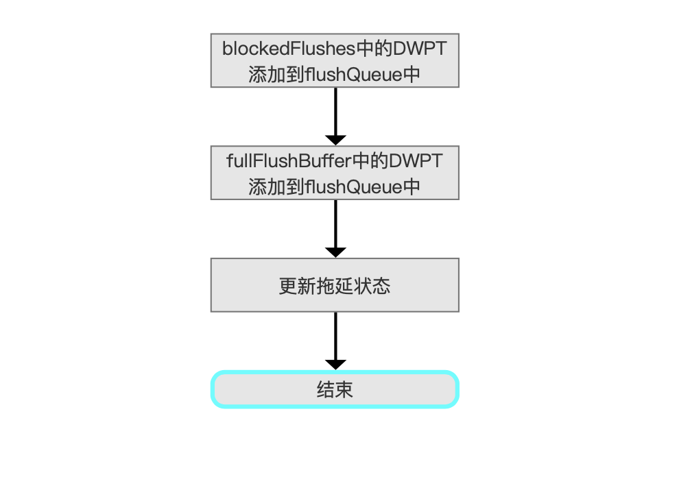

# [文档提交之flush（一）](https://www.amazingkoala.com.cn/Lucene/Index/)

&emsp;&emsp;阅读本文章需要前置知识：[文档的增删改](https://www.amazingkoala.com.cn/Lucene/Index/2019/0626/68.html)的系列文章，**下文中出现的未展开介绍的变量说明已经这些文章中介绍**，本文中不赘述。

&emsp;&emsp;触发flush的方式可以分为主动flush跟自动flush：

- 主动flush：触发该方式的场景很多，本篇文章只介绍由IndexWriter.flush()方法触发的flush。其他的触发flush的场景包括执行段合并的操作IndexWriter.forceMerge(int)、Facet中IndexWriter.addIndexes(Directory)、IndexWriter.shutDown( )、IndexWriter.forceMergeDeletes( )等等
- 自动flush：在[文档的增删改](https://www.amazingkoala.com.cn/Lucene/Index/2019/0626/68.html)的系列文章中，我们介绍了文档的增删改操作的具体流程，并且知道当满足某些条件后触发自动flush

&emsp;&emsp;无论哪种方式触发flush，目标都是将内存中新生成的索引信息写入到[Directory](https://www.amazingkoala.com.cn/Lucene/Store/2019/0613/66.html)中。

# 预备知识

## updateStallState

&emsp;&emsp;更新拖延状态updateStallState实际更新的是写入的健康度（indexing healthiness），由于添加/更新文档跟执行主动flush是并行操作，故可能会存在添加/更新的速度快于flush的情况，使得内存中堆积索引信息，那么很容易出现OOM的错误，所以某些操作后需要调用updateStallState方法来更新当前写入的健康度。

&emsp;&emsp;例如添加/更新文档的操作会降低健康度，当达到阈值时，会阻塞这些执行添加/更新操作的线程；flush操作会提高健康度，当执行完flush，如果健康度恢复到小于阈值，那么唤醒那些被阻塞的线程，由于阈值的判断公式中涉及了两个变量activeBytes跟flushBytes，故当这两个变量发生变化时就需要调用updateStallState。

&emsp;&emsp;阈值判断公式以及线程阻塞的方式已在[文档的增删改（下）（part 1）](https://www.amazingkoala.com.cn/Lucene/Index/2019/0701/70.html)中介绍，不赘述。

# 文档提交之flush的流程图

图1：


[点击]()查看大图

## 自动flush

图2：



&emsp;&emsp;在文章[文档的增删改（下）（part 3）](https://www.amazingkoala.com.cn/Lucene/Index/2019/0709/72.html)中，介绍了在自动flush，执行DWPT的doFlush( )的条件：

- maxBufferedDocs：当某一个DWPT收集的文档号达到maxBufferedDocs，`该DWPT`会执行doFlush( )
- ramBufferSizeMB：当内存中activeBytes与deleteRamByteUsed的和值达到ramBufferSizeMB，那么从DWPTP中找到一个持有DWPT，并且该DWPT收集的索引信息量`最大`的ThreadState，将其置为flushPending，并且ThreadState持有的DWPT执行doFlush( )

&emsp;&emsp;上面的两种情形可以看出，无论是哪种方式触发的自动flush，每次只会有`一个DWPT`执行doFlush( )，这是跟主动flush其中一个不同点，在下文中我们会了解到，触发了主动flush以后，所有收集了索引信息的DWPT都会被执行doFlush( )，各自生成一个段。

&emsp;&emsp;自动flush中的 `执行DWPT的doFlush()`、`IndexWriter处理事件`这两个流程点跟主动flush中的有相同的逻辑，故下文中只介绍主动flush的流程点

## 执行flush前的工作

图3：


&emsp;&emsp;在执行主动flush前，Lucene提供了一个钩子方法（hook method），使用者可以自定义一些执行flush前的信息，继承IndexWriter类就可以实现该方法。

&emsp;&emsp;唯一需要注意的是该方法不在flush的临界区（下文会介绍）内执行，钩子方法的定义如下：

```java
    protected void doBeforeFlush() throws IOException {}
```

## 收集所有达到flush条件的DWPT

图4：


&emsp;&emsp;该流程点展开后的流程图如下：

图5：



[点击]()查看大图

### 同步

&emsp;&emsp;多线程下可能存在多个线程同时调用IndexWriter.flush( )的方法，通过fullFlushLock对象实现同步（临界区）。

&emsp;&emsp;fullFlushLock的定义如下：

```java
    private final Object fullFlushLock = new Object();
```

&emsp;&emsp;多线程下需要同步执行主动flush( )，通过抢占该对象，利用对象锁实现同步：

```java
    synchronized (fullFlushLock) {
        ... ... 
    }
```

### 置全局变量fullFLush为true

图6：



&emsp;&emsp;在临界区内就可以置fullFLush为true，表示当前线程正在执行主动flush操作，fullFLush的作用范围包括正在执行添加/更新、删除的其他线程，该值在[文档的增删改](https://www.amazingkoala.com.cn/Lucene/Index/2019/0626/68.html)的系列文章中反复被提及，即触发全局flush。

### 替换全局删除队列

图7：


&emsp;&emsp;在[文档的增删改（下）（part 2）](https://www.amazingkoala.com.cn/Lucene/Index/2019/0704/71.html)我们已经介绍了删除队列deleteQueue的概念及其用途，它用来存储所有的删除信息，而在主动flush中，它还有一个额外的功能：定义flush的作用域。

&emsp;&emsp;添加/更新文档跟执行主动flush是并行操作，当某个线程执行主动flush后，随后其他线程获得的新生成的DWPT 不能在这次的flush作用范围内，又因为DWPT的构造函数的其中一个参数就是deleteQueue，故可通过判断DWPT对象中持有的deleteQueue对象来判断它是否在此次的flush的作用范围内。

&emsp;&emsp;故当某个线程执行了主动flush后，保存当前的全局变量deleteQueue为flushingQueue，然后生成一个新的删除队列newQueue更新为全局变量deleteQueue，其他线程新生成的DWPT则会使用新的deleteQueue，所以任意时刻最多只能存在两个deleteQueue，一个是正在主动flush使用的用于区分flush作用域的flushingQueue，另一个则是下一次flush需要用到的newQueue。

### 从DWPTP中找出满足flush条件的DWPT

图8：



&emsp;&emsp;上图中虽然流程点很多，但目的就是每次从DWPTP中找出**同时**满足以下两个条件的DWPT，并且添加到fullFlushBuffer中（flushQueue、fullFlushBuffer、blockedFlushes、flushingWriters的概念已在[文档的增删改（下）（part 3）](https://www.amazingkoala.com.cn/Lucene/Index/2019/0709/72.html)中介绍）：

- 持有flushingQueue：上文中我们介绍了持有flushingQueue对象的DWPT都在这次的flush作用范围内，如果不持有，说明DWPT是在其他线程在当前线程主动flush之后生成的
- numDocsInRAM > 0：在[文档的增删改（下）（part 2）](https://www.amazingkoala.com.cn/Lucene/Index/2019/0704/71.html)介绍了numDocsInRAM的概念，numDocsInRAM的个数描述了DPWT处理的文档数，故收集（处理）过文档的DWPT都在这次的flush作用范围内，如果DWPT对应的ThreadState不是flushPending状态，那么设置其状态，如果没有收集过文档，那么重置ThreadState

#### 取出当前ThreadState持有的DWPT做了些什么工作

&emsp;&emsp;该操作需要顺序执行以下的工作：

- 获得bytes：DWPT收集的所有文档对应的索引总量
- 获得DWPT：没什么好说的
- 重置ThreadState：重置后的ThreadState等待新的添加/更新任务
- 更新flushWriters：将DWPT作为key，bytes作为value添加到flushWriters中

#### 设置ThreadState为flushPending状态

&emsp;&emsp;设置状态的过程就实际是更新flushBytes和activeBytes，每一个DWPT达到flush条件前，其收集的文档对应的索引量会被添加到activeBytes，当DWPT达到条件后或者其对应的ThreadState被强制置为flushPending后（主动flush），那么需要从activeBytes扣除索引量，并且把索引量添加到flushBytes，flushBytes和activeBytes的值描述了当前内存索引的占用量，同时也可以用来反映索引堆积情况（健康度）（见上文中updateStallState的介绍）。

#### 更新拖延状态

&emsp;&emsp;由于可能有`设置ThreadState为flushPending状态`的流程，所以需要调用updateStallState方法，调整当前写入的健康度，上文中已经介绍，不赘述。

#### 为什么从DWPTP中取出一个ThreadState后，需要获得ThreadState的锁

&emsp;&emsp;在[文档的增删改（中）](https://www.amazingkoala.com.cn/Lucene/Index/2019/0628/69.html)的文章中，我们介绍了DWPTP中通过一个**freeList**的链表来维护完成了添加/更新操作后的ThreadState，同时还有一个threadStates的链表，他记录了所有的ThreadState，即`正在`执行添加/更新操作（active threadState）以及`完成`添加/更新任务的ThreadState（inactive threadState，freeList中的ThreadState）。threadStates链表中的个数只会增加（执行添加/更新的任务如果没能从freeList中得到ThreadState对象则新生成一个）不会减少，不过总的ThreadState对象的个数（active threadState和inactive threadState的总个数）不会大于持有相同IndexWriter对象的线程的线程总数。

&emsp;&emsp;由于添加/更新文档跟执行主动flush是并行操作，可能该active threadState中的DWPT在这一次flush的作用范围内，那么当前执行主动flush的线程就可以通过ThreadState的锁等待其他线程完成添加/更新文档的任务，最后结合遍历threadStates链表，就可以收集到满足这次flush条件的所有DWPT（不包括blockedFlushes中的DWPT，下文会介绍）

&emsp;&emsp;从这个逻辑可以看出即使是多线程执行添加/更新操作，还是可能因为某个线程执行主动flush会出现同步等待的情况。

## 将blockedFlushes、fullFlushBuffer中的DWPT添加到flushQueue中

图9：



&emsp;&emsp;blockedFlushes用来存放优先执行doFLush( )的DWPT，在[文档的增删改（下）（part 3）](https://www.amazingkoala.com.cn/Lucene/Index/)文章中介绍了为什么有些DWPT需要优先执行doFLush( )，而在这里文章里面我们介绍了为什么需要额外的blockedFlushes对象来存放该DWPT，原因就是添加/更新跟主动flush是同步操作，我们必须通过遍历存放所有ThreadState的threadStates链表才能找到所有满足flush要求的DWPT，如果不使用blockedFlushes，我们需要从这些DWPT挑选出一个优先执行doFlush( )的DWPT，相比较之下，使用blockedFlushes更简单高效。

&emsp;&emsp;将blockedFlushes跟fullFlushBuffer中的DWPT都添加到flushQueue中之后，那么`收集所有达到flush条件的DWPT`的流程就完成了。

# 结语

&emsp;&emsp;由于篇幅原因，将在后面的文章中继续介绍文档提交之flush的其他流程。

[点击下载](http://www.amazingkoala.com.cn/attachment/Lucene/Index/文档提交/文档提交之flush（一）/文档提交之flush（一）.zip)附件


