# [文档提交之flush（七）](https://www.amazingkoala.com.cn/Lucene/Index/)（Lucene 7.5.0）

&emsp;&emsp;本文承接[文档提交之flush（六）](https://www.amazingkoala.com.cn/Lucene/Index/2019/0805/79.html)，继续依次介绍每一个流程点。


# 文档提交之flush的整体流程图

图1：


# 预备知识

## Set&lt;FrozenBufferedUpdates&gt; update

&emsp;&emsp;update中存放的是FrozenBufferedUpdates的集合，在[文档提交之flush（六）](https://www.amazingkoala.com.cn/Lucene/Index/2019/0805/79.html)中FrozenBufferedUpdates获得nextGen的值之后，它会被添加到update容器中，在FrozenBufferedUpdates中的删除信息作用到段之后，从update中移除。

# IndexWriter处理事件

&emsp;&emsp;在[文档提交之flush（六）](https://www.amazingkoala.com.cn/Lucene/Index/2019/0805/79.html)中我们介绍了`IndexWriter处理事件`流程中的几种事件类型，下面仅介绍`发布生成的段中的处理删除信息事件`。

## 处理删除信息

&emsp;&emsp;根据作用（apply）的目标段，处理删除信息划分为两种处理方式：

- 全局FrozenBufferedUpdates：根据全局FrozenBufferedUpdates内的nextGen（见[文档提交之flush（六）](https://www.amazingkoala.com.cn/Lucene/Index/2019/0805/79.html)）值，其删除信息将要作用到所有比该nextGen值小的段
- 段内FrozenBufferedUpdates：在[文档提交之flush（三）](https://www.amazingkoala.com.cn/Lucene/Index/2019/0725/76.html)中我们提到，在生成索引文件的过程中，我们只处理了部分满足删除信息，即只处理了满足删除信息TermArrayNode、TermNode（见[文档的增删改（下）（part 2）](https://www.amazingkoala.com.cn/Lucene/Index/2019/0704/71.html)）的段内部分文档，而如果段内FrozenBufferedUpdates还存在删除信息QueryArrayNode、DocValuesUpdatesNode，那么在当前流程中需要找出所有剩余的满足删除的文档

## 处理删除信息的流程图

图2：

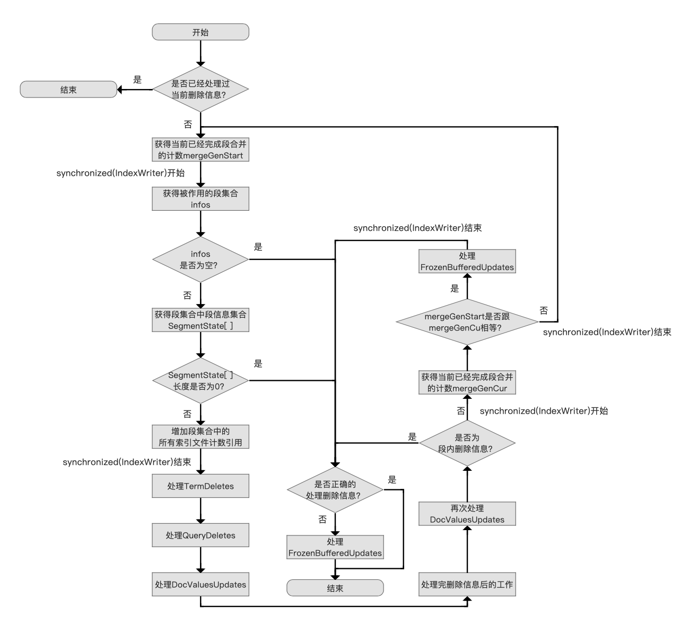

[点击]()查看大图

&emsp;&emsp;该流程在以下三种情况下会被调用：

- 线程执行eventQueue中的`发布生成的段中的处理删除信息事件`
- 线程执行段合并之前的初始化操作（[IndexWriter.mergeInit(MergePolicy.OneMerge)](https://github.com/LuXugang/Lucene-7.5.0/blob/master/solr-7.5.0/lucene/core/src/java/org/apache/lucene/index/IndexWriter.java)方法）
- 执行主动flush的线程等待其他线程执行完所有的`发布生成的段中的处理删除信息事件`（下文中会介绍）

&emsp;&emsp;上述的三种情况会发生并发执行同一个FrozenBufferedUpdates的作用（apply）删除信息工作。

### 是否已经处理过当前删除信息

图3：

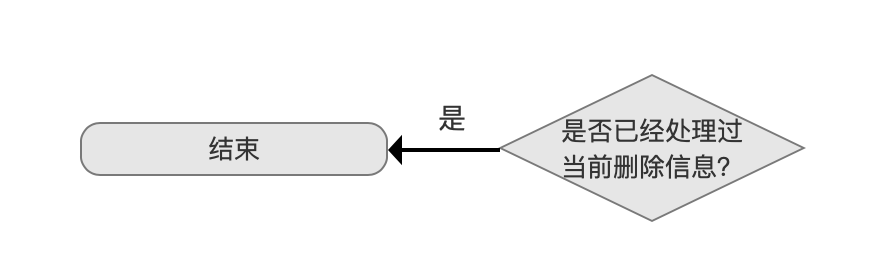

&emsp;&emsp;如上文中介绍，多线程可能同时执行同一个FrozenBufferedUpdates的作用（apply）删除信息的工作，即图2的流程，但只允许一个线程执行，否则会重复的处理删除信息，其他线程会被阻塞直到获得锁的线程执行完图2的流程。

&emsp;&emsp;**通过什么方式判断其他线程已经处理过当前删除信息**：

- 初始化一个CountDownLatch，如下所示：

```java
    public final CountDownLatch applied = new CountDownLatch(1);
```

- 当线程执行完成图2的流程，会将计数置为0，其他线程进入图2的流程后如果当前计数为0则直接退出

### 获得当前已经完成段合并的计数mergeGenStart

图4：

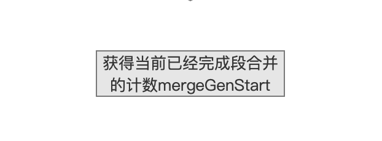

&emsp;&emsp;执行段合并的线程在执行完一次段合并之后，会递增一个计数，即mergeGenStart，该值会在后面的流程介绍，这里只要知道获得mergeGenStart所在的流程点位置。

### 获得被作用的段集合infos

图5：

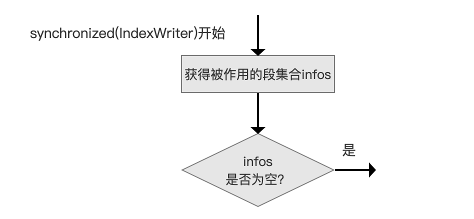

&emsp;&emsp;在[文档提交之flush（六）](https://www.amazingkoala.com.cn/Lucene/Index/2019/0805/79.html)中我们了解到，描述新生成的段以及旧段的索引信息SegmentCommitInfo都存放在IndexWriter的全局变量SegmentInfos中，此流程从SegmentInfos找到那些将要被作用删除信息的段的集合，根据当前处理的FrozenBufferedUpdates是全局还是段内，获取的方式有点区别：

- 全局FrozenBufferedUpdates：取出SegmentInfos中所有的SegmentCommitInfo
- 段内FrozenBufferedUpdates：只取出段对应的SegmentCommitInfo

&emsp;&emsp;infos为空的后执行的流程在下文介绍。

&emsp;&emsp;**为什么这里需要通过IndexWriter对象实现同步**：

- 由于其他线程可能正在执行段的合并，有可能会使得一些SegmentCommitInfo被合并掉（merge away），在这个临界区内我们需要保证所有的SegmentCommitInfo暂时不允许被修改（change），直到我们获得这些SegmentCommitInfo包含的索引信息，之后就可以离开临界区了。在后面的流程中我们会知道，当离开临界区之后，可能某些SegmentCommitInfo马上发生了更改（比如其他线程执行了段合并），那么我们会重新去获取索引目录中最新的段集合

### 获取infos中所有SegmentCommitInfo的信息

图6：

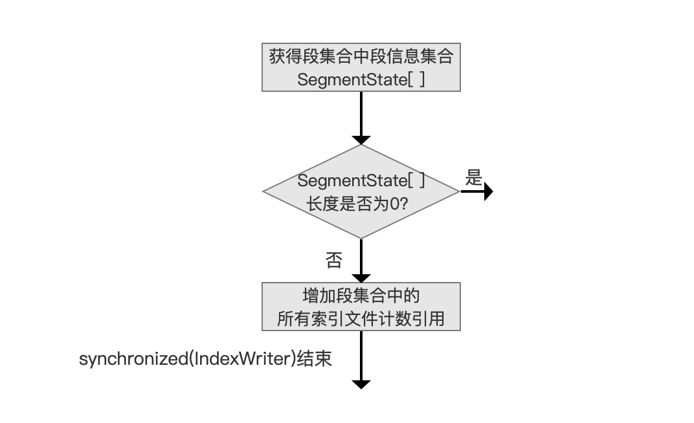

&emsp;&emsp;获取的信息被保存到SegmentState[ ]数组中，在介绍数组元素包含的信息前，得先说明只有满足下列要求的SegmentCommitInfo才会将其信息保存到SegmentState[ ]数组中：

```java
    bufferedDeletesGen <= delGen && alreadySeenSegments.contains(SegmentCommitInfo) == false
```

- bufferedDeletesGen：该值描述的是SegmentCommitInfo的delGen，delGen的值即nextGen，只是换了个名字而已

- delGen：delGen即当前FrozenBufferedUpdates的nextGen

&emsp;&emsp;首先保证bufferedDeletesGen <= delGen，上文中我们提到的，根据全局FrozenBufferedUpdates内的nextGen（见[文档提交之flush（六）](https://www.amazingkoala.com.cn/Lucene/Index/2019/0805/79.html)）值，即delGen，其删除信息将要作用到所有比该nextGen（delGen）值小的段，其中`等号"="`考虑是段内的FrozenBufferedUpdates的delGen跟此段的delGen是相等的情况。

- alreadySeenSegments：这个变量在下文会介绍，因为得结合下文中的内容，所以稍安勿躁

&emsp;&emsp;再满足了上面的条件之后，就可以获取infos中所有满足条件的SegmentCommitInfo的信息了。SegmentState[ ]数组中的数组元素至少（跟本篇文章相关的）包括了下面的信息：

- SegmentReader：该值不具体展开介绍，这里我们只需要知道它描述了段中的索引信息
- ReadersAndUpdates：在本篇文章中我们只需要知道该类中有一个变量**PendingDeletes**，它用来记录段中被删除的文档号集合

&emsp;&emsp;**为什么要增加段集合中的所有索引文件计数引用**：

- 索引目录中一个段对应的所有索引文件，在生成[复合索引文件](https://www.amazingkoala.com.cn/Lucene/suoyinwenjian/2019/0710/73.html)时，非复合索引文件会被删除，除了这个场景，比如在执行了段合并后，合并前的旧段对应的索引文件也需要被删除，其删除的机制即`计数引用`，一个段被其他对象有N次引用时，其索引文件对应的计数引用为N，当该段没有被任何对象引用后，那么就可以删除该段对应的索引文件
- 在当前的流程点我们需要引用段，而此时有可能其他线程正在合并此段，为了防止合并后，段的引用计数为0，即其索引文件的引用计数为0，我们这里需要增加计数引用，防止索引文件被删除

### 处理删除信息

图7：

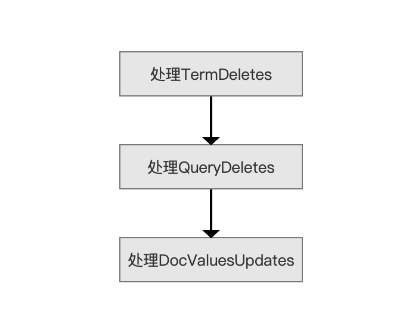

&emsp;&emsp;图7中，处理TermDeletes即处理删除信息TermArrayNode、TermNode；处理QueryDeletes即处理删除信息QueryArrayNode；处理DocValuesUpdates即处理删除信息DocValuesUpdatesNode。其删除信息的介绍看[文档的增删改（下）（part 2）](https://www.amazingkoala.com.cn/Lucene/Index/2019/0704/71.html)。

&emsp;&emsp;上文中我们获得了SegmentReader，该值使得我们能获得段中的索引信息，包括文档的信息：

- 处理TermDeletes：该处理逻辑跟Lucene查询阶段，查找一个Term对应所有文档的逻辑是一样的，在这里我们暂时不介绍，在介绍Lucene的查询时会详细展开
- 处理QueryDeletes：该处理逻辑跟Lucene查询阶段，通过一个Query查找出所有文档的逻辑是一样的，在这里我们暂时不介绍，在介绍Lucene的查询时会详细展开
- 处理DocValuesUpdates：该处理在后面介绍软删除的文章会展开介绍

&emsp;&emsp;尽管我们没有对上述几个处理逻辑进行展开介绍，但这三个流程最终的目的就是找出满足删除要求的文档号，通过[ReaderPool](https://www.amazingkoala.com.cn/Lucene/Index/2020/1208/183.html)对象暂存TermDeletes、QueryDeletes生成的删除信息以及DocValuesUpdates生成的更新信息。最后在图1的流程点`更新ReaderPool`中将删除信息以及更新信息生成索引文件。

&emsp;&emsp;如果图2中处理的是段内FrozenBufferedUpdates，那么是不用处理`处理TermDeletes`的，因为删除信息TermArrayNode、TermNode在生成索引文件[.tim、.tip](https://www.amazingkoala.com.cn/Lucene/suoyinwenjian/2019/0401/43.html)、[.doc](https://www.amazingkoala.com.cn/Lucene/suoyinwenjian/2019/0324/42.html)、[.pos、.pay](https://www.amazingkoala.com.cn/Lucene/suoyinwenjian/2019/0324/41.html)阶段就被处理了（见[文档提交之flush（三）](https://www.amazingkoala.com.cn/Lucene/Index/2019/0725/76.html)）。

### 处理完删除信息后的工作

图8：

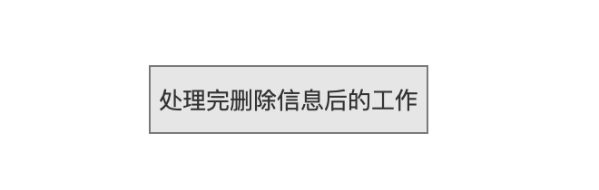

&emsp;&emsp;在处理完删除信息后，我们需要以下的工作：

- 减少段集合中的所有索引文件计数引用：我们不再需要引用段，故减少段对应的索引文件的计数引用，如果计数值为0，那么删除这些索引文件，同时说明该段被合并了
- 判断是否至少有一个段发生了变化：`变化`描述的是在上面的流程中，段中的一个或多个文档被标记为删除，那么我们需要另IndexWriter中的一个全局变量maybeMerge为true，maybeMerge描述的是需要进行尝试段合并操作，在执行完主动flush后，会尝试进行段合并，段的合并策略以及合并计划可以看[LogMergePolicy](https://www.amazingkoala.com.cn/Lucene/Index/2019/0513/58.html)、[TieredMergePolicy](https://www.amazingkoala.com.cn/Lucene/Index/2019/0516/59.html)、[MergeScheduler](https://www.amazingkoala.com.cn/Lucene/Index/2019/0519/60.html)
- 判断是否有些段中的文档都被标记为删除：在上面的流程中，有可能一个或多个段中所有的文档都被值为删除，那么我们需要丢弃这些段

### 再次处理DocValuesUpdates

图9：

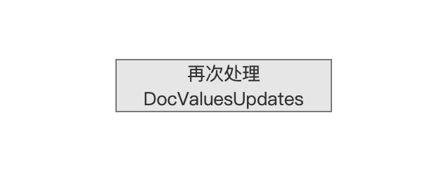

&emsp;&emsp;该流程会在后面介绍软删除的文章中展开介绍，这里只要知道其流程所在位置即可。

### 是否为段内删除信息？

图10：

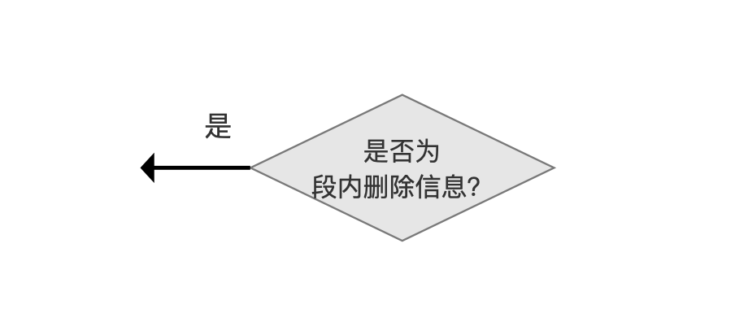

&emsp;&emsp;图2如果到达此流程点，并且段内FrozenBufferedUpdates的流程，那么我们已经成功的处理了段内的删除信息，故可以直接进入其下一个流程，该流程点在下文会介绍。

### 没有并发的段合并操作

图11：

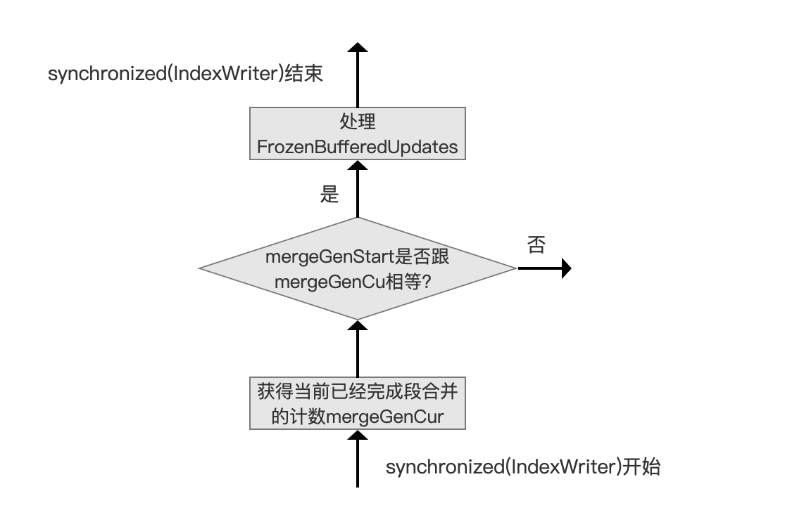

&emsp;&emsp;在上文的`获得当前已经完成段合并的计数mergeGenStart`中，我们获得了mergeGenStart，并且在当前流程点再次去获得段合并的计数mergeGenCur，如果mergeGenCur 与 mergeGenStart相等，说明图2的流程从开始到现在这段期间，*没有其他线程执行段合并* 或者 **某些段合并操作还未结束**，否则我们需要重新执行图2的流程，原因是索引目录中的段已经发生了变化，我们需要重新将全局的FrozenBufferedUpdates作用到索引目录中的段。

&emsp;&emsp;从上面的流程可以看出，这种处理逻辑即乐观锁的一种实现方式。

&emsp;&emsp;由于执行段合并的段集合只是索引目录中的部分段，所以有些段并没有发生变化，并且这些段已经被作用（apply）了删除信息，故可以存放到上文中提到的alreadySeenSegments中，使得在下一轮的图2流程中，不会重复作用删除信息。

### 处理FrozenBufferedUpdates

图12：

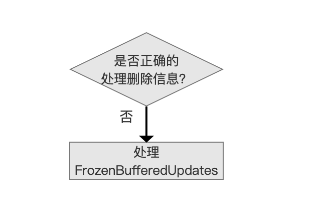

&emsp;&emsp;`处理FrozenBufferedUpdates`的流程点逻辑跟图11中的是一致的，在退出图2流程之前，我们总是需要`处理FrozenBufferedUpdates`。只有mergeGenCur 与 mergeGenStart相等后才属于`正确的处理删除信息`，在其他流程点进入该流程点都属于未能正确处理删除信息。

&emsp;&emsp;处理FrozenBufferedUpdates的工作如下，仅列出跟本篇文章有关的工作：

- 另applied（见上文的`是否已经处理过当前删除信息`流程）的计数为0，使得并发执行图2流程的线程直接退出
- 从update中移除当前FrozenBufferedUpdates

# 结语

&emsp;&emsp;基于篇幅，图1中剩余流程点留到下一篇文章介绍。

[点击](http://www.amazingkoala.com.cn/attachment/Lucene/Index/文档提交/文档提交之flush（七）/文档提交之flush（七）.zip)下载附件


