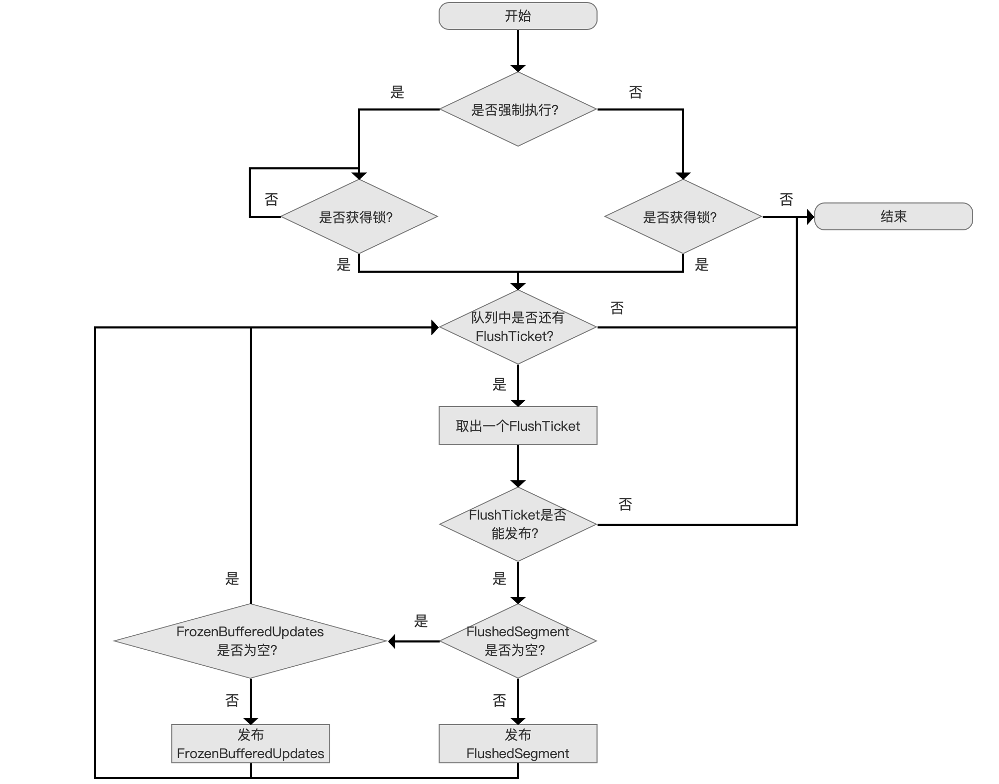
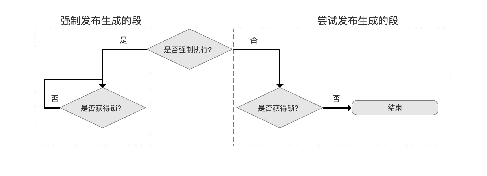
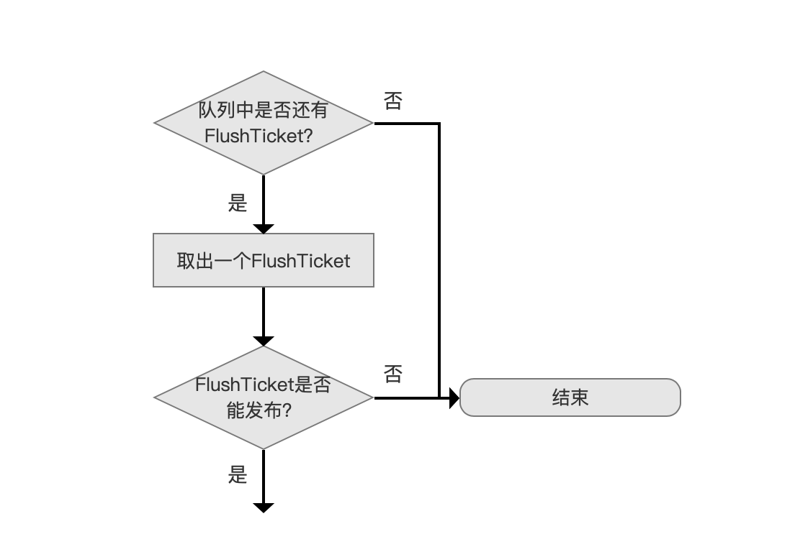
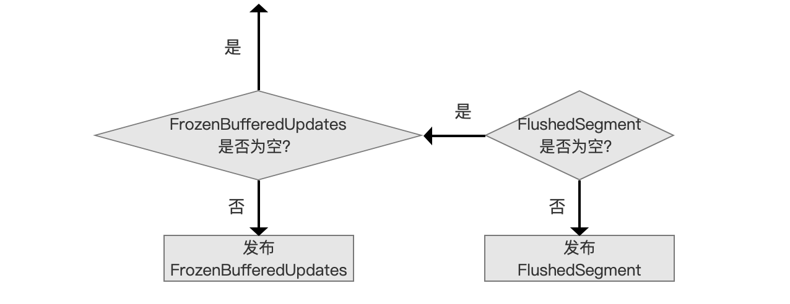

# [文档提交之flush（五）](https://www.amazingkoala.com.cn/Lucene/Index/)

&emsp;&emsp;本文承接[文档提交之flush（四）](https://www.amazingkoala.com.cn/Lucene/Index/2019/0730/77.html)，继续依次介绍每一个流程点。

# 文档提交之flush的整体流程图

图1：


## 更新删除信息

图2：


&emsp;&emsp;在执行`更新删除信息`的流程点之前，我们需要等待所有`执行DWPT的doFlush()`的线程执行完毕。

&emsp;&emsp;**为什么会有多线程执行`执行DWPT的doFlush()`的流程**：

- 在[文档提交之flush（二）](https://www.amazingkoala.com.cn/Lucene/Index/2019/0718/75.html)中我们了解到，如果主动flush跟自动flush的DWPT是相同的类型（持有相同全局删除队列deleteQueue，deleteQueue的概念见[文档的增删改（下）（part 2）](https://www.amazingkoala.com.cn/Lucene/Index/2019/0704/71.html)），那么会存在多线程执行`执行DWPT的doFlush()`的流程的情况

&emsp;&emsp;**为什么需要等待所有`执行DWPT的doFlush()`的线程执行完毕**：

&emsp;&emsp;可能会导致触发主动flush的线程已经执行完flush的工作，但其他线程中的DWPT还未生成一个段，无法保证线程A执行主动flush后应有的结果完整性。

&emsp;&emsp;**为什么还要更新删除信息**：

- 先给出FlushTicket类：

```java
    static final class FlushTicket {
        private final FrozenBufferedUpdates frozenUpdates;
        private FlushedSegment segment;
        ... ....
    } 
```

- 在[文档提交之flush（二）](https://www.amazingkoala.com.cn/Lucene/Index/2019/0718/75.html)中我们了解到，在`执行DWPT的doFlush()`流程中需要生成一个全局的删除信息FrozenBufferedUpdates，它将作用（apply）到索引目录中已有的段，但是在`执行DWPT的doFlush()`的流程中，需要通过FrozenBufferedUpdates跟**第一个**生成FlushedSegment的DWPT作为一个FlushTicket（见[文档提交之flush（四）](https://www.amazingkoala.com.cn/Lucene/Index/2019/0730/77.html)）来携带删除信息，如果此次的主动flush没有可用的DWPT可处理（即上次主动flush到这次主动flush之间没有添加/更新的操作），那么上次主动flush到这次主动flush之间的删除操作在`执行DWPT的doFlush()`的流程中无法生成对应的删除信息。所以在执行`更新删除信息`的目的就是为了处理 上次主动flush到这次主动flush之间只有删除操作的情况
- 需要强调的是，在[文档提交之flush（四）](https://www.amazingkoala.com.cn/Lucene/Index/2019/0730/77.html)中的`执行DWPT的doFlush()`流程图中的有一个`是否处理删除信息`的流程点，在主动flush中，该流程点处理的是新的全局删除队列newQueue（见[文档提交之flush（一）](https://www.amazingkoala.com.cn/Lucene/Index/2019/0716/74.html)）中的删除信息

&emsp;&emsp;在此流程点，删除信息同样被封装到一个FlushTicket中，跟之前文章中所有提及的FlushTicket不同的是，它其中的FlushedSegment对象是个null值，这个null很重要，在后面执行`发布生成的段`的流程中，根据FlushedSegment是否为null来区分两种不同作用的FlushTicket：

- FlushedSegment不为空：FlushTicket在`发布生成的段`的流程中需要执行将删除信息（如果有的话，见下文介绍）作用（apply）到其他段以及更新生成的段的任务
- FlushedSegment为空：FlushTicket在`发布生成的段`的流程中仅仅需要执行将删除信息（如果有的话，见下文介绍）作用到其他段的任务

&emsp;&emsp;我们结合[文档提交之flush（四）](https://www.amazingkoala.com.cn/Lucene/Index/2019/0730/77.html)中提到的生成出错的FlushTicket的情况，根据FlushedSegment跟FrozenBufferedUpdates不同可以归纳出在**主动flush**下FlushTicket的四种状态：

- 状态一：FrozenBufferedUpdates != null && FlushedSegment != null，FlushedSegment正确生成，FlushedSegment对应的DWPT**是**主动flush处理的第一个DWPT
- 状态二：FrozenBufferedUpdates == null && FlushedSegment != null，FlushedSegment正确生成，FlushedSegment对应的DWPT**不是**主动flush处理的第一个DWPT
- 状态三：FrozenBufferedUpdates == null && FlushedSegment == null，FlushedSegment未正确生成，FlushedSegment对应的DWPT**不是**主动flush处理的第一个DWPT
- 状态四：FrozenBufferedUpdates !=  null && FlushedSegment == null，这种还可细分为两种子状态
  - 子状态一：FlushedSegment未正确生成，FlushedSegment对应的DWPT**不是**主动flush处理的第一个DWPT
  - 子状态二：上文中在`更新删除信息`中的情况

## 强制发布生成的段

图3：


&emsp;&emsp;`发布生成的段`分为`强制`跟`尝试`两种情况，其区别在[文档提交之flush（四）](https://www.amazingkoala.com.cn/Lucene/Index/2019/0730/77.html)已介绍，不赘述，在本篇文章中主要介绍`发布生成的段`的流程。

&emsp;&emsp;**为什么在这个阶段要强制执行发布生成的段**：

- 原因在于当前是触发主动flush的线程，它必须保证完成主动flush的操作时，所有的DWPT已经生成对应的段，即保证线程A执行主动flush后应有的结果完整性。

### 发布生成的段的流程图

图4：



#### 强制、尝试发布生成的段

图5：



&emsp;&emsp;图5中，`是否强制执行`的`是`与`否`分别对应了`强制发布生成的段`以及`尝试发布生成的段`

- 强制发布生成的段：多线程执行`发布生成的段`，会等待获得锁
- 尝试发布生成的段：多线程执行`发布生成的段`，如果锁已被占用，那么直接退出

&emsp;&emsp;**为什么要区分`强制`跟`尝试`**：

- 在[文档提交之flush（四）](https://www.amazingkoala.com.cn/Lucene/Index/2019/0730/77.html)中已介绍，不赘述

#### 取出允许发布（publish）的FlushTicket

图6：



&emsp;&emsp;图6中，从队列中取出一个FlushTicket，队列即Queue&lt;FlushTicket&gt; queue（见[文档提交之flush（四）](https://www.amazingkoala.com.cn/Lucene/Index/2019/0730/77.html)）

&emsp;&emsp;源码中判断FlushTicket是否能发布的条件如下：

```java
    boolean canPublish() {
        return hasSegment == false || segment != null || failed;
    }
```

- hasSegment：通过DWPT生成FlushTicket的过程中会将该值值为true
- segment：FlushTicket中的FlushedSegment不为null
- failed：FlushTicket未能正常生成也允许发布，因为该FlushTicket中的FrozenBufferedUpdates可能包含删除信息（为什么是可能包含，见[文档提交之flush（二）](https://www.amazingkoala.com.cn/Lucene/Index/2019/0718/75.html)）

#### 发布FrozenBufferedUpdates、FlushedSegment

图7：



&emsp;&emsp;图7中FlushedSegment和FrozenBufferedUpdates同时为空的条件的条件即上文中FlushTicket的状态三。

&emsp;&emsp;由于篇幅原因，`发布FrozenBufferedUpdates`、`FlushedSegment`的流程将在下篇文章中展开介绍。

# 结语

&emsp;&emsp;无

[点击](http://www.amazingkoala.com.cn/attachment/Lucene/Index/文档提交/文档提交之flush（五）/文档提交之flush（五）.zip)下载附件