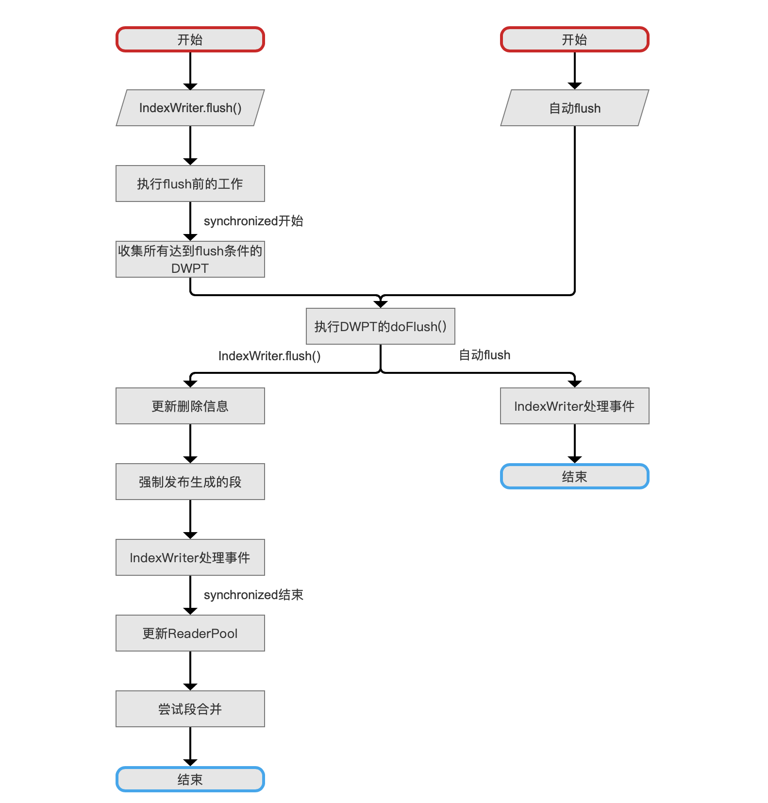
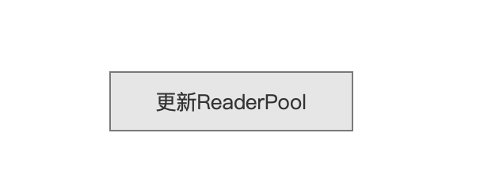
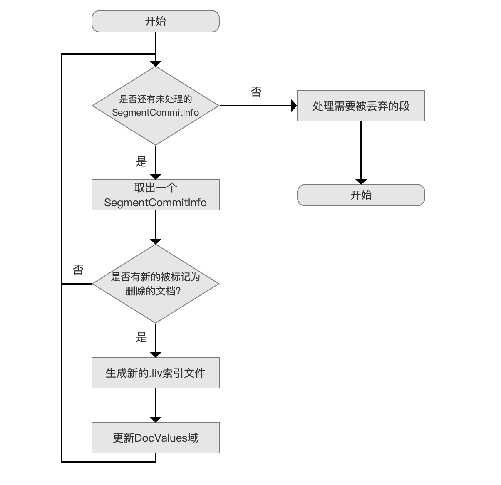
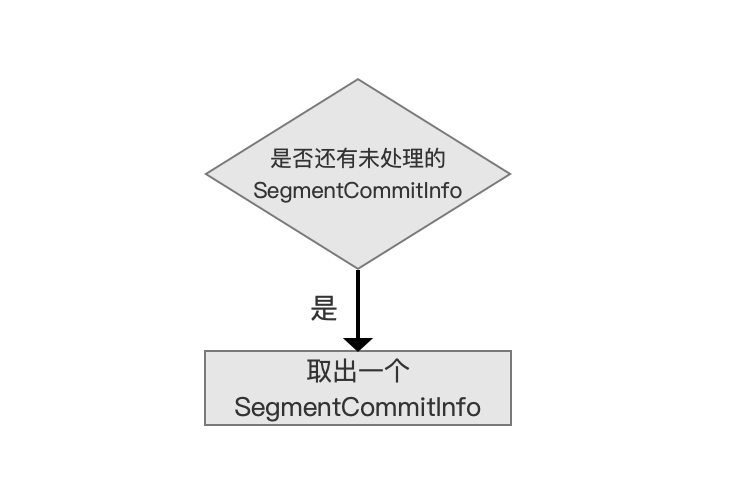
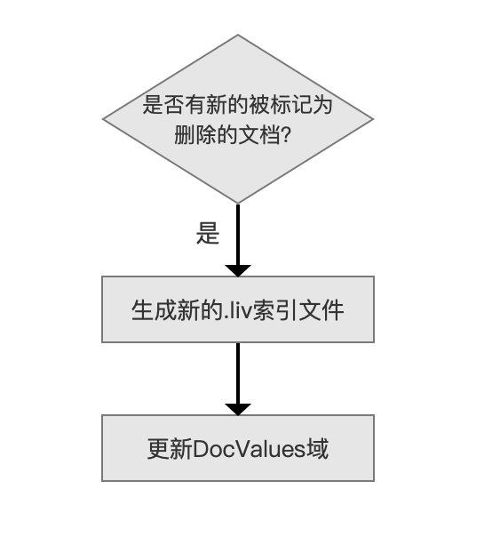

# [文档提交之flush（八）终](https://www.amazingkoala.com.cn/Lucene/Index/)

&emsp;&emsp;本文承接[文档提交之flush（七）](https://www.amazingkoala.com.cn/Lucene/Index/2019/0807/80.html)，继续依次介绍每一个流程点，本篇文章是介绍文档提交之flush流程的最后一篇文章。

# 文档提交之flush的整体流程图

图1：



## 更新ReaderPool

图2：



&emsp;&emsp;在执行`更新ReaderPool`流程之前，我们需要等待所有`发布生成的段中的处理删除信息事件`执行结束。

&emsp;&emsp;**为什么需要等待**：

- 在[文档提交之flush（二）](https://www.amazingkoala.com.cn/Lucene/Index/2019/0718/75.html)中我们了解到，如果自动flush处理的DWPT跟全局flush的DWPT类型是一致的（有相同的全局删除队列deleteQueue，见[文档的增删改（下）（part 2）](https://www.amazingkoala.com.cn/Lucene/Index/2019/0704/71.html)），那么允许并发的执行`执行DWPT的doFlush()`。根据图1的流程图，即存在多线程执行流程点`IndexWriter处理事件`，自动fulsh的线程可能会从eventQueue中取出`发布生成的段中的处理删除信息事件`，那主动flush的线程只能等待所有的事件执行完成才能继续往下执行，否则会造成主动flush的不完整性，不完整性描述的是，调用主动flush的方法（IndexWriter.flush()）已经完成，但删除信息可能还没有完成

&emsp;&emsp;**等待的逻辑是什么**：

- 根据前面的文章我们可以知道，到达此流程点，说明主动flush中的所有删除信息已经作为FrozenBufferedUpdates添加到update中，故只需要获得当前的update的状态，等待update容器中的元素为空（见上文中update的介绍），说明`至少主动flush必须（must be）要处理的删除信息`都已经完成了

&emsp;&emsp;**为什么是`至少主动flush必须（must be）要处理的删除信息`都已经完成了，`至少主动flush必须（must be）要处理的删除信息`这句话需要拆分为两部分来介绍**：

- 主动flush必须（must be）要处理的删除信息：主动flush对应的全局删除队列中的删除信息
- 至少：主动flush对应的全局删除队列中的删除信息肯定都能被处理，同时有可能newQueue中的删除信息会被处理，由于此时fullFlush已经被置为false，newQueue中的FrozenBufferedUpdates可能会被添加到update中

&emsp;&emsp;**主动flush的线程如何获得当前update状态**：

- 先给出源码：

```java
    Set<FrozenBufferedUpdates> waitFor;
    synchronized (this) {
        waitFor = new HashSet<>(updates);
    }
```

- 从上面的代码可以看出，通过new的方式仅获得线程运行到此处时的当前updates中已有的FrozenBufferedUpdates对象引用，描述为当前update状态（current status），updates的状态可能还会被其他线程更新，如果主动flush直接判断updates，那么可能因为newQueue一直生产新的FrozenBufferedUpdates被添加到update中，导致无法或等待长时间后才能退出

### 更新ReaderPool的流程图

图3：



&emsp;&emsp;**ReaderPool是什么**：

- ReaderPool描述了所有SegmentCommitInfo的信息，在本篇文章中我们只需要知道，ReaderPool类中包含了一个容器，其定义如下，其中ReaderAndUpdates的介绍见[文档提交之flush（七）](https://www.amazingkoala.com.cn/Lucene/Index/2019/0807/80.html)

```java
    private final Map<SegmentCommitInfo,ReadersAndUpdates> readerMap = new HashMap<>();
```

&emsp;&emsp;故`更新ReaderPool`的过程就是更新每一个SegmentCommitInfo对应的ReadersAndUpdates的过程。

#### 取出一个SegmentCommitInfo

图4：



&emsp;&emsp;从IndexWriter的全局变量[segmentInfos](https://github.com/LuXugang/Lucene-7.5.0/blob/master/solr-7.5.0/lucene/core/src/java/org/apache/lucene/index/IndexWriter.java)中依次取出每一个SegmentCommitInfo：

```java
    private final SegmentInfos segmentInfos;
```

#### 处理每一个SegmentCommitInfo

图5：



&emsp;&emsp;在[文档提交之flush（七）](https://www.amazingkoala.com.cn/Lucene/Index/2019/0807/80.html)中我们了解到全局FrozenBufferedUpdates中的删除信息会作用到segmentInfos中的每一个SegmentCommitInfo中，同时段内FrozenBufferedUpdates中的删除信息会作用到本段的SegmentCommitInfo，即当作用（apply）了删除信息后，每一个段中的删除信息**可能**会发生变化。如果一个段中有新的被标记为删除的文档产生，那么被删除的文档会被记录到[.liv](https://www.amazingkoala.com.cn/Lucene/suoyinwenjian/2019/0425/54.html)索引文件中，如果该段已经存在.liv索引文件，那么先生成一个新的.liv索引文件，然后删除旧的.liv索引文件（通过索引文件计数引用来判断是否能删除该索引文件，见[文档提交之flush（七）](https://www.amazingkoala.com.cn/Lucene/Index/2019/0807/80.html)）。

&emsp;&emsp;如果存在更改DocValues域的操作，那么需要更新DocValues域，这部分在后面介绍软删除的文章中会展开介绍。

#### 处理需要被丢弃的段

图6：


&emsp;&emsp;在上面的流程中，通过.liv索引文件确定了每一个段中的被删除的文档集合，如果一个段中所有文档都被标记为删除的，那么需要丢弃该段。

&emsp;&emsp;在执行完`更新ReaderPool`流程之后，Lucene还提供了一个钩子函数，用户可以根据具体业务来实现这个接口，这个接口同[文档提交之flush（六）](https://www.amazingkoala.com.cn/Lucene/Index/2019/0805/79.html)中的图3中`执行flush后的工作`流程是同一个钩子函数。

## 尝试段合并

&emsp;&emsp;每一次索引发生变化，都会尝试判断是否需要执行段的合并操作，其判断条件依据不同的合并策略而有所不同，合并策略的文章可以看这里：[LogMergePolicy](https://www.amazingkoala.com.cn/Lucene/Index/2019/0513/58.html)、[TieredMergePolicy](https://www.amazingkoala.com.cn/Lucene/Index/2019/0516/59.html)。

# 结语

&emsp;&emsp;至此，除了跟DocValues相关的知识点，我们通过八篇文章详细的介绍了执行了IndexWriter.flush()的所有流程。

&emsp;&emsp;在后面的文章中，我们会介绍软删除的内容，填补未展开的坑。

[点击](http://www.amazingkoala.com.cn/attachment/Lucene/Index/文档提交/文档提交之flush（八）/文档提交之flush（八）.zip)下载附件