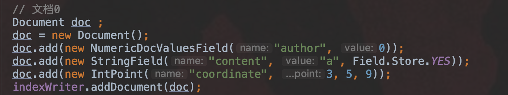
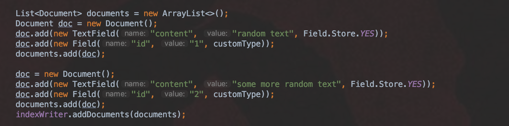
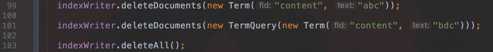
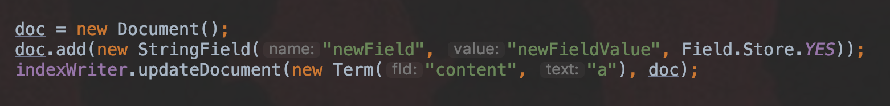
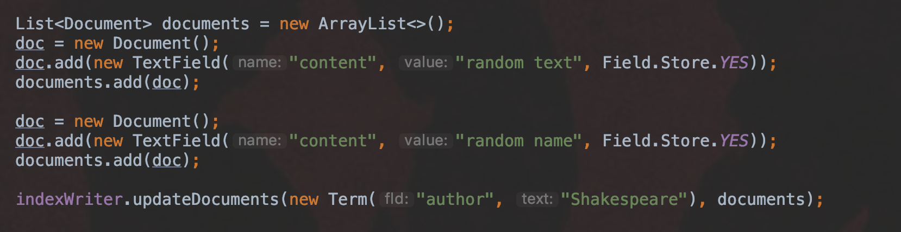
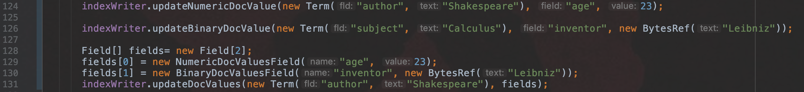
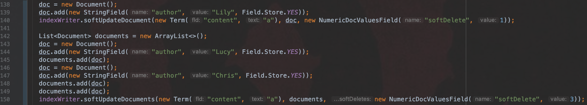
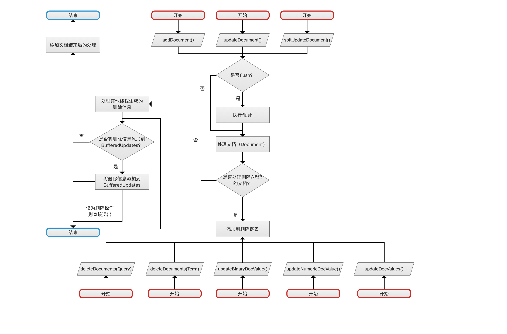
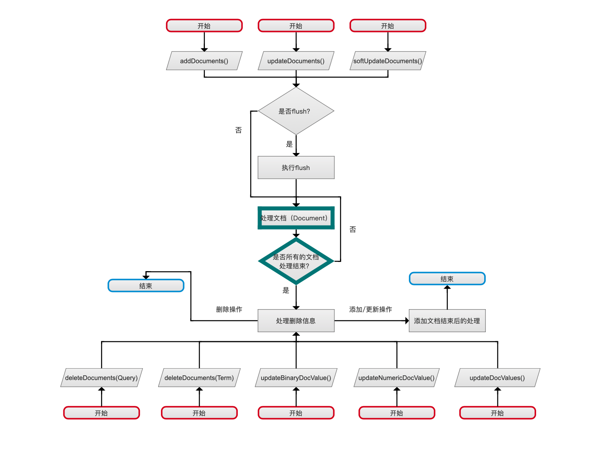

# [文档的增删改](https://www.amazingkoala.com.cn/Lucene/Index/)(上)

&emsp;&emsp;在Lucene中，可以对文档（Document）进行添加（增）、删除（删）、更新（改）的操作，而每一种操作各自又有多个功能的扩展。

# 文档的增删改应用

## 添加文档
&emsp;&emsp;该小结介绍增删改的简单使用方法。
图1：

图2：

&emsp;&emsp;Lucene允许通过IndexWriter对象添加一篇文档或者多篇文档。
- 添加一篇文档：图1中，我们添加了一篇文档，该文档中包含三个域，分别是[DocValues](https://www.amazingkoala.com.cn/Lucene/DocValues/)域"author"、[存储域](https://www.amazingkoala.com.cn/Lucene/suoyinwenjian/2019/0301/38.html)"content"、[点数据](https://www.amazingkoala.com.cn/Lucene/suoyinwenjian/2019/0424/53.html)域"coordinate"
- 添加多篇文档：图2中，我们添加了两篇文档

## 删除文档

图3：

&emsp;&emsp;删除文档的操作可以根据Term、Query进行删除：

- 根据Term删除文档：图3的第99行，包含域名为"content"，域值为"abc"的文档都满足删除要求
- 根据Query删除文档：图3的第101行，使用TermQuery进行查询，满足查询要求的文档都会被删除
- 删除所有文档：删除所有的文档

## 更新文档

图4：

图5：

&emsp;&emsp;允许更新一篇或多篇文档，更新文档是一个`先删除、后添加`的过程。

- 更新一篇文档：图4中，先`删除`所有包含域名为"content"，域值为"a"的文档，并且`添加`一篇新的文档，该文档包含一个存储域"newField"，域值为"newFieldValue"
- 更新多篇文档：图5中，先`删除`所有包含域名为"author"，域值为"Shakespeare"的文档，并且`添加`**两篇**新的文档

图6：

&emsp;&emsp;Lucene7.5.0版本中提供了三种更新文档的DocValues域的方法。

- 更新NumericDocValueField：图6的124行，包含域名"author"，域值为"ShakeSpare"的所有文档的域名为“age”的NumericDocValueField的域值更新为23。注意的是，索引中必须存在域名为"age"的NumericDocValueField，在更新过程前，会通过一个全局的globalFieldNumberMap的Map对象检查是否存在该域名，不存在则抛出异常。
- 更新BinaryDocValueField：图6的126行，包含域名"subject"，域值为"Calculus"的所有文档，这些文档的域名为“inventor”的BinaryDocValueField的域值更新为"Leibniz"。注意的是，索引中必须存在域名为"inventor"的BinaryDocValueField，在更新过程前，会通过一个全局的globalFieldNumberMap的Map对象检查是否存在该域名，不存在则抛出异常。
- 批量更新DocValues域：批量的更新DocValues域，但是目前版本只能允许更新NumericDocValueField或BinaryDocValueField，跟单独更新DocValues域不同的是，该方法不会检查当前索引中是否存在待更新的域名，如果没有则直接添加，但如果待更新的域名已经存在并且对应的DocValues域的类型不是BinaryDocValueField或者NumericDocValueField，那么抛出异常

图7：

&emsp;&emsp;软删除(softDelete)也属于文档的更新，支持添加一篇或多篇文档，图4及图5中的更新文档是 `先删除、后添加`的过程，而软删除则是`先标记、后添加`。

&emsp;&emsp;软删除的概念会在后面的文章中详细介绍。

- 添加一篇文档：图7的140行，先`标记`所有包含域名为"content"，域值为"a"的文档，使得这些文档添加一个域名"softDelete"，域值"1"的NumericDocValuesField的域，然后`添加`一篇新的文档，该文档包含一个存储域"author"，域值为"a"
- 添加多篇文档：图7中150行，先`标记`所有包含域名为"content"，域值为"a"的文档，使得这些文档添加一个域名"softDelete"，域值"3"的NumericDocValuesField的域，然后`添加`两篇新的文档

# 文档的增删改原理

&emsp;&emsp;上一节中介绍文档的增删改的方法即：

&emsp;&emsp;添加/更新一篇文档操作：

- 添加一篇文档：addDocument( )
- 更新一篇文档：updateDocument( )
- 软删除中的添加一篇文档：softUpdateDocument( )

&emsp;&emsp;添加/更新多篇文档操作：

- 添加多篇文档：addDocuments( )
- 更新多篇文档：updateDocuments( )
- 软删除中的添加多篇文档：softUpdateDocuments( )

&emsp;&emsp;删除文档操作：

- 按照Term进行删除：deleteDocuments(Term)
- 按照Query进行删除：deleteDocuments(Query)
- 删除所有文档：deleteAll( )

&emsp;&emsp;更新DocValues域操作：

- 更新BinaryDocValues：updateBinaryDocValue( )
- 更新NumericDocValues：updateNumericDocValue( )
- 更新多个DocValues：updateDocValues( )

## 文档Document的增删改流程图

&emsp;&emsp;单文档跟多文档的添加/更新操作的流程图略有不同：

### 单文档的增删改流程图

图8：

[点击](http://www.amazingkoala.com.cn/uploads/lucene/index/%E6%96%87%E6%A1%A3%E7%9A%84%E5%A2%9E%E5%88%A0%E6%94%B9/%E6%96%87%E6%A1%A3%E7%9A%84%E5%A2%9E%E5%88%A0%E6%94%B9%EF%BC%88%E4%B8%8A%EF%BC%89/%E5%8D%95%E6%96%87%E6%A1%A3%E6%93%8D%E4%BD%9C.html)查看大图

### 多文档的增删改流程图

图9：

[点击](http://www.amazingkoala.com.cn/uploads/lucene/index/%E6%96%87%E6%A1%A3%E7%9A%84%E5%A2%9E%E5%88%A0%E6%94%B9/%E6%96%87%E6%A1%A3%E7%9A%84%E5%A2%9E%E5%88%A0%E6%94%B9%EF%BC%88%E4%B8%8A%EF%BC%89/%E5%A4%9A%E6%96%87%E6%A1%A3%E6%93%8D%E4%BD%9C.html)查看大图

&emsp;&emsp;从图8跟图9的流程图中可以看出，尽管有多种增删改的操作，但其相同的逻辑部分重合度是很高的，另外没有列出删除出所有文档的操作，即deleteAll( )。该操作暂时不作介绍，原因是一方面这个操作在实际业务中几乎不会使用，另一方该操作的流程完全不同于其他的增删改操作，展开介绍则需要另外开一章节，感觉没这个必要。

# 结语

&emsp;&emsp;本章节介绍了文档增删改的应用及其流程图，由于流程图的每一个步骤展开介绍会使得本篇文章篇幅过大，故在下一篇文章中介绍。

[点击下载](http://www.amazingkoala.com.cn/attachment/Lucene/Index/%E6%96%87%E6%A1%A3%E7%9A%84%E5%A2%9E%E5%88%A0%E6%94%B9/%E6%96%87%E6%A1%A3%E7%9A%84%E5%A2%9E%E5%88%A0%E6%94%B9%EF%BC%88%E4%B8%8A%EF%BC%89/%E6%96%87%E6%A1%A3%E7%9A%84%E5%A2%9E%E5%88%A0%E6%94%B9%EF%BC%88%E4%B8%8A%EF%BC%89.zip)附件

