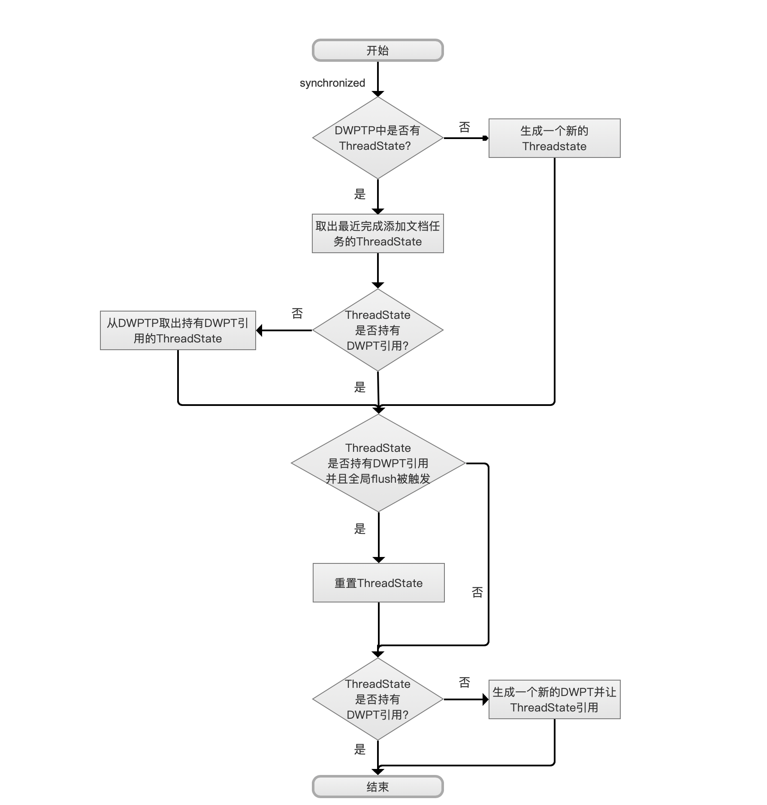
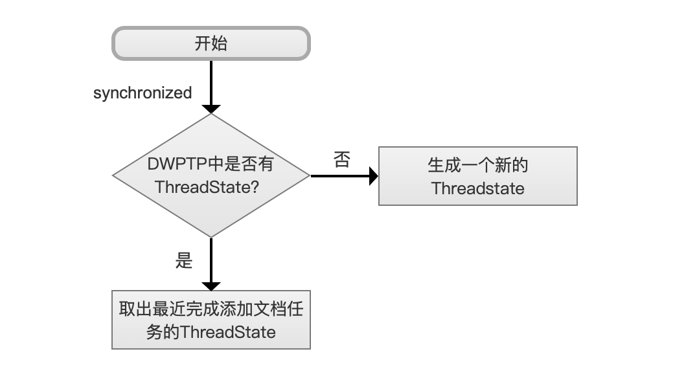
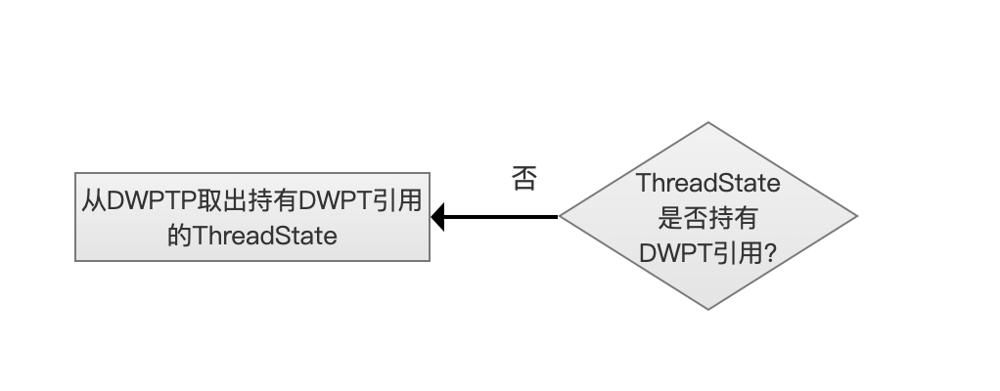
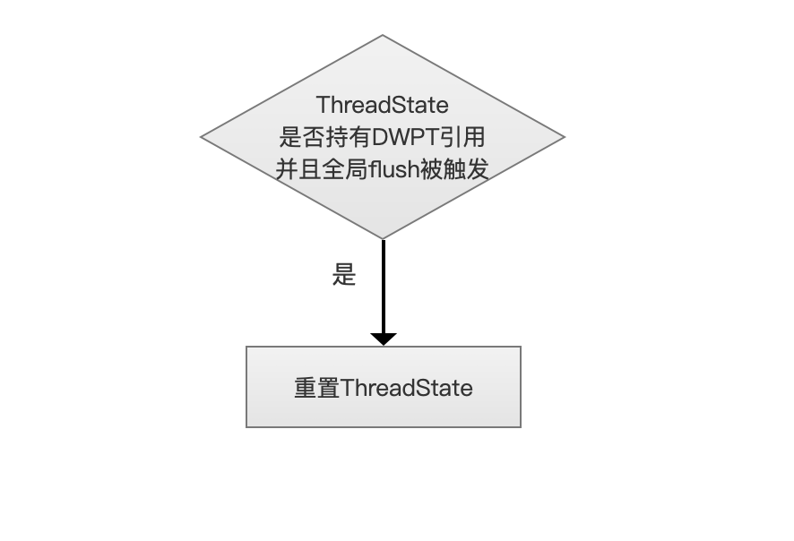
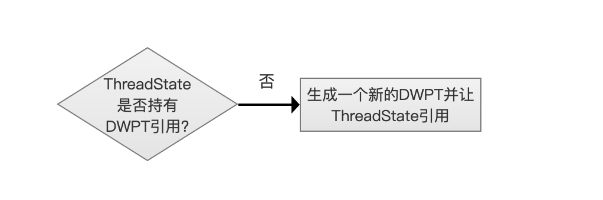

# [文档的增删改](https://www.amazingkoala.com.cn/Lucene/Index/)（中）

&emsp;&emsp;在[文档的增删改（上）](https://www.amazingkoala.com.cn/Lucene/Index/2019/0626/68.html)中，我们介绍了应用示例并给出了流程图，本篇文章承接上文，就流程图的每个流程点展开介绍，如果篇幅过长又得拖到下一篇文档啦😅。

# 预备知识
&emsp;&emsp;在介绍流程点前需要了解以下几个知识点，下文使用到的名称都是源码中的类名。

## DocumentsWriterPerThread
&emsp;&emsp;该类实现了将文档转化为索引文件的所有需要的功能，如果你之前看过[两阶段生成索引文件之第一阶段](https://www.amazingkoala.com.cn/Lucene/Index/2019/0521/61.html)，这篇文章中描述了一篇文档转化为索引文件的过程的第一个阶段，而这个过程的入口即DocumentsWriterPerThread提供的processDocument( )方法。

&emsp;&emsp;DocumentsWriterPerThread在处理完文档后，会收集到以下的数据，注意的这只是部分数据，并且是跟本篇文章相关的，而其他数据以及DocumentsWriterPerThread提供的其他方法(功能)则会在后面介绍flush的文章中进一步展开：

- numDocs：DocumentsWriterPerThread处理的文档个数，上文中我们知道，IndexWriter可以一次添加一篇或多篇文档，而这一次的添加操作实际由DocumentsWriterPerThread完成，用numDocs来记录处理的文档个数
- IndexByteUsed（索引信息总量）：DocumentsWriterPerThread处理的文档转化为索引文件后占用的内存大小，这里的IndexByteUsed至少包含了生成[索引文件](https://www.amazingkoala.com.cn/Lucene/suoyinwenjian/)需要的内存大小

&emsp;&emsp;**DocumentsWriterPerThread在下文中简称DWPT，源码中也是这么干的**😁。


## DocumentsWriterPerThreadPool、ThreadState
&emsp;&emsp;DocumentsWriterPerThreadPool是一个逻辑上的线程池，它实现了类似Java线程池的功能，在Java的线程池中，新来的一个任务可以从[ExecutorService](https://docs.oracle.com/javase/8/docs/api/java/util/concurrent/ExecutorService.html)中获得一个线程去处理该任务，而在DocumentsWriterPerThreadPool中，每当IndexWriter要添加文档，会从DocumentsWriterPerThreadPool中获得一个ThreadState去执行，故在多线程（持有相同的IndexWriter对象引用）执行添加文档操作时，每个线程都会获得一个ThreadState对象。

&emsp;&emsp;每一个ThreadState对象中都持有一个DWPT的引用，所以正如上文中所述，实际的添加文档操作还是DWPT。

&emsp;&emsp;当ThreadState执行完添加文档的任务后，它会回到DocumentsWriterPerThreadPool中，等待下次的文档添加操作，通过一个名为**freeList**的链表来存储。

```java
private final List<ThreadState> freeList = new ArrayList<>();
```

&emsp;&emsp;ThreadState在两种情况下`不持有`一个DWPT的引用：

- 情况一：当一个新的添加文档任务来时，DocumentsWriterPerThreadPool中没有可用的ThreadState对象，那么会生成一个新的ThreadState对象，此时新生成的ThreadState对象没有DWPT的引用(个人理解：从源码结构上看ThreadState的构造函数所在的类DocumentsWriterPerThreadPool没有可用的生成一个DWPT对象所需要的参数)
- 情况二：上文中提到DWPT在执行完添加文档操作后，会收集numDocs跟IndexByteUsed的值，其中IndexByteUsed的值会被`累加`到一个全局的变量activeBytes（线程共享）中，另外还有一个全局变量deleteRamByteUsed，它描述了被删除文档的信息占用的内存大小（在后面介绍flush的文章中会展开），如果activeBytes与deleteRamByteUsed的和值，以及numDocs 分别超过下面两个变量，那么持有DWPT的ThreadState会被标记为flushPending状态，并且失去该DWPT的引用，DWPT被加入到flush队列，其包含的索引信息等待被写入到磁盘：
  - ramBufferSizeMB：该值描述了索引信息被写入到磁盘前暂时缓存在内存中允许的最大使用内存值
  - maxBufferedDocs：该值描述了索引信息被写入到磁盘前暂时缓存在内存中允许的文档最大数量，这里注意的是这里指的是一个DWPT允许添加的最大文档数量，在多线程下，可以同时存在多个DWPT，而maxBufferedDocs并不是所有线程的DWPT中添加的文档数量和值

&emsp;&emsp;用户可以通过LiveIndexWriterConfig对象自定义配置ramBufferSizeMB跟maxBufferedDocs的值，这两个变量的概念在后面介绍flush的文章中会详细展开。

### 获取ThreadState的流程图

图1：



[点击](http://www.amazingkoala.com.cn/uploads/lucene/index/%E6%96%87%E6%A1%A3%E7%9A%84%E5%A2%9E%E5%88%A0%E6%94%B9/%E6%96%87%E6%A1%A3%E7%9A%84%E5%A2%9E%E5%88%A0%E6%94%B9%EF%BC%88%E4%B8%AD%EF%BC%89/index.html)查看大图

#### 从DocumentsWriterPerThreadPool(DWPTP)中获取一个ThreadState

图2：



&emsp;&emsp;当IndexWriter执行添加文档操作，比如说IndexWriter.addDocument()的操作，那么进入开始的流程点，由于可以多线程(持有相同的IndexWriter对象引用)添加文档，故使用synchronized(IndexWriter对象)关键字从DWPTP中获取ThreadState。

&emsp;&emsp;如果DWPTP中没有ThreadState对象，那么直接生成一个新的ThreadState，如果存在，那么从freeList中的链表尾部取出一个ThreadState，因为当一个ThreadState完成添加文档的任务后，会重新回到DWPTP，即添加到freeList中，所以从链表尾部获取一个ThreadState即取出最近完成添加文档任务的ThreadState，即LIFO（Last In First Out）。

#### 优先取出持有DWPT对象引用的ThreadState

图3：



&emsp;&emsp;从freeList的链表尾部获得一个ThreadState对象后，我们这里称之为threadState1，如果threadState1中不持有DWPT对象的引用，那么需要从freeList的首部开始遍历每一个ThreadState，找到第一个持有DWPT对象引用的ThreadState对象，并且将threadState1重新添加到freeList中，当然也有可能链表中所有的ThreadState都不持有DWPT对象的引用。

&emsp;&emsp;为什么要优先取出持有DWPT对象引用的ThreadState：

- 前面提到当一个ThreadState完成添加文档的任务后，如果其引用的DWPT对象收集的numDocs、全局变量activeBytes分别达不到maxBufferedDocs、ramBufferSizeMB，即达不到flush的要求，那么ThreadState会重新回到DWPTP中，如果新的添加文档任务到来，引用一个新的DWPT对象，特别是文档（Document）大小较小（更难达到ramBufferSizeMB）且数量较多（每个DWPT中收集的numDocs达到maxBufferedDocs才会flush）的时候，那么内存中会相对堆积更多的索引数据（更多的持有DWPT对象引用的ThreadState对象），如果此时添加文档的频率降低了，那么更会加剧堆积的问题，会导致不可确定的长期占用内存(leave docs indefinitely buffered，tying up RAM)的情况。所以优先取出持有DWPT对象引用的ThreadState可以使得该ThreadState中的DWPT收集的numDocs、全局变量activeBytes尽快达到flush的要求，释放内存，并且生成一个较大的段，BTW：段越大，commit的时候性能更高

&emsp;&emsp;为什么可能会取到不持有DWPT对象引用的ThreadState：

- 当一个ThreadState完成添加文档的任务后，其引用的DWPT对象收集的numDocs或者全局变量activeBytes达到flush的要求，ThreadState会被标记为flushPending为true状态，那么失去该DWPT的引用，而该DWPT被加入到flush队列，其包含的索引信息等待被写入到磁盘，该ThreadState重新添加到freeList中，并且重新标记flushPending为false

#### 全局flush被触发

图4：



&emsp;&emsp;当前的ThreadState持有DWPT对象引用，说明在上一步的流程中，从freeList中取到了一个刚刚完成文档添加任务的ThreadState，如果此时全局flush被触发，那么ThreadState会失去该DWPT的引用，而该DWPT被加入到flush队列，其包含的索引信息等待被写入到磁盘，并且ThreadState被重置（恢复到刚生成ThreadState对象的状态）

&emsp;&emsp;这里简单提下哪些情况会触发全局flush，具体的内容会在介绍flush时展开：

- 调用IndexWriter.commit( )方法
- 调用IndexWriter.flush( )方法
- 调用IndexWriter.getReader( )方法，即使用NRT（near real-time）搜索功能。

#### 让ThreadState持有一个DWPT对象的引用

图5：



&emsp;&emsp;从上面的流程可以看出，到了这个流程点，从freeList中获取的ThreadState不一定持有DWPT对象的引用，故需要提供一个新的DWPT对象。当然新生成的hreadState在这个流程点也需要持有一个新的DWPT对象。

#### 结束

图6：


&emsp;&emsp;至此，获取ThreadState的流程已经结束，并且ThreadState必定是持有DWPT对象的引用。

## FlushPolicy
&emsp;&emsp;FlushPolicy即flush策略，准确的说应该称为 自动flush策略，因为flush分为自动flush跟主动flush，即显示的调用IndexWriter.flush( )方法，flushPolicy描述了IndexWriter执行了增删改的操作后，将修改后的索引信息写入磁盘的时机。

&emsp;&emsp;Lucene7.5.0版本中，有且仅有一个flushPolicy：FlushByRamOrCountsPolicy

### FlushByRamOrCountsPolicy

&emsp;&emsp;FlushByRamOrCountsPolicy还定义了IndexWriter执行完增删改的操作后的后续工作：

- 添加操作：先判断numDocs是否maxBufferedDocs，再判断activeBytes与deleteRamByteUsed的和值是否达到ramBufferSizeMB
- 删除操作：判断deleteRamByteUsed是否达到ramBufferSizeMB
- 更新操作：更新操作实际是执行`删除`跟`添加`的操作

## DocumentsWriterFlushControl
&emsp;&emsp;DocumentsWriterFlushControl类中定义了ThreadState在添加/更新文档过程中的各种行为，上文中提及的例如ThreadState失去持有DWPT的行为、activeBytes、flush队列等等都是在该类中定义，下面列出几个跟本篇文章内容**相关**的DocumentsWriterFlushControl类中的方法、变量：

- activeBytes（long类型）：多线程（持有相同的IndexWriter对象的引用）执行添加/更新操作时，每一个DWPT收集到的IndexByteUsed都会被累加到activeBytes中
- flushBytes（long类型）：待写入到磁盘的索引数据量，如果全局的flush被触发，即使某个ThreadState中的DWPT达不到flush的要求，DWPT中的索引信息也会被累加到flushBytes中(没有触发全局flush的话，则是被累加到activeBytes中)
- numPending（int类型）：描述了被标记为flushPending的ThreadState的个数
- fullFlush（boolean 类型）：全局flush是否被触发的标志
- flushQueue（Queue类型）：存放DWPT的队列，即flush队列
- commitPerThreadBytes( ) (方法)：该方法描述了刚刚完成添加/更新的DWPT收集到的索引信息应该被添加到activeBytes还是flushBytes中，取决于ThreadState的flushPending状态
- setFlushPending( )(方法)：该方法用来设置一个ThreadState为flushPending状态

# 结语

&emsp;&emsp;要完全的深入了解文档增删改的过程，这些预备知识必须都先了解，果不其然，篇幅又超了，所以文档增删改的流程图的介绍又得拖到下一篇文章啦。

[点击下载](http://www.amazingkoala.com.cn/attachment/Lucene/Index/%E6%96%87%E6%A1%A3%E7%9A%84%E5%A2%9E%E5%88%A0%E6%94%B9/%E6%96%87%E6%A1%A3%E7%9A%84%E5%A2%9E%E5%88%A0%E6%94%B9%EF%BC%88%E4%B8%AD%EF%BC%89/%E6%96%87%E6%A1%A3%E7%9A%84%E5%A2%9E%E5%88%A0%E6%94%B9%EF%BC%88%E4%B8%AD%EF%BC%89.zip)附件