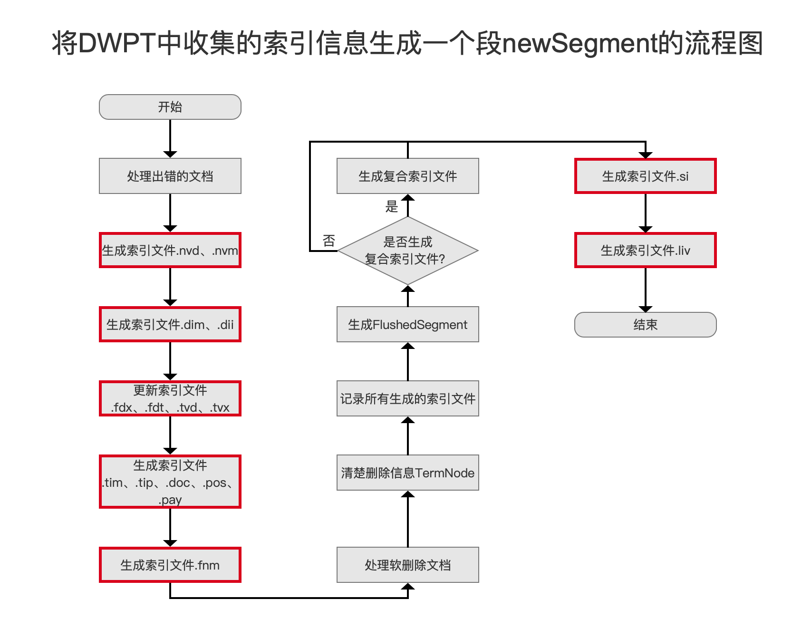
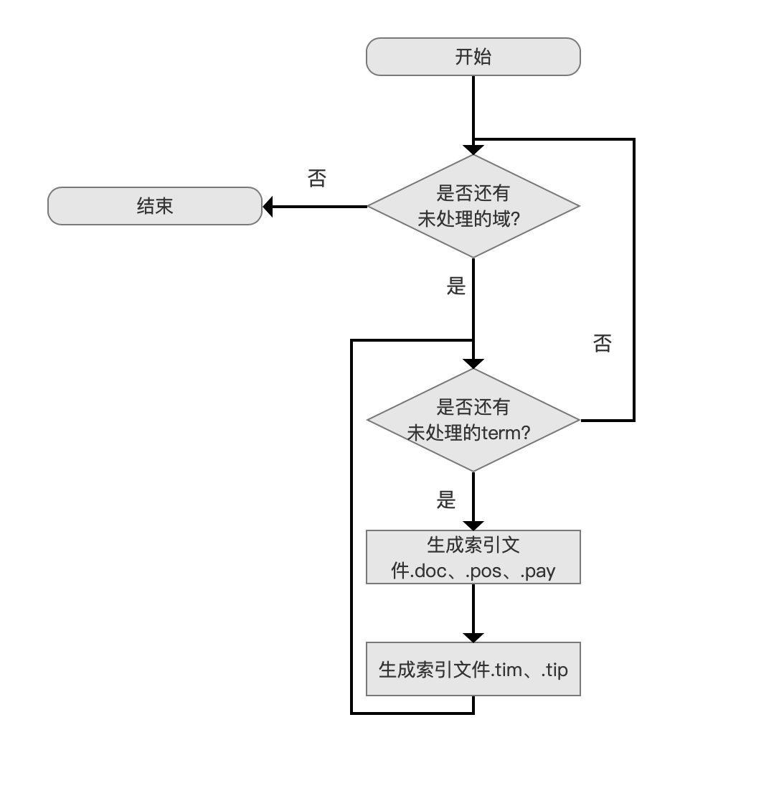
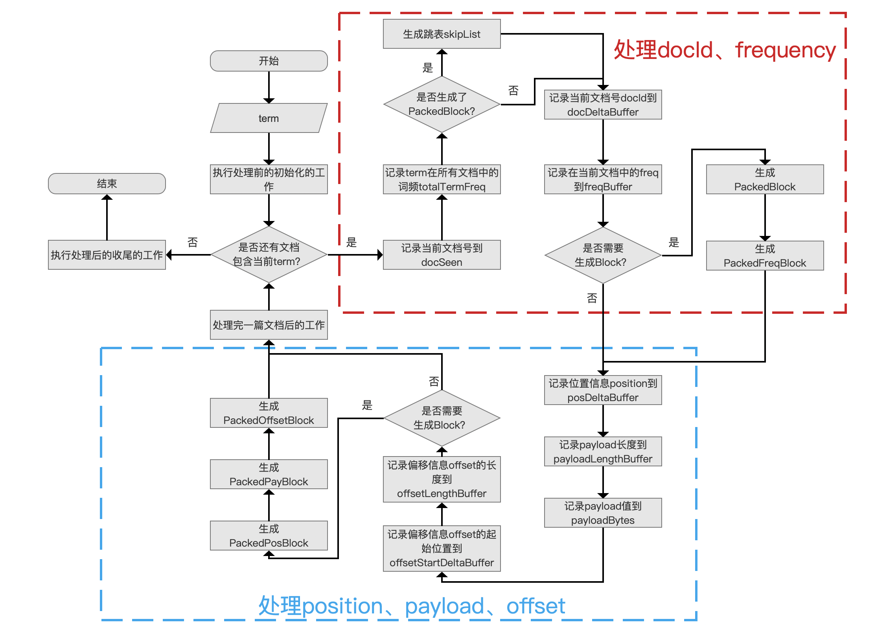
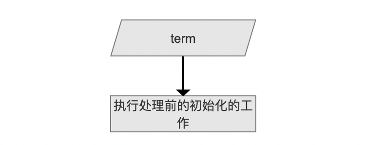
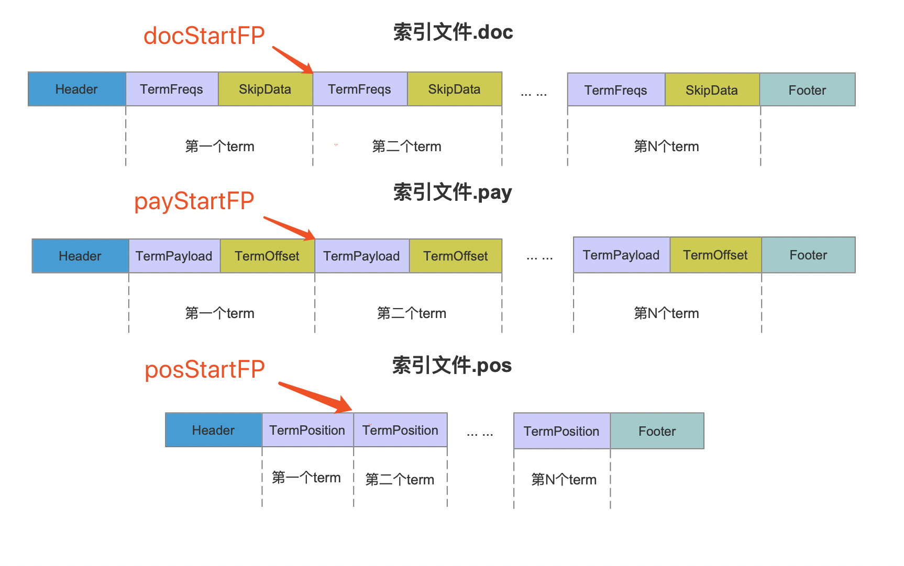
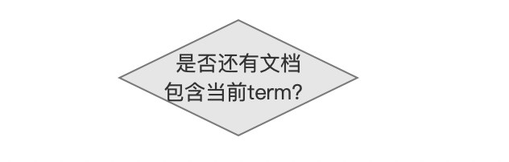
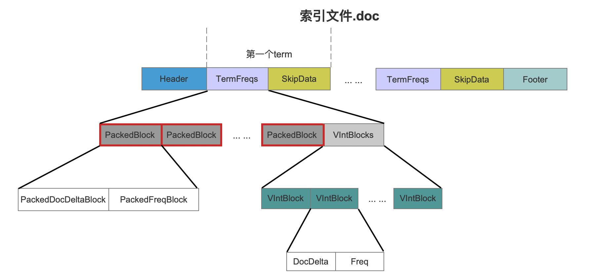
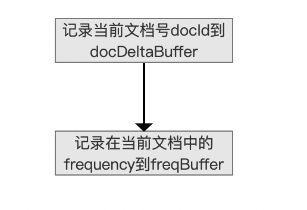
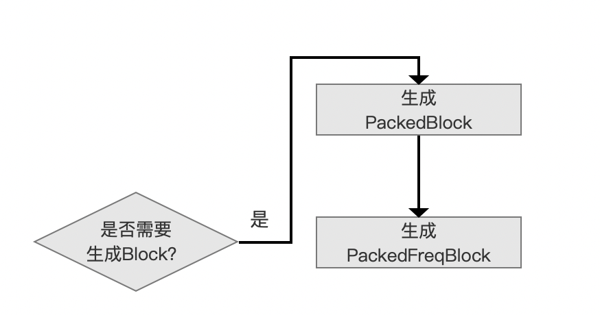
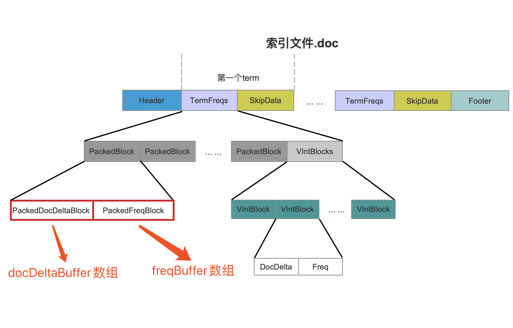

# [索引文件的生成（一）](https://www.amazingkoala.com.cn/Lucene/Index/)

&emsp;&emsp;在执行flush()的过程中，Lucene会将内存中的索引信息生成索引文件，其生成的时机点如下图红色框标注：

图1：



&emsp;&emsp;图一中的流程是flush()阶段的其中一个流程点，完整的flush()过程可以看系列文章[文档提交之flush](https://www.amazingkoala.com.cn/Lucene/Index/2019/0716/74.html)，`索引文件的生成`系列文章将会介绍图一中红框标注的每一个流程点，本篇文章先介绍`生成索引文件
.tim、.tip、.doc、.pos、.pay`流程点。

## 生成索引文件.tim、.tip、.doc、.pos、.pay

&emsp;&emsp;在添加文档阶段，一篇文档中的term所属文档号docId，在文档内的出现次数frequency，位置信息position、payload信息、偏移信息offset，会先被存放到[倒排表](https://www.amazingkoala.com.cn/Lucene/Index/2019/0222/36.html)中，随后在flush()阶段，读取倒排表的信息，将这些信息写入到索引文件[.tim、.tip](https://www.amazingkoala.com.cn/Lucene/suoyinwenjian/2019/0401/43.html)、[.doc](https://www.amazingkoala.com.cn/Lucene/suoyinwenjian/2019/0324/42.html)、[.pos、.pay](https://www.amazingkoala.com.cn/Lucene/suoyinwenjian/2019/0324/41.html)中。

### 生成索引文件.tim、.tip、.doc、.pos、.pay的流程图

图2：



#### 写入索引文件的顺序

图3：


&emsp;&emsp;在文章[倒排表](https://www.amazingkoala.com.cn/Lucene/Index/2019/0222/36.html)中我们知道，倒排表中的内容按照域进行划分，域之间可能存在相同的term，但是一个域内term是唯一的，故其写入索引文件的顺序如图3所示， 域间（between filed）根据域名（field name）的字典序处理，域内（inner field）按照term的字典序进行处理。

#### 生成索引文件.doc、.pos、.pay

图4：


&emsp;&emsp;我们先介绍在**一个域内**，生成索引文件.doc、.pos、.pay的逻辑。

##### 生成索引文件.doc、.pos、.pay的流程图

图5：



[点击]()查看大图

&emsp;&emsp;图5描述的是同一个域内处理一个term，生成索引文件.doc、.pos、.pay的过程。

###### 执行处理前的初始化的工作

图6：



&emsp;&emsp;依次处理当前域中所有的term，并且是按照term的字典序处理。

**为什么要按照term的字典序处理**：

- 在后面介绍生成[索引文件.tim、tip](https://www.amazingkoala.com.cn/Lucene/suoyinwenjian/2019/0401/43.html)时，需要存储term的值，而相邻有序的term更有可能具有相同的前缀值，那么通过前缀存储（见[索引文件之tim&&tip](https://www.amazingkoala.com.cn/Lucene/suoyinwenjian/2019/0401/43.html)）就可以节省存储空间。

&emsp;&emsp;在处理一个term前，我们先要`执行处理前的初始化的工作`，工作内容为获取上一个term后处理结束后的信息，包括以下信息：

- docStartFP：当前term在[索引文件.doc](https://www.amazingkoala.com.cn/Lucene/suoyinwenjian/2019/0324/42.html)中的起始位置，在后面的流程中，当前term的文档号docId、词频frequency信息将从这个位置写入，因为索引文件是以数据流的方式存储，所以docStartFP也是上一个term对应的信息在索引文件.doc中的最后位置+1
- posStartFP：当前term在[索引文件.pos](https://www.amazingkoala.com.cn/Lucene/suoyinwenjian/2019/0324/41.html)中的起始位置，在后面的流程中，当前term的位置position信息从这个位置写入，因为索引文件是以数据流的方式存储，所以posStartFP也是上一个term对应的信息在索引文件.pos中的最后位置+1
- payStartFP：当前term在[索引文件.pay](https://www.amazingkoala.com.cn/Lucene/suoyinwenjian/2019/0324/41.html)中的起始位置，在后面的流程中，当前term的偏移offset、payload信息从这个位置写入，因为索引文件是以数据流的方式存储，所以payStartFP也是上一个term对应的信息在索引文件.pay中的最后位置+1
- 重置跳表信息：该信息在后面介绍跳表时再展开介绍

图7：



&emsp;&emsp;图7中，如果**当前开始处理第二个term**，那么此时docStartFP（docStart File Pointer缩写）、posStartFP、payStartFP如上所示，这几个信息将会被写入到索引文件.tim、.tip中，本文中我们只需要知道生成的时机点，这些信息的作用将在后面的文章中介绍。

###### 是否还有文档包含当前term？

图8：



&emsp;&emsp;按照文档号从小到大，依次处理当前term在一篇文档中的信息，这些文档中都包含当前term。

###### 记录当前文档号到docSeen

图9：


&emsp;&emsp;使用[FixedBitSet](https://www.amazingkoala.com.cn/Lucene/gongjulei/2019/0404/45.html)对象docSeen来记录当前的文档号，docSeen在生成[索引文件.tim、tip]((https://www.amazingkoala.com.cn/Lucene/suoyinwenjian/2019/0401/43.html))时会用到，这里我们只要知道它生成的时间点就行。 

###### 记录term所有文档中的词频totalTermFreq

图10：


&emsp;&emsp;这里说的所有文档指的是包含当前term的文档，一篇文档中可能包含多个当前term，那么每处理一篇包含当前term的文档，term在这篇文档中出现的次数增量到totalTermFreq，totalTermFreq中存储了term在所有文档中出现的次数，同样增量统计docFreq，它描述了包含当前term的文档数量。

&emsp;&emsp;totalTermFreq、docFreq将会被存储到[索引文件.tim、tip]((https://www.amazingkoala.com.cn/Lucene/suoyinwenjian/2019/0401/43.html))中，在搜索阶段，totalTermFreq、docFreq该值用来参与打分计算（见系列文章[查询原理](https://www.amazingkoala.com.cn/Lucene/Search/2019/0820/86.html)）。

###### 是否生成了PackedBlock?

图11：


&emsp;&emsp;每当处理128篇包含当前term的文档，就需要将term在这些文档中的信息，即文档号docId跟词频frequency，使用[PackeInts](https://www.amazingkoala.com.cn/Lucene/yasuocunchu/2019/1217/118.html)进行压缩存储，生成一个PackedBlock。

图12：



&emsp;&emsp;图12中，红框标注的即PackedBlock，关于PackedBlock的介绍以及几个问题在后面的流程中会介绍，这里先抛出这几个问题：

- 为什么要生成PackedBlock
- 为什么选择128作为生成PackedBlock的阈值

###### 写入到跳表skipList中

图13：


&emsp;&emsp;如果生成了一个PackedBlock，那么需要生成跳表，使得能在读取阶段能快速跳转到指定的PackedBlock，跳表skipList的介绍将在后面的文章中详细介绍，这里只要知道生成的时机点即可。

###### 记录文档号跟词频信息

图14：



&emsp;&emsp;将文档号跟term在当前文档中的词频frequency分别记录到两个数组docDeltaBuffer、freqBuffer中，注意的是由于文档号是按照从小到大的顺序处理的，所以docDeltaBuffer数组存放的是与上一个文档号的差值，但是term在每个文档中的词频frequency是无序的，所以无法使用差值存储词频frequency，故在freqBuffer数组中，数组元素是原始的词频值。

**为什么使用差值存储**：

&emsp;&emsp;能降低存储空间的使用量，如果我们有下面的待处理的文档号集合，数组中按照文档号从小到大有序：

```java
    int[] docIds = {1, 3, 7, 10, 12, 13, 17}
```

&emsp;&emsp;如果我们使用固定字节存储（见[PackedInts（一）](https://www.amazingkoala.com.cn/Lucene/yasuocunchu/2019/1217/118.html)），那么根据17（数组中的最大值）的二进制为000<font color=Red>10001</font>，最少可以使用5个bit位（有效数据位）才能描述17，那么数组的其他元素都是用5个bit位存储的话，一共7个数组元素，共需要5\*7 = 35个bit，如果使用差值存储（当前数组元素与前一个数组元素的差值），在计算了差值后，数组docIds如下所示：

```java
    int[] docIds = {1, 2, 4, 3, 2, 1, 4}
```

&emsp;&emsp;docIds数组中最大值为4，二进制位00000<font color=Red>100</font>，那么所有数组元素使用3个bit位存储，共需要3\*7 = 21个bit，可见能有效的降低存储空间。

###### 生成Block

图15：



&emsp;&emsp;当数组docDeltaBuffer中的数组元素个数达到128个以后，意味着已经处理了128篇文档，此时需要生成Block，即将数组docDeltaBuffer、freqBuffer中的数据经过[PackeInts](https://www.amazingkoala.com.cn/Lucene/yasuocunchu/2019/1217/118.html)处理后生成一个PackedBlock，如下所示：

图16：



## 结语

&emsp;&emsp;基于篇幅，剩余的流程将在下一篇文档中展开。

[点击]()下载附件