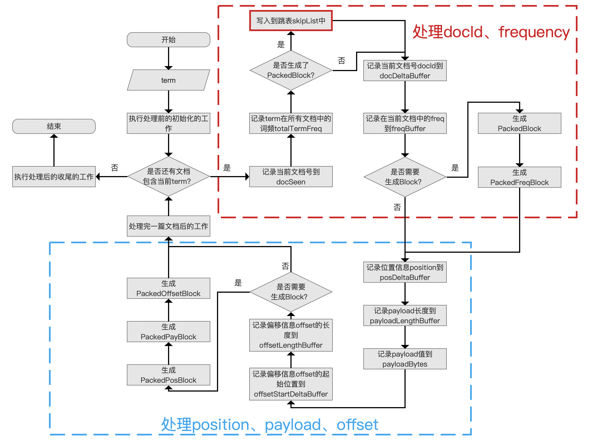
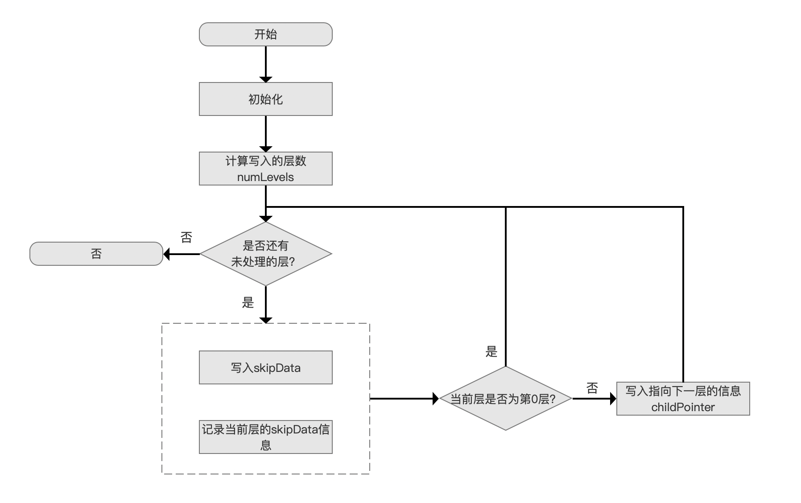
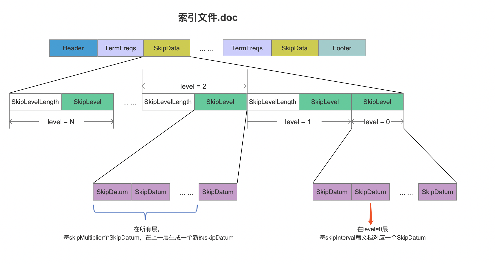
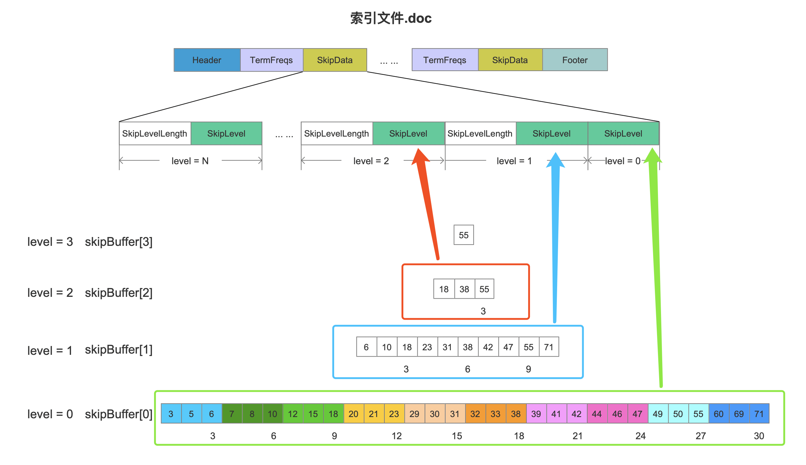
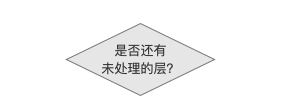
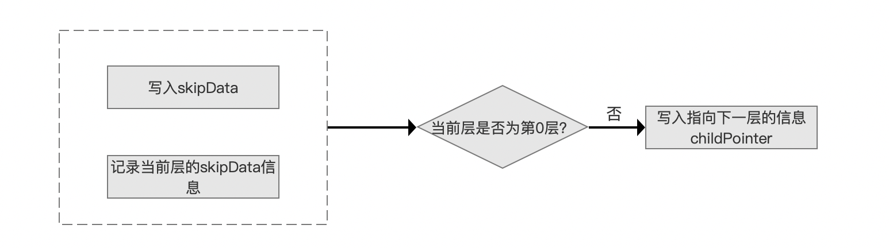
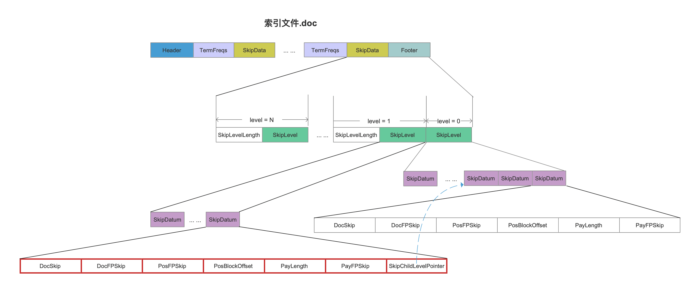
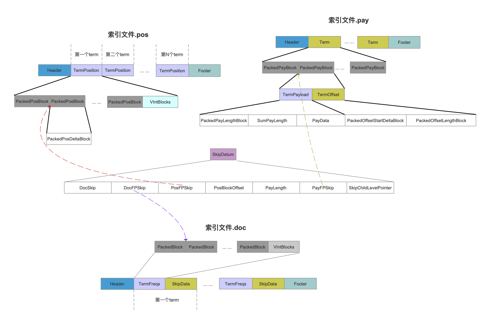

# [索引文件的生成（三）](https://www.amazingkoala.com.cn/Lucene/Index/)

&emsp;&emsp;在文章[索引文件的生成（一）](https://www.amazingkoala.com.cn/Lucene/Index/2019/1226/121.html)中我们说到，在生成[索引文件.doc](https://www.amazingkoala.com.cn/Lucene/suoyinwenjian/2019/0324/42.html)、[.pos、.pay](https://www.amazingkoala.com.cn/Lucene/suoyinwenjian/2019/0324/41.html)的过程中，当处理了128篇文档后会生成一个PackedBlock，并将这个PackedBlock的信息写入到跳表skipList中，使得在读取阶段能根据文档号快速跳转到目标PackedBlock，提高查询性能。

&emsp;&emsp;将PackedBlock的信息写入到跳表skipList的时机点如下图红色框所示：

图1：



&emsp;&emsp;本篇文章介绍下skipList的写入/读取的过程，在介绍之前，我们先大致的描述下跳表是什么，如下图所示：

图2：


&emsp;&emsp;图2中每一层中的数值描述的是信息的编号，例如在level=0中的数值"3"描述的是第3条信息，在写入的过程中，每处理skipMultiplier个信息就在上一层生成一个索引，例如在level=1中的第6条信息中有一个索引，他指向level=0的一个位置；level=2中的第38条信息，它包含一个索引，指向level=1中的一个位置。由此可见跳表是一个多层次的数据结构，除了第0层外，其他层中的每一条信息中拥有一个指向下一层的索引。

&emsp;&emsp;接着我们开始介绍在Lucene中如何生成以及读取SkipList。

## 写入到跳表skipList中的流程图

图3：



### 初始化

图4：


&emsp;&emsp;需要初始化的内容如下所示：

- skipInterval：该值描述了在level=0层，每处理skipInterval篇文档，就生成一个skipDatum，该值默认为128
- skipMultiplier：该值描述了在所有层，每处理skipMultiplier个skipDatum，就在上一层生成一个新的skipDatum，该值默认为8

&emsp;&emsp;skipInterval、skipMultiplier、skipDatum的关系在[索引文件.doc](https://www.amazingkoala.com.cn/Lucene/suoyinwenjian/2019/0324/42.html)中的关系如下所示：

图5：



- numberOfSkipLevels：该值描述的是我们即将生成的skipList中的层数，即图2中的level的最大值

**如何计算numberOfSkipLevels**：

&emsp;&emsp;根据上文中，skipInterval跟skipMultiplier的介绍，可以看出我们根据待处理的文档数量就可以计算出numberOfSkipLevels，计算公式如下：

```java
    int numberOfSkipLevels = 1 + MathUtil.log(df/skipInterval, skipMultiplier)
```

&emsp;&emsp;上述公式中，df（document frequency）即待处理的文档数量。

**待处理的文档数量是如何获得的**：

&emsp;&emsp;在[索引文件的生成（一）](https://www.amazingkoala.com.cn/Lucene/Index/2019/1226/121.html)中我们介绍了生成索引文件.doc的时机点，即在flush阶段，所以就可以根据的段的信息获得待处理的文档数量。

- skipBuffer\[ ]数组：该数组中存放的元素为每一层的数据，根据图2可以知道，该数据就是SkipDatum的集合，并且数组的元素数量为numberOfSkipLevels，skipBuffer\[ ]中每一个元素在[索引文件.doc](https://www.amazingkoala.com.cn/Lucene/suoyinwenjian/2019/0324/42.html)中对应为一个SkipLevel字段，如下所示：

图6：



### 计算写入的层数numLevels

图7：


&emsp;&emsp;根据当前已经处理的文档数量，预先计算出将待写入SkipDatum信息的层数，计算方式如下：

```java
int numLevels = 1;
// 计算出在level=0层有多少个SkipDatum
df /= skipInterval;
while ((df % skipMultiplier) == 0 && numLevels < numberOfSkipLevels)
{
    numLevels++;
    // 每skipMultiplier个SkipDatum就在上一层生成一个SkipDatum
    df /= skipMultiplier;
}
```

### 是否还有未处理的层？

图8：



&emsp;&emsp;在上一个流程中，如果numLevels的值 > 1，那么按照level从小到大依次处理。

### 层内处理

图9：



&emsp;&emsp;在`层内处理`的流程中，首先将在图1中`是否生成了PackedBlock`流程中生成的block信息生成一个SkipDatum写入到skipData中，block包含的信息如下图红框所示：

图10：



[点击]()查看大图

&emsp;&emsp;另外，在图10中，如果在level>0的层写入一个SkipDatum后，相比较在level=0中的SKipDatum，**它多了一个字段SkipChildLevelPointer**，它是一个指针，指向下一层的一个SkipDatum。

&emsp;&emsp;SkipDatum中的字段含义在文章[索引文件之.doc](https://www.amazingkoala.com.cn/Lucene/suoyinwenjian/2019/0324/42.html)中已经介绍，不赘述，另外图10中的SkipDatum中的信息除了SkipChildLevelPointer，其他所有的字段都是用**差值存储**，所以在图9中，我们需要执行`记录当前层的skipData信息`的流程，使得下一个同一层内的新生成的SkipDatum可以用来进行差值计算。

**SkipDatum中的字段干什么用的**

&emsp;&emsp;这些字段的作用正是用来展示跳表SkipList跳表在Lucene中的功能，它们作为指针来描述当前block在的其他索引文件中的位置信息。在文章[索引文件的生成（二）](https://www.amazingkoala.com.cn/Lucene/Index/2019/1227/122.html)中我们介绍图1中的`处理完一篇文档后的工作`流程点时，说到在该流程点生成了几个信息，他们跟SkipDatum中的字段的对应关系如下：

- lastBlockDocID：记录刚刚处理完的那篇文档的文档号，即**DocSkip**
- lastBlockPayFP：描述是处理完128篇文档后，在索引文件.pay中的位置信息，即**PayFPSkip**
- lastBlockPosFP：描述是处理完128篇文档后，在索引文件.pos中的位置信息，即**PosFPSkip**
- lastBlockPosBufferUpto：在posDeltaBuffer、payloadLengthBuffer、offsetStartDeltaBuffer、offsetLengthBuffer数组中的数组下标值，即**PosBlockOffset**
- lastBlockPayloadByteUpto：在payloadBytes数组中的数组下标值，即**PayLength**

&emsp;&emsp;另外还有DocFPSkip值并没有在`处理完一篇文档后的工作`流程中获取，该值描述的是在索引文件.doc当前可写入的位置，故直接可以获取。

&emsp;&emsp;SkipDatum中的字段与索引文件.doc、.pos、.pay的关系如下所示：

图11：



[点击]()查看大图

&emsp;&emsp;图10中，由于是按照每处理128篇文档才执行`写入到跳表skipList中`的流程，那么有可能此时位置信息position、偏移信息offset，payload信息没有生成一个PackedBlock，那么SkipDatum需要两个指针的组合才能找到在索引文件.pos、.pay中的位置，比如说我们需要PosFPSkip+PosBlockOffset的组合值才能找到位置信息（没明白的话说明你没有看文章[索引文件的生成（一）](https://www.amazingkoala.com.cn/Lucene/Index/2019/1226/121.html)以及[索引文件的生成（二）](https://www.amazingkoala.com.cn/Lucene/Index/2019/1227/122.html)）

## 结语

&emsp;&emsp;基于篇幅，读取的SkipList的逻辑将在下一篇文章中展开。

[点击](http://www.amazingkoala.com.cn/attachment/Lucene/Index/索引文件的生成/索引文件的生成（三）/索引文件的生成（三）.zip)下载附件