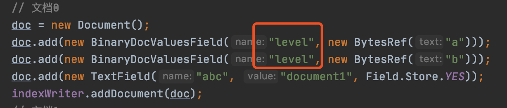
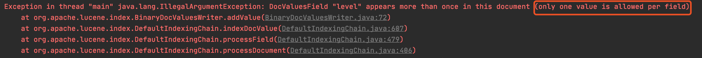
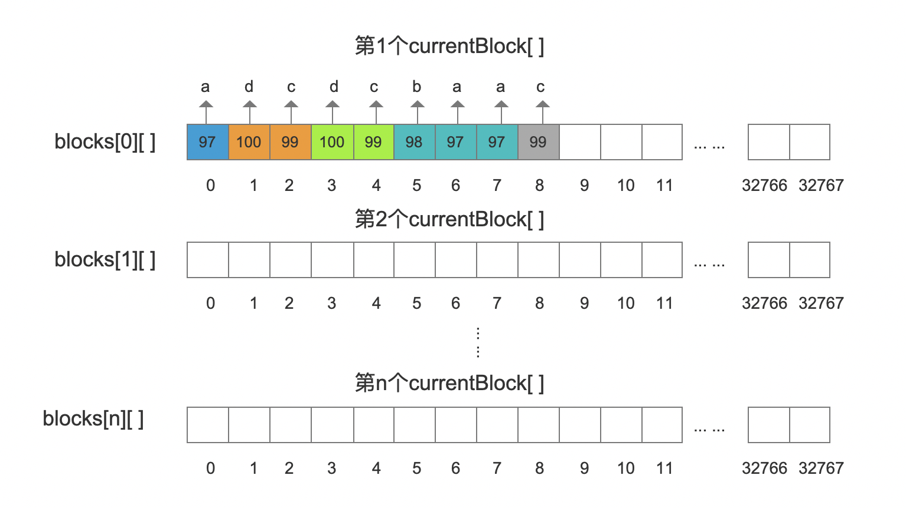
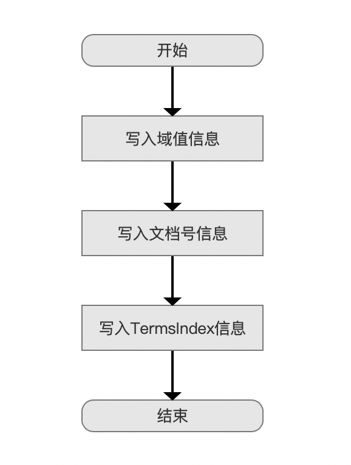
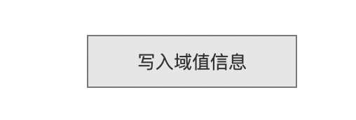
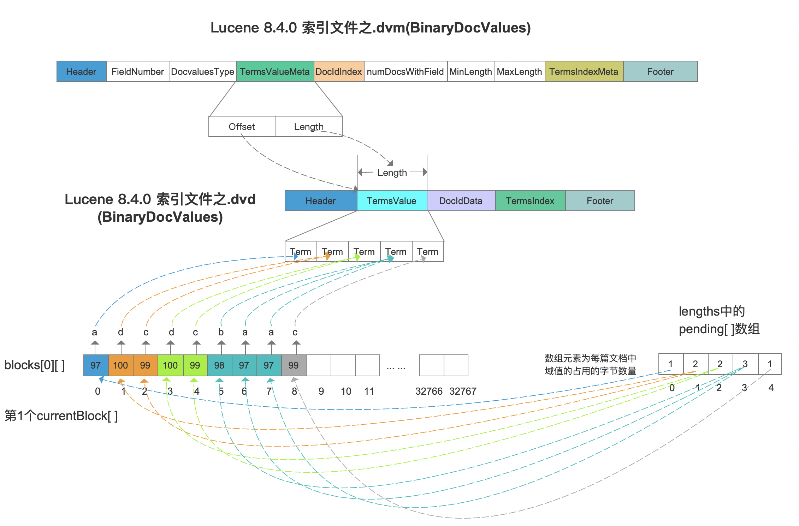
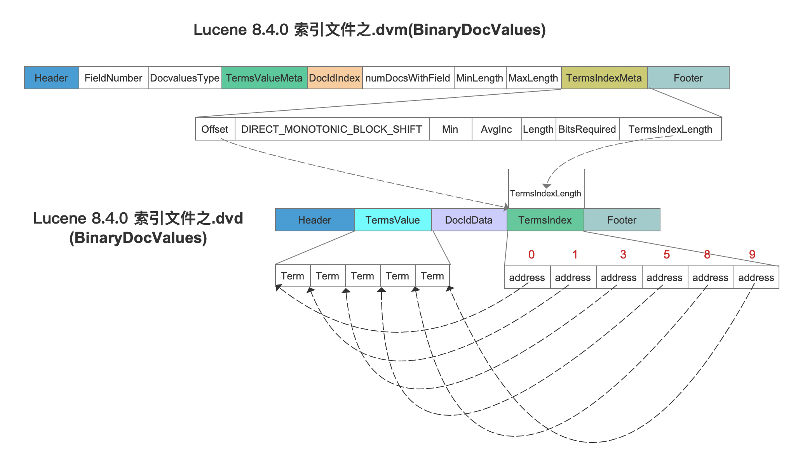

# [索引文件的生成（二十一）](https://www.amazingkoala.com.cn/Lucene/Index/)（Lucene 8.4.0）

&emsp;&emsp;索引文件.dvm&&.dvd中根据文档中包含的不同类型的DocValuesFields，包含下面的DocValues信息：

- BinaryDocValues：
- NumericDocValues：见文章[索引文件的生成（十五）之dvm&&dvd](https://www.amazingkoala.com.cn/Lucene/Index/2020/0507/139.html)
- SortedDocValues：见文章[索引文件的生成（十八）之dvm&&dvd](https://www.amazingkoala.com.cn/Lucene/Index/2020/0528/144.html)
- SortedNumericDocValues：见文章[索引文件的生成（十七）之dvm&&dvd](https://www.amazingkoala.com.cn/Lucene/Index/2020/0526/143.html)
- SortedSetDocValues：[索引文件的生成（十八）之dvm&&dvd](https://www.amazingkoala.com.cn/Lucene/Index/2020/0528/144.html)

&emsp;&emsp;本篇文章开始介绍生成索引文件.dvd、.dvm之BinaryDocValues的内容，在此之前，我们先介绍下在索引（index）阶段以及[flush](https://www.amazingkoala.com.cn/Lucene/Index/2019/0716/74.html)阶段，Lucene是如何收集文档中的BinaryDocValues的信息。

## BinaryDocValues

&emsp;&emsp;BinaryDocValues信息对应的是在文档中BinaryDocValuesField域中的信息，它同NumericDocValues、SortedDocValues一样，在一篇文档中，相同域名的BinaryDocValuesField只能有一个，否则就会报错，如下所示：

图1：

图2：

### 收集文档的BinaryDocValues信息

&emsp;&emsp;收集BinaryDocValues信息的代码入口方法为：https://github.com/LuXugang/Lucene-7.5.0/blob/master/solr-8.4.0/lucene/core/src/java/org/apache/lucene/index/BinaryDocValuesWriter.java 的 addValue(int docID, BytesRef value)方法，收集的信息有：DocId、bytes、lengths。

&emsp;&emsp;我们根据一个例子来介绍上述收集的信息，注意的是，图3中的文档2并没有包含BInaryDocValuesField：

图3：

#### DocId

&emsp;&emsp;DocId即包含BinaryDocValuesField域的文档的文档号，并且使用DocsWithFieldSet存储，DocsWithFieldSet存储文档号的过程在文章[索引文件的生成（十五）之dvm&&dvd](https://www.amazingkoala.com.cn/Lucene/Index/2020/0507/139.html)已经介绍，不赘述。

#### bytes

&emsp;&emsp;bytes在源码中是[PagedBytes](https://github.com/LuXugang/Lucene-7.5.0/blob/master/solr-8.4.0/lucene/core/src/java/org/apache/lucene/util/PagedBytes.java)对象，我们不用关心PagedBytes类的具体内容，我们只需要知道，在这个类中，有一个二维字节数组blocks\[ ]\[ ]以及一个字节数组currentBlock\[ ]，他们用来存储BinaryDocValuesField的域值，如下所示：

图4：

&emsp;&emsp;在实际写入过程中，二维数组blocks是动态成长的，当一个currentBlock[ ]中填满域值后，它会被写入到二维数组中，另外出于存储性能的考虑，currentBlock[ ]中每个字节都会被用于存储，这样使得可能某个域值会被分散在两个currentBlock[ ]中。

#### lengths

&emsp;&emsp;lengths是一个PackedLongValues.Builder对象，同样的我们不需要关心PackedLongValues.Builder的具体内容， 我们只需要知道，在这个类中，有一个pending数组，它用来收集**包含BinaryDocValuesField域的每篇文档中**的对应的域值长度，对于图3的例子如下所示：

图5：

&emsp;&emsp;域值的长度即域值占用的字节数量。

&emsp;&emsp;在索引阶段收集了lengths、bytes之后使得在生成索引文件.dvd、.dvm之BinaryDocValues时能获得域值的信息，下文将会作出介绍。

## 生成索引文件.dvd、.dvm之BinaryDocValues

&emsp;&emsp;在索引阶段收集完BinaryDocValues的信息后，随后在flush()阶段会将这些信息写入到索引文件.dvd、.dvd中，流程图如下：

图6：

### 写入域值信息

图7：

&emsp;&emsp;在当前流程点，即通过上文中的bytes以及lengths获取域值，然后写入到索引文件.dvd中，如下所示：

图8：

&emsp;&emsp;根据pending[ ]数组中数组元素，读取出包含BinaryDocValues的文档的域值的长度，然后去blocks\[ ]\[ ]中读取对应长度的字节数，这些字节组成一个term存储到索引文件TermsValue字段的Term中。另外需要在索引文件.dvm中生成TermsValueMata字段用来在读取阶段获取TermsValue字段在索引文件.dvd的数据区间。

### 写入文档号信息

图9：

&emsp;&emsp;文档号信息的存储跟SortedDocValues、SortedSetDocValues、NumericDocValues一致的，都是生成图8中DocIdData、DocIdIndex字段的数据结构，不赘述，可以阅读文章[索引文件的生成（十六）之dvm&&dvd](https://www.amazingkoala.com.cn/Lucene/Index/2020/0518/142.html)。

### 写入TermsIndex信息

图10：

&emsp;&emsp;从图8中可以看出，TermsValue中所有域值都是连续存储，那么还需要增加TermsIndex信息来描述一个term的长度，才能在读取阶段分离出每一个term，如下所示：

图11：

&emsp;&emsp;图11中，TermsIndex中的address记录了每个term的相对于第一个term的距离，可以看出每个address的差值为一个term的占用的字节数量，另外还需要在索引文件.dvm中生成TermsIndexMeta用来在读取阶段能获取TermsIndex字段在索引文件.dvd中的数据区间。

## 结语

&emsp;&emsp;上文中未介绍的字段含义请看文章[BinaryDocValues](https://www.amazingkoala.com.cn/Lucene/DocValues/2019/0412/49.html)。

&emsp;&emsp;从下一篇文章开始，我们将介绍索引文件.dvm、dvd的读取过程，届时还会介绍这几种DocValues的用法差异等等。

[点击](http://www.amazingkoala.com.cn/attachment/Lucene/Index/索引文件的生成/索引文件的生成（二十一）/索引文件的生成（二十一）.zip)下载附件

