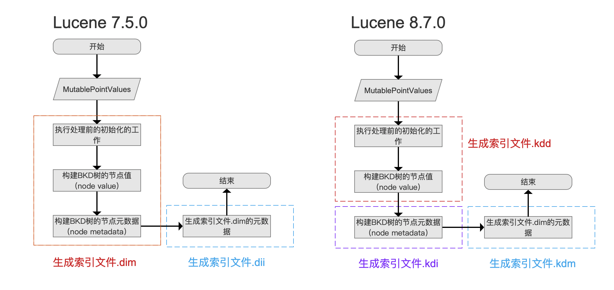
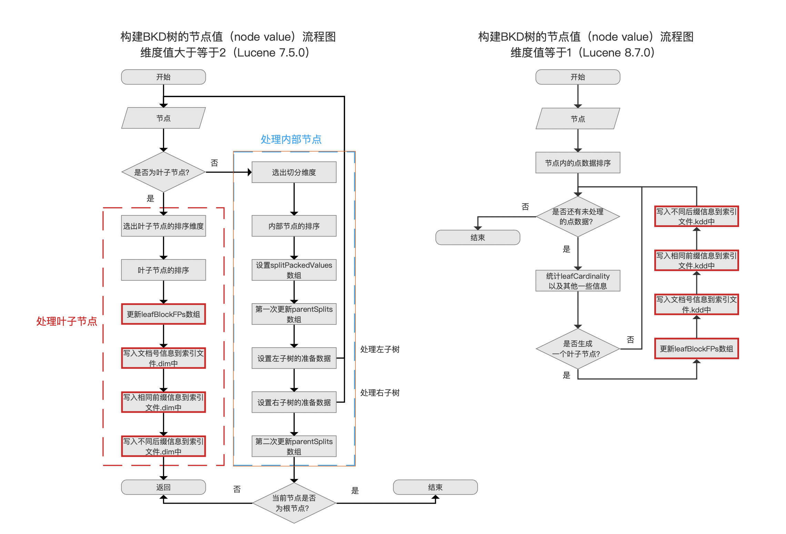
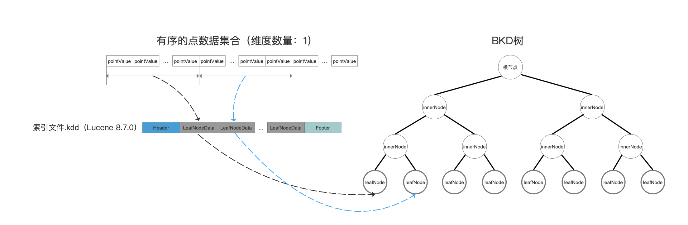
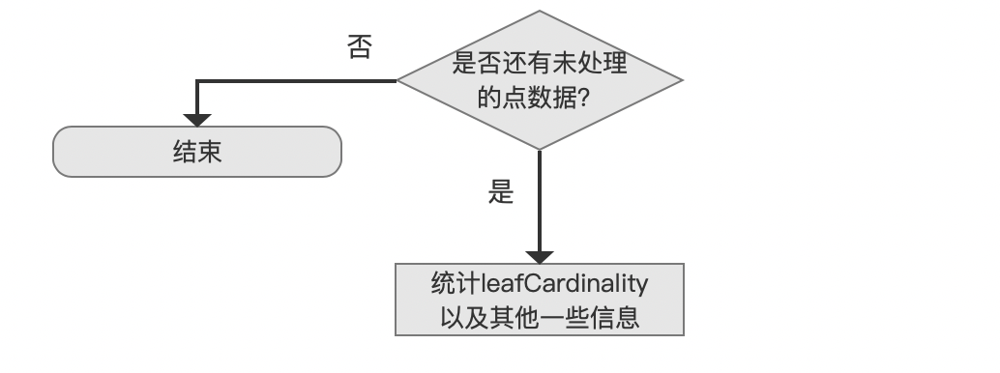
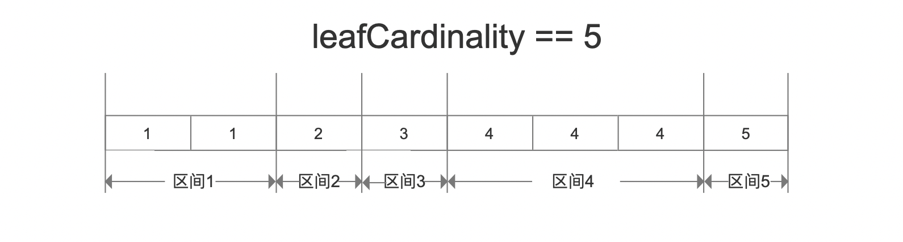
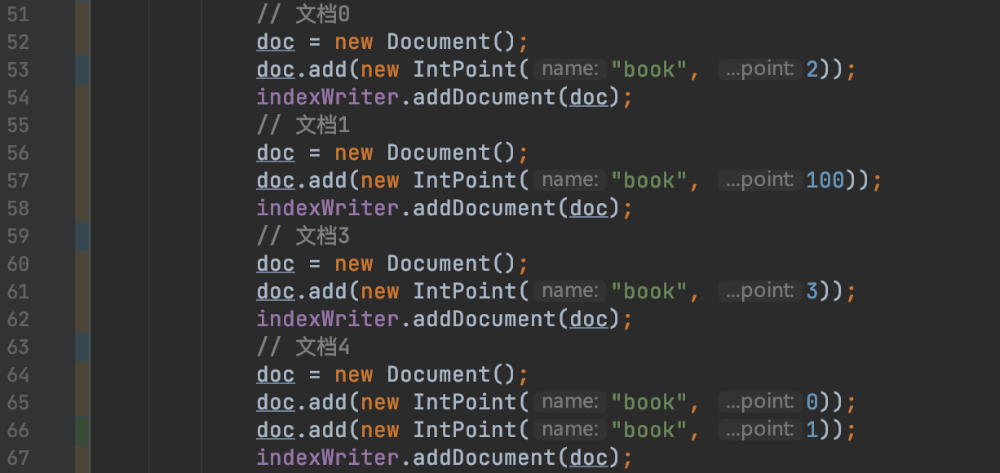
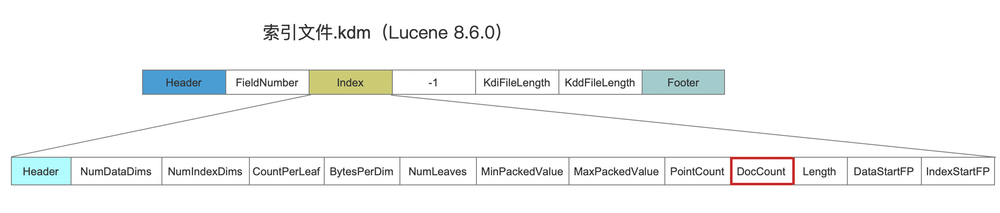

# [索引文件的生成（二十五）](https://www.amazingkoala.com.cn/Lucene/Index/)（Lucene 8.7.0）

&emsp;&emsp;在系列文章[索引文件的生成](https://www.amazingkoala.com.cn/Lucene/Index/2020/0329/128.html)（Lucene 7.5.0）中，我们介绍了存储**维度（见文章[Bkd-Tree](https://www.amazingkoala.com.cn/Lucene/gongjulei/2019/0422/52.html)）值大于等于2**的数值类型对应的索引文件的生成过程。对于**维度值等于1**的情况，其生成过程有少许的不同。为了后续便于介绍该类型的索引文件的合并，我们需要再写一篇文章来介绍其生成过程。

## 索引文件的变更

图1：

&emsp;&emsp;从Lucene 8.6.0开始，用于存储点数据（point value）的索引文件由原先的[索引文件dim&&dii](https://www.amazingkoala.com.cn/Lucene/suoyinwenjian/2019/0424/53.html)，改为三个[索引文件kdd&kdi&kdm](https://www.amazingkoala.com.cn/Lucene/suoyinwenjian/2020/1027/172.html)，其变更的目的可以看这个[issue](https://issues.apache.org/jira/browse/LUCENE-9148)，本文中不展开讨论。

&emsp;&emsp;给出图1的目的是为了说明，点数据对应的索引文件，其生成的总体流程没有太大变动的，下文中介绍维度值为1的生成过程（**基于Lucene 8.7.0**）时，只会介绍与维度值大于等于2的不同的流程点，其相同的流程点可以参考系列文章[索引文件的生成](https://www.amazingkoala.com.cn/Lucene/Index/2020/0329/128.html)（**基于Lucene 7.5.0**）。

## 差异

&emsp;&emsp;维度值为1的生成索引文件的过程中，**唯一**不同点在于图1中的流程点`构建BKD树的节点值（node value）`，如下所示：

图2：

[点击]()查看大图

&emsp;&emsp;图2中，红框标注的流程点表示在这些流程点的处理方式是一致的。

## 生成索引文件kdd&kdi&kdm的流程图

图3：

### 节点

图4：

&emsp;&emsp;流程点`节点`中包含了在索引（Indexing）期间收集的点数据信息，收集相关的介绍见文章[索引文件的生成（八）](https://www.amazingkoala.com.cn/Lucene/Index/2020/0329/128.html)。

### 节点内的点数据排序

图5：

&emsp;&emsp;无论维度的数量是多少，最终生成的bkd树的每个叶子节点中的点数据是有序的。对于维度大于等于2的情况，叶子节点中点数据的排序规则取决这个叶子节点的父节点在进行左右子树划分时选择的某个维度，对应图2中流程点`内部节点的排序`，该流程点的详细介绍见文章[索引文件的生成（十）](https://www.amazingkoala.com.cn/Lucene/Index/2020/0408/130.html)。对于维度等于1的情况，由于不用考虑选择哪个维度进行排序，所以对于某个**点数据域**来说，直接对flush/commit收集到的全量点数据进行排序即可，随后对这个有序的集合**按块划分**（下文会介绍）后，每一块中的点数据集合将被写入到一个叶子节点，如下所示。另外排序使用的算法为最大有效位的基数排序(MSB radix sort)。

图6：

[点击]()查看大图

&emsp;&emsp;当然了，排序过程中并不会真正的去改变排序前的点数据集合，通过一个int类型的ord[ \]实现一个映射关系来描述排序关系。同样关于ord[ \]数组的介绍可以看文章 [索引文件的生成（十）之dim&&dii](https://www.amazingkoala.com.cn/Lucene/Index/2020/0408/130.html)。

### 统计leafCardinality以及其他一些信息

图7：

&emsp;&emsp;在获得了有序的点数据集合后，接着有序的依次取出每一个点数据，每处理一个点数据，需要统计leafCardinality以及其他一些信息。

#### leafCardinality

&emsp;&emsp;对于一个有序的集合，可以划分为一个或多个区间，要求每个区间内至少包含一个数据，如果包含多个数据，那么要求所有的数据是相同的，leafCardinality描述的正是区间数量。

图8：

&emsp;&emsp;随后在图2的流程点`写入不同后缀信息到索引文件.kdd中`中，会根据根据leafCardinality的值来选择（用于来判断是否使用游标编码（Run Length Encoding）存储）存储开销较低的数据结构来存储点数据的后缀信息。同样的，详细的过程见文章[索引文件的生成（十三）](https://www.amazingkoala.com.cn/Lucene/Index/2020/0418/133.html)的介绍。

#### 其他一些信息

&emsp;&emsp;处理统计leafCardinality的值，还需要计算下面一些信息：

- docsSeen：docsSeen是一个[FixedBitSet](https://www.amazingkoala.com.cn/Lucene/gongjulei/2019/0404/45.html)对象，用来去重记录包含某个点数据域的文档的数量：

图9：

&emsp;&emsp;图9中，由于文档4中添加了两次IntPoint，那么在点数据的收集阶段，会认为一共收集了5个点数据。通过docsSeen可以正确的统计文档的数量，该值将被写入到索引文件.kdm的DocCount字段中：

图10：

- leafDocs[ ]：用来统计即将写入到叶子节点的文档号，文档号为段内文档号。leafDocs[\]中的数组元素不是有序的，数组元素对应的点数据的值是有序的。

### 是否生成一个叶子节点？

图11：

&emsp;&emsp;在前面的流程中，当处理了maxPointsInLeafNode个点数据后（即上文中提到的**按块划分**），则满足条件生成一个叶子节点。

####  maxPointsInLeafNode

&emsp;&emsp;maxPointsInLeafNode描述的是叶子节点中允许存储的点数据的数量最大值（max points allowed on a Leaf block）。maxPointsInLeafNode的默认值为512。

### 其他流程点

&emsp;&emsp;图3中未介绍的流程点可以查看文章[索引文件的生成（十二）之dim&&dii](https://www.amazingkoala.com.cn/Lucene/Index/2020/0415/132.html)、[索引文件的生成（十三）之dim&&dii](https://www.amazingkoala.com.cn/Lucene/Index/2020/0418/133.html)，不赘述。

## 结语

&emsp;&emsp;无

[点击](http://www.amazingkoala.com.cn/attachment/Lucene/Index/索引文件的生成/索引文件的生成（二十五）/索引文件的生成（二十五）.zip)下载附件

