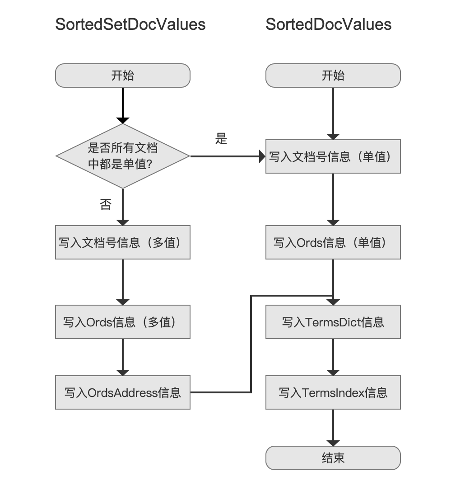
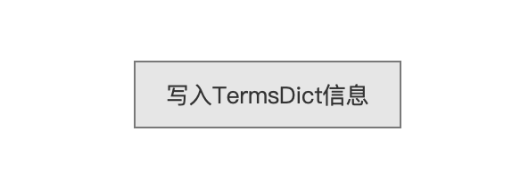
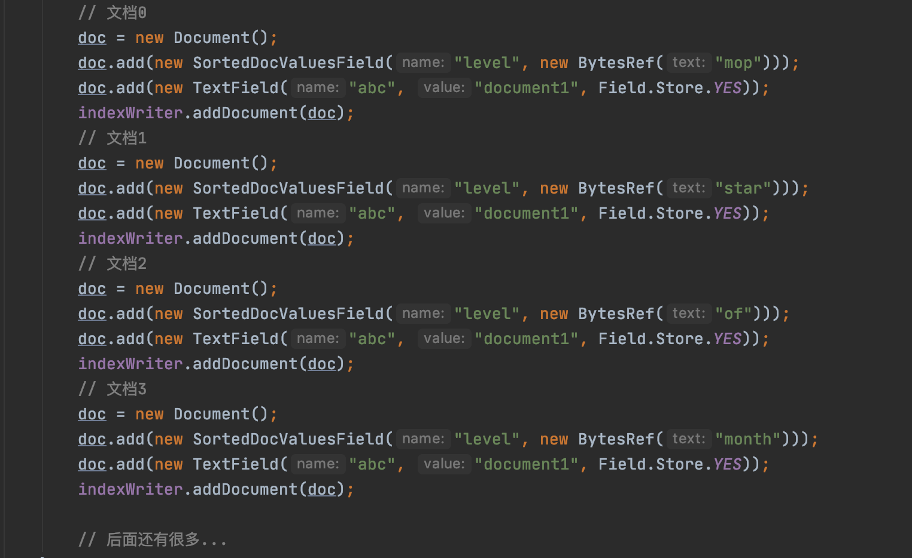
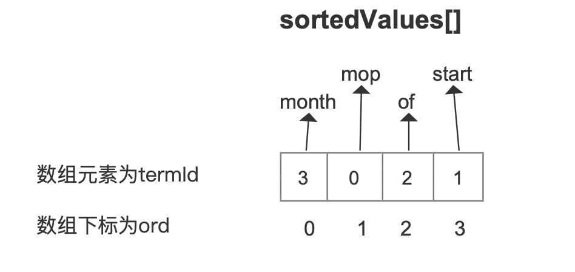
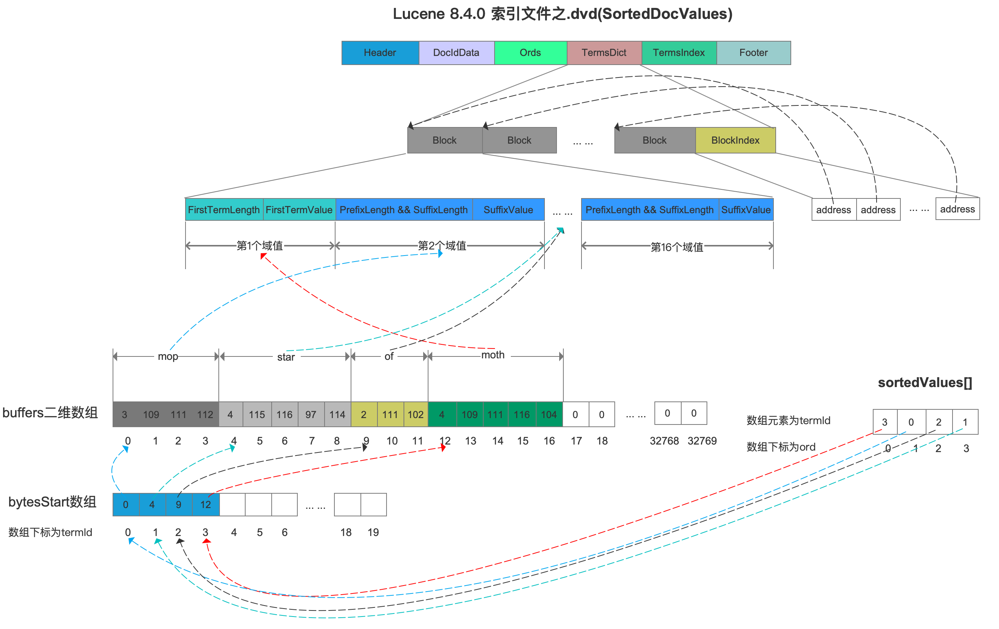
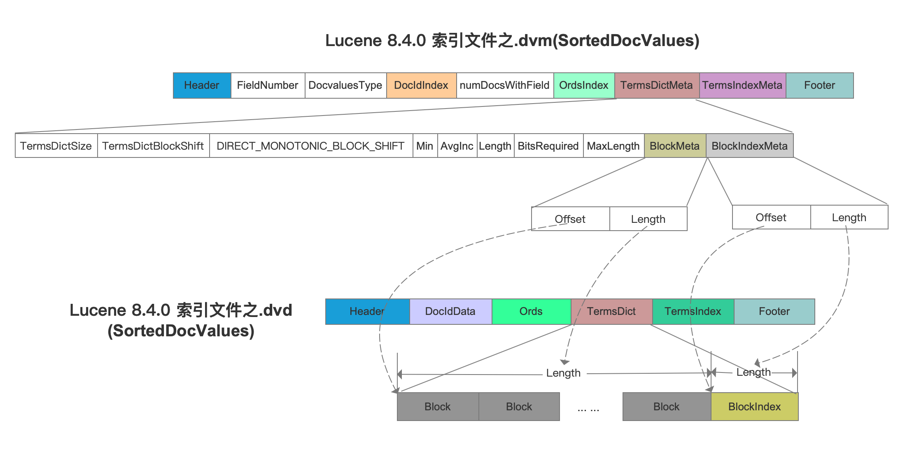
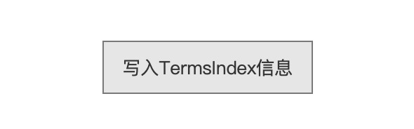
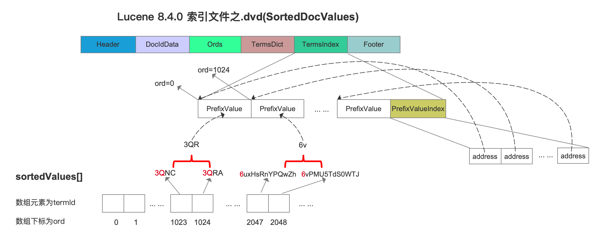
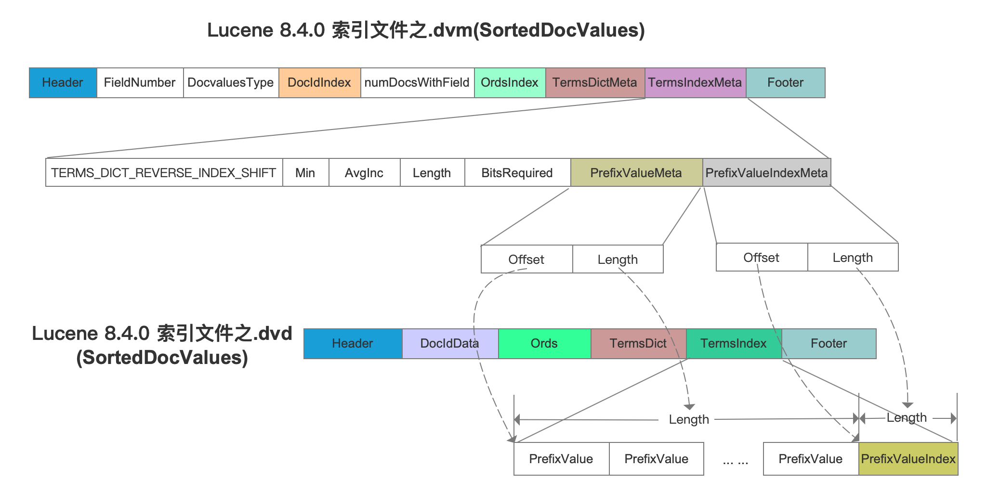

# [索引文件的生成（二十）](https://www.amazingkoala.com.cn/Lucene/Index/)（Lucene 8.4.0）

&emsp;&emsp;本文承接文章[索引文件的生成（十九）之dvm&&dvd](https://www.amazingkoala.com.cn/Lucene/Index/2020/0531/145.html)继续介绍剩余的内容。

## 生成索引文件.dvd、.dvm之SortedDocValues、SortedSetDocValues

&emsp;&emsp;生成索引文件.dvd、.dvm之SortedDocValues、SortedSetDocValues的流程图：

图1：

### 写入TermsDict信息

图2：

&emsp;&emsp;在当前流程点，将存储SortedDocValues、SortedSetDocValues对应的所有域值按照字典序写入到索引文件中，在文章[索引文件的生成（十八）之dvm&&dvd](https://www.amazingkoala.com.cn/Lucene/Index/2020/0528/144.html)我们知道，在索引阶段，我们已经通过sortedValues[ ]数组收集了所有种类的域值。

&emsp;&emsp;我们通过例子来介绍TermDict的数据结构如下所示：

图3：

&emsp;&emsp;图3的例子中，为了便于画图，我们只介绍前4篇文档的存储详情，在文章[索引文件的生成（十八）之dvm&&dvd](https://www.amazingkoala.com.cn/Lucene/Index/2020/0528/144.html)中我们已经介绍了termId的概念，故这里不赘述，直接给出前4篇文档中SortedDocValuesField中的域值对应的termId：

| 域值  | termId |
| :---: | :----: |
|  mop  |   0    |
| star  |   1    |
|  of   |   2    |
| month |   3    |

&emsp;&emsp;sortedValues[ ]数组中的数组元素为termId，并且数组元素是有序的，但是排序规则不是按照数组元素的值，即termId，而是按照termId对应的域值的字典序，故sortedValues[ ]数组如下所示：

图4：

&emsp;&emsp;随后依次读取sortedValues[ ]数组中每一个termId，找到termId对应的域值，将这些域值写入到索引文件.dvd中，可见是按照域值从小到大的顺序（字典序）写入的，如下所示：

图5：

[查看]()大图

&emsp;&emsp;图5中，根据sortedValues\[ ] 数组中的termId作为bytesStart\[ ]数组的下标值，从bytesStart\[ ]数组获取域值在buffers二维数组中的起始位置，最后在buffers二维数组中获取到在索引期间存储的域值，其中bytesStart\[ ]数组、buffers二维数组的介绍见文章[ByteRefHash](https://www.amazingkoala.com.cn/Lucene/gongjulei/2019/0218/32.html)，在那篇文章中，sortedValues[ ]数组即排序后的ids[]数组。

&emsp;&emsp;随后每处理16个域值，就生成一个block，并且通过BlockIndex字段来实现在索引阶段对block的随机访问，详细的读取过程将在后续的文章中介绍。

&emsp;&emsp;同时在索引文件.dvm中需要生成TermsDictMeta，它相当于作为索引，在读取阶段获取TermsDict字段在索引文件.dvd中的数据区间，如下所示：

图6：

&emsp;&emsp;图6中，分别通过BlockMeta字段、BlockIndexMeta字段来获取所有的Block、BlockIndex字段在索引文件.dvd中的数据区间，另外其他字段的介绍见文章[SortedDocValues](https://www.amazingkoala.com.cn/Lucene/DocValues/2019/0219/34.html)。

### 写入TermsIndex信息

图7：

&emsp;&emsp;在当前流程点，跟写入TermsDict信息一样，依次读取sortedValues\[ ] 数组并获取到域值，不同的是，每处理1024个域值会生成一个PrefixValue，这里要说明的是PrefixValue这个名字起的不是很好，应该换成源码中的sortKey更为贴切，但由于在文章[SortedDocValues](https://www.amazingkoala.com.cn/Lucene/DocValues/2019/0219/34.html)已经用了PrefixValue，所以继续沿用，我们直接给出索引文件的数据结构来简单提下PrefixValue的作用，其详细的过程将会在后面的文章中展开：

图8：

&emsp;&emsp;图8中，省去了通过sortedValues\[ ] 数组的数组元素，即termId获取域值的过程，同图5，直接给出域值，故图中的sortedValues\[ ]数组没有画出termId，以sortedValues\[ ] 数组中下标值1023、1024为例，先找出两个域值的相同前缀，即"3Q"，然后读取下标值为1024的域值的后缀值的第一个字节，即"R"，然后将"3QR"作为PrefixValue写入到TermsIndex中，这么做目的在于，我们在搜索阶段，如果提供了一个域值，那么通过二分法可以快速的判断该域值在哪一个PrefixValue的区间，就可以获得这个PrefixValue对应的ord值，最后通过ord去TermsDict中继续查找，同样详细的过程将在后面的文章中展开。

&emsp;&emsp;同时在索引文件.dvm中需要生成TermsIndexMeta，它相当于作为索引，在读取阶段获取TermsIndex字段在索引文件.dvd中的数据区间，如下所示：

图9：

&emsp;&emsp;SorteSetDocValues对应的TermsDict、TermsIndex信息跟SortedDocValues是一致的，不赘述。

## 结语

&emsp;&emsp;至此，生成索引文件.dvd、.dvm之SortedDocValues、SortedSetDocValues的流程介绍完毕，下一篇文章将会介绍在读取阶段如何通过上文中存储的DocValues信息来实现排序的原理。

[点击](http://www.amazingkoala.com.cn/attachment/Lucene/Index/索引文件的生成/索引文件的生成（二十）/索引文件的生成（二十）.zip)下载附件

