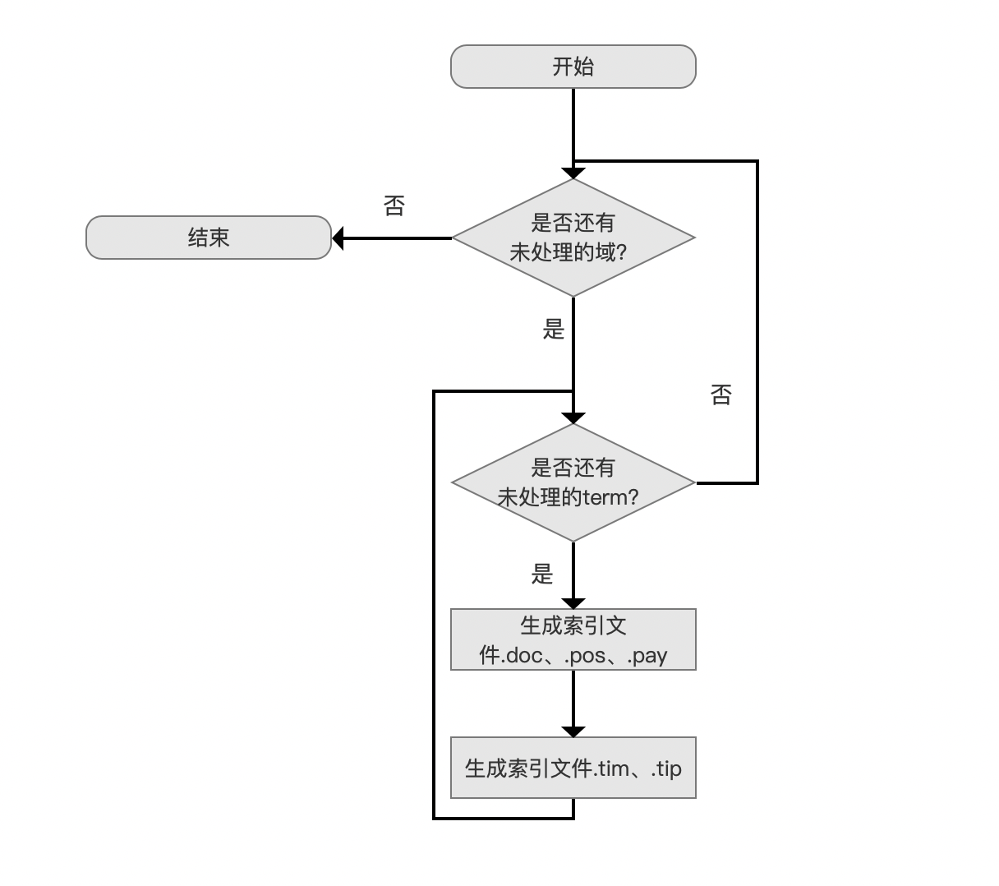
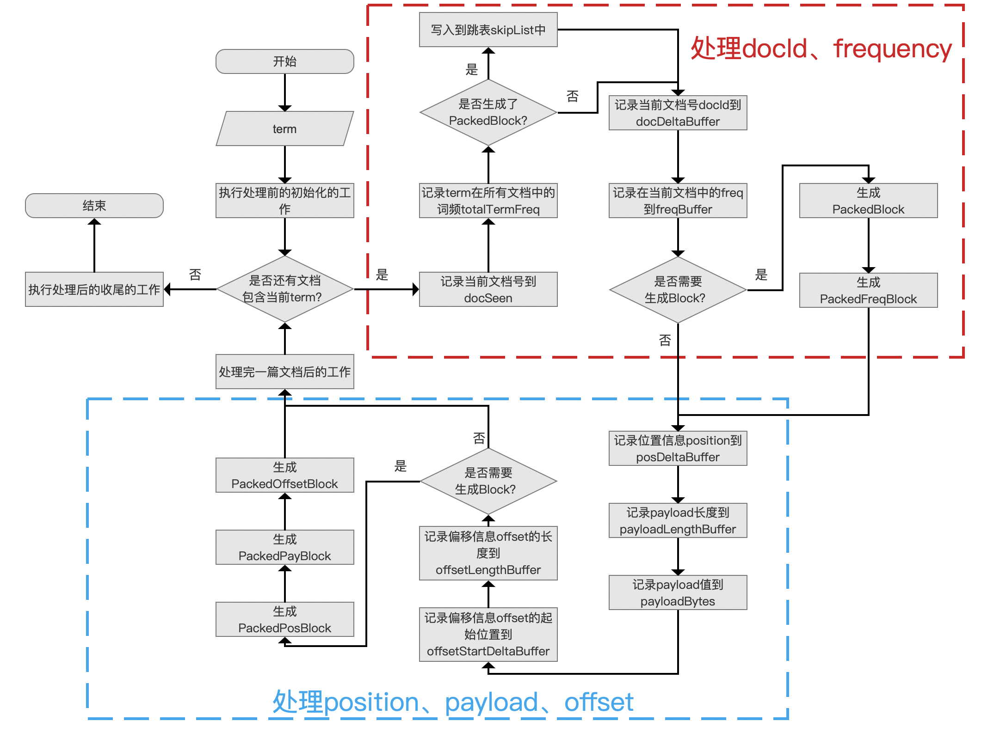
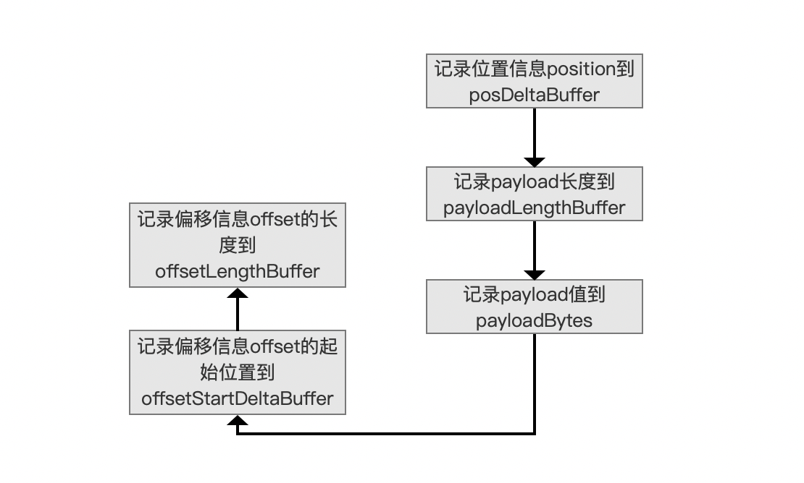
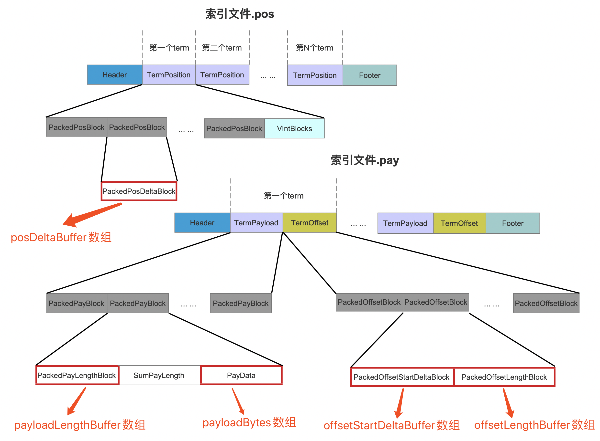
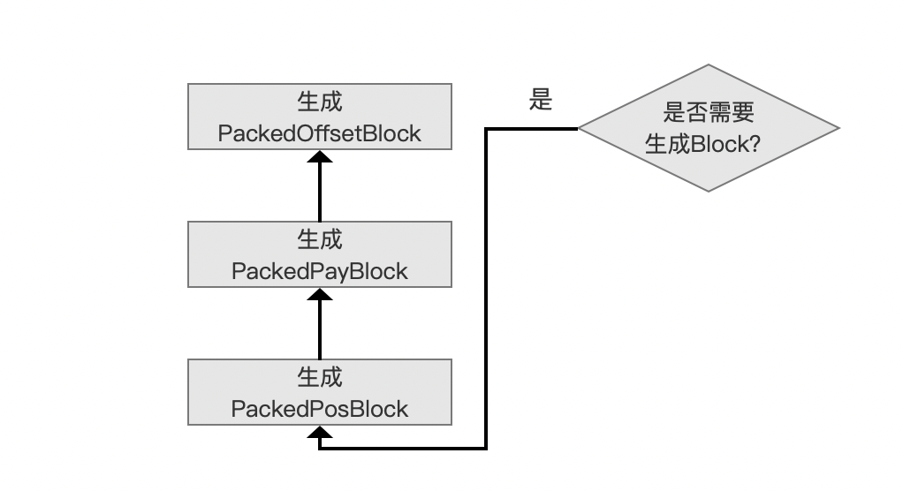
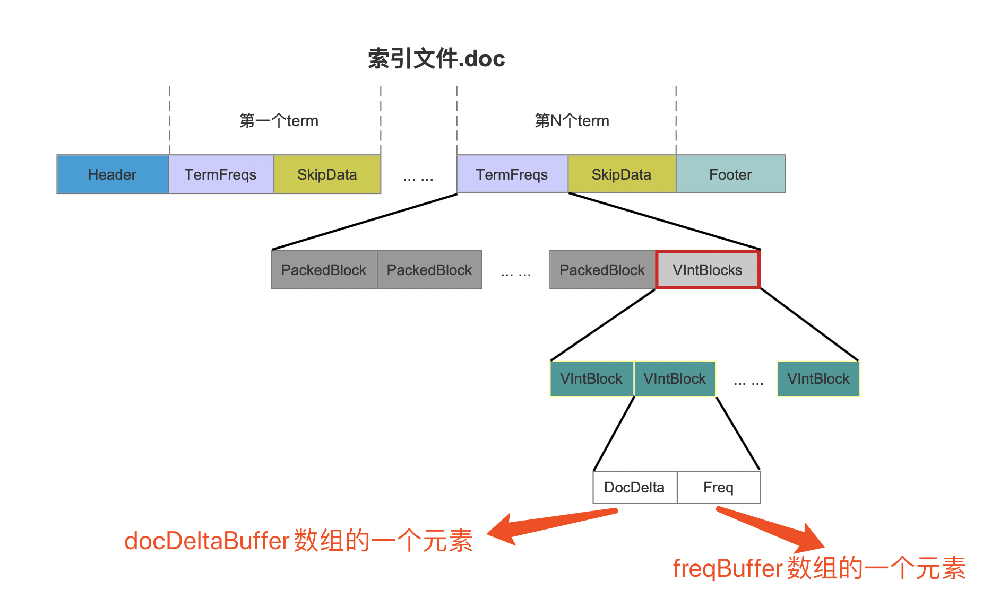
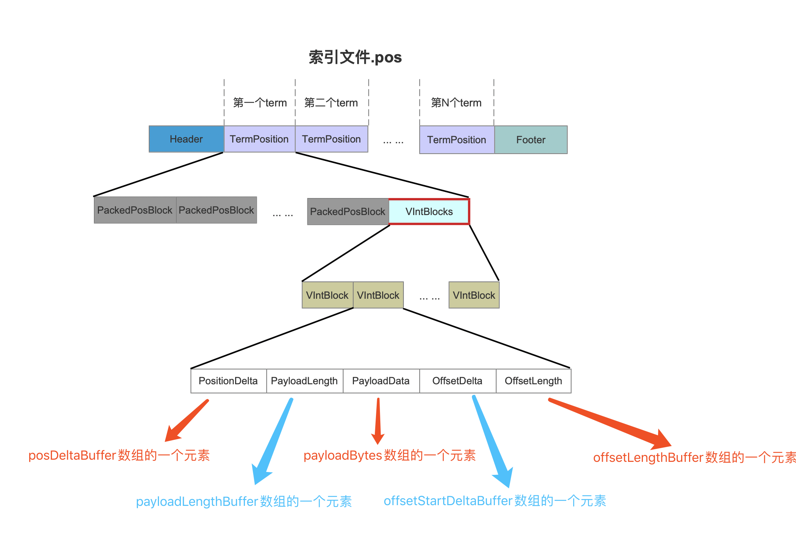

# [索引文件的生成（二）](https://www.amazingkoala.com.cn/Lucene/Index/)

&emsp;&emsp;本文承接[索引文件的生成（一）](https://www.amazingkoala.com.cn/Lucene/Index/2019/1226/121.html)，继续介绍剩余的内容。

## 生成索引文件.tim、.tip、.doc、.pos、.pay的流程图

图1：



&emsp;&emsp;我们继续介绍流程点`生成索引文件.doc、.pos、.pay`。

### 生成索引文件.doc、.pos、.pay的流程图

图2：



#### 记录位置信息position、payload、偏移信息offset

图3：



&emsp;&emsp;当前term在一篇文档中的所有位置信息position以及偏移信息offset的起始位置是有序的，所以可以跟文档号一样（见[索引文件的生成（一）](https://www.amazingkoala.com.cn/Lucene/Index/2019/1226/121.html)关于数组docDeltaBuffer的介绍），分别使用差值存储到数组posDeltaBuffer、offsetStartDeltaBuffer中，而图3中其他数组，payloadLengthBuffer、payloadBytes、offsetLengthBuffer则只能存储原始数据。另外要说的是，在处理的过程中，有些位置是不带有payload信息，那么对应payloadLengthBuffer中的数组元素为0。

&emsp;&emsp;这几个数组对应在[索引文件.pos、.pay](https://www.amazingkoala.com.cn/Lucene/suoyinwenjian/2019/0324/41.html)中的位置如下所示：

图4：



&emsp;&emsp;另外图4中的索引文件.pay中的字段SumPayLength描述的是当前block中PayData的的长度，在读取阶段用来确认PayData在索引文件.pay中的数据区间。

#### 是否需要生成Block？

图5：



&emsp;&emsp;当处理128个当前term的位置信息position后，即posDeltaBuffer数组中的元素个数达到128，那么就要生成三个block：PackedPosBlock、PackedPayBlock、PackedOffsetBlock，即图4中的灰色标注的字段。

**为什么要生成PackedBlock**：

&emsp;&emsp;当然是为了降低存储空间的使用量，至于能压缩率是多少，可以看[PackedInts](https://www.amazingkoala.com.cn/Lucene/yasuocunchu/2019/1217/118.html)文章的介绍。

**为什么选择128作为生成PackedBlock的阈值**：

&emsp;&emsp;先给出源码中的注释：

```java
    must be multiple of 64 because of PackedInts long-aligned encoding/decoding
```

&emsp;&emsp;注释中要求阈值只要是64的倍数就行，目的是能字节对齐。因为在使用[PackedInts](https://www.amazingkoala.com.cn/Lucene/yasuocunchu/2019/1217/118.html)实现压缩存储后的数据用long类型的数组存储，如果待处理的数据集（例如posDeltaBuffer数组）使用**固定字节按位存储**（见[PackedInts（一）](https://www.amazingkoala.com.cn/Lucene/yasuocunchu/2019/1217/118.html)），那么只要数据集中的数量是64的倍数，就能按照64对齐，即long类型数组中的每一个long中每一个bit位都是有效数据。至于为什么是128，本人不做妄加猜测，目前没有弄明白。

#### 处理完一篇文档后的工作

图6：


&emsp;&emsp;每处理完一篇包含当前term的文档，我们需要判断下我们目前处理的文档总数是否达到128篇，如果没有达到，那么该流程什么也不做，否则需要记录下面的信息：

- lastBlockDocID：记录刚刚处理完的那篇文档的文档号
- lastBlockPayFP：描述是处理完128篇文档后，在索引文件.pay中的位置信息
- lastBlockPosFP：描述是处理完128篇文档后，，在索引文件.pos中的位置信息
- lastBlockPosBufferUpto：在posDeltaBuffer、payloadLengthBuffer、offsetStartDeltaBuffer、offsetLengthBuffer数组中的数组下标值
- lastBlockPayloadByteUpto：在payloadBytes数组中的数组下标值

**上述的信息有什么**：

&emsp;&emsp;上述信息作为参数用来生成跳表SkipList，在介绍SkipList时再介绍这些参数，在这里我们只要知道这些信息的生成时机点。

#### 执行处理后的收尾工作

图7：


&emsp;&emsp;当处理完所有包含当前term的文档后，我们需要`执行处理后的收尾工作`。在前面的流程中，我们知道，每处理128篇文档或者128个位置信息position就会分别生成Block，如果包含当前term的文档的数量或者位置信息总数不是128的倍数，那么到此流程，docDeltaBuffer、freqBuffer（见[索引文件的生成（一）](https://www.amazingkoala.com.cn/Lucene/Index/2019/1226/121.html)）、posDeltaBuffer、payloadLengthBuffer、payloadBytes、offsetStartDeltaBuffer、offsetLengthBuffer数组会有未处理的信息，而当前流程就是处理这些信息。

&emsp;&emsp;对于docDeltaBuffer、freqBuffer数组中的信息，将会被存储到[索引文件.doc](https://www.amazingkoala.com.cn/Lucene/suoyinwenjian/2019/0324/42.html)的VIntBlocks中，如下所示：

图8：




&emsp;&emsp;在docDeltaBuffer、freqBuffer数组中，当前term在一篇文档的文档号以及词频信息用图8中的一个VIntBlock来存储，VIntBlock的个数跟docDeltaBuffer、freqBuffer数组的数组大小一致。

&emsp;&emsp;这里存储DocDelta、Freq的有一个优化设计：组合存储（见[倒排表（上）](https://www.amazingkoala.com.cn/Lucene/Index/2019/0222/36.html)中关于组合存储的介绍）。

&emsp;&emsp;对于posDeltaBuffer、payloadLengthBuffer、payloadBytes、offsetStartDeltaBuffer、offsetLengthBuffer数组中的信息，将会被存储到[索引文件.pos](https://www.amazingkoala.com.cn/Lucene/suoyinwenjian/2019/0324/41.html)的VIntBlocks中，如下所示：

图9：



## 结语 

&emsp;&emsp;至此，除了跳表SkipList（下一篇文章介绍），生成索引文件.doc、.pos、.pay的流程介绍完毕。

[点击]()下载附件

