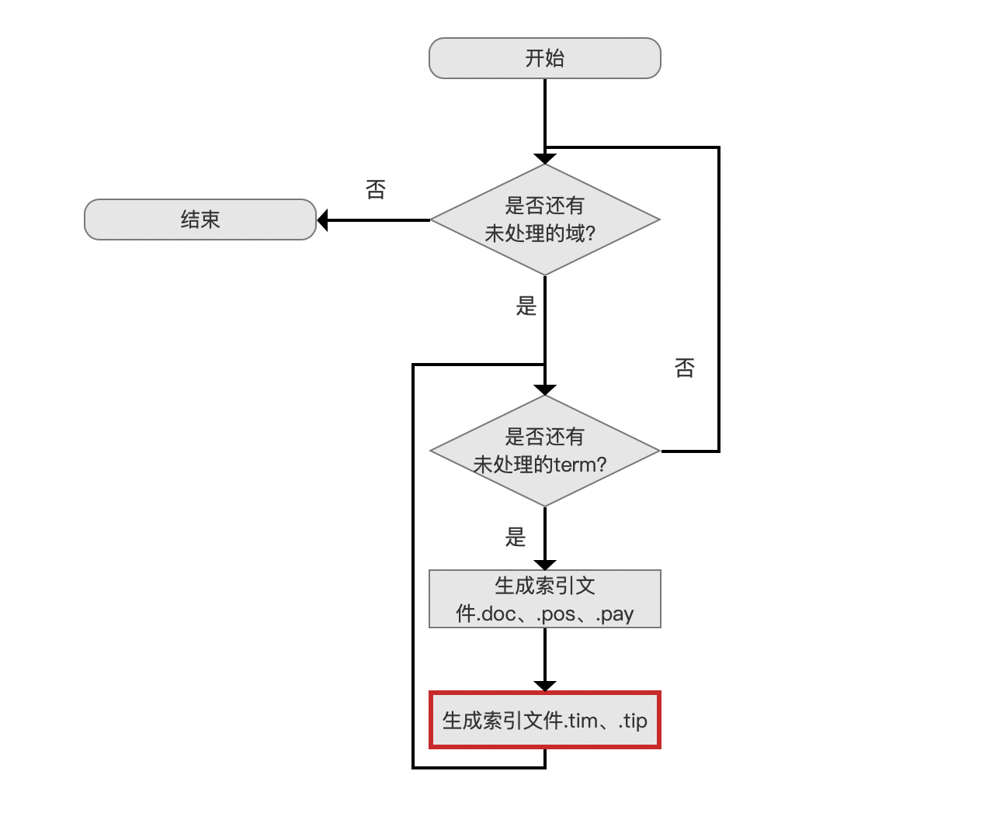
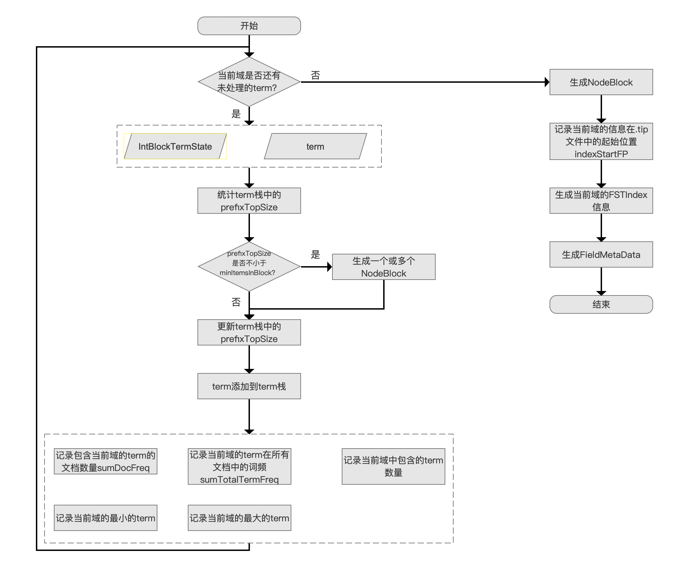
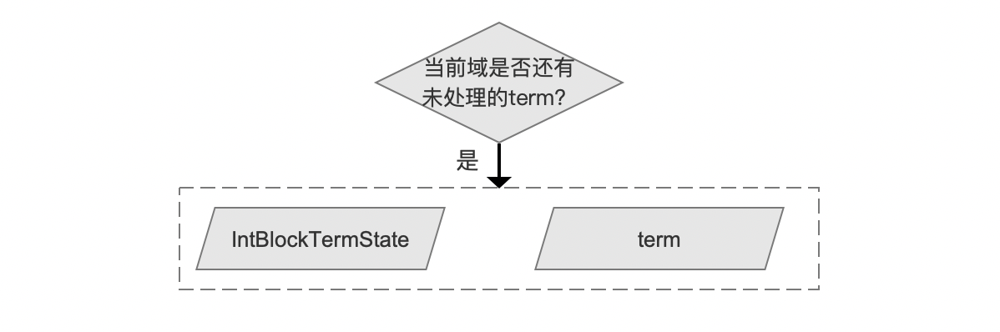
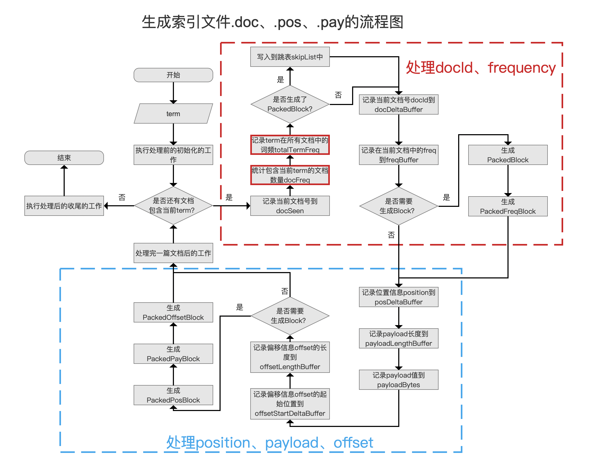
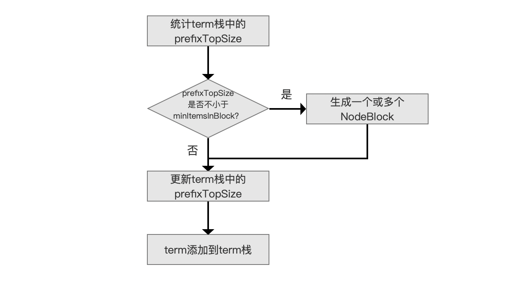
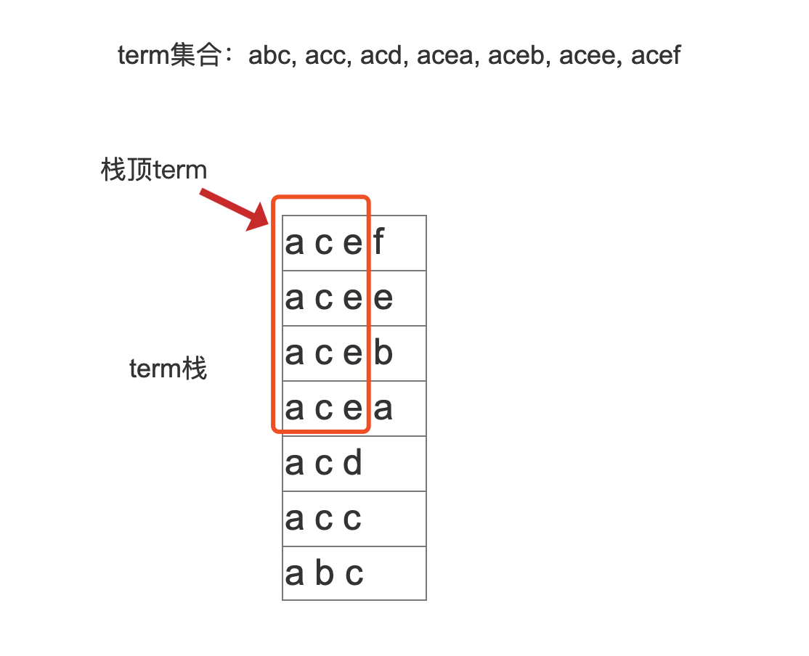
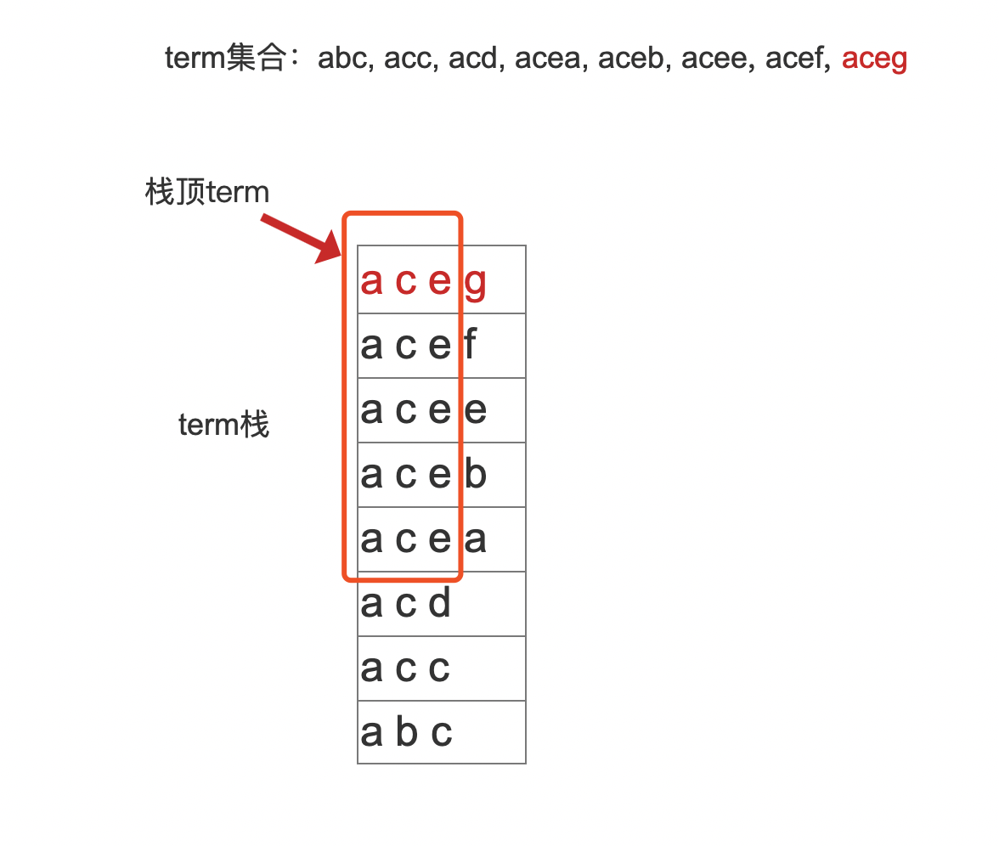
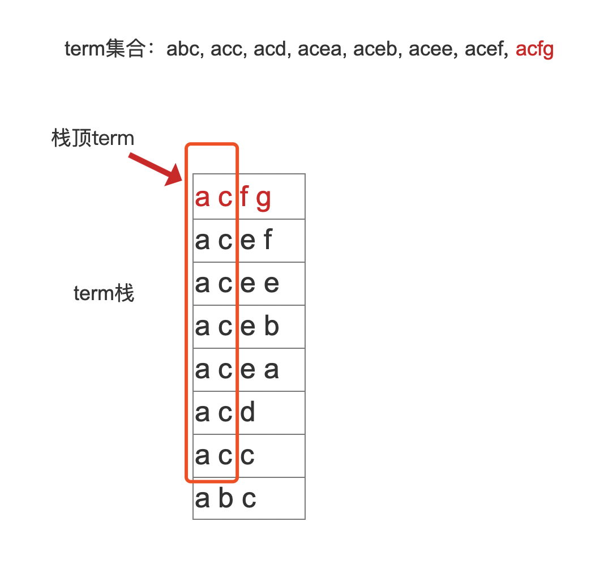
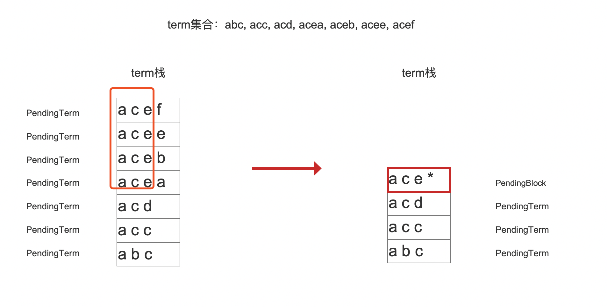
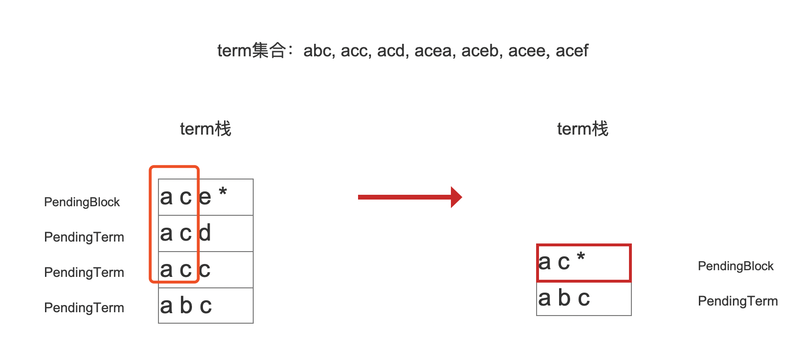

# [索引文件的生成（五）](https://www.amazingkoala.com.cn/Lucene/Index/)

&emsp;&emsp;在前面的四篇文章中，我们介绍了生成索引文件[.tim、.tip](https://www.amazingkoala.com.cn/Lucene/suoyinwenjian/2019/0401/43.html)、[.doc](https://www.amazingkoala.com.cn/Lucene/suoyinwenjian/2019/0324/42.html)、[.pos、.pay](https://www.amazingkoala.com.cn/Lucene/suoyinwenjian/2019/0324/41.html)中.doc、.pos、.pay这三个索引文件的内容，接着我们继续图1中剩余的内容，即流程点`生成索引文件.tim、.tip`。

## 生成索引文件.tim、.tip、.doc、.pos、.pay的流程图

图1：



&emsp;&emsp;对于图1的流程图的介绍，可以看文章[索引文件的生成（一）之doc&&pay&&pos](https://www.amazingkoala.com.cn/Lucene/Index/2019/1226/121.html)，我们同样以流程图的方法来介绍生成索引文件.tim、.tip的逻辑。

## 生成索引文件.tim、.tip的流程图

图2：



&emsp;&emsp;图2的流程描述的是一个域生成索引文件.tim、.tip的流程图。

### 准备数据

图3：



&emsp;&emsp;将包含当前term的文档号docId，以及在这些文档内的出现频率frequency，位置信息position、payload信息、偏移信息offset写入到索引文件.doc、.pay、.pos之后，会生成IntBlockTermState对象，该对象包含了以下的信息作为处理索引文件.tim、.tip的准备数据：

- singletonDocID：该值如果不为-1，说明只有一篇文档包含当前term，那么singletonDocID的值为对应的文档号，singletonDocID的存在会影响索引文件的数据结构，在`生成InnerNode`流程点会介绍该值的影响
- lastPosBlockOffset：如果该值为-1，说明term在所有文档中的词频没有达到128，即没有生成一个block（见文章[索引文件的生成（二）](https://www.amazingkoala.com.cn/Lucene/Index/2019/1227/122.html)），如果至少存在一个block，那么该值描述的是VIntBlocks在[索引文件.pos](https://www.amazingkoala.com.cn/Lucene/suoyinwenjian/2019/0324/41.html)中的起始位置，见图4
- docStartFP：当前term的文档号docId、词频信息frequency在索引文件.doc的起始位置
- posStartFP：当前term的位置信息position在索引文件.pos的起始位置
- payStartFP：当前term的偏移位置offset，payload在索引文件.pay的起始位置
- skipOffset：当前term的跳表信息在索引文件.doc的起始位置

&emsp;&emsp;上述值在索引文件中的位置如下所示：

图4：


&emsp;&emsp;索引文件.tim又称为 Term Dictionary，所以在读取阶段，我们是先通过读取索引文件.tim来得到在索引文件.doc、.pos、pay的信息。

- docFreq：包含当前term的文档数量
- totalTermFreq：当前term在所有文档中出现的词频和值

&emsp;&emsp;上述的两个信息是在生成索引文件.doc、.pay、.pos的过程中记录的，其记录的时机点如下所示：

图5：



### 生成NodeBlock

图6：



&emsp;&emsp;每当处理一个新的term之前，我们先要`统计term栈中的prefixTopSize`。

**term栈跟prefixTopSize是什么**

&emsp;&emsp;term栈即存放term的栈，prefixTopSize是跟栈顶term有相同前缀的term数量，例如待处理的term集合如下所示：

```java
    term集合 = {"abc", "acc", "acd", "acea", "aceb", "acee", "acef"}
```

图7：



&emsp;&emsp;从图7可以看出跟栈顶元素有最长相同前缀的term数量为4，前缀值为"ace"，那么此时prefixTopSize的值为4，如果prefixTopSize超过minItemsInBlock，那么就生成一个NodeBlock。

**minItemsInBlock是什么**：

&emsp;&emsp;minItemsInBlock是一个Lucene中的默认建议值（Suggested default value），默认值为25，它描述了至少有minItemsInBlock个有相同前缀的term才能生成一个NodeBlock。

&emsp;&emsp;如果minItemsInBlock的值为5，在图7中，由于prefixTopSize的值为4，所以不能生成一个NodeBlock，那么就执行`更新term栈中的prefixTopSize`的流程点。

**如何更新term栈中的prefixTopSize**：

&emsp;&emsp;根据新的term来更新term栈中的prefixTopSize。我们用两种情况来介绍其更新过程。

- 如果新的term为"aceg"，那么将"aceg"添加到term栈以后如下图所示：

图8：



- 如果新的term为"acfg"，那么将"acfg"添加到term栈以后如下图所示：

图9：



**为什么是生成一个或多个NodeBlock**：

&emsp;&emsp;前面我们说到term栈就是存放term的栈，这种说法只是为了便于介绍上文中的内容，term栈里面实际存放了两种类型的信息，在源码中的对应的变量名如下所示，另外term栈在源码中对应的是pending链表：

- PendingTerm：该值代表了一个term包含的信息
- PendingBlock：该值代表的是具有相同前缀的term集合包含的信息

&emsp;&emsp;我们另**minItemsInBlock的值为3**（强调的是上文中minItemsInBlock的值为5），**我们以图7为例**，如果我们插入一个新的term，例如“ba”，由于此时prefixTopSize的值为4，那么就可以将"acea", "aceb", "acee", "acef"这四个term的信息生成一个NodeBlock，生成NodeBlock的过程将在下一篇文章介绍，在这里我们只需要知道在生成NodeBlock之后，它就会生成一个以"ace"为前缀的PendingBlock，并且会添加到term栈中，如下所示：

图10：



&emsp;&emsp;由图10可，在生成以"ace"为前缀的NodeBlock之后，还可以生成以"ac"为前缀的NodeBlock，如下所示：

图11：



&emsp;&emsp;图10、图11生成NodeBlock的条件的判断逻辑是这样的：

- 计算当前栈顶term的长度i
- 计算出新term跟当前栈顶term的相同前缀个数pos
- 如果栈顶term的相同前缀为n的prefixTopSize不小于minItemsInBlock，那么就生成一个NodeBlock，其中n的取值范围是(pos, i)

&emsp;&emsp;图10的例子中，栈顶term（”acef“）的长度 i = 4，新term为"ba"，跟栈顶term没有相同前缀，所以pos = 0，栈顶元素term的相同前缀n的取值范围为(0, 4)，当n=3（前缀为"ace"）时，此时的prefixTopSize为4，那么就可以生成一个block，即图10的内容；当n=2（前缀为"ac"）时，prefixTopSize为3，那么就可以生成一个block，即图11的内容；当n=1（前缀为"a"）时，prefixTopSize为2，由于小于minItemsInBlock，故不能生成一个PendingBlock。

## 结语

&emsp;&emsp;图6的流程图对应的是源码 https://github.com/LuXugang/Lucene-7.5.0/blob/master/solr-7.5.0/lucene/core/src/java/org/apache/lucene/codecs/blocktree/BlockTreeTermsWriter.java 中的pushTerm()方法，感兴趣的同学可以结合源码理解。

[点击](http://www.amazingkoala.com.cn/attachment/Lucene/Index/索引文件的生成/索引文件的生成（五）/索引文件的生成（五）.zip)下载附件