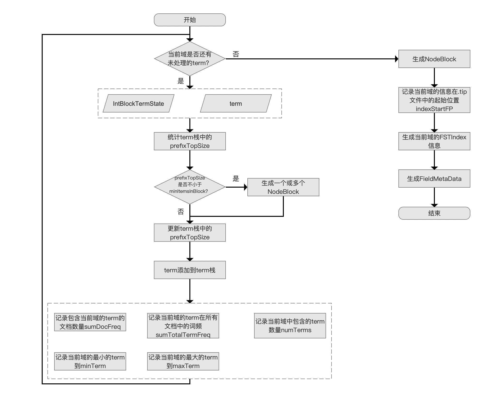
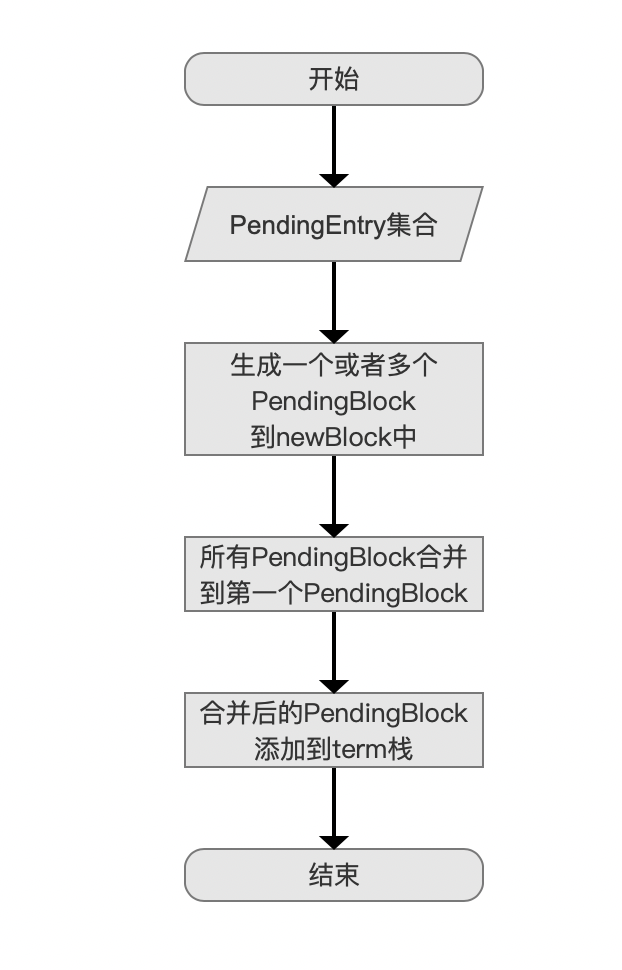
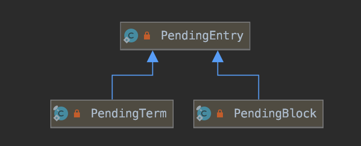
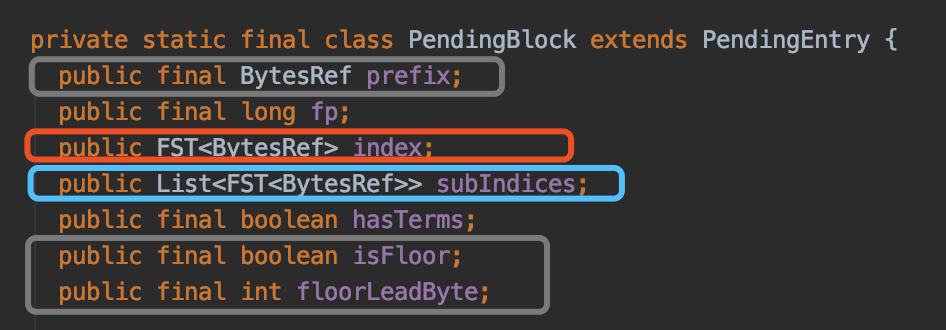
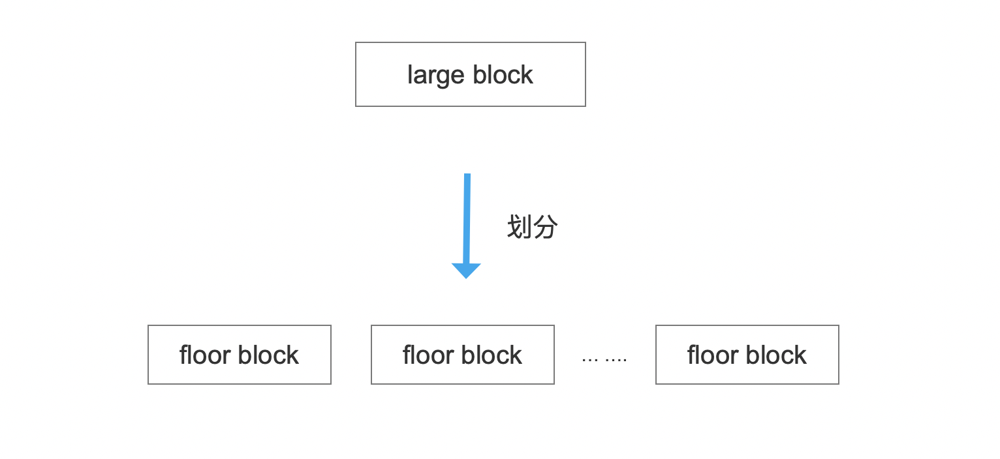
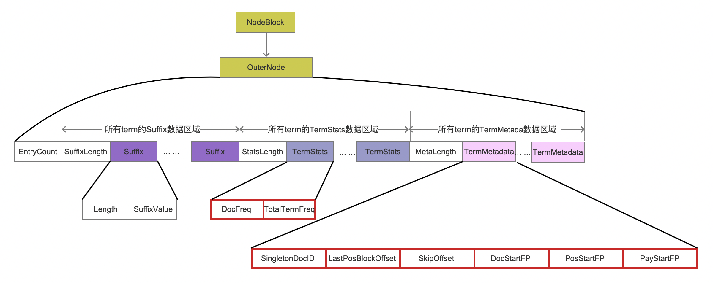
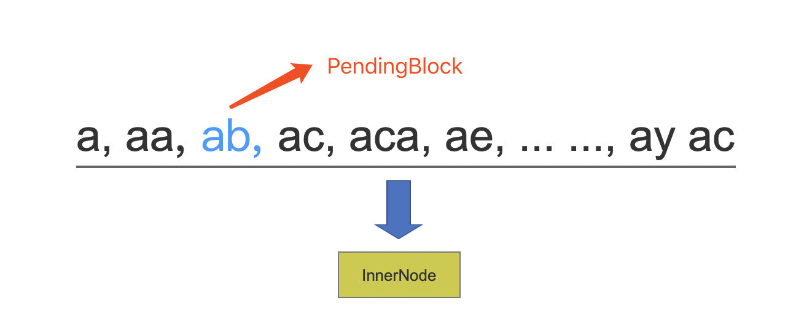
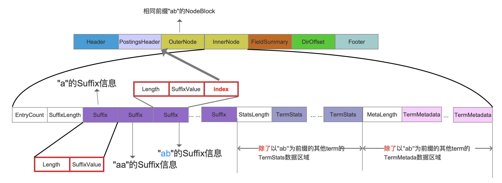
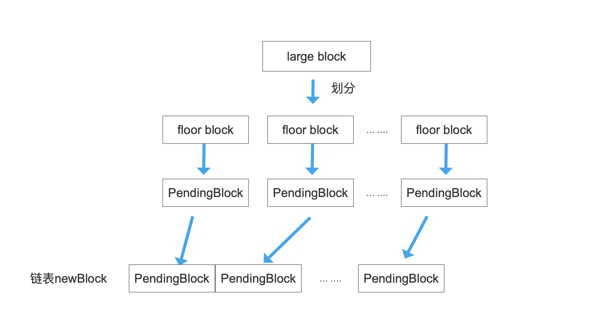
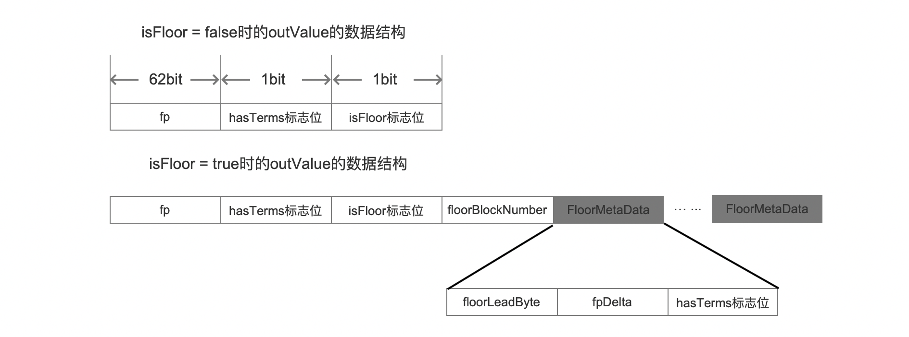

# [索引文件的生成（六）](https://www.amazingkoala.com.cn/Lucene/Index/)

&emsp;&emsp;本文承接[索引文件的生成（五）](https://www.amazingkoala.com.cn/Lucene/Index/2020/0110/125.html)继续介绍剩余的内容，下面先给出生成索引文件.tim、.tip的流程图。

## 生成索引文件.tim、.tip的流程图
图1：



&emsp;&emsp;上一篇文章中，我们介绍了执行`生成一个或多个NodeBlock`的触发条件，本文就其实现过程展开介绍，同样的，下文中出现的并且没有作出解释的名词，说明已经在文章[索引文件的生成（五）](https://www.amazingkoala.com.cn/Lucene/Index/2020/0110/125.html)中介绍，不在本文中赘述。

## 生成一个或多个NodeBlock的流程图

图2：




### PendingEntry集合

图3：


&emsp;&emsp;我们在上一篇文章中说到，term栈中存放了两种类型的信息：PendingTerm和PendingBlock，它们两个的类图关系如下所示：

图4：



&emsp;&emsp;故图2流程图的准备数据是一个PendingEntry集合，它就是term栈（本人对该集合的称呼😂），在源码中即pending链表，定义如下：

```java
    private final List<PendingEntry> pending = new ArrayList<>();
```
### 生成一个或者多个PendingBlock到newBlock中

图5：


&emsp;&emsp;在介绍该流程点之前，我们需要了解下PendingBlock类中的一些信息，PendingBlock类的定义如下：

图6：



&emsp;&emsp;第一次执行图2的流程时，PendingEntry集合中**总是**只存在PendingTerm信息，集合中的每一个元素代表了一个term包含的信息，在执行完图2的流程之后，PendingEntry集合中的信息就转化为一个PendingBlock（我们记为block1），它用来描述具有相同前缀的term集合的信息，并且重新添加到term栈中；如果下一次执行图2的流程时，PendingEntry集合中包含了PendingTerm和PendingBlock（block1）两种类型信息，那么在执行完图2的流程后，PendingEntry集合中的信息就会转化为一个新的PendingBlock（我们记为block2），由此可见执行图1的流程点`生成一个或多个NodeBlock`实际是通过**嵌套**的方式将所有term的信息转化为一个PendingBlock。

&emsp;&emsp;图6中<font color=Red>红框</font>标注的index描述的是一个PendingBlock自身的信息，而<font color=Blue>蓝框</font>标注的subIndices描述的是该PendingBlock中嵌套的PendingBlock信息的集合（即每一个PendingBlock的index信息），对于block1跟block2来说，block2对象中的subIndices中包含了一条信息，该信息为block1中的index信息，至于index中包含了具体哪些信息，下文中会展开介绍。

&emsp;&emsp;我们回到`生成一个或者多个PendingBlock到newBlock中`的流程点的介绍。

**为什么可能会生成多个PendingBlock**

&emsp;&emsp;对于待处理的PendingEntry集合，它包含的信息数量至少有minItemsInBlock个（为什么使用**至少**这个副词，见文章[索引文件的生成（五）](https://www.amazingkoala.com.cn/Lucene/Index/2020/0110/125.html)），因为这是图2的流程的触发条件，如果PendingEntry集合中的数量过多，那么需要处理为多个PendingBlock，这么处理的原因以及处理方式在源码中也给出了解释，见 https://github.com/LuXugang/Lucene-7.5.0/blob/master/solr-7.5.0/lucene/core/src/java/org/apache/lucene/codecs/blocktree/BlockTreeTermsWriter.java 中的 void writeBlocks(int prefixLength, int count)方法：

```text
The count is too large for one block, so we must break it into "floor" blocks, where we record the leading label of the suffix of the first term in each floor block, so at search time we can jump to the right floor block.  We just use a naive greedy segmenter here: make a new floor block as soon as we have at least minItemsInBlock.  This is not always best: it often produces a too-small block as the final block:
```

&emsp;&emsp;上述的注释大意为：如果一个block太大，那么就划分为多个floor block，并且在每个floor block中记录后缀的第一个字符作为leading label，使得在搜索阶段能通过前缀以及leading label直接跳转到对应的floor block，另外每生成一个floor block，该block中至少包含了minItemsInBlock条PendingEntry信息，这种划分方式通常会使得最后一个block中包含的信息数量较少。

&emsp;&emsp;对于上述的注释我们会提出以下几个问题：

- 问题一：划分出一个floor block的规则是什么
- 问题二：在搜索阶段，如何通过前缀跟leading label快速跳转到对应floor block

**问题一：划分出一个floor block的规则是什么**

&emsp;&emsp;使用下面两个阈值作为划分参数：

- minItemsInBlock：默认值为25
- maxItemsInBlock：默认值为48，它的值可以设定的范围如下所示：

```java
minItemsInBlock < maxItemsInBlock < 2*(minItemsInBlock-1)
```

&emsp;&emsp;划分的规则：每处理图3中PendingEntry集合中N个信息，就生成一个block，除了第一个block（我们称之为head block），其他block都是floor block，其中N值不小于minItemsInBlock，并且PendingEntry集合中未处理的信息不小于maxItemsInBlock，如下所示：

图7：



&emsp;&emsp;随后将head block以及floor block中包含的PendingEntry信息分别生成PendingBlock，两种类型的block生成的PendingBlock的差异性用图6中<font color=gray>黑灰色</font>标注的三个信息来区分：

- prefix：相同前缀 + leading label，所有block的相同前缀都是一样的，对于head block，它生成的PendingBlock对应的prefix的值只有相同前缀
- isFloor：是否为floor block
- floorLeadByte：该字段即leading label

&emsp;&emsp;在生成PendingBlock的过程中，同时也是将term信息写入到[索引文件.timp](https://www.amazingkoala.com.cn/Lucene/suoyinwenjian/2019/0401/43.html)文件的过程，即生成NodeBlock的过程，其中一个block（head block或者floor block）对应生成一个NodeBlock，上文中我们说到PendingEntry信息可分为两种类型：PendingTerm和PendingBlock，根据block中的不同类型的PendingEntry，在索引文件.timp中写入的数据结构也是不同的。

#### block中只包含PendingTerm

图8：



&emsp;&emsp;根据block中包含的PendingEntry的类型，可以细化的将`block中只包含PendingTerm`对应生成的NodeBlock称为OuterNode，`block中至少包含PendingBlock`（至少包含PendingBlock意思是只包含PendingBlock或者同时包含PendingBlock以及PendingTerm）对应生成的NodeBlock称为InnerNode。

&emsp;&emsp;图8中，所有的字段的含义已经在文章[索引文件之tim&&tip](https://www.amazingkoala.com.cn/Lucene/suoyinwenjian/2019/0401/43.html)介绍，不一一展开介绍，这里注意的是<font color=Red>红框</font>标注的8个字段描述的是一个term的信息，该信息在生成[索引文件.doc](https://www.amazingkoala.com.cn/Lucene/suoyinwenjian/2019/0324/42.html)、[pos、.pay](https://www.amazingkoala.com.cn/Lucene/suoyinwenjian/2019/0324/41.html)之后，使用IntBlockTermState封装这些信息，并且通过做为图1中的准备数据存储到索引文件.tim中，这8个字段的介绍见文章[索引文件的生成（五）之tim&&tip](https://www.amazingkoala.com.cn/Lucene/Index/2020/0110/125.html)。

&emsp;&emsp;当outerNode写入到索引文件.tim之后，它在索引文件中.tim的起始位置就用图6的fp信息描述，由于block中存在PendingTerm，故图6中的hasTerms信息被置为true，至此，图6中PendingBlock包含的所有信息都已经介绍完毕，并且我们也明白了PendingBlock的作用：用来描述一个NodeBlock的所有信息。

#### block中至少包含PendingBlock

&emsp;&emsp;我们结合一个例子来介绍这种情况。

图9：



&emsp;&emsp;待处理的PendingEntry集合如图9所示，其中除了"ab"是一个PendingBlock，其他都是PendingTerm，将该PendingEntry集合生成一个NodeBlock，它是InnerNode。

图10：



&emsp;&emsp;由图10中<font color=Red>红框</font>标注的信息描述了PendingTerm以及PendingBlock对应的Suffix字段的差异性，对于PendingBlock，它对应的Suffix中多了一个index字段，该字段的值就是以"ab"为前缀的PendingBlock中的fp信息（即图6中的fp信息），它描述了"ab"为前缀的PendingBlock对应的NodeBlock信息在索引文件.tim中的起始位置。

&emsp;&emsp;最后根据图7中划分后的block在分别生成PendingBlock之后，将这些PendingBlock添加到链表newBlock中，newBlock的定义如下：

```java
    private final List<PendingBlock> newBlocks = new ArrayList<>();
```

&emsp;&emsp;添加到链表newBlock中的目的就是为下一个流程`合并PendingBlock`做准备的。

**问题二：在搜索阶段，如何通过前缀跟leading label快速跳转到对应floor block**

&emsp;&emsp;在下一篇文章介绍索引文件.tip时回答该问题。


### 所有PendingBlock合并到第一个PendingBlock

图11：


&emsp;&emsp;在上文中，根据图2中的PendingEntry集合，我们生成了一个或多个PendingBlock，并且添加到了newBlock中，如下所示：

图12：



&emsp;&emsp;在当前流程中，我们需要将newBlock中第二个PendingBlock开始后面所有的PendingBlock的信息合并到第一个PendingBlock中，合并的信息包含以下内容：

- floorLeadByte
- fp
- hasTerms

&emsp;&emsp;随后将这些信息写入到[FST](https://www.amazingkoala.com.cn/Lucene/yasuocunchu/2019/0220/35.html)中，其中相同前缀值（即图2中PendingEntry集合的最长相同前缀值）作为FST的inputValue，合并的信息作为FST的outValue。inputValue、outValue的概念见文章[FST算法（上）](https://www.amazingkoala.com.cn/Lucene/yasuocunchu/2019/0220/35.html)，不赘述。

&emsp;&emsp;图12中，如果`block中至少包含PendingBlock`，那么对应PendingBlock中的subIndices中的信息也需要写入到FST中。

### 合并后的PendingBlock添加到term栈

图13：



&emsp;&emsp;最后合并的PendingBlock添加到term栈，等待被嵌套到新的PendingBlock中，最终，经过层层的嵌套，一个域中产生的所有的PendingBlock都会被嵌套到一个PendingBlock中，该PendingBlock的index信息在后面的流程中将会被写入到索引文件.tip中。

## 结语

&emsp;&emsp;基于篇幅，剩余的内容将在下一篇文章中展开。

[点击](http://www.amazingkoala.com.cn/attachment/Lucene/Index/索引文件的生成/索引文件的生成（六）/索引文件的生成（六）.zip)下载附件

