# [索引文件的生成（十九）](https://www.amazingkoala.com.cn/Lucene/Index/)（Lucene 8.4.0）

&emsp;&emsp;在文章[索引文件的生成（十八）之dvm&&dvd](https://www.amazingkoala.com.cn/Lucene/Index/2020/0528/144.html)中，我们介绍了Lucene在索引阶段跟flush阶段收集到的SortedDocValues、SortedSetDocValues信息，这些信息将作为生成索引文件.dvm、dvd的依据。

## 生成索引文件.dvd、.dvm之SortedDocValues、SortedSetDocValues的流程图

图1：

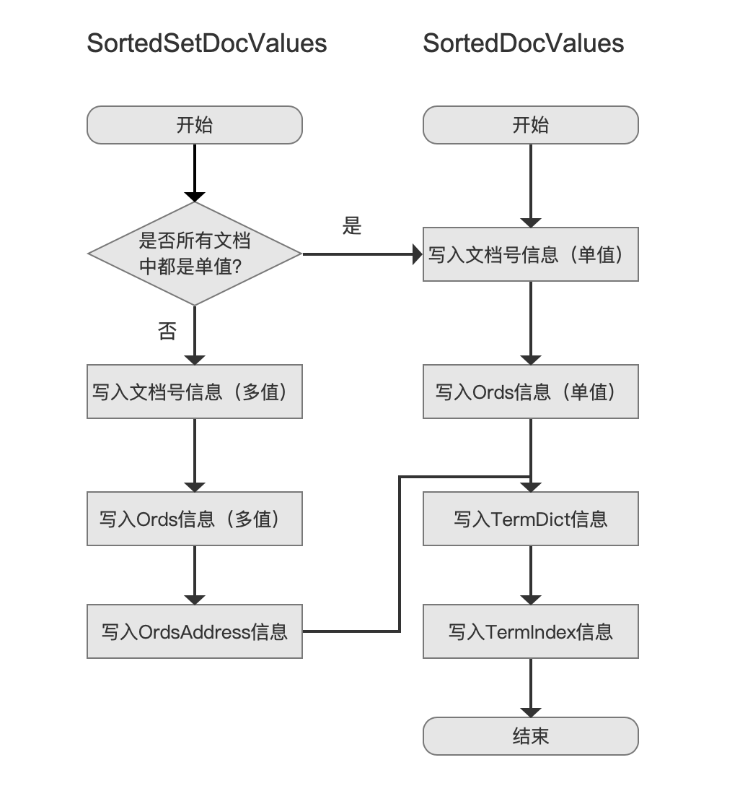

### 是否所有文档中都是单值？

图2：

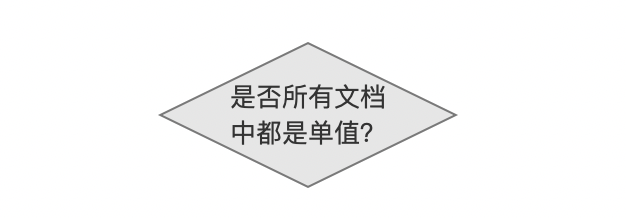

&emsp;&emsp;如果每篇文档中的某个域名的SortedSetDocValueField只有一个，即所谓的单值，判断numDocsWithField跟numOrds的值是否相同，相同意味着所有文档中都是单值：

- numDocsWithField：该值描述了包含当前SortedSetDocValueField的文档数量，在文章[索引文件的生成（十八）之dvm&&dvd](https://www.amazingkoala.com.cn/Lucene/Index/2020/0528/144.html)中我们说到，在索引阶段，通过DocsWithFieldSet收集文档号，在当前流程点就是通过DocsWithFieldSet获取文档号，DocsWithFieldSet存储文档号的内容在文章[索引文件的生成（十五）之dvm&&dvd](https://www.amazingkoala.com.cn/Lucene/Index/2020/0507/139.html)已经介绍，不赘述。
- numOrds：在文章[索引文件的生成（十八）之dvm&&dvd](https://www.amazingkoala.com.cn/Lucene/Index/2020/0528/144.html)我们说到，**每种域值对应一个ord值**，如果一篇文档中出现了相同域名的SortedSetDocValueField的多个域值，这些域值如果不全都相等，显而易见，numDocsWithField跟numOrds的值是不同的，意味着多值。获得一篇文章中numOrds的值的方法是通过收集阶段生成的ordMap数组。

那么此时对应生成的索引文件跟SortedDocValue是一致的，如下所示：

图3：

&emsp;&emsp;在读取阶段，根据DocValuesType字段判断出是SortedSetDocValues后，接着读取索引文件的下一个字节，即SingleValue，根据SingleValue的值判断索引文件的数据结构：

- SingleValue == 0：单值，那么SingleValue字段后的所有字段跟SortedDocValues一致
- SingleValue == 1：至少有一篇文档中包含了多个（大于1）某个域名的SortedSetDocValueField

&emsp;&emsp;图3中，**DocValuesType**字段的值描述了当前的DocValues类型，字段的可选值如下所示：

图4：

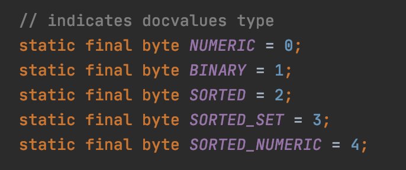

### 写入文档号信息（单值）

图5：

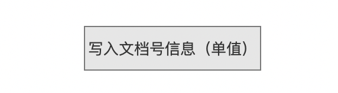

&emsp;&emsp;根据numDocsWithField不同值，生成不同数据结构的DocIdIndex字段，该内容跟存储NumericDocValues的文档号是一模一样的，故不赘述，见文章[索引文件的生成（十六）之dvm&&dvd](https://www.amazingkoala.com.cn/Lucene/Index/2020/0518/142.html)。

### 写入文档号信息（多值）

图6：

&emsp;&emsp;同样根据numDocsWithField的值生成不同数据结构的DocIdIndex字段，但跟`写入文档号信息（单值）`不同点在于，numDocsWithField的值不可能为0（numDocsWithField的值有三种可能，见文章[索引文件的生成（十六）之dvm&&dvd](https://www.amazingkoala.com.cn/Lucene/Index/2020/0518/142.html)），因为如果numDocsWithField的值为0，那么必定numOrds的值也是0，意味着numDocsWithField与numOrds相等，那么会与图1中`是否所有文档中都是单值？`的判断会为假发生矛盾，故numDocsWithField不可能为0。

&emsp;&emsp;文档号信息（值）会被写入到索引文件.dvd中，文档号信息（值）在索引文件.dvd中的位置信息（即DocIdIndex）与numDocsWithField都会被记录到索引文件.dvm中，关系如下所示：

图7：

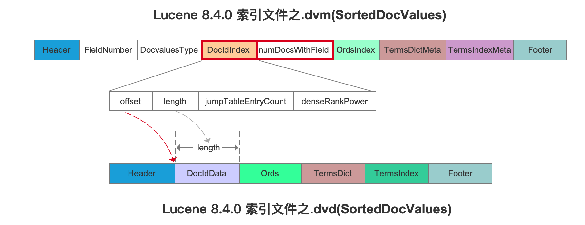

图8：

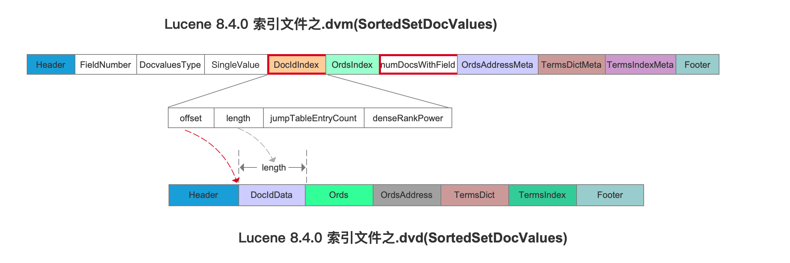

&emsp;&emsp;注意的是在文章[SortedSetDocValues](https://www.amazingkoala.com.cn/Lucene/DocValues/2019/0412/48.html)、[SortedDocValues](https://www.amazingkoala.com.cn/Lucene/DocValues/2019/0219/34.html)中的索引文件数据结构是Lucene7.5.0，对于DocIdIndex，跟Lucene 8.4.0中的差异介绍见文章[索引文件的生成（十六）之dvm&&dvd](https://www.amazingkoala.com.cn/Lucene/Index/2020/0518/142.html)。

### 写入Ords信息（单值）

图9：

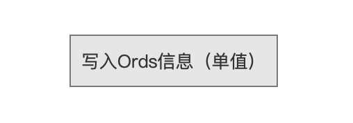

&emsp;&emsp;**我们以文章[索引文件的生成（十八）之dvm&&dvd](https://www.amazingkoala.com.cn/Lucene/Index/2020/0528/144.html)中的图3为例**，该例子对应的currentValues[ ]数组跟ordMap[ ]如下所示，这两个数组的介绍已经介绍过了，这里不赘述，直接列出：

图10：

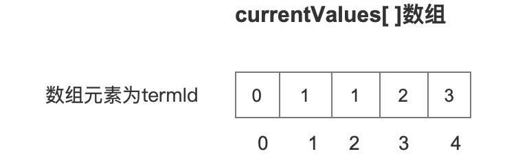

图11：

&emsp;&emsp;由于是单值，所以currentValues[ ]数组下标的大小关系正好描述了文档的处理顺序，比如下标为0，描述的是在索引阶段收集的第一篇包含SortedDocValues的域值对应的termId，随后termId作为ordMap[ ]的下标值，找到termId对应的ord值，Ords信息将会被存储到索引文件.dvd中的Ords字段，对应Ords信息在索引文件.dvd中的位置信息会被记录到索引文件.dvm中的OrdsIndex中。**在本文中，我们还是仅仅描述索引文件.dvd、dvm中需要存储的信息，至于存储ords信息的作用是什么，会在后面文章中介绍**：

图12：

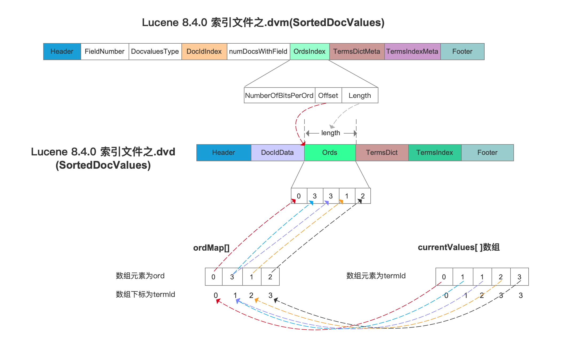

### 写入Ords信息（多值）

&emsp;&emsp;**我们以文章[索引文件的生成（十八）之dvm&&dvd](https://www.amazingkoala.com.cn/Lucene/Index/2020/0528/144.html)中的图11为例**，该例子对应的currentValues[ ]数组跟ordMap[ ]如下所示，同样不作出介绍：

图13：

图14：

&emsp;&emsp;下图中对应的demo见：https://github.com/LuXugang/Lucene-7.5.0/blob/master/LuceneDemo8.4.0/src/main/java/io/lucene/DcoValues/SortedSetDocValues2Test.java ：

图15：

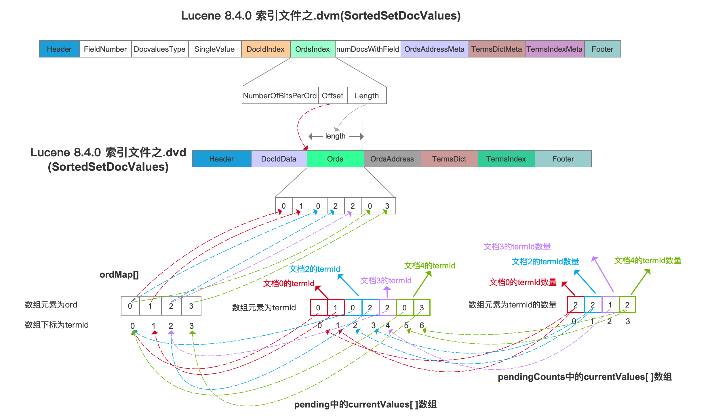

&emsp;&emsp;图15中，pendingCounts中的currentValues[ ]数组的下标的大小关系描述的是处理的文档的顺序，例如下标值为1，它对应的数组元素为2，描述了这篇文档中有两个域值，随后从pengding中的currentValues[ ]数组中取出这两个域值对应的termId，接着termId作为ordMap[ ]数组的下标值，取出对应的ord值，然后存储到索引文件.dvd中。

### 写入OrdsAddress信息

图16：

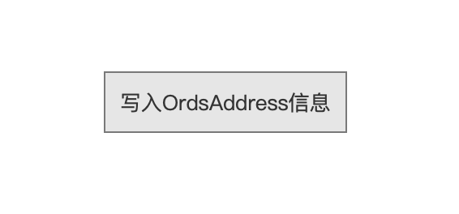

&emsp;&emsp;从图15的索引结构可以看出，在读取阶段，由于多值的存在，我们无法区分每篇文档对应的ords值，所以需要OrdsAffress信息来作为索引，同样结合图15中的例子，如下所示：

图17：

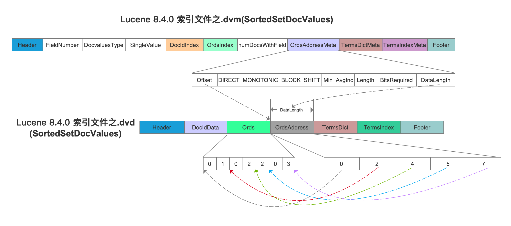

## 结语

&emsp;&emsp;基于篇幅，剩余的内容将在下一篇文章中展开。

[点击](http://www.amazingkoala.com.cn/attachment/Lucene/Index/索引文件的生成/索引文件的生成（十九）/索引文件的生成（十九）.zip)下载附件