# [索引文件的生成（十八）](https://www.amazingkoala.com.cn/Lucene/Index/)（Lucene 8.4.0）

&emsp;&emsp;索引文件.dvm&&.dvd中根据文档中包含的不同类型的DocValuesFields，包含下面的DocValues信息：

- BinaryDocValues
- NumericDocValues：见文章[索引文件的生成（十五）之dvm&&dvd](https://www.amazingkoala.com.cn/Lucene/Index/2020/0507/139.html)
- SortedDocValues
- SortedNumericDocValues：见文章[索引文件的生成（十七）之dvm&&dvd](https://www.amazingkoala.com.cn/Lucene/Index/2020/0526/143.html)
- SortedSetDocValues

&emsp;&emsp;本篇文章开始介绍生成索引文件.dvd、.dvm之SortedDocValues、SortedSetDocValues的内容，在此之前，我们先介绍下在索引（index）阶段以及[flush](https://www.amazingkoala.com.cn/Lucene/Index/2019/0716/74.html)阶段，Lucene是如何收集文档中的SortedDocValues、SortedSetDocValues信息。

## SortedDocValues

&emsp;&emsp;SortedDocValues信息对应的是在文档中SortedDocValuesField域中的信息，它同[NumericDocValues](https://www.amazingkoala.com.cn/Lucene/Index/2020/0507/139.html)一样，在一篇文档中，相同域名的SortedDocValuesField只能有一个，否则就会报错，如下所示：

图1：

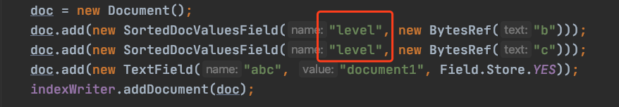

图2：

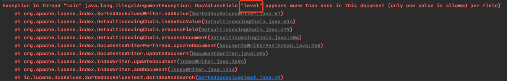

&emsp;&emsp;图1中，在一篇文档中有两个域名为"level"的SortedDocValuesField，那么会抛出图2中的错误，如果你期望支持多值，那么可以使用SortedSetDocValues，下文中会详细介绍。

### 收集文档的SortedDocValues信息

&emsp;&emsp;收集SortedDocValues信息的代码入口方法为：https://github.com/LuXugang/Lucene-7.5.0/blob/master/solr-8.4.0/lucene/core/src/java/org/apache/lucene/index/SortedDocValuesWriter.java 的 addValue(int docID, BytesRef value)方法，收集的信息有：**DocId、TermId、pending、sortedValues[ ]数组、ord、ordMap[ ]数组**。

&emsp;&emsp;我们根据一个例子来介绍上述收集的信息：

图3：

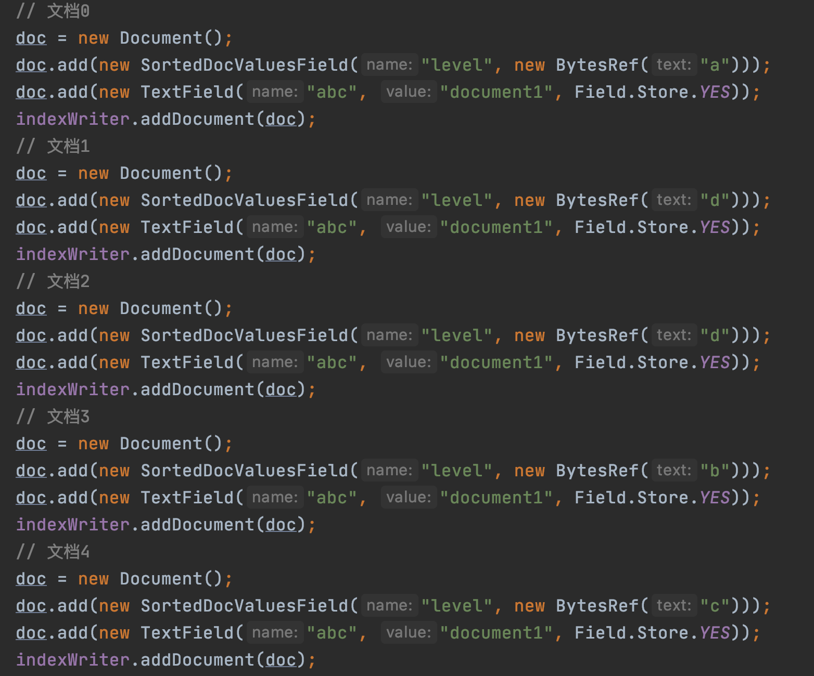

#### DocId

&emsp;&emsp;DocId即包含SortedDocValuesField域的文档的文档号，并且使用DocsWithFieldSet存储，DocsWithFieldSet存储文档号的过程在文章[索引文件的生成（十五）之dvm&&dvd](https://www.amazingkoala.com.cn/Lucene/Index/2020/0507/139.html)已经介绍，不赘述。

#### TermId

&emsp;&emsp;根据处理文档的顺序，有序的处理每一篇文档中的SortedDocValuesField，并且对每一个SortedDocValuesField的域值用一个从0开始递增的termId来描述，相同的域值具有相同的termId，图3的例子对应的termId如下所示：

表一：

| 域值 | termId |
| :--: | :----: |
|  a   |   0    |
|  d   |   1   |
|  b   |   2    |
|  c   |   3    |

#### pending

&emsp;&emsp;pending是PackedLongValues.Builder对象，这个对象我们不需要具体了解，我们只需要知道，在这个对象有一个currentValues[ ]数组，它用来收集每篇文档中SortedDocValuesField域的域值对应的termId，图3的例子对应的currentValues[ ]如下所示：

图4：

&emsp;&emsp;图4中，注意的是currentValues[ ]数组的数组下标描述的不是文档号。

#### sortedValues[ ]数组 && ord

&emsp;&emsp;sortedValues[ ]数组的数组元素是termId（去重），数组下标为ord。下面的一句话很重要：数组元素是有序的，但是排序规则不是根据termId的值，而是根据termId对应的域值的字典序，图3的例子对应的sortedValues[ ]数组如下所示：

图5：

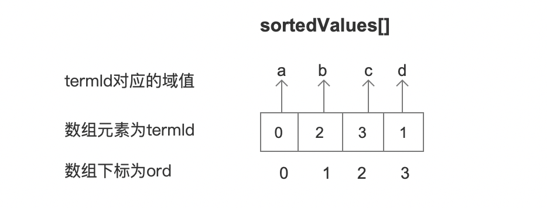

#### ordMap[ ]数组

&emsp;&emsp;sortedValues[]数组中实现了 数组下标ord 到 数组元素termId的映射，而ordMap[]数组则是实现了 数组下标termId 到 数组元素 ord的映射，图3的例子对应的ordMap[ ]数组如下所示：

图6：

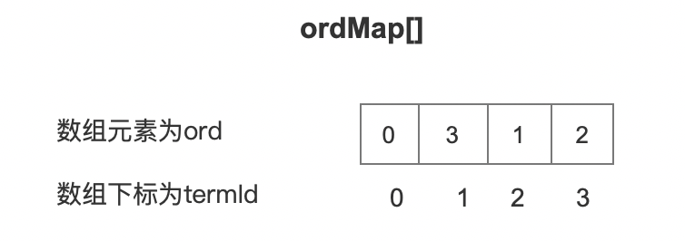

&emsp;&emsp;以上就是索引（index）阶段以及[flush](https://www.amazingkoala.com.cn/Lucene/Index/2019/0716/74.html)阶段收集的内容，至于收集这些信息的作用，将在后续的文章中提及。

## SortedSetDocValues

&emsp;&emsp;SortedSetDocValues信息对应的是在文档中SortedSetDocValuesField域中的信息，它跟SortedDocValues不用的是，一篇文章中允许多个相同域名的SortedSetDocValuesField，使得在搜索阶段，能提供更灵活的排序，同样我们以一个例子来介绍所谓的更灵活的排序。

图7：

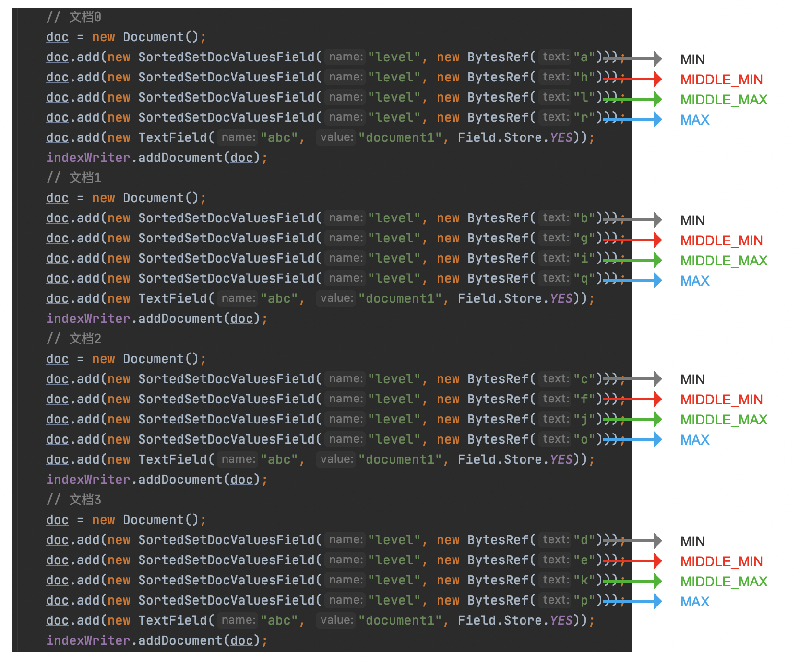

&emsp;&emsp;在搜索阶段，对于某一个SortedSetDocValues，可以支持四种方式的排序：

- MIN：选取文档中域值最小的参与排序
- MIDDLE_MIN：如果域值的数量为偶数，选取文档中的中间值较小的域值参与排序
- MIDDLE_MAX：如果域值的数量为偶数，选取文档中的中间值较大的域值参与排序
- MAX：选取文档中域值最大的参与排序

&emsp;&emsp;以下是源码中对上述的解释：

图8：

&emsp;&emsp;如果在搜索阶段，我们定义了MIDDLE_MAX的排序规则，如下所示：

图9：

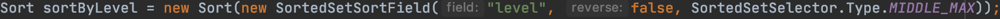

&emsp;&emsp;对于上述排序规则，由于图6中每篇文档中的SortedSetDocValuesField数量为偶数，那么选取中间值较大的域值参与排序，如下所示：

| 文档号 | 参与排序的域值(MIDDLE_MAX) |
| :----: | :------------------------: |
|   0    |             l              |
|   1    |             i              |
|   2    |             j              |
|   3    |             k              |

&emsp;&emsp;那么搜索出来的文档是有序的，如下所示：

图10：

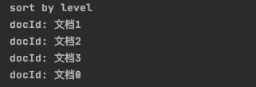

&emsp;&emsp;上述的demo见 https://github.com/LuXugang/Lucene-7.5.0/blob/master/LuceneDemo8.4.0/src/main/java/io/lucene/DcoValues/SortedSetDocValuesTest.java 。

### 收集文档的SortedSetDocValues信息

&emsp;&emsp;介绍完SortedDocValues用法之后，我们继续介绍在索引（index）阶段以及[flush](https://www.amazingkoala.com.cn/Lucene/Index/2019/0716/74.html)阶段，收集SortedDocValues信息的内容，收集信息的代码入口方法为：https://github.com/LuXugang/Lucene-7.5.0/blob/master/solr-8.4.0/lucene/core/src/java/org/apache/lucene/index/SortedSetDocValuesWriter.java 的 addValue(int docID, BytesRef value)方法，需要收集的信息，包括：**DocId、TermId、sortedValues[ ]数组、ord、ordMap[ ]数组、pending、pendingCounts**。

&emsp;&emsp;其中DocId、TermId、sortedValues[ ]数组、ord、ordMap[ ]数组的含义跟SortedDocValues是一致的，故只介绍pending、pendingCounts。

#### pending

&emsp;&emsp;同样使用pending中的currentValues[ ]数组收集每篇文档中SortedSetDocValues域的域值对应的termId，注意的是一篇文档中可能包含多个域值，**并且可能还是重复的域值**，为了能更好的理解pending，我们需要重新写一个例子：

图11：

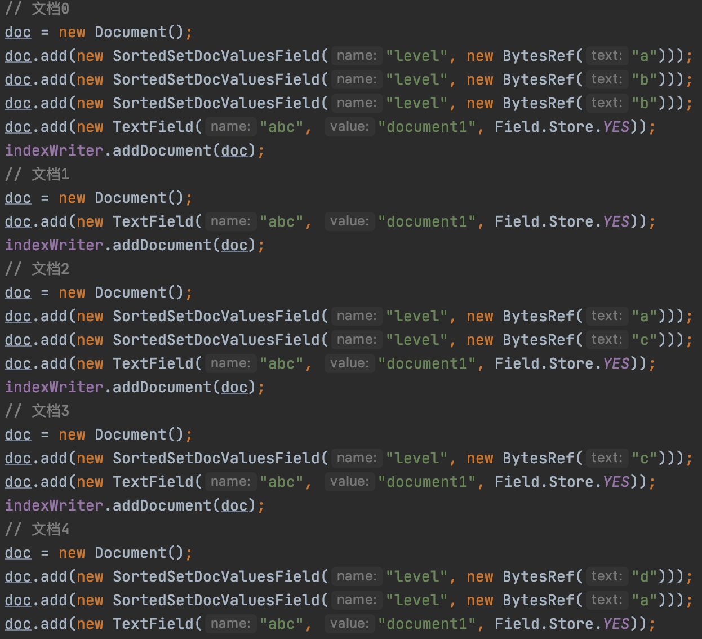

&emsp;&emsp;图11的例子对应的termId如下所示：

| 域值 | termId |
| :--: | :----: |
|  a   |   0    |
|  b   |   1    |
|  c   |   2    |
|  d   |   3    |

&emsp;&emsp;图11的例子对应的currentValues[ ]数组如下所示：

图12：

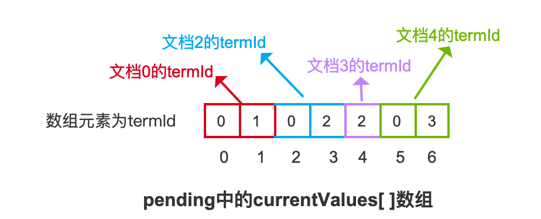

&emsp;&emsp;对于上述的currentValues[ ]数组，需要说明两个重点：

- 重点一：如果一篇文档中包含重复的域值，那么只需要记录一个即可，例如文档0中，有两个域值为"b"的SortedSetDocValuesField
- 重点二：一篇文档中域值对应的termId是有序存放到currentValues[ ]数组中的，例如文档4，按照域值处理顺序为先处理域值"d"，对应termId为3.再处理域值"a"，对应termId为0，但最终根据termId从小到大的顺序存储到了currentValues[ ]数组中，至于这么处理的原因，暂时不介绍，在后面的文章中会介绍。

#### pendingCounts

&emsp;&emsp;pendingCounts跟pending一样都是PackedLongValues.Builder对象，所以同样我们只需要关系pendingCounts中的currentValues[ ]数组，它存储了每篇文档中包含的termId的数量，图11的例子对应的currentValues[ ]数组如下所示：

图13：

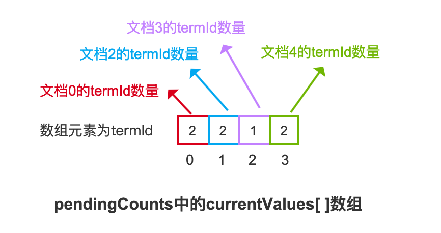

&emsp;&emsp;同样的，收集SortedSetDocValues信息的作用，将在介绍生成索引文件.dvd、.dvm之SortedDocValues、SortedSetDocValues的文章中。

## 结语

&emsp;&emsp;无。

[点击](http://www.amazingkoala.com.cn/attachment/Lucene/Index/索引文件的生成/索引文件的生成（十八）/索引文件的生成（十八）.zip)下载附件