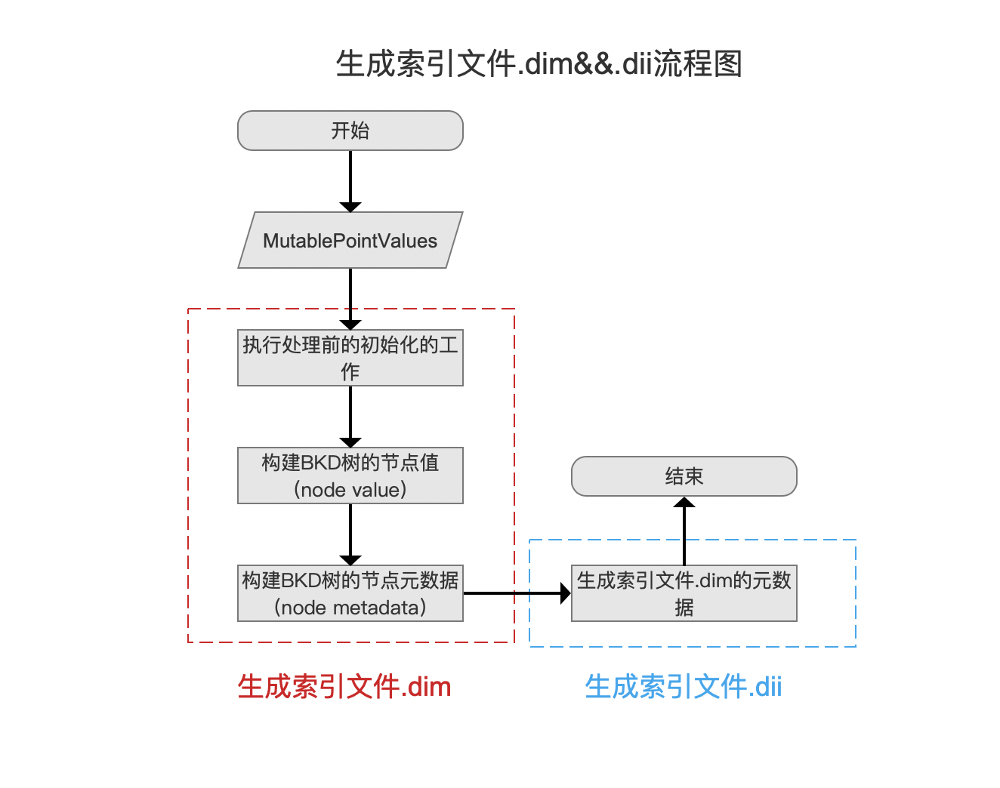
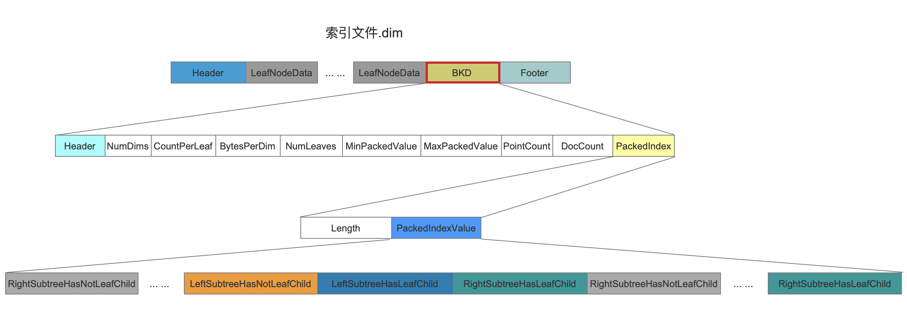
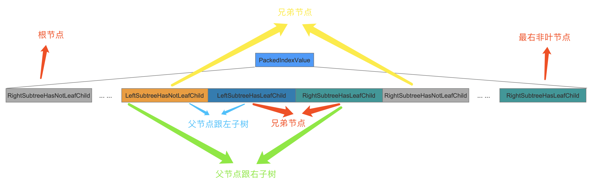
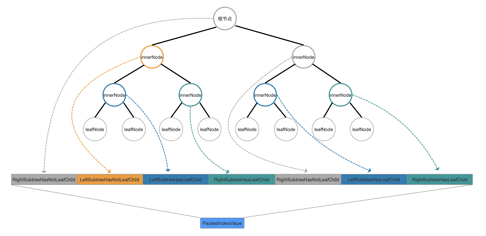
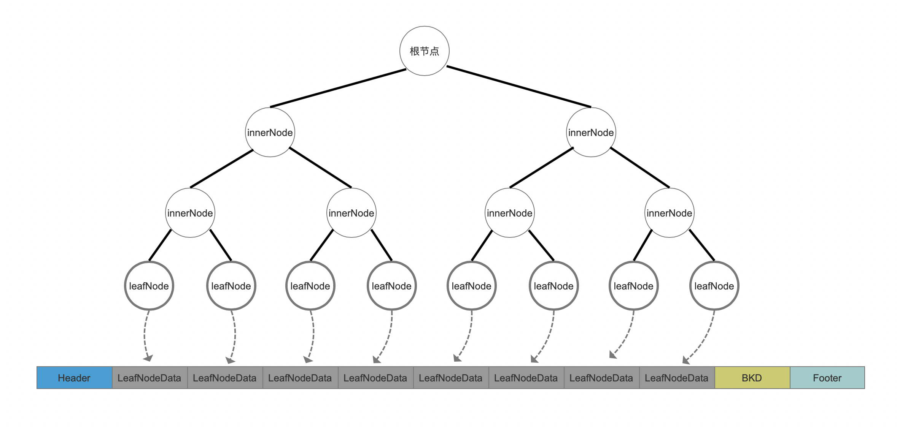
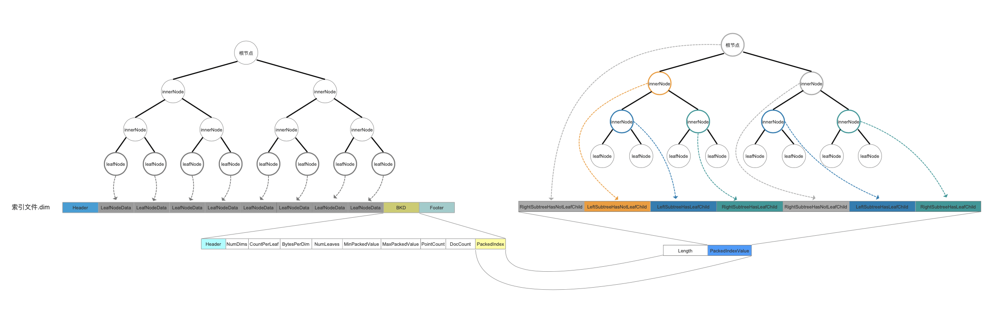
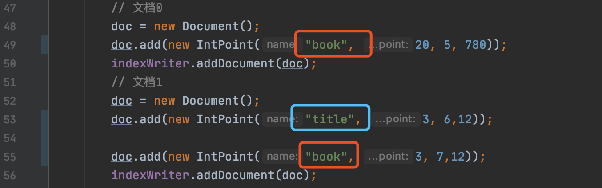
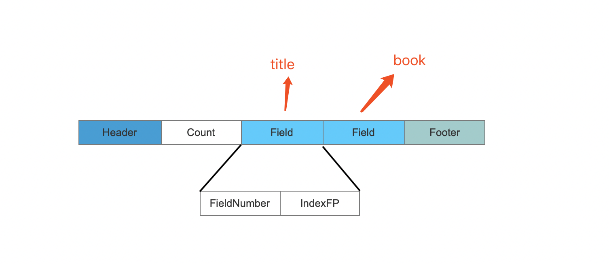

# [索引文件的生成（十四）](https://www.amazingkoala.com.cn/Lucene/Index/)（Lucene 8.4.0）

&emsp;&emsp;在前面的文章中，我们介绍了`构建BKD树的节点值（node value）`的流程，其中叶子节点的信息被写入到了[索引文件.dim](https://www.amazingkoala.com.cn/Lucene/suoyinwenjian/2019/0424/53.html)中，本文开始的内容将会介绍将内部节点（非叶节点）的信息写入到[索引文件.dim](https://www.amazingkoala.com.cn/Lucene/suoyinwenjian/2019/0424/53.html)，为了便于下文的介绍，先给出[生成索引文件.dim&&.dii](https://www.amazingkoala.com.cn/Lucene/suoyinwenjian/2019/0424/53.html)的流程图：

图1：

## 构建BKD树的节点元数据（node metadata）

&emsp;&emsp;在图1的流程点`构建BKD树的节点元数据（node metadata）`中，即将内部节点的信息写入到索引文件.dim的过程，该流程点对应的是源码 https://github.com/LuXugang/Lucene-7.5.0/blob/master/solr-8.4.0/lucene/core/src/java/org/apache/lucene/util/bkd/BKDWriter.java 中的**writeIndex(IndexOutput out, int countPerLeaf, long[] leafBlockFPs, byte[] splitPackedValues)**方法。

&emsp;&emsp;在这个方法中写入的信息即下图中的BKD字段，它对应在索引文件.dim中的位置如下所示：

图2：

&emsp;&emsp;图2中，所有字段的含义在文章[索引文件之dim&&dii](https://www.amazingkoala.com.cn/Lucene/suoyinwenjian/2019/0424/53.html)中已经介绍，我们仅挑选出某些字段来进一步的介绍。

### PackedIndexValue

&emsp;&emsp;该字段描述的是内部节点的信息，该字段中包含的四种类型的数据结构分别描述不同类型的内部节点（非叶节点）信息：

-	LeftSubtreeHasLeafChild：非叶节点的子树是叶子节点，并且它是父节点的左子树
-	RightSubtreeHasLeafChild：非叶节点的子树是叶子节点，并且它是父节点的右子树
-	LeftSubtreeHasNotLeafChild：非叶节点的子树不是叶子节点，并且它是父节点的左子树
- RightSubtreeHasNotLeafChild：非叶节点的子树不是叶子节点，并且它是父节点的右子树

&emsp;&emsp;在PackedIndexValue中，非叶节点之间的关系如下所示：

图3：

&emsp;&emsp;如果我们有以下的BKD树，树中的非叶节点信息对应在PackedIndexValue字段中的位置如下所示：

图4：

[点击]()查看大图

&emsp;&emsp;顺便给出叶子节点的信息对应在PackedIndexValue字段中的位置如下所示：

图5：

[点击]()查看大图

&emsp;&emsp;篇幅不够，画图来凑：

图6：

[点击]()查看大图

## 生成索引文件.dim的元数据

&emsp;&emsp;生成索引文件.dim的元数据的过程即生成索引文件.dii。在读取索引阶段，通过读取索引文件.dii来获得**每一个点数据域**的数据块（block），该block在索引文件.dim中的偏移值，如果我们在索引阶段的点数据域信息如下所示：

图7：

&emsp;&emsp;图7中，有两个点数据域，它们对应的域名分别是"book"、"tilte"，那么对应在索引文件.dii中的位置如下所示：

图8：

&emsp;&emsp;同样的，图8中各个字段的含义在文章[索引文件之dim&&dii](https://www.amazingkoala.com.cn/Lucene/suoyinwenjian/2019/0424/53.html)已经介绍，不赘述。

&emsp;&emsp;在读取阶段，就可以通过读取索引文件.dii的IndexFP字段找到某个点数据域在索引文件.dim中的偏移值，即读取起始位置。

&emsp;&emsp;至于详细的读取过程将在后续文章中介绍。

# 结语

&emsp;&emsp;至此，生成索引文件.dim&&dii的过程已经全部介绍结束，在后续的文章中，将通过数值类型的范围查询来介绍索引文件.dim&&dii的读取过程，即读取BKD树。

[点击](http://www.amazingkoala.com.cn/attachment/Lucene/Index/索引文件的生成/索引文件的生成（十四）/索引文件的生成（十四）.zip)下载附件