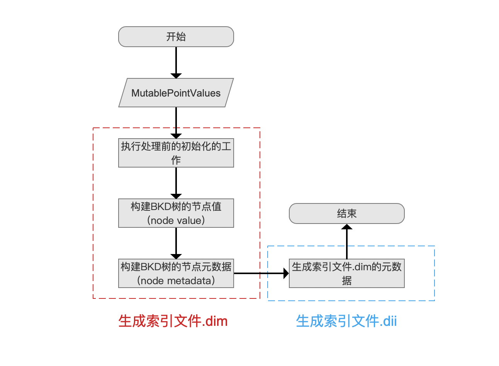
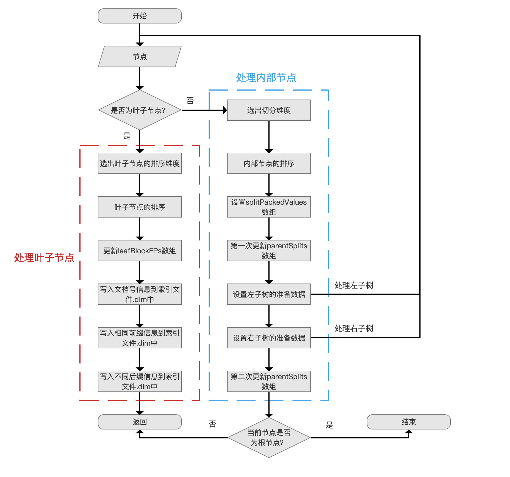
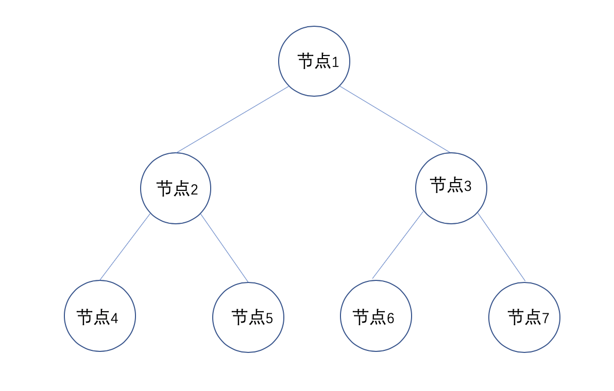
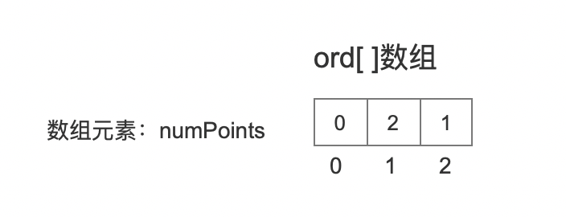
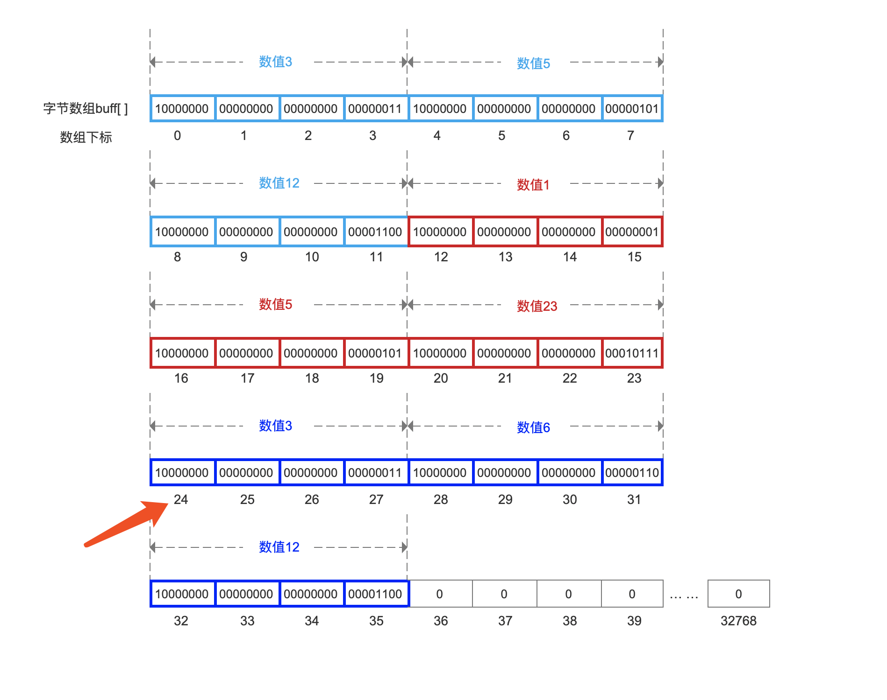
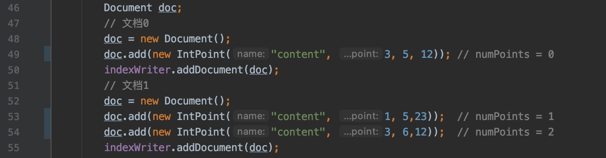
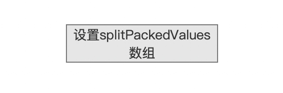
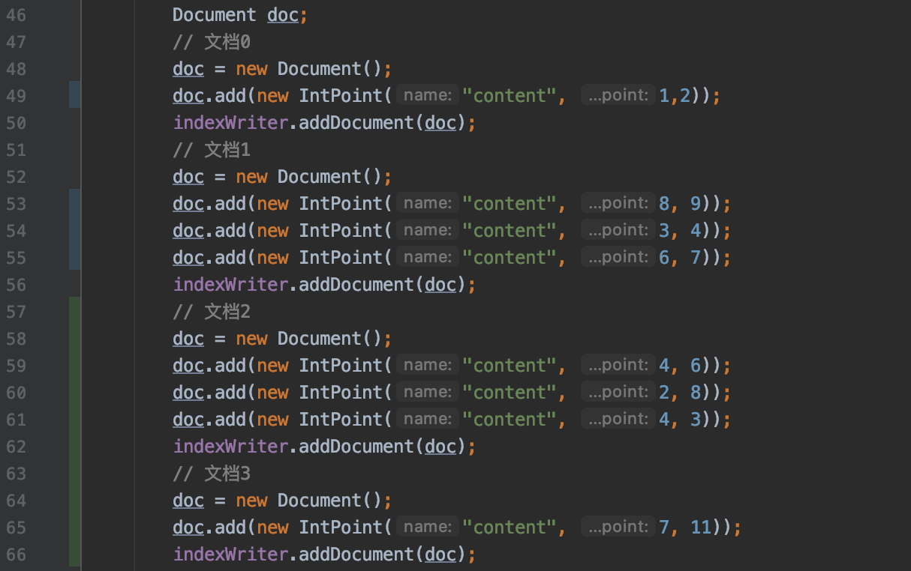
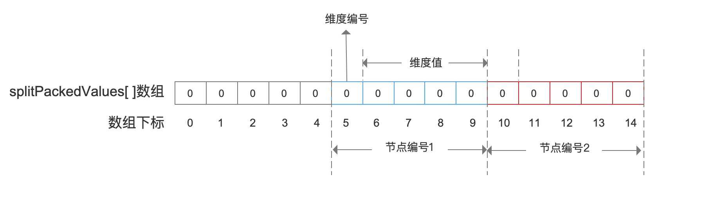
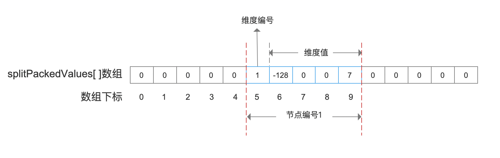

# [索引文件的生成（十）](https://www.amazingkoala.com.cn/Lucene/Index/)（Lucene 8.4.0）

&emsp;&emsp;本文承接[索引文件的生成（九）](https://www.amazingkoala.com.cn/Lucene/Index/2020/0406/129.html)，继续介绍剩余的内容，下面先给出生成索引文件.dim&&.dii的流程图：

图1：



&emsp;&emsp;在上一篇文章中，我们介绍了流程点`执行处理前的初始化的工作`，在这个流程中涉及到的一些信息贯穿整个流程，请务必先行阅读，**例如一些变量名如果没有展开说明，说明已经在上一篇文章中介绍**。

## 构建BKD树的节点值（node value）

&emsp;&emsp;先给出该流程点的流程图：

图2：



&emsp;&emsp;图2的流程中，描述的是处理一个节点的流程，该节点如果是内部节点（非叶节点），那么就划分出左右子树，即左右两个节点，随后递归处理，是一个深度遍历的过程。

### 节点

图3：


&emsp;&emsp;流程图的准备数据为一个节点，该节点可能是叶子节点或者内部节点，在生成BKD树的开始阶段，该节点为根节点。

### 是否为叶子节点？

图4：


&emsp;&emsp;在文章[索引文件的生成（九）之dim&&dii](https://www.amazingkoala.com.cn/Lucene/Index/2020/0406/129.html)中我们说到，在构建BKD树之前，我们已经能提前计算出BKD树中内部节点以及叶子节点的数量 numleaves，并且为每个节点都赋予了一个节点编号，如下图所示：

图5：



&emsp;&emsp;**如何判断当前节点是不是叶子节点**：

&emsp;&emsp;源码中通过判断当前节点编号是否小于最左叶子节点的编号，如果满足，说明当前节点是内部节点，否则就是叶子节点，而最左叶子节点的编号正是numleaves（满二叉树的性质）。

### 选出切分维度

图6：


&emsp;&emsp;在当前流程点，我们需要`选出切分维度`，使得在后面的流程中根据该维度值进行左右子树的划分，规则如下：

- 条件一：先计算出切分次数最多的那个维度（根据parentSplits数组），切分次数记为maxNumSplits，如果有一个维度的切分次数小于 (maxNumSplits / 2) ，并且该维度中的最大跟（maxPackedValue）最小值（minPackedValue）不相同，那么令该维度为切分维度
- 条件二：计算出每一个维度中最大值跟最小值的差值，差值最大的作为切分维度

&emsp;&emsp;从条件一可以看出这条规则的目的就是保证所有的维度都能被用来切分，当条件一无法选出切分维度时，再考虑条件二。

&emsp;&emsp;**Lucene8.4.0中的优化改进**

&emsp;&emsp;Lucene 7.5.0与8.4.0两个版本中，选出切分维度的条件是一致的，而Lucene8.4.0对上述条件中的最大跟（maxPackedValue）最小值（minPackedValue）进行了优化处理，这部分内容将在介绍流程点`设置左子树的准备数据`、`设置右子树的准备数据`时候展开。

### 内部节点的排序

图7：


&emsp;&emsp;在上一个流程点`选出切分维度`选出切分维度后，接着以这个维度的值作为排序规则对点数据进行排序，排序算法使用的是最大有效位的基数排序(MSB radix sort)，在源码中，先计算出maxPackedValue、minPackedValue中切分维度对应的维度值的相同前缀，目的在于使得在排序时只需要比较不相同的后缀值，提高排序性能。

&emsp;&emsp;我们在文章[索引文件的生成（八）之dim&&dii](https://www.amazingkoala.com.cn/Lucene/Index/2020/0329/128.html)中提到，在收集阶段，已经将所有的点数据的域值（维度值）都存放在了ByteBlockPool对象的**字节数组buff**中，当前流程点对点数据的排序并不会真正的在buff数组中移动（交换）维度值来实现排序，而是通过一个int类型的ord数组来描述点数据之间的排序关系。

#### ord[ ]数组

&emsp;&emsp;ord数组是一个int类型的数组，数组元素是numPoints（点数据的唯一标示，见文章[索引文件的生成（八）之dim&&dii](https://www.amazingkoala.com.cn/Lucene/Index/2020/0329/128.html)），执行完流程点`内部节点的排序`后，ord[ ]数组中的数组元素是有序的。注意的是：**不是数组元素的值有序，而是数组元素（numPoints）对应的维度值是有序的**

&emsp;&emsp;**如何通过numPoints获得维度值**

&emsp;&emsp;通过下面的公式来找到numPoints对应的维度值在字节数组buff中的起始位置

```java
final long offset = (long) packedBytesLength * ords[i];
```

&emsp;&emsp;介绍上述公式之前我们先说下**维度编号**的概念：

- 图10中，每个点数据有三个维度，对于代码的第49行，维度值3的维度编号是0，维度值5的维度编号是1，维度值12的维度编号是2，即维度编号是一个从开始递增的值。

&emsp;&emsp;我们继续介绍上述公式：packedBytesLength指的是一条点数据的域值占用的字节数，例如在图10中，一条点数据中有3个维度值，维度值是int类型，一个int类型的数值转化为字节数组后占用的字节数为4（见文章[索引文件的生成（八）之dim&&dii](https://www.amazingkoala.com.cn/Lucene/Index/2020/0329/128.html)），那么**packedBytesLength**的值为3\*4 = 12，另外，假设根节点中包含了图8中的三个点数据，并且假设按照**维度编号2**排序，那么ord数组如下所示：

图8：



&emsp;&emsp;如果我们需要获得numPoints为2的点数据域值，根据上述公式offset = 12 * 2 = 24，就可以将**字节数组buff**中数组下标为24的位置作为起始地址，读取packedBytesLength（12）个字节就可以获得点数据的域值，图9中的字节数组buff中存放的域值对应图10：

图9：



图10：



### 设置splitPackedValues数组

图11：



&emsp;&emsp;在上一篇中我们简单的介绍了splitPackedValues，它是一个字节数组，该值用来描述每一个节点使用哪个维度（维度编号）进行划分以及维度的值。

图12：



&emsp;&emsp;splitPackedValues数组中数组元素描述的信息如图所示：

图13：



&emsp;&emsp;**我们假设当前处理的是根节点，并且图12为在根节点中待处理的点数据集合，同时切分维度的维度编号为1**，那么在执行了流程点`内部节点的排序`之后，排序后的点数据集合如下所示，为了便于描述，该集合的每个元素都有一个序号，序号是从0开始递增的值，例如下图中点数据{1, 2}的序号为0，点数据{2, 8}的序号为5：

```text
{1,2} -> {4,3} -> {3,4} -> {4,6} -> {6,7} -> {2,8} -> {8,9} -> {7,11}
```

&emsp;&emsp;在上文有序的点数据集合中，选出序号的中位数，该例子中一共有8个点数据，那么根据源码中的中位数计算公式：

```java
final int mid = (number) >>> 1;
```

&emsp;&emsp;上述公式中，number即点数据的数量，即8，故mid的值为4，即**点数据{6, 7}**，由于我们假设的是根节点，它的**节点编号是1**，那么根据下面的公式就可以找到该节点编号在splitPackedValues数组中写入的起始地址：

```java
final int address = nodeID * (1+bytesPerDim);
```

&emsp;&emsp;上述公式中，nodeId即节点编号，bytesPerDim描述的是每个维度值占用的字节数量，在文章[索引文件的生成（九）之dim&&dii](https://www.amazingkoala.com.cn/Lucene/Index/2020/0406/129.html)中说到int类型在转化为字节数组后占用4个字节，故bytesPerDim的值为4，那么address的值为：

```java
address = 1 * (1 + 4) = 5
```
&emsp;&emsp;所以splitPackedValues数组下标值为5的位置作为写入的起始地址，分别写入**维度编号1**（上文中我们了假设切分维度的维度编号是1）以及切分维度的维度值7，如下图所示：

图14：



# 结语

&emsp;&emsp;基于篇幅，剩余的流程点将在下一篇文章中展开介绍。

[点击](http://www.amazingkoala.com.cn/attachment/Lucene/Index/索引文件的生成/索引文件的生成（十）/索引文件的生成（十）.zip)下载附件
