# [软删除softDeletes（一）](https://www.amazingkoala.com.cn/Lucene/Index/)（Lucene 8.4.0）

&emsp;&emsp;在文章[文档的增删改（上）](https://www.amazingkoala.com.cn/Lucene/Index/2019/0626/68.html)中我们介绍了Lucene中提供的几个接口用来实现文档的更新：

- updateDocument(Term term, Iterable\<? extends IndexableField\> doc)
- updateDocuments(Term delTerm, Iterable\<? extends Iterable\<? extends IndexableField\>\> docs)

&emsp;&emsp;对于上述的两个更新操作，实际的处理过程为：`先删除、后添加`，其中`删除`在源码中用hardDelete描述，即硬删除（或者可以翻译为实删除），该过程为先删除包含term的文档，然后添加新的文档doc或批量添加新的文档集合docs。

- softUpdateDocument(Term term, Iterable\<? extends IndexableField\> doc, Field... softDeletes)
- softUpdateDocuments(Term term, Iterable\<? extends Iterable\<? extends IndexableField\>\> docs, Field... softDeletes)

&emsp;&emsp;对于上述的两个更新操作，实际的逻辑过程为：`先标记、后添加`，其中`标记`在源码中用softDeletes描述，即软删除，该过程为先标记包含term的文档，这些文档使用域名为softDeletes的DocValues域（为什么softDeletes参数允许多个，下文中会介绍）来描述该文档被软删除了，然后添加新的文档doc或批量添加新的文档集合docs。

## 软删除跟硬删除的差异

&emsp;&emsp;我们接着从**使用方式、被删除的文档的描述方式、被删除的的文档的生命周期**这几个方面来描述两者的差异。

### 使用方式

- 硬删除：不使用任何使用方式
- 软删除：需要在构造IndexWriter对象时指定一个软删除的域名softDeletesField，即在设置IndexWriter的配置信息IndexWriterConfig时通过调用IndexWriterConfig类提供的setSoftDeletesField方法来指定一个软删除的域名softDeletesField，如下所示，另外设置IndexWriter的配置信息IndexWriterConfig的内容可以查看文章[构造IndexWriter对象（一）](https://www.amazingkoala.com.cn/Lucene/Index/2019/1111/106.html)：

图1：

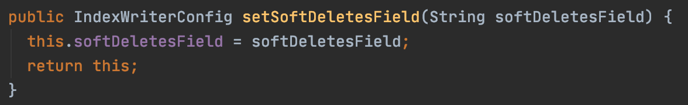

### 被删除的文档的描述方式

- 硬删除：被删除的文档对应的文档号用[索引文件.liv](https://www.amazingkoala.com.cn/Lucene/suoyinwenjian/2019/0425/54.html)来描述。
- 软删除：被标记为删除的文档不使用[索引文件.liv](https://www.amazingkoala.com.cn/Lucene/suoyinwenjian/2019/0425/54.html)来描述，而是通过[索引文件.dvd、dvm](https://www.amazingkoala.com.cn/Lucene/DocValues/)来描述，其具体介绍将在后面的内容中展开

### 被删除的文档的生命周期

- 硬删除：在执行[段的合并](https://www.amazingkoala.com.cn/Lucene/Index/2019/1024/101.html)之前，被删除的文档信息仍然在索引文件中，此时执行查询操作，如果被删除的文档满足查询条件，在查询的过程中仍然能获取这个文档号，只是在随后的逻辑中，通过[索引文件.liv](https://www.amazingkoala.com.cn/Lucene/suoyinwenjian/2019/0425/54.html)来实现过滤，使得不让这个文档号传递给[Collector](https://www.amazingkoala.com.cn/Lucene/Search/2019/0812/82.html)，并且最终根据[段的合并策略](https://www.amazingkoala.com.cn/Lucene/Index/2019/0516/59.html)，被删除的文档才会在合并的过程中实现物理删除，即索引文件中不存在该文档的信息。
- 软删除：在执行[段的合并](https://www.amazingkoala.com.cn/Lucene/Index/2019/1024/101.html)之前，被标记为删除的文档信息仍然在索引文件中，此时执行查询操作，如果被软删除的文档满足查询条件，在查询的过程中仍然能获取到这个文档，只是在随后的逻辑中，通过[索引文件.dvm&&.dvd](https://www.amazingkoala.com.cn/Lucene/DocValues/)来实现过滤，使得不让这个文档号传递给[Collector](https://www.amazingkoala.com.cn/Lucene/Search/2019/0812/82.html)，与硬删除不同的是，软删除可以通过使用合并策略SoftDeletesRetentionMergePolicy使得在执行段的合并之后，这些被删除的文档仍然被保留在索引文件中，并且可以被搜索到；同样的还是通过配置合并策略SoftDeletesRetentionMergePolicy使得这些被删除的文档无法被搜索到，或者使这些被删除的文档在下一次合并中同硬删除一样，实现物理删除，合并策略SoftDeletesRetentionMergePolicy的介绍将在后面的内容中展开

## 例子

&emsp;&emsp;接着我们通过几个例子，先从功能上来简单了解下软删除的功能。

### 第一个例子

图2：

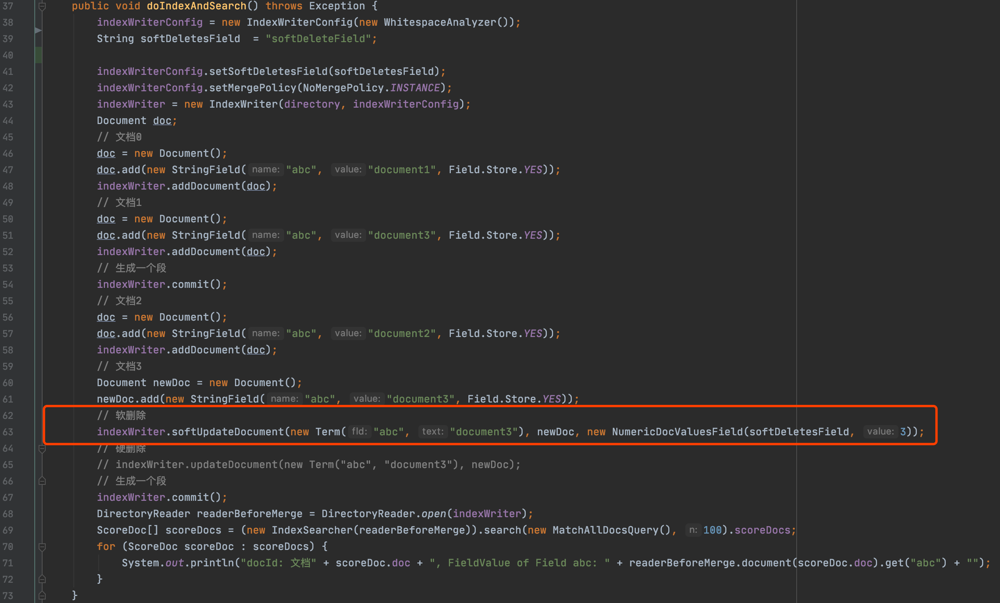

图3：

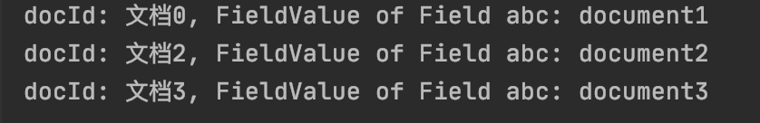

图4：

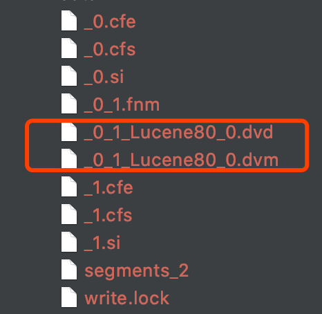

&emsp;&emsp;图2中的demo请点击 https://github.com/LuXugang/Lucene-7.5.0/blob/master/LuceneDemo8.4.0/src/main/java/io/softDeletes/SoftDeletesTest1.java 查看。

&emsp;&emsp;图2中的第63行，执行了软删除的操作，这个操作将软删除所有包含域名为"abc"、域值为"document3"的文档，并且添加一篇新的文档，即文档3，文档3中包含了一条域名为"abc"、域值为"document3"的信息。

&emsp;&emsp;图4中为执行完图2的代码后索引目录中的内容，由于图2中我们执行了两次[commit()](https://www.amazingkoala.com.cn/Lucene/Index/2019/0906/91.html)操作，所以会生成2个段，其中以"\_0"为前缀的索引文件描述是图2中文档0跟文档1的信息，可以看出这两篇文档中并没有添加DocValues的信息，但是索引目录中却有\_0\_1\_Lucene80\_0.dvd、\_0\_1\_Lucene80\_0.dvm这两个索引文件，它们正是用来描述软删除的信息，描述了文档1被标记为软删除的文档；另外图2中第64行，softUpdateDocument(...)的操作添加了一个newDoc，即文档3，它也满足软删除的要求，但由于softUpdateDocument(...)的执行逻辑为先`先标记、后添加`，故软删除的操作不会作用（apply）到文档3，从图4中的索引目录也可以看出，并没有.dvm&&.dvd的索引文件。

&emsp;&emsp;接着我们给出硬删除的例子作为对比：

图5：

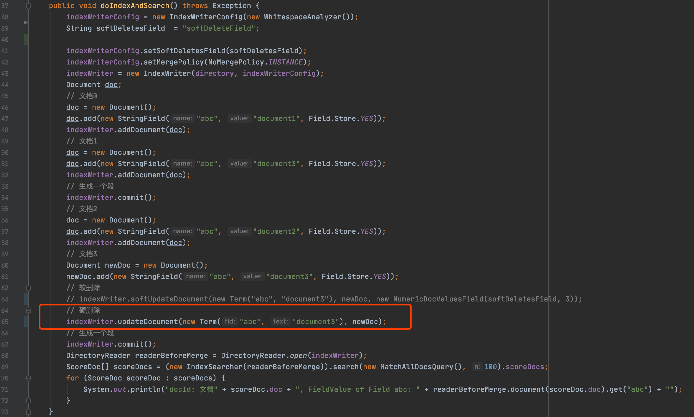

图6：

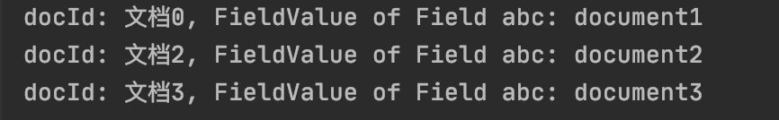

图7：

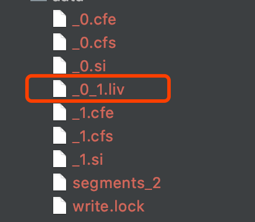

&emsp;&emsp;图5中，在第66行执行了硬删除的操作，这个操作将硬删除所有包含域名为"abc"、域值为"document3"的文档，并且添加一篇新的文档，即文档3，文档3中包含了一条域名为"abc"、域值为"document3"的信息，从图6的搜索结果可以看出，文档1满足删除要求，并且用图7索引目录中的索引文件\_0\_1.liv来描述被硬删除的文档1；同样地，updateDocument(...)的执行逻辑为`先删除、后添加`，故第66行的硬删除操作不会作用到文档3。

### 第二个例子

图8：

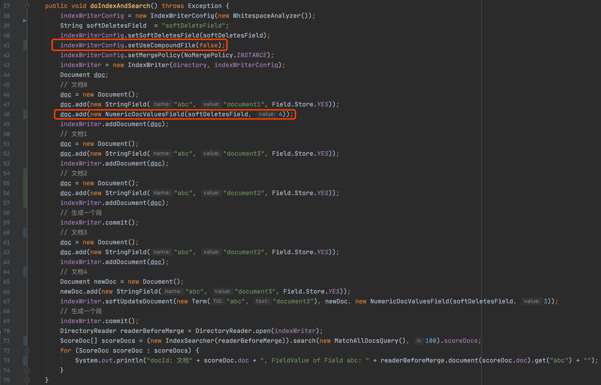

图9：

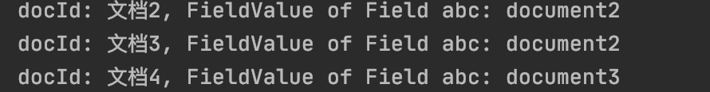

图10：

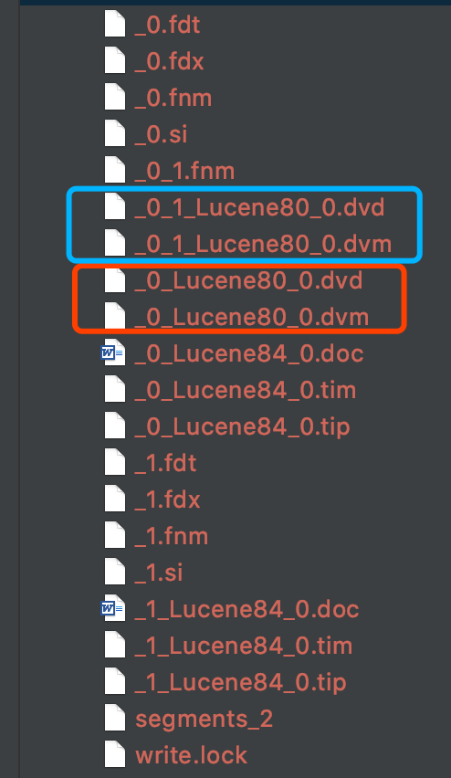

&emsp;&emsp;图8中的demo请点击 https://github.com/LuXugang/Lucene-7.5.0/blob/master/LuceneDemo8.4.0/src/main/java/io/softDeletes/SoftDeletesTest2.java 查看。

&emsp;&emsp;在图8的例子中，代码第59、69行执行了两次commit()操作，故在图10的索引目录中会生成两个段的索引文件，其中以”\_0“为前缀的索引文件描述的是第一次commit()对应的文档信息，以"\_1"为前缀的索引文件描述的是第二次commit()对应的文档信息。

&emsp;&emsp;在图8的第48行，文档0中添加了一个域名为"softDeleteField"的NumericDocValuesField域，由于在第41行设置的软删除的域名也为"softDeleteField"，并且在第67行执行软删除时也使用了NumericDocValues来标记被删除的文档，**使得在图9中的搜索结果中，文档0也被认为是被软删除的**，尽管它没有满足第67行softUpdateDocument(...)的删除条件：包含域名为"abc"、域值为"document3"的文档。

&emsp;&emsp;**这个例子是为了想说明，软删除的机制可以理解为：软删除使用DocValues来标记那些满足删除条件（即softUpdateDocument方法的第一个参数term）的文档，"标记"的过程就是为那些文档增加一个DocValues域**。

&emsp;&emsp;所以图8中由于文档0使用了软删除对应的域名，使得文档0也被认为是删除。

&emsp;&emsp;我们继续观察图10中索引目录中的索引文件，\_0\_Lucene80\_0.dvm、\_0\_Lucene80\_0.dvd这两个文件是在图8中第59行第一次commit()的时候生成的，它们描述的是文档0中的DocValues域的信息，在文章[索引文件的生成（十五）之dvm&&dvd](https://www.amazingkoala.com.cn/Lucene/Index/2020/0507/139.html)的系列文章中介绍了生成这两个索引文件的过程，不赘述；而对于\_0\_1\_Lucene80\_0.dvm、\_0\_1\_Lucene80\_0.dvd这两个索引文件则是由于执行了第67行的软删除操作后用来描述第一个段中的被软删除的文档信息，原因是在生成第二个段的时候，需要将删除信息作用到已生成的段，即第一个段，如果这里看不明白，请先阅读系列文章[文档提交之flush](https://www.amazingkoala.com.cn/Lucene/Index/2019/0716/74.html) 😂。

### 第三个例子

&emsp;&emsp;在第二个例子中，我们了解到，一篇文档中只要包含了至少一个DocValues域，并且这个域的域名为软删除对应的域名，这篇文档就被认为是软删除的，基于这个知识点就可以开始介绍如何使用软删除机制，比如在elasticsearch中使用软删除实现的一个机制，即history retention。

&emsp;&emsp;elasticsearch中关于history retention的文档见： https://www.elastic.co/guide/en/elasticsearch/reference/7.7/index-modules-history-retention.html 。

&emsp;&emsp;同样的我们通过Lucene的例子来介绍如何实现history retention，demo见：

图11：

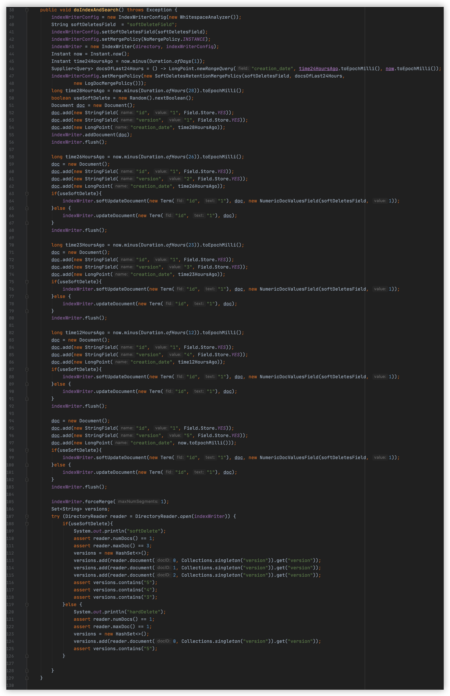

&emsp;&emsp;图11中的demo请点击 https://github.com/LuXugang/Lucene-7.5.0/blob/master/LuceneDemo8.4.0/src/main/java/io/softDeletes/HistoryRetention.java 查看。

&emsp;&emsp;在系列文章[执行段的合并](https://www.amazingkoala.com.cn/Lucene/Index/2019/1024/101.html)我们说到，在段的合并过程中，被硬删除和软删除的文档的索引信息将实现物理删除，即对应的索引信息将从索引文件中删除，图11中的第47行，我们定义了一个段的合并策略SoftDeletesRetentionMergePolicy，该策略用来描述在执行段的合并期间的一个规则，该规则描述了满足条件的被软删除的文档在合并过程中不会被物理删除，使得在合并后仍然能被搜索到，该条件即第46行的docsOfLast24Hours，该条件描述的是保留过去24小时被软删除的文档。

&emsp;&emsp;接着我们看图11中的文档，如果使用硬删除，即useSoftDelete的值为false，那么在合并后，reader中只包含一篇文档，即包含域名为"version"、域值为"5"的那篇文档，即图11中的第121~125代码，可见，使用硬删除以后，无法保留被删除的文档信息；当使用了软删除，即useSoftDelete的值为true，除了包含域名为"version"、域值为"5"的那篇文档，其他所有的文档都被软删除了，并且由于合并策略SoftDeletesRetentionMergePolicy的条件为保留过去24小时被软删除的文档，所以那些包含域名为"creation_date"，域值在24小时的被软删除的文档将不会在合并期间物理删除，即能搜索到，可见，包含域名为"version"，域值为5、4、3的文档，他们包含的creation_date都在24小时内，故能被搜索到，而域名为"version"，域值为2、1的被软删除的文档，它们的"creation_data"分别为28小时、26小时，故在段的合并之后，这两篇文档被物理删除了。

&emsp;&emsp;故上述描述的就是保留24小时删除记录的history retention。

## 结语

&emsp;&emsp;本篇文章简单介绍了软删除的一些概念以及history retention的实现方式，在随后的系列文章中将会介绍，合并策略SoftDeletesRetentionMergePolicy保留满足条件的被软删除的文档的原理以及在索引期间、flush期间、合并期间跟软删除相关的内容。

[点击]()下载附件

