# [软删除softDeletes（三）](https://www.amazingkoala.com.cn/Lucene/Index/)（Lucene 8.4.0）

&emsp;&emsp;在文章[软删除softDeletes（二）](https://www.amazingkoala.com.cn/Lucene/Index/2020/0621/149.html)中我们说到，在Lucene 7.5.0版本中，使用了下面两个容器来存储软删除的删除信息、DocValues的更新信息：

- Map<String,LinkedHashMap<Term,NumericDocValuesUpdate>> numericUpdates：DocValuesUpdatesNode
- Map<String,LinkedHashMap<Term,BinaryDocValuesUpdate>> binaryUpdate：DocValuesUpdatesNode

&emsp;&emsp;而从Lucene 7.7.0版本之后，使用了下面的一个容器来优化存储：

- final Map<String, FieldUpdatesBuffer> fieldUpdates = new HashMap\<\>();

&emsp;&emsp;我们先给出源码的CHANGE.LOG中的介绍：

```text
LUCENE-8590: BufferedUpdates now uses an optimized storage for buffering docvalues updates that can safe up to 80% of the heap used compared to the previous implementation and uses non-object based datastructures.
```

&emsp;&emsp;该issue的地址见：https://issues.apache.org/jira/browse/LUCENE-8590 ，对于上述中优化存储的内容将在下一篇文章中展开。

&emsp;&emsp;在介绍软删除在flush/commit阶段的相关内容之前，我想先重新介绍在多线程下执行文档删除（更新）操作时，删除结点（即[软删除softDeletes（二）](https://www.amazingkoala.com.cn/Lucene/Index/2020/0621/149.html)中介绍的Node对象）如何被添加到全局的deleteQueue中，以及在flush阶段，DWPT（见文章[文档的增删改（下）（part 1）](https://www.amazingkoala.com.cn/Lucene/Index/2019/0701/70.html)）生成一个段时，如何最终确定这个段包含了哪些私有删除信息（见文章[文档提交之flush（三）](https://www.amazingkoala.com.cn/Lucene/Index/2019/0725/76.html)）。

## 添加删除结点到全局deleteQueue

&emsp;&emsp;在触发主动flush（见文章[文档提交之flush（一）](https://www.amazingkoala.com.cn/Lucene/Index/2019/0716/74.html)）之前，总是**只存在一个**全局的deleteQueue，它用来存储在上一次主动flush到下一次主动flush期间所有线程执行删除操作后对应的删除信息，即删除结点Node对象，为了便于描述，我们假设一个DWPT总是只由一个相同的线程来管理（一个DWPT如果执行了一次文档的增删改操作后，没有触发自动flush，那么下次再次执行文档的增删改操作时可能会由另一个线程管理，见文章[文档的增删改（中）](https://www.amazingkoala.com.cn/Lucene/Index/2019/0628/69.html)）。

&emsp;&emsp;每个DWPT对象中有一个私有的DeleteSlice对象，DeleteSlice的结构很简单，如下所示：

图1：

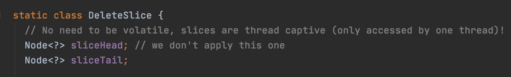

&emsp;&emsp;每当生成一个新的DWPT（意味着随后会生成一个新的段），DWPT中的DeleteSlice对象（为了区分全局的DeleteSlice，故我们称之为DWPT私有的DeleteSlice对象）的sliceHead以及sliceTail会同时被赋值为deleteQueue中最后一个删除结点，可以理解为sliceHead跟sliceTail作为指针指向deleteQueue中最后一个删除结点，如下所示：

图2：

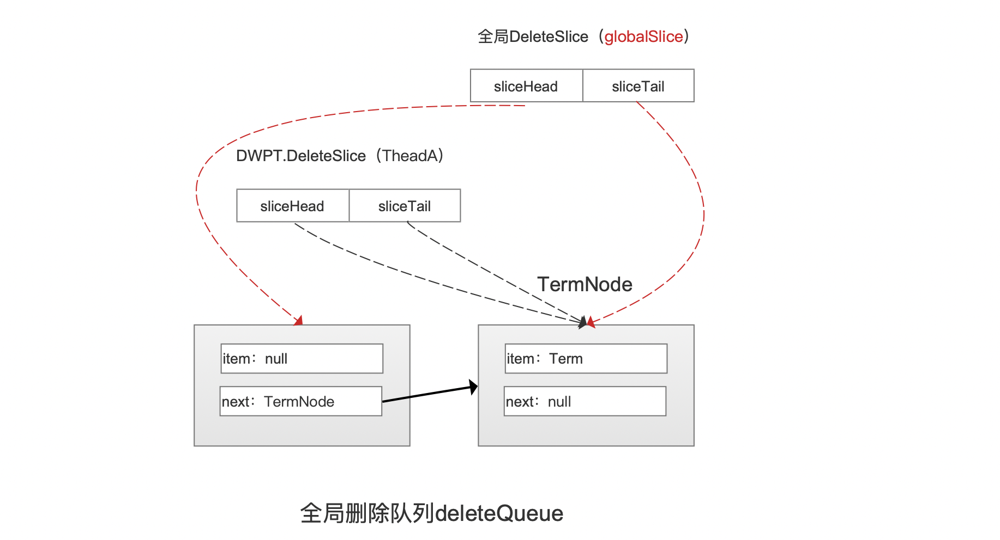

&emsp;&emsp;图2中，deleteQueue中已经有了一个删除结点TermNode，它是由其他线程添加的，当TheadA管理一个新生成的DWPT时，那么在初始化DWPT阶段，DWPT中的DeleteSlice对象的sliceHead以及sliceTail会指向deleteQueue中的最后一个删除结点，即上图中的TermNode。

&emsp;&emsp;**为什么sliceHead以及sliceTail要指向deleteQueue中的最后一个结点：**

&emsp;&emsp;这么做的目的是保证旧的删除操作不会错误的作用（apply）到新的段（DWPT最终会flush为一个段），注意的是在flush阶段总是从sliceHead指向的删除结点的**下一个结点**开始读取，故图2中的DWPT生成的段不会被上图中TermNode这个删除信息作用。

&emsp;&emsp;另外还存在一个全局deleteSlice，它的sliceHead以及sliceTail**总是分别指向（在完善删除结点之前）**deleteQueue中的第一个以及最后一个删除结点，全局deleteSlice的作用将在下文中中介绍。

&emsp;&emsp;**在完善删除结点的前后全局deleteSlice的sliceHead以及sliceTail有什么区别：**

&emsp;&emsp;在文章[软删除softDeletes（二）](https://www.amazingkoala.com.cn/Lucene/Index/2020/0621/149.html)中我们说到，删除结点在被**完善（添加哨兵值，见文章[文档的增删改（下）（part 2）](https://www.amazingkoala.com.cn/Lucene/Index/2019/0704/71.html)）**后使用新的容器来存储，在源码中的描述就是删除信息Node在被完善后用BufferedUpdate对象（新的容器的是对象成员，见在文章[软删除softDeletes（二）](https://www.amazingkoala.com.cn/Lucene/Index/2020/0621/149.html)）来存储。

&emsp;&emsp;**全局deleteSlice什么时候会发生完善删除结点：**

&emsp;&emsp;在索引期间，任意线程往deleteQueue中添加删除结点后就会执行完善全局deleteSlice对应的删除结点的操作，在源码中通过调用tryApplyGlobalSlice()来执行完善删除结点的操作，以及在flush阶段也会发生完善删除结点的操作，如下所示：

图3：

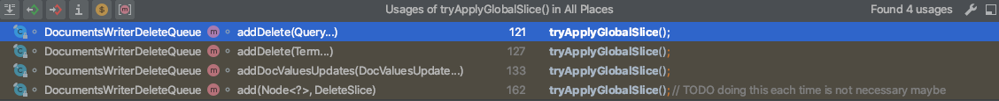

&emsp;&emsp;图3中可以看出，每次执行一次添加删除结点的操作后就会**尝试**执行完善删除结点，那么问题又来了，为什么是尝试执行，而不是强制执行，强制执行意味着任意线程添加一个删除结点都要完善全局deleteSlice对应的删除结点。

&emsp;&emsp;**为什么是尝试完善删除结点，而不是强制完善删除结点：**

&emsp;&emsp;在flush阶段，deleteQueue中所有的删除结点都会被完善删除结点，这些删除信息的作用（apply）对象为索引目录中已经生成的段，为了防止产生重复的删除信息，只会让第一个执行flush的DWPT在生成段的时候完善全局deleteSlice对应的删除结点，意味着这个DWPT对应的线程相对于其他线程会有额外的负担，那么如果在索引阶段，每个线程管理的DWPT在添加一个删除结点后就尝试完善全局deleteSlice对应的删除结点，就能减轻在flush阶段第一个生成段对应的线程的压力。索引期间的删除结点操作是个tryLock的同步操作，所以如果线程尝试完善全局DeleteSlice对应的删除结点时发现其他线程正在执行，那么就跳过此次操作。另外一个更重要的原因是，我们在文章[文档的增删改（下）（part 2）](https://www.amazingkoala.com.cn/Lucene/Index/2019/0704/71.html)中知道，完善删除结点的主要目的就是添加哨兵值，哨兵值用来描述删除信息的作用范围，然而全局DeleteSlice中的的删除信息是用来作用索引文件已经生成的段的所有文档，所以这个哨兵值是个常量为0x7fffffff，代表了所有的文档号，但是对于DWPT的DeleteSlice中的删除信息，它们的作用（apply）对象是DWPT即将生成的段中的文档，所以此时的哨兵值为DWPT当前收集的文档数量，即numDocsInRAM（见文章[文档的增删改（下）（part 2）](https://www.amazingkoala.com.cn/Lucene/Index/2019/0704/71.html)），下文会进一步介绍。

&emsp;&emsp;图2中，如果ThreadA在添加了删除结点后执行了tryApplyGlobalSlice()的操作，下图所示：

图4：

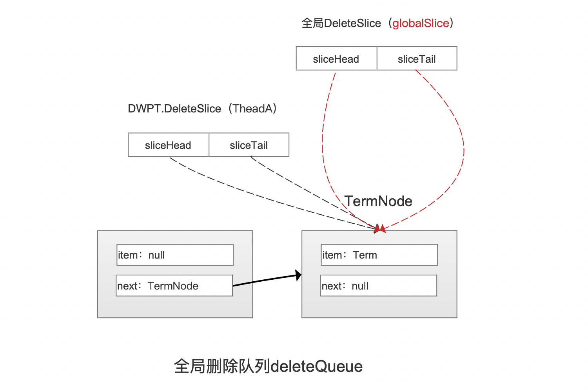

&emsp;&emsp;**为了便于描述，我们假设只有在flush阶段才会完善全局DeleteSlice对应的删除结点，故下文中，全局DeleteSlice中的sliceHead以及sliceTail总是分别指向deleteQueue中第一个和最后一个删除结点。**

&emsp;&emsp;接着如果此时图2中的DWPT执行一个删除操作，那么会在deleteQueue中添加一个删除结点，我们假设执行了**软删除的操作**，故添加一个DocValuesUpdatesNode，并且让DWPT的私有DeleteSlice指向**它添加的那个删除结点（这里加黑的区域很重要，下文会介绍）**如下所示：

图5：

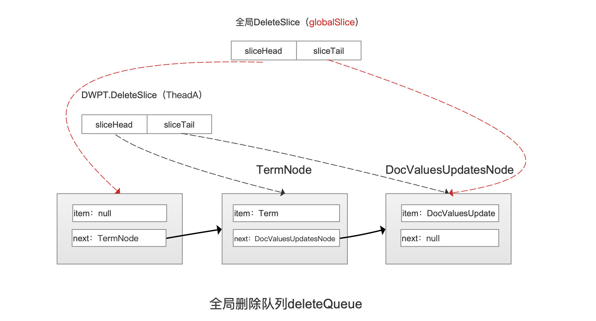

&emsp;&emsp;同样的在添加完删除结点DocValuesUpdatesNode之后，ThreadA管理的DWPT同样会对它包含的DeleteSlice，即私有DeleteSlice对应的删除节点执行完善的操作，那么在删除结点DocValuesUpdatesNode被完善后用新的容器来存储，即被存储到BufferedUpdates对象中，并且BufferedUpdates对象是DWPT的私有的（看不懂？先看下文章[文档的增删改（下）（part 2）](https://www.amazingkoala.com.cn/Lucene/Index/2019/0704/71.html)），最后更新DWPT的DeleteSlice的sliceHead，让它指向sliceTail指向的删除结点，如下所示：

图6：

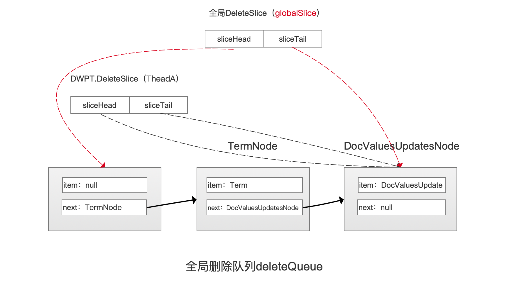


&emsp;&emsp;如果此时线程ThreadB管理一个新的DWPT，那么DWPT初始化结束后，如下所示：

图7：

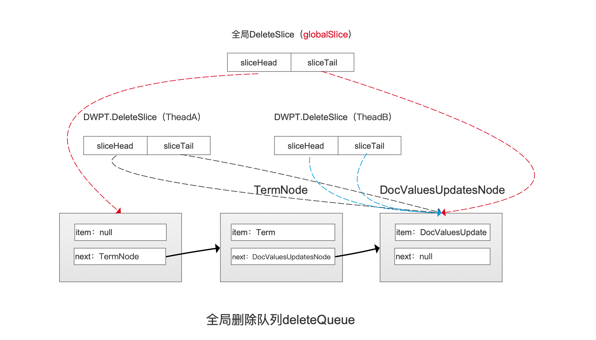

&emsp;&emsp;图4中可以看出ThreadA管理的DWPT添加的删除信息不会作用到ThreadA管理的DWPT对应的段，在多线程下往deleteQueue中添加删除结点是个同步操作，该同步通过synchronize实现，在源码中的代码如下所示：

图8：

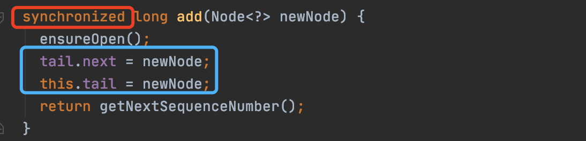

&emsp;&emsp;图7中通过synchronized关键字实现线程间的同步，上图中tail是一个全局的Node结点，它总是deleteQueue中最后一个删除结点的引用，**它用来告知其他的线程以及全局的DeleteSlice的sliceTail如何指向deleteQueue中的最后一个删除结点**。

&emsp;&emsp;从图7中我们了解到，多线程执行添加删除结点操作是同步，但是每个线程在添加结束后紧接着的完善删除结点的操作却是不同步的，例如ThreadA跟ThreadB管理的DWPT分别添加了一个TermNode跟DocValuesUpdatesNode，并且我们假设**TermNode先被添加了**，**并且两个线程都没有开始执行完善删除结点的操作**。如下所示：

图9：

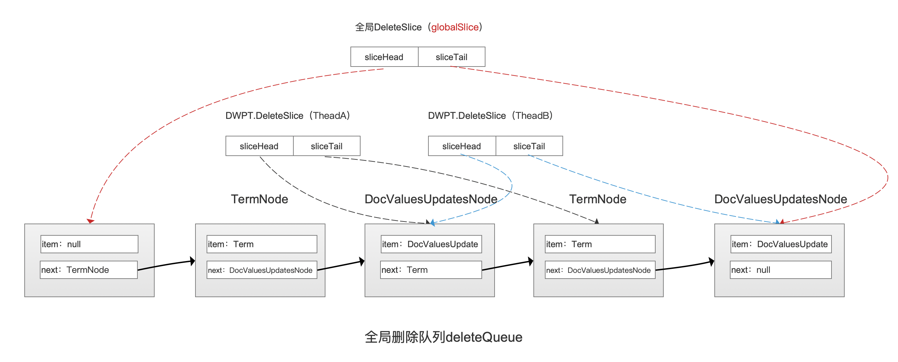

&emsp;&emsp;上文中我们说到，DWPT往deleteQueue中添加了一个删除结点后，会让DWPT的私有DeleteSlice的sliceTail指向它添加的那个删除结点，故如上所示。

&emsp;&emsp;在添加删除结点到deleteQueue中之后，每个线程管理的DWPT都需要执行完善结点的操作，从图9中可以看出，由于ThreadA在添加删除结点的竞争中获胜了，所以在完善删除结点后，只有TermNode作用于ThreadA管理的DWPT中的文档，而对于ThreadB，则是TermNode跟DocValuesUpdatesNode两个删除信息将作用于ThreadB管理的DWPT中的文档，同理如果在添加到deleteQueue的竞争中，**ThreadB获胜了**，那么如下所示：

图10：

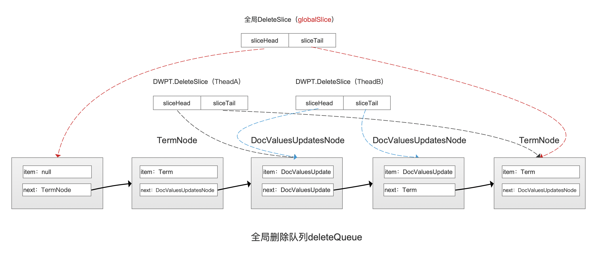

&emsp;&emsp;从图10中可以看出，当执行完善删除结点后，ThreadB管理的DWPT中的文档将被只被一个DocValuesUpdatesNode作用，而ThreadA管理的DWPT中的文档将只被2个删除信息作用。

&emsp;&emsp;我们此时肯定会产生一个疑问（其实这也是我第一次看这段源码时的疑惑😁），按照上文中的描述，DWPT生成的段中的删除信息是无法确定的。

&emsp;&emsp;其实不然，我们先抛出结论：在**DWPT初始化之后**，下次主动flush之前的所有**新增的删除信息**（可能由其他线程提供的删除信息）都会作用到这个DWPT中的文档。也就是说对于图9跟图10两种添加删除结点的情况，这两个线程管理的DWPT中的文档最终都将被TermNode、DocValuesUpdateNode作用。

&emsp;&emsp;我们以图10的ThreadB为例，目前它管理的DWPT中的文档只被DocValuesUpdatesNode作用，TermNode将在下面三种情况下作用（apply）

- 情况一：ThreadB管理的DWPT又添加了一条删除信息，假设这条删除信息是TermNode，那么在完善结点时就能通过TheadB管理的DWPT对应的DeleteSlice中的sliceHead与sliceTail指向的删除结点区间来实现，如下所示：

图11：

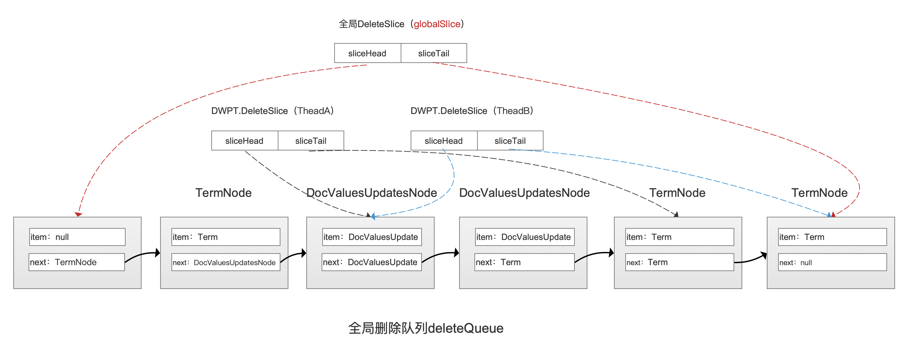

- 情况二：ThreadB管理的DWPT添加了一篇文档，在添加完这篇文档后，会更新DWPT中的DeleteSlice的sliceTail，让它指向tail（tails的作用上文已经介绍），也就是指向deleteQueue中最后一个删除结点，随后执行完善删除结点的操作

- 情况三：在flush阶段，DWPT生成一个段时，ThreadB管理的DWPT对应的DeleteSlice中的sliceTail将会被指向tail，这样所有其他线程新增的删除信息都能被作用到当前DWPT中的文档。


&emsp;&emsp;源码中是这样介绍删除结点作用DWPT中的文档的时机点的：

图12：

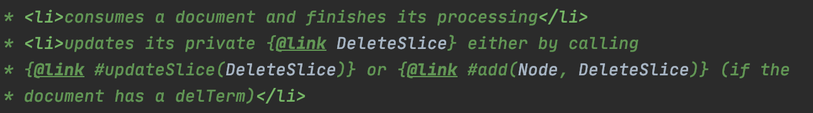

&emsp;&emsp;图12中说到，当DWPT处理完一篇文档之后，会更新DWPT私有的DeleteSlice，如果这次的操作是更新操作，即带有删除信息，那么就通过add(Node, DeleteSlice)方法，即上文中的情况一；如果没有删除信息就调用updateSlice(DeleteSlice)的方法，即上文中的情况二。

## 结语

&emsp;&emsp;相信通过上文的介绍，能完全的理解Lucene在索引阶段处理删除信息的方式，在后面的文章中我们还会介绍在flush阶段跟删除信息相关的知识，为了更快的理解，建议先阅读系列文章[文档提交之flush](https://www.amazingkoala.com.cn/Lucene/Index/2019/0716/74.html)。

[点击](http://www.amazingkoala.com.cn/attachment/Lucene/Index/软删除softDeletes/软删除softDeletes（三）/软删除softDeletes（三）.zip)下载附件