# [软删除softDeletes（二）](https://www.amazingkoala.com.cn/Lucene/Index/)（Lucene 8.4.0）

&emsp;&emsp;在文章[软删除softDeletes（一）](https://www.amazingkoala.com.cn/Lucene/Index/2020/0616/148.html)中我们介绍了软删除的一些应用，从本篇文章开始，将根据索引（index）、flush/commit、段的合并、搜索这几个不同的阶段来介绍跟软删除相关的内容。

## 索引（index）

&emsp;&emsp;**阅读本小结内容必须掌握文章[文档的增删改（下）（part 2）](https://www.amazingkoala.com.cn/Lucene/Index/2019/0704/71.html)中的知识点，故下文中出现的一些名词不会作详细的介绍**。

&emsp;&emsp;索引（index）这个阶段，即[文档的增删改](https://www.amazingkoala.com.cn/Lucene/Index/2019/0626/68.html)的阶段，由于软删除属于删除操作，故对应的删除信息会被添加到全局的deleteQueue中，deleteQueue中存放了四种类型的删除信息，这四种删除信息用下图中的Node对象来描述：

图1：

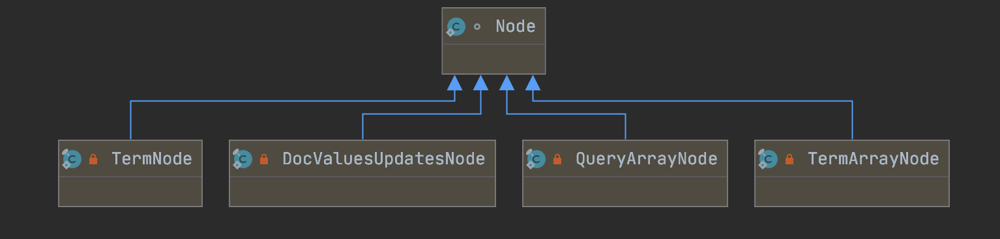

&emsp;&emsp;上图中的四种删除信息通过IndexWriter类中提供的方法生成：

- QueryArrayNode：deleteDocuments(Querys)
- TermArrayNode：deleteDocuments(Terms)
- DocValuesUpdatesNode：updateBinaryDocValue( )、updateNumericDocValue( )、updateDocValues( )、softUpdateDocument( )、softUpdateDocuments( )
- TermNode：updateDocument(Term, Document)、updateDocuments( Term, Documents)

&emsp;&emsp;由上文可以看出，软删除对应的删除信息将会由DocValuesUpdatesNode来描述，

我们通过一个例子来看下DocValuesUpdatesNode中描述了哪些删除信息：

图2：

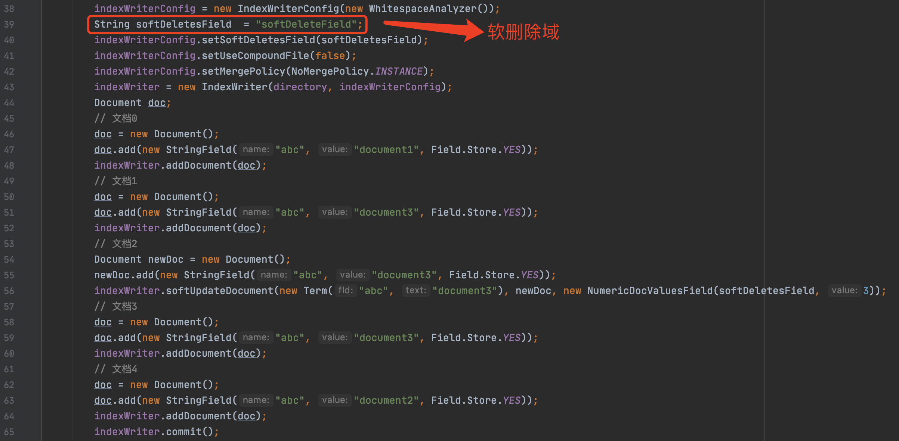

&emsp;&emsp;图2中，第56行执行了软删除的操作，它对应的删除信息DocValuesUpdatesNode包含如下信息：

图3：

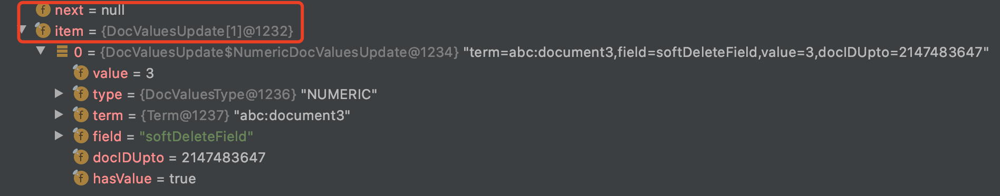

&emsp;&emsp;DocValuesUpdatesNode中包含了两个对象：next、item，其中next用来指向deleteQueue中下一个删除信息（见文章[文档的增删改（下）（part 2）](https://www.amazingkoala.com.cn/Lucene/Index/2019/0704/71.html)），item（**NumericDocValuesUpdate对象**）中的type描述了使用NUMERIC类型的DocValues来描述被软删除的文档，item中的term描述了满足被软删除的文档的条件，即包含域名为"abc"、域值为"document3"的文档都会被软删除。

&emsp;&emsp;上述DocValuesUpdatesNode的信息我们可以看出，我们获得了满足软删除的条件，但是没有指出软删除的作用范围（作用域），例如在图2中，文档3也满足被软删除的条件，但是这篇文档是在第56行的软删除操作之后添加的，那么这次的软删除不能作用（apply）到这篇文档，即这次的软删除操作只能对文档1生效，故我们还需要**根据DocValuesUpdatesNode的信息**进一步完善删除信息，即添加软删除的作用范围，不同的删除信息在完善删除信息后用下列的容器来描述（**Lucene 7.5.0**）：

- Map<Term,Integer> deleteTerms ：TermArrayNode、TermNode
- Map<Query,Integer> deleteQueries：QueryArrayNode
- Map<String,LinkedHashMap<Term,NumericDocValuesUpdate>> numericUpdates：DocValuesUpdatesNode
- Map<String,LinkedHashMap<Term,BinaryDocValuesUpdate>> binaryUpdate：DocValuesUpdatesNode

&emsp;&emsp;BufferedUpdates类、deleteTerms、deleteQueries的内容在文章[文档的增删改（下）（part 2）](https://www.amazingkoala.com.cn/Lucene/Index/2019/0704/71.html)中已经作出了介绍，不赘述。

&emsp;&emsp;如果DocValuesUpdatesNode中item中的type为NUMERIC，那么对应生成numericUpdates，如果item中的type为BINARY，那么对应生成binaryUpdate。

### numericUpdates

&emsp;&emsp;numericUpdates容器的key描述的是图3中，item中的field的值，而容器的value则是又一个LinkedHashMap的容器，该容器的key为一个term，例如图3中的item的term的值，而value则是图3中的item。

&emsp;&emsp;在文章[构造IndexWriter对象（一）](https://www.amazingkoala.com.cn/Lucene/Index/2019/1111/106.html)中我们说到，一个IndexWriter通过IndexWriterConfig配置只能设置一个软删除域，并且是个`不可变配置`，那么为什么numericUpdates使用Map存储，并且key为软删除域的值？

- 上文中我们说到，IndexWriter类中提供的updateBinaryDocValue( )、updateNumericDocValue( )、updateDocValues( )方法（这三个方法为**更新DocValues的操作**）对应生成的删除信息跟软删除操作softUpdateDocument( )、softUpdateDocuments( )一样都是用DocValuesUpdatesNode来描述，故也使用同一个numericUpdates来完善删除信息，所以numericUpdates容器的key不一定就是软删除的域。

&emsp;&emsp;我们同样的以一个例子来介绍：

图4：

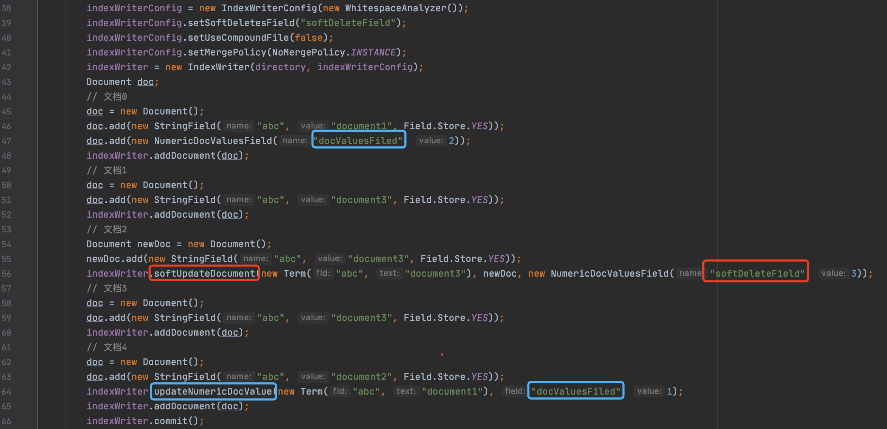

&emsp;&emsp;图4的例子中，既有updateNumericDocValue()，又有softDocument()的操作，那么这两个操作对应在numericUpdates中的删除信息如下所示：

图5：

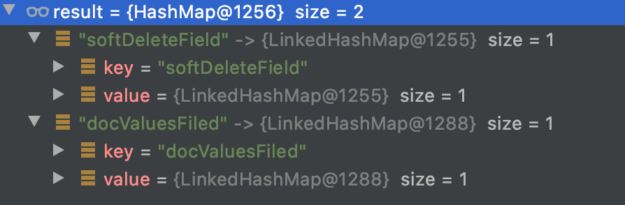

&emsp;&emsp;我们接着继续介绍为什么numericUpdates容器的value是一个LinkedHashMap结构，先给出源码中对这种设计的注释：

图6：

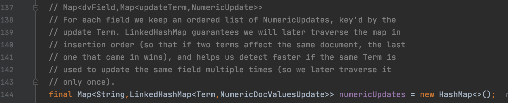

&emsp;&emsp;注释中讲述了使用LinkedHashMap结构的两个原因：

- 原因一：在不同的term之间，即LinkedHashMap的不同的key，如果一篇文档中包含的term满足多个软删除操作中的term条件（见文章[软删除softDeletes（一）](https://www.amazingkoala.com.cn/Lucene/Index/2020/0616/148.html)），那么根据LinkedHashMap的插入有序的特点，这篇文档用最后一个软删除操作中的DocValues来描述该文档被软删除了
- 原因二：在相同的term之间，如果多次调用的软删除中的term条件是一样的，那么可以进行去重，并且选取作用范围（作用域）最大的那个（下面的例子会介绍）

&emsp;&emsp;我们继续用一个例子来介绍上述的原因一：

图7：

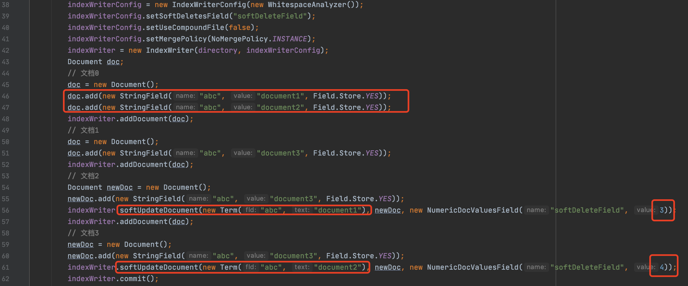

&emsp;&emsp;图7中，第56、61行执行了两次软删除操作，并且文档0都满足这两个软删除的条件，由于第61行的软删除操作晚于第56行，所以文档0将用61行中的域名为"softDeleteField"、域值为4的NumericDocValues来描述它被软删除了，至于使用这个DocValues来描述被软删除的用途，将在后面的文章中介绍。

&emsp;&emsp;我们接着通过一个例子介绍上述的原因二：

图8：

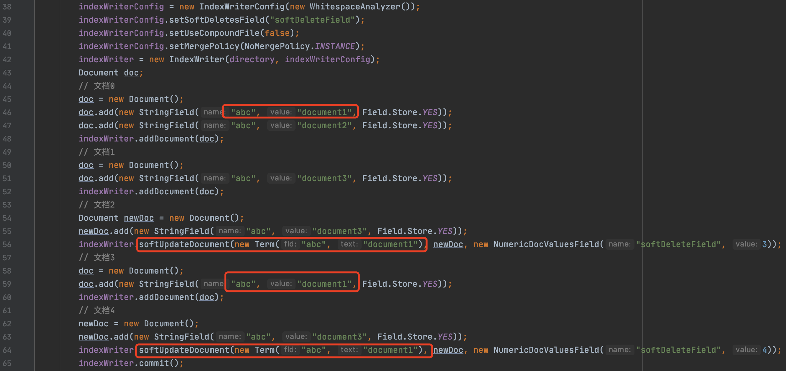

&emsp;&emsp;图8中，第56、64行执行了两次软删除操作，并且他们的软删除条件是一样的，即被软删除的文档中需要包含域名为"abc"、域值为"document1"的信息，那么第56行的软删除对应的删除信息将被第66行的软删除对应的删除信息替换。

&emsp;&emsp;**图8中两次软删除对应在numericUpdates容器中的信息有什么不同，为什么会发生替换？**

&emsp;&emsp;我们直接给出这两次软删除的对应在numericUpdates容器中的信息来做介绍：

图9：

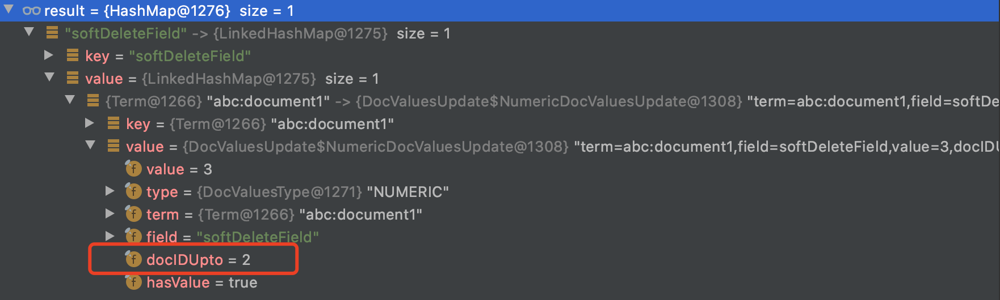

图10：

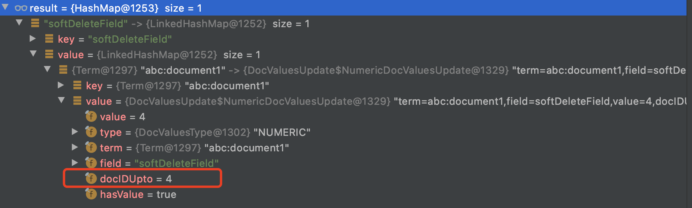

&emsp;&emsp;图9、图10中，docIDUpto描述的是删除信息的作用范围（作用域），图9中docIDUpto的值为2，它描述了从删除信息的作用范围为文档号区间为[0, 2)、图10中的docIDUpto的值为5，它描述了从删除信息的作用范围为文档号区间为[0, 4)，故图10中的作用范围包含了图9中的删除范围，这样就能过滤掉相同term条件的软删除操作。

## 注意点

&emsp;&emsp;上文中我们说到，updateBinaryDocValue( )、updateNumericDocValue( )、updateDocValues( )、softUpdateDocument( )、softUpdateDocuments( )的操作在索引期间使用相同的方式来存储删除信息，这使得我们用softUpdateDocument( )需要注意一个问题，如果该方法中用来描述文档被软删除的DocValues的域名不是IndexWriter的配置中定义的软删除域，那么这次软删除操作就会转变为**DocValues的更新操作**，我们通过下面的例子来说明：

图11：

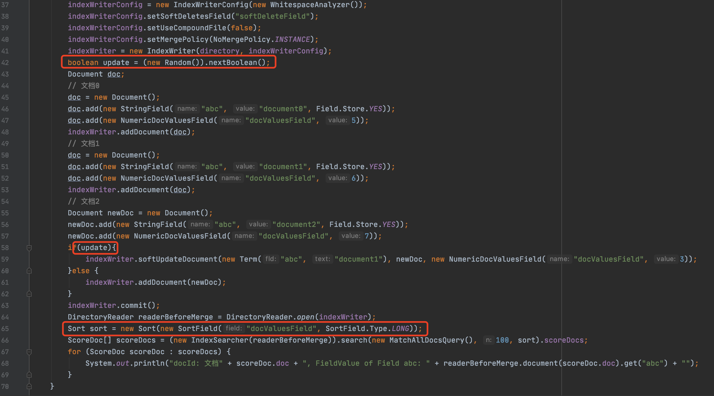

&emsp;&emsp;图11中，如果update为true，那么我们执行软删除操作，注意的是59行用来描述文档被软删除的DocValues的域名"docValuesField"不是38行的设置的软删除域”softDeleteField“，故这次的软删除操作转化为**DocValues的更新操作**，那么文档1中域名为"docValuesFiled"的NumericDocValuesField的域值"5"会被更新为"3"，故搜索结果在按照"docValuesField"排序之后， 如下所示：

图12：

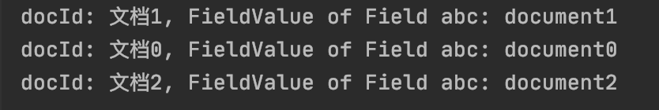

&emsp;&emsp;可见，文档1并没有被软删除，图11的demo看这里：https://github.com/LuXugang/Lucene-7.5.0/blob/master/LuceneDemo/src/main/java/lucene/softDeletes/SoftDeletesTest3.java 。

## 结语

&emsp;&emsp;本文中，我们介绍了Lucene7.5.0版本中，在索引期间跟软删除相关的一些内容，即使用numericUpdates、binaryUpdate两个容器存储删除信息，然而在Lucene8.4.0中，取消了这两个容器，使用了其他的方法存储删除信息，这块内容将在下篇文章中展开。

[点击](http://www.amazingkoala.com.cn/attachment/Lucene/Index/软删除softDeletes/软删除softDeletes（二）/软删除softDeletes（二）.zip)下载附件