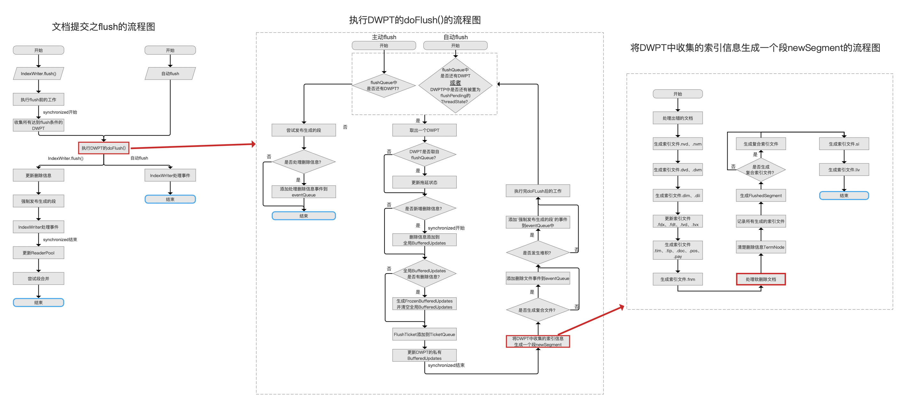
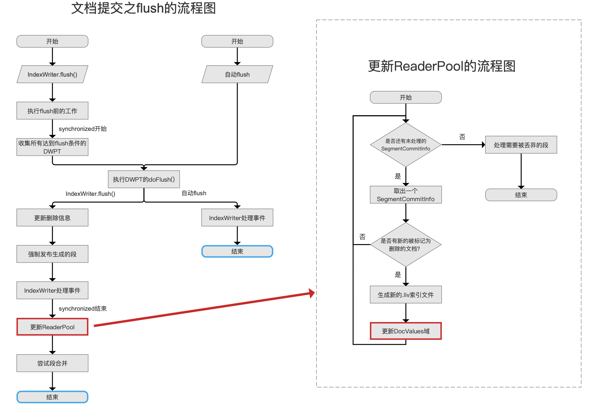
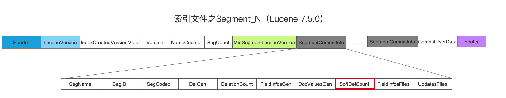
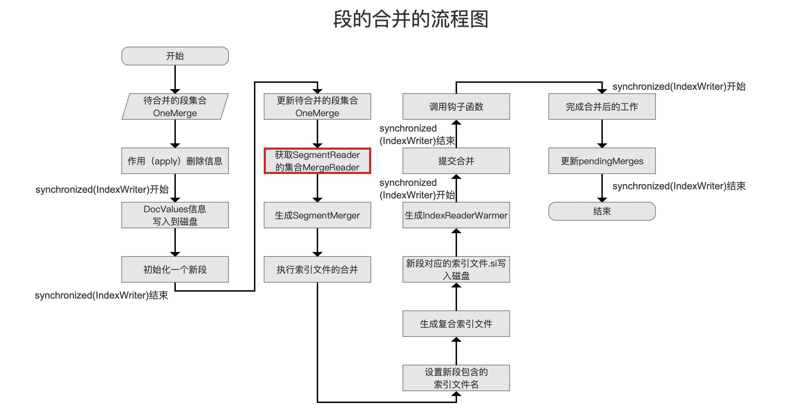
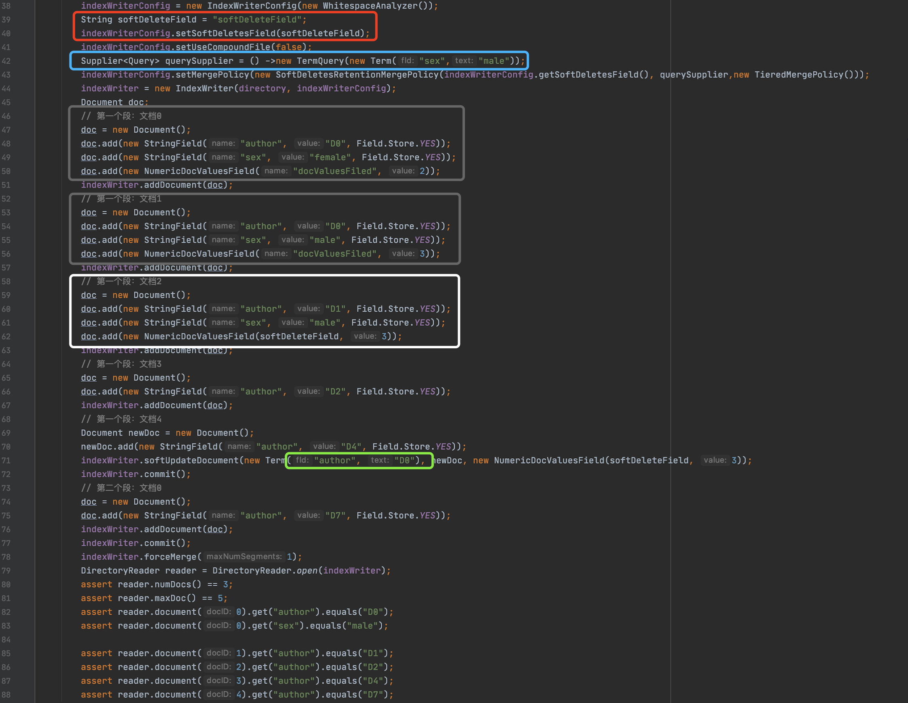
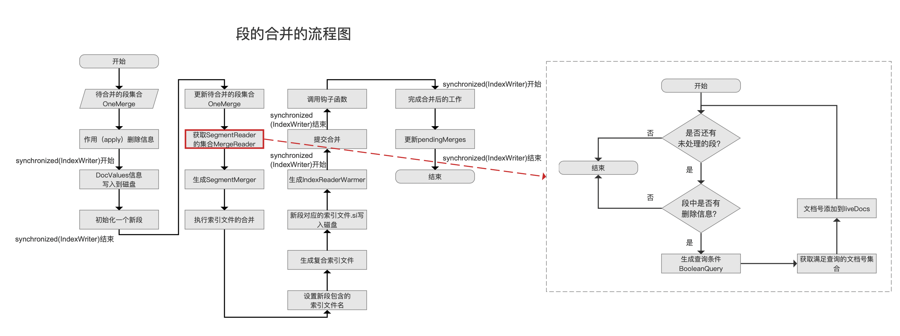
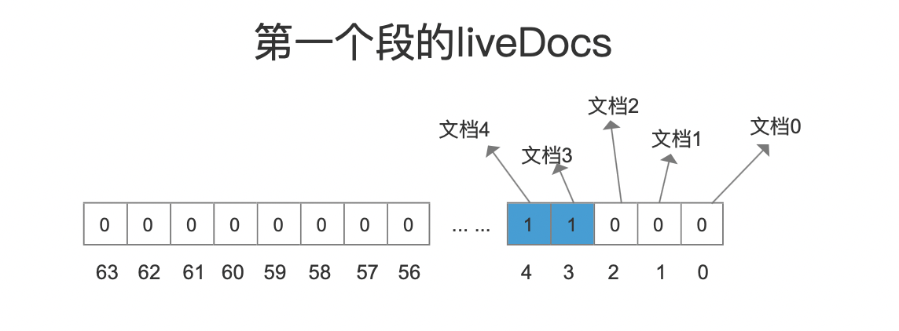
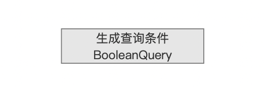
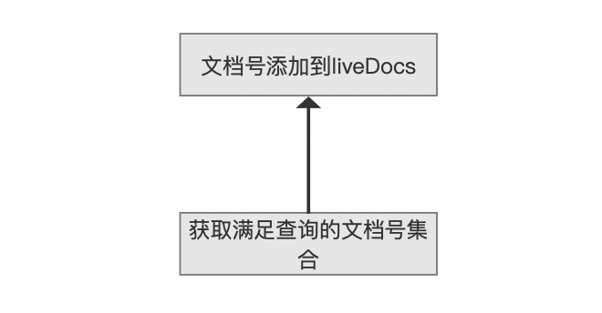
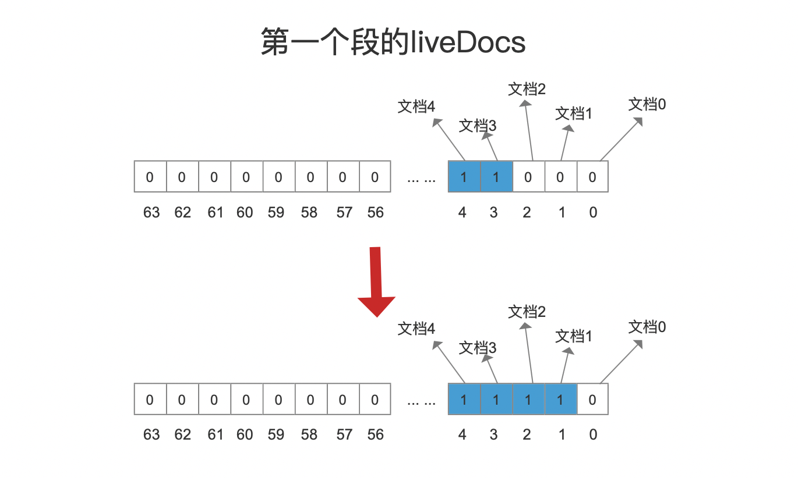

# [软删除softDeletes（五）](https://www.amazingkoala.com.cn/Lucene/Index/)（Lucene 8.4.0）

&emsp;&emsp;在文章[软删除softDeletes（二）](https://www.amazingkoala.com.cn/Lucene/Index/2020/0621/149.html)中介绍了软删除在索引（index）阶段的相关内容，我们接着介绍在flush/commit阶段的内容

## flush/commit

&emsp;&emsp;在这个阶段，我们首先要介绍的是DWPT在转化为一个段的期间，即下图中用红框标注的流程点，跟软删除相关的内容：

图1：



[点击]()查看大图

&emsp;&emsp;上图中，流程点`将DWPT中收集的索引信息生成一个段newSegment`的介绍见文章[文档提交之flush（三）](https://www.amazingkoala.com.cn/Lucene/Index/2019/0725/76.html)，注意的是，图1中的流程点基于版本为Lucene 7.5.0，但是软删除相关的处理时机点跟Lucene 8.4.0是一致的。

&emsp;&emsp;在<font color=red>红框</font>标注的流程点`处理软删除文档`中，统计了满足某个条件的文档的数量softDelCountOnFlush，这个条件是：文档中包含了DocValues（NumericDocValuesField或BinaryDocValuesField）的信息，并且DocValues的域名跟软删除的域是相同的（文档也有可能同时满足软删除的条件）。满足该条件的文档都被会认为是软删除的，在文章[软删除softDeletes（一）](https://www.amazingkoala.com.cn/Lucene/Index/2020/0616/148.html)中的**第二个例子**介绍了这种情况。

&emsp;&emsp;**在<font color=red>红框</font>标注的流程点`处理软删除文档`中是如何找到所有满足这个条件的文档集合的：**

&emsp;&emsp;在文章[索引文件的生成（十五）之dvm&&dvd](https://www.amazingkoala.com.cn/Lucene/Index/2020/0507/139.html)中，我们介绍了在索引阶段Lucene收集DocValues信息的过程，并且说到使用了[DocsWithFieldSet](https://github.com/LuXugang/Lucene-7.5.0/blob/master/solr-8.4.0/lucene/core/src/java/org/apache/lucene/index/DocsWithFieldSet.java)对象收集了文档号，同时介绍了DocsWithFieldSet收集的过程，即每一个DocValues域都有一个[DocsWithFieldSet](https://github.com/LuXugang/Lucene-7.5.0/blob/master/solr-8.4.0/lucene/core/src/java/org/apache/lucene/index/DocsWithFieldSet.java)对象，那么DocValues域的域名跟软删除的域如果相同的话，[DocsWithFieldSet](https://github.com/LuXugang/Lucene-7.5.0/blob/master/solr-8.4.0/lucene/core/src/java/org/apache/lucene/index/DocsWithFieldSet.java)对象中文档的数量会添加到softDelCountOnFlush中。


&emsp;&emsp;接着在下图<font color=red>红框</font>标注的流程点`更新DocValues域`处理软删除的信息。

图2：



&emsp;&emsp;上文中，DWPT转化为一个段的时候，计算出了softDelCountOnFlush，但是它并不包含满足软删除条件的文档并且文档中不包含跟软删除有相同域名的DocValues信息，那么到了图2中会将这种文档的数量进行统计，统计结果会跟softDelCountOnFlush一起写入到SoftDelCount，而SoftDelCount最终会被写入到用于描述段的索引信息SegmentCommitInfo中，即下图<font color=red>红框</font>标注的字段，在文章[索引文件之segments_N](https://www.amazingkoala.com.cn/Lucene/suoyinwenjian/2019/0610/65.html)中我们知道，当执行了commit()操作后，一个段的索引信息SegmentCommitInfo将被写入到索引文件segments_N中：

图3：



&emsp;&emsp;在执行图1流程点`处理软删除文档`之前，已经将TermNode的删除信息作用到了本段，故有些文档可能已经被硬删除了，如果这些文档同时满足上文中的条件，那么softDelCountOnFlush不会统计这篇文档，这里看出硬删除有更高的"删除等级"、这么做的目的也是为了能正确统计一个段中被删除（软删除和硬删除）的文档数量，因为在flush阶段，当一个段被作用了删除信息之后，会判断段中的文档是否都已经被删除了，如果满足会丢弃这个段，判断条件在文章[文档提交之flush（六）](https://www.amazingkoala.com.cn/Lucene/Index/2019/0805/79.html)中的已经作出了介绍，这里简单的给出判断条件：

```
delCount + softDelCount == maxDoc
```

&emsp;&emsp;delCount即被硬删除的文档数量、softDelCount即被软删除的文档数量、maxDoc为段中的文档总数。

## 段的合并

&emsp;&emsp;接着我们介绍在段的合并阶段，跟软删除相关的内容，在文章[执行段的合并（三）](https://www.amazingkoala.com.cn/Lucene/Index/2019/1028/103.html)中我们介绍了下图中<font color=red>红框</font>标注的流程点`获取SegmentReader的集合MergeReader`，在这个流程点中，会对OneMerge（待合并的段的集合，见文章[LogMergePolicy](https://www.amazingkoala.com.cn/Lucene/Index/2019/0513/58.html)）中的被标记为软删除的文档的总数进行统计，通过读取每个段中的SegmentCommitInfo中的softDelCount获取，即图3中的字段，注意的是，如果被标记为软删除的文档满足其他删除条件，那么这些文档不会被认为是软删除的，最后统计出的数值将作为新段的softDelCount：

图4：



&emsp;&emsp;其他一些在段的合并中跟软删除相关的内容，我们将结合下文的合并策略SoftDeletesRetentionMergePolicy一起介绍。

## 段的合并策略SoftDeletesRetentionMergePolicy

&emsp;&emsp;合并策略SoftDeletesRetentionMergePolicy是实现软删除机制最重要的一块，我们先看下源码中关于该策略的介绍，其他的合并策略见文章[LogMergePolicy](https://www.amazingkoala.com.cn/Lucene/Index/2019/0513/58.html)、[TieredMergePolicy](https://www.amazingkoala.com.cn/Lucene/Index/2019/0516/59.html)：

```text
This MergePolicy allows to carry over soft deleted documents across merges. 
The policy wraps the merge reader and marks documents as "live" that have a value in the soft delete field and match the provided query. 
This allows for instance to keep documents alive based on time or any other constraint in the index. 
The main purpose for this merge policy is to implement retention policies for document modification to vanish in the index. 
Using this merge policy allows to control when soft deletes are claimed by merges.
```

&emsp;&emsp;我们依次介绍上文中的五段注释。

### 第一段

```text
This MergePolicy allows to carry over soft deleted documents across merges. 
```

&emsp;&emsp;该段注释大意为：使用这个合并策略能使得被标记为软删除的文档在段的合并之后仍然被保留。

&emsp;&emsp;在文章[软删除softDeletes（一）](https://www.amazingkoala.com.cn/Lucene/Index/2020/0616/148.html)中我们说到，在生成一个段后，段中被硬删除的文档用[索引文件.liv](https://www.amazingkoala.com.cn/Lucene/suoyinwenjian/2019/0425/54.html)描述、被软删除的文档用[索引文件.dvd、dvm](https://www.amazingkoala.com.cn/Lucene/DocValues/)描述，如果不使用SoftDeletesRetentionMergePolicy，当段被合并后，新的段中不会包含这些被删除的文档，而通过这个合并策略，可以使得被软删除的文档仍然存在与新的段中，但是文档必须满足两个条件，见下文第二段中的描述。

### 第二段

```text
The policy wraps the merge reader and marks documents as "live" that have a value in the soft delete field and match the provided query. 
```

&emsp;&emsp;该段注释大意为：在封装merge reader（即上文图4中的MergeReader）时，使得那些被软删除的文档标记为live状态，即索引文件.liv中能找到这篇文档（如果找不到，说明被删除了，所以这个索引文件也能用来描述被硬删除的文档，见文章[工具类之FixedBitSet](https://www.amazingkoala.com.cn/Lucene/gongjulei/2019/0404/45.html)），不过这些文档必须同时满足下面两个条件：

- 被软删除的文档中必须包含软删除的域对应的DocValues信息
- 被软删除的文档必须满足Query的查询条件
  - 该条件在构造SoftDeletesRetentionMergePolicy对象时提供，即参数retentionQuerySupplier中定义的Query：

```java
public SoftDeletesRetentionMergePolicy(String field, Supplier<Query> retentionQuerySupplier, MergePolicy in){
    ... ...
}
```

### 第三段

```text
This allows for instance to keep documents alive based on time or any other constraint in the index. 
```

&emsp;&emsp;该段注释大意为：使用这个合并策略能使得基于时间或者其他限制方法来搜索索引中的文档。

&emsp;&emsp;即通过参数Supplier\<Query\> retentionQuerySupplier来定义限制方式，使得搜到满足Query并且被标记为软删除的文档、比如我们可以一个限制方式：24小时内被软删除的文档。那么在执行搜索时，当前时间前24小时内被软删除的文档可以被搜索到。

### 第四段

```text
The main purpose for this merge policy is to implement retention policies for document modification to vanish in the index. 
```

&emsp;&emsp;该段注释大意为：设计这个合并策略的主要目的就是为了实现保留策略（retention policies）。

&emsp;&emsp;参考文章[软删除softDeletes（一）](https://www.amazingkoala.com.cn/Lucene/Index/2020/0616/148.html)中第三个例子，也可以直接查看这个 demo：https://github.com/LuXugang/Lucene-7.5.0/blob/master/LuceneDemo8.4.0/src/main/java/io/softDeletes/HistoryRetention.java 。

### 第五段

```text
Using this merge policy allows to control when soft deletes are claimed by merges.
```

&emsp;&emsp;该段注释大意为：使用这个合并策略使得在合并期间，能控制何时处理被标记为软删除的文档。

&emsp;&emsp;我们通过几个例子来介绍上述的SoftDeletesRetentionMergePolicy的使用方式以及实现原理。

### 第一个例子

图5：



&emsp;&emsp;图5的完整demo见：https://github.com/LuXugang/Lucene-7.5.0/blob/master/LuceneDemo8.4.0/src/main/java/io/softDeletes/SoftDeletesTest8.java 。

&emsp;&emsp;图5中第39、40行<font color=red>红框</font>标注定义了软删除对应的域名，在第42行<font color=blue>蓝色</font>标注定义了querySupplier，它将作为合并策略SoftDeletesRetentionMergePolicy的参数Supplier\<Query\> retentionQuerySupplier。

&emsp;&emsp;在71行执行了软删除的操作，如果文档中包含了域名为"author"、域值为"D0"的信息（<font color=green>绿色</font>标注），那么这些文档都将被标记为软删除的，显而易见、<font color=gray>灰色</font>标注的两篇文档（第一个段中的文档0、文档1）满足软删除的条件，接着在72行、77行生成了两个段，最后在第78行执行了段的合并，强制合并为一个段。

&emsp;&emsp;由于在第43行，我们定义了一个合并策略SoftDeletesRetentionMergePolicy，**满足条件**的被软删除的文档在段的合并之后仍将存在与索引之中（**第一段注释**），这些文档必须满足两个条件（**第二段注释**），在图5的例子中，这两个条件如下所示：

- 被软删除的文档中必须包含软删除的域对应的DocValues信息
  - 图5中<font color=gray>灰色</font>标注的两篇文档（第一个段中的文档0、文档1）由于满足软删除的条件，所以这两篇文档间接被认为是包含软删除的域对应的DocValues信息的，而白色标注的文档（第一个段中的文档2），它虽然不满足第71行软删除的条件，但是它直接包含了软删除对应的域名，所以满足当前条件（上文中，我们介绍了这种文档也是被认为软删除的）
- 被软删除的文档必须满足Query的查询条件
  - 图5中第42行定义了Query的查询条件，即被软删除的文档中必须包含域名为"sex"、域值为"male"的信息

&emsp;&emsp;所以结合上述的两个条件，满足第一个条件的有三篇文档，而同时满足第二个条件后只有两篇文档，故图5的reader中，能找到这两篇文档（第一个段中的文档0、文档1）的信息，即第82、83行、85行分别为这两篇文档的信息。接着看第80、81行的代码，其中reader.numDocs()描述的是索引中没有标记为删除（软删除跟硬删除）的文档数量，而reader.maxDoc()描述的是索引中所有的文档（包含被标记为删除的文档），由于图5中没有硬删除的操作，所以reader.maxDoc()与reader.numDocs()的差值为2，正是说明了只有两篇被软删除的文档在段的合并后仍然在索引中，并且有一篇被软删除的文档在段的合并之后实现了真正的物理删除（对于当前的reader）。

#### 流程图

&emsp;&emsp;找出那些在段的合并后依然保留在索引中的被软删除的文档的流程图以及时机点如下所示：

图6：



##### 是否还有未处理的段？

图7：


&emsp;&emsp;执行段的合并时，依次处理待合并的段，直到所有的段处理结束。

##### 段中是否有删除信息？

图8：


&emsp;&emsp;只有段中有删除信息才有执行当前流程的必要性，删除信息包括软删除和硬删除，通过读取段中的liveDocs（FixedBitSet对象，见文章[工具类之FixedBitSet](https://www.amazingkoala.com.cn/Lucene/gongjulei/2019/0404/45.html)的介绍）信息判断段中是否有删除信息，liveDocs描述了在内存中段中的删除信息，对于图5中的第一个段，由于段中一共5篇文档，其中3篇文档被软删除的，对应的liveDocs如下所示：

图9：



&emsp;&emsp;图9的数组中，下标值用来描述段内文档号、数组元素使用0跟1来描述文档是否被删除的，对于第二个段，它没有删除信息，故不需要执行剩余的其他流程点。

##### 生成查询条件BooleanQuery

图10：



&emsp;&emsp;在当前流程点将两个查询条件作为一个组合查询BooleanQuery，这两个查询条件即上文中第二段提到的内容，对于第一个条件通过索引文件.dvm、dvd来查询，而第二个条件则是TermQuery的方法，这里不赘述，在前面的文章中已经介绍过了。

##### 文档号添加到liveDocs

图11：



&emsp;&emsp;当找出满足条件的文档号后，那么更新liveDocs即可，对于图5的例子，第一个段中的两篇被软删除的文档1、文档2的文档号将被条件到liveDocs中，如下所示：

图12：



&emsp;&emsp;最后所有段的liveDocs信息都会传递给新段。

## 结语

&emsp;&emsp;基于篇幅，剩余的内容将在下一篇文章中展开。

[点击](http://www.amazingkoala.com.cn/attachment/Lucene/Index/软删除softDeletes/软删除softDeletes（五）/软删除softDeletes（五）.zip)下载附件


