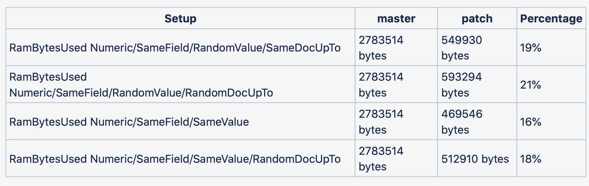
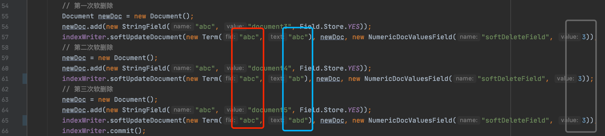
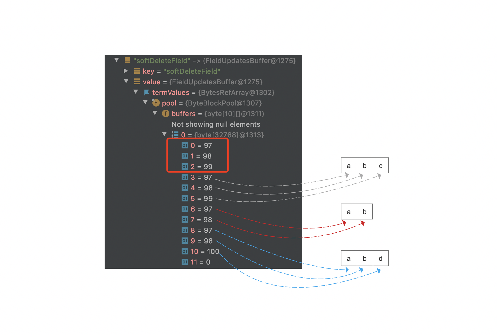
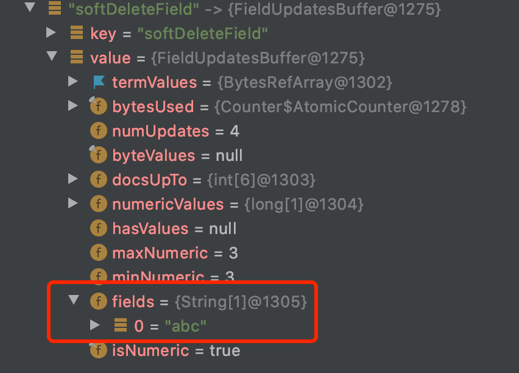
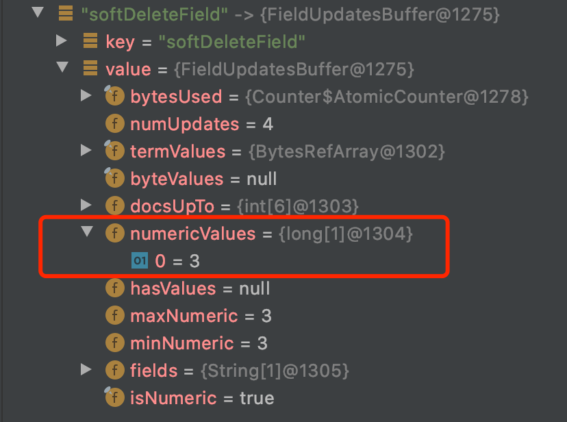
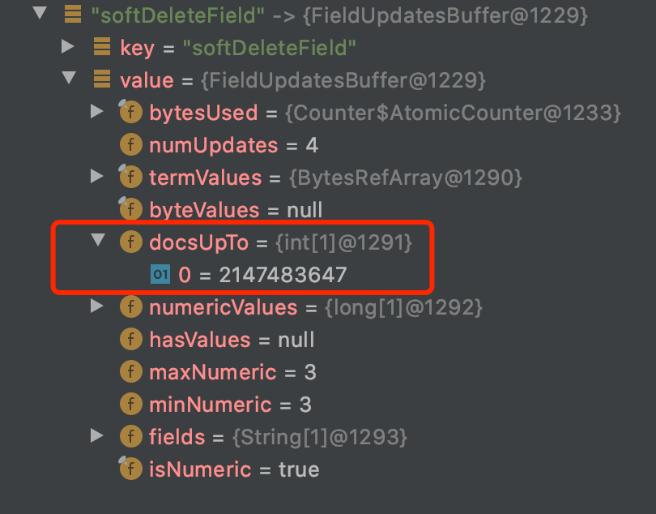

# [软删除softDeletes（四）](https://www.amazingkoala.com.cn/Lucene/Index/)（Lucene 8.4.0）

&emsp;&emsp;在文章[软删除softDeletes（二）](https://www.amazingkoala.com.cn/Lucene/Index/2020/0621/149.html)中我们说到，在Lucene 7.5.0版本中，使用了下面两个容器来存储软删除的删除信息、DocValues的更新信息：

- Map<String,LinkedHashMap<Term,NumericDocValuesUpdate>> numericUpdates：DocValuesUpdatesNode
- Map<String,LinkedHashMap<Term,BinaryDocValuesUpdate>> binaryUpdate：DocValuesUpdatesNode

&emsp;&emsp;而从Lucene 7.7.0版本之后，使用了下面的一个容器来优化存储：

- final Map<String, FieldUpdatesBuffer> fieldUpdates = new HashMap\<\>();

## 为什么使用FieldUpdatesBuffer类存储

&emsp;&emsp;在介绍这两种存储的差异前，我们先通过源码中的注释来介绍下改用FieldUpdatesBuffer来存储完善后的删除结点的目的：

```text
    This class efficiently buffers numeric and binary field updates and stores terms, values and metadata in a memory efficient way without creating large amounts of objects. Update terms are stored without de-duplicating the update term.
    In general we try to optimize for several use-cases. For instance we try to use constant space for update terms field since the common case always updates on the same field. Also for docUpTo we try to optimize for the case when updates should be applied to all docs ie. docUpTo=Integer.MAX_VALUE. In other cases each update will likely have a different docUpTo.
    Along the same lines this impl optimizes the case when all updates have a value. Lastly, if all updates share the same value for a numeric field we only store the value once.
```

### 第一段

&emsp;&emsp;上文第一段的大意是，使用FieldUpdatesBuffer类代替numericUpdates/binaryUpdate存储能`降低内存开销`，同时Term中的域值`不使用de-duplicating存储`。

- 降低内存开销：直接给出两种存储方式的内存占用情况，下图出自issue：https://issues.apache.org/jira/browse/LUCENE-8590

图1：



&emsp;&emsp;图1中sameFiled、sameValue、sameDocUpTo、RandomDocUpTo的概念在下文中介绍。

- 不使用de-duplicating存储：即不使用重复数据消除，同样源码中给出了不使用de-duplicating存储的原因：
```text
    we use a very simple approach and store the update term values without de-duplication which is also not a common case to keep updating the same value more than once...
    we might pay a higher price in terms of memory in certain cases but will gain on CPU for those. We also save on not needing to sort in order to apply the terms in order since by definition we store them in order.
```

&emsp;&emsp;上文注释可以看出一方面作者认为在实际使用过程中，每次更新的操作的条件（条件即updateDocument()、softUpdateDocument()方法的第一个参数Term）一般情况下都是不同的（注意的是Term由域名跟域值组成，两者都相同才认为是相同的Term），这里作者实际指的是Term中的域值的不同；另一方面作用（apply）删除信息顺序是依据添加顺序的，所以不用对Term中的域值进行排序，而de-duplicating存储在Lucene的应用中，很重要的一步就是排序，因为只有排序才能更好的提取出冗余的数据，例如前缀存储。

### 第二段

&emsp;&emsp;上文第二段的大意是：使用FieldUpdatesBuffer类优化存储的设计初衷是对这两个的优化：更新/删除的操作的条件通常是相同的域名，即Term的域名以及docUpTo为Integer.MAX_VALUE时的优化。

### 第三段

&emsp;&emsp;上文第二段的大意是：如果updateDocument()、softUpdateDocument()方法等更新方法中指定的DocValues域的域值为相同的，那么只需要存储一次。

## 如何使用FieldUpdatesBuffer类优化存储

&emsp;&emsp;我们先给出FieldUpdatesBuffer类的主要成员：

图2：


&emsp;&emsp;接着我们通过例子来介绍如何实现优化存储。

图3：



&emsp;&emsp;图3中执行了三次软删除后，FieldUpdatesBuffer对象中的内容如下所示：

图4：



&emsp;&emsp;图4中，<font color=red>红框</font>标注的部分描述的是在构造FieldUpdatesBuffer对象期间，就将第一个删除信息作为类中相关的信息的初始值，我们先看数组下标区间[3、10]的数组元素，这就是上文中`第一段`提到的存储图3的三个软删除的条件，即Term的域值不使用de-duplicating。

图5：



&emsp;&emsp;图5中<font color=red>红框</font>标注的部分为存储Term的域名，即上文中`第二段`提到的，当多个软删除、DocValues更新的条件，如果条件Term的域名一样时（上文中的sameFiled），域名只需要存储一次。

图6：



&emsp;&emsp;图6中，由于图3的例子中，用相同的NumericDocValue来描述被删除的文档时，NumericDocValueFiled的域值都是"3"、那么正如上文中`第三段`讲的那样，只存储一次。

&emsp;&emsp;最后我们在介绍下上文中`第二段`介绍的关于docUpTo为Integer.MAX_VALUE时的优化，在文章[软删除softDeletes（三）](https://www.amazingkoala.com.cn/Lucene/Index/2020/0624/150.html)我们说到，存在一个全局的删除信息，当执行了主动flush后，这些删除信息将作用（apply）索引目录中已经存在的段中的文档，所以对应的FieldUpdatesBuffer中的docsUpTo永远是Integer.MAX_VALUE（上文中的sameDocUpTo），即作用对象是所有的文档，同样以图3为例，使用FieldUpdatesBuffer存储后如下所示：

图7：



&emsp;&emsp;从图7可以看出，docsUpTo只需要存储一次，而如果使用Lucene 7.5.0版本中的numericUpdates存储，对于图3的例子，docsUpTo需要存储三次，因为三次软删除的条件Term是不相同的（Term的域名或域值至少一个不相同），故需要对于Map<String,LinkedHashMap<Term,NumericDocValuesUpdate>> numericUpdates，LinkedHashMap中需要存储三个NumericDocValuesUpdate，即存储了三次docsUpTo为Integer.MAX_VALUE的值。

## 结语

&emsp;&emsp;无

[点击](http://www.amazingkoala.com.cn/attachment/Lucene/Index/软删除softDeletes/软删除softDeletes（四）/软删除softDeletes（四）.zip)下载附件


