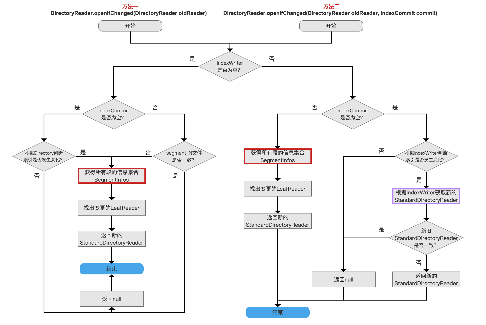
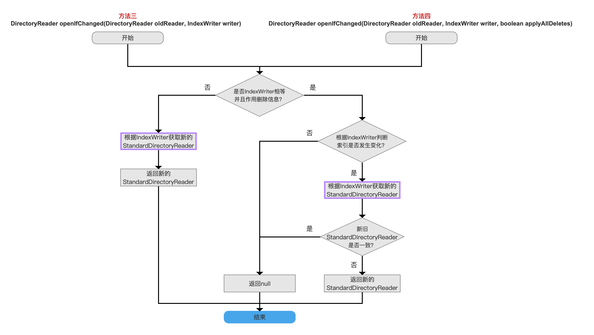
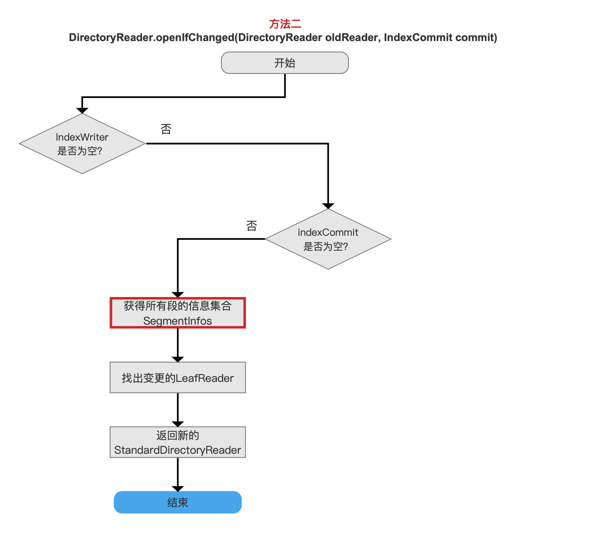
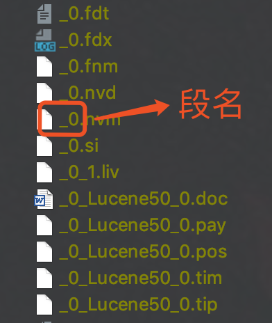
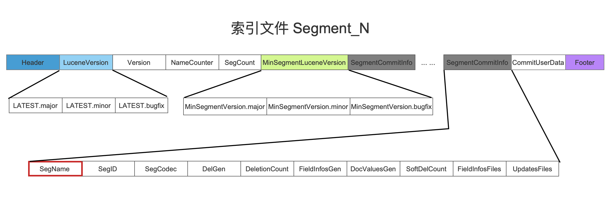
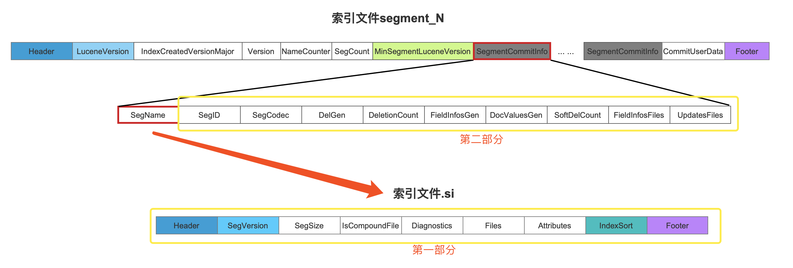
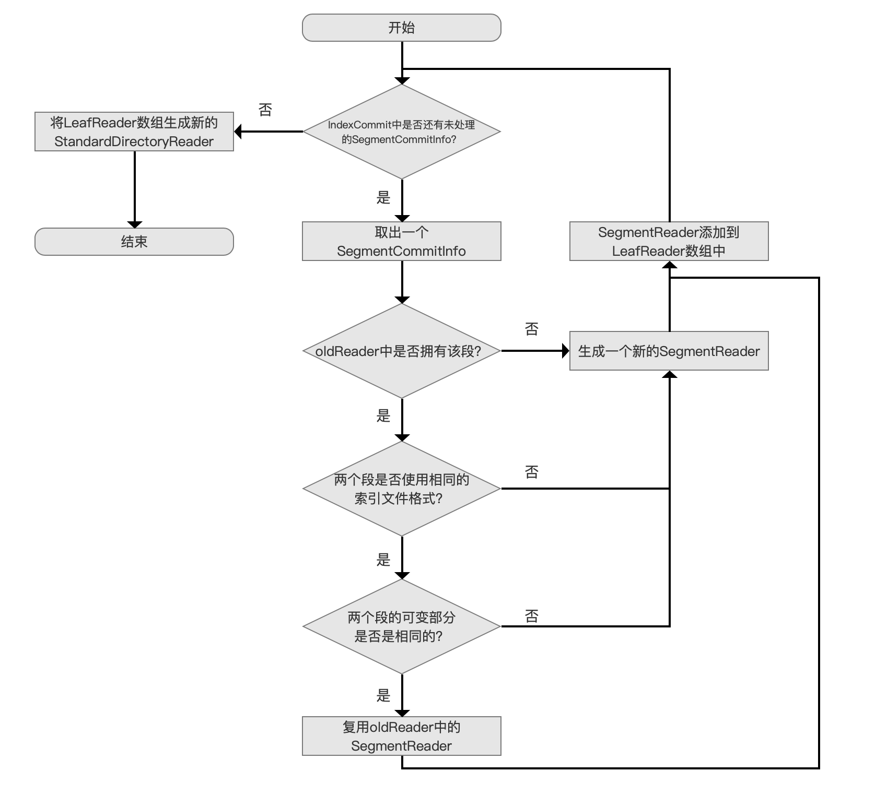
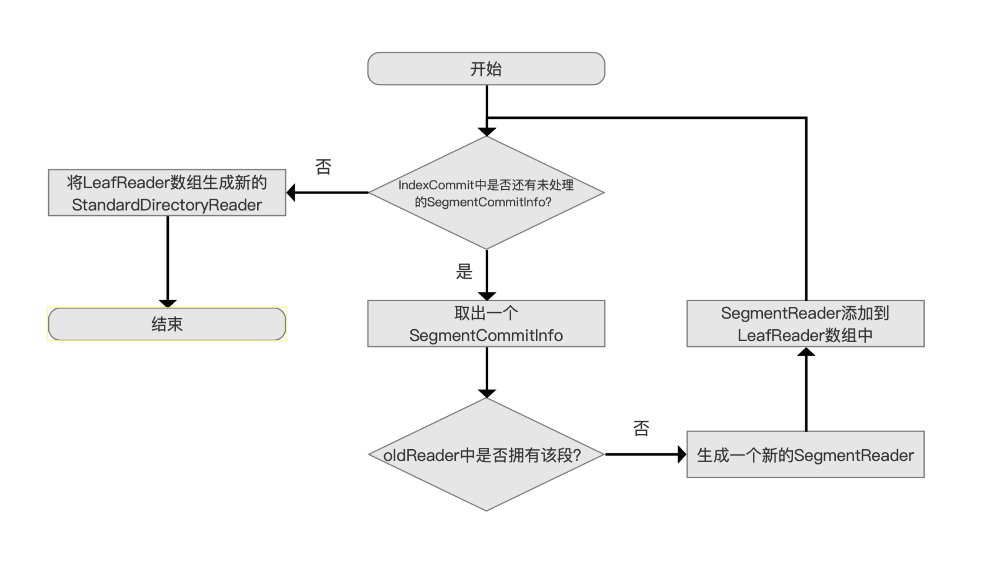
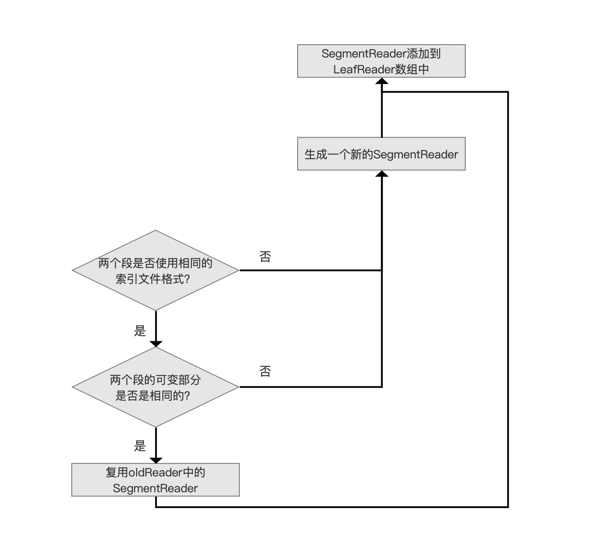

# [近实时搜索NRT（四）](https://www.amazingkoala.com.cn/Lucene/Index/)

&emsp;&emsp;Lucene7.5.0中提供了以下四种open方法来获得StandardDirectoryReader的对象，这四种方法：

- 方法一：DirectoryReader.open(final Directory directory)
- 方法二：DirectoryReader.open(final IndexCommit indexCommit)
- 方法三：DirectoryReader.open(final IndexWriter indexWriter)
- 方法四：DirectoryReader.open(final IndexWriter indexWriter, boolean applyAllDeletes, boolean writeAllDeletes)

&emsp;&emsp;这四种open方法的详细介绍见[近实时搜索NRT（一）](https://www.amazingkoala.com.cn/Lucene/Index/)、[近实时搜索NRT（二）](https://www.amazingkoala.com.cn/Lucene/Index/2019/0917/94.html)。

&emsp;&emsp;基于性能考虑，Lucene7.5.0中同时提供了以下四种openIfChange方法，这四种方法：

- 方法一：DirectoryReader.openIfChanged(DirectoryReader oldReader) 
- 方法二：DirectoryReader.openIfChanged(DirectoryReader oldReader, IndexCommit commit)
- 方法三：DirectoryReader openIfChanged(DirectoryReader oldReader, IndexWriter writer) 
- 方法四：DirectoryReader openIfChanged(DirectoryReader oldReader, IndexWriter writer, boolean applyAllDeletes)

&emsp;&emsp;我们接着[近实时搜索NRT（三）](https://www.amazingkoala.com.cn/Lucene/Index/2019/0920/95.html)的内容，继续介绍openIfChange方法的流程图。

# openIfChange方法的流程图

&emsp;&emsp;其中openIfChange的方法一&&方法二、方法三&&方法四的逻辑需要用两个流程图图1、图2展现：

图1：

[点击]()查看大图

图2：

[点击]()查看大图

## 从IndexCommit中获取StandardDirectoryReader

图3：

&emsp;&emsp;如果oldReader是通过open方法中的方法三或者方法四获得，那么oldReader就持有IndexWriter对象（见[近实时搜索NRT（三）](https://www.amazingkoala.com.cn/Lucene/Index/2019/0920/95.html)），当调用了openIfChange的方法二，该方法就会执行图3中的流程。

&emsp;&emsp;在介绍图3的的流程之前，我们先介绍一下几个预备知识。

&emsp;&emsp;**段的段名（segName）是什么**

-	段名是一个下划线与数字的组合值，其中数值是一个全局同步递增的值，例如"\_0"，每当生成一个DWPT（见[文档的增删改（中）](https://www.amazingkoala.com.cn/Lucene/Index/2019/0628/69.html)），就会生成一个新的段名，在执行flush（见[文档提交之flush（一）](https://www.amazingkoala.com.cn/Lucene/Index/2019/0716/74.html)）的操作后，该DWPT会生成一个段，在flush的阶段（见[文档提交之flush（三）](https://www.amazingkoala.com.cn/Lucene/Index/2019/0725/76.html)）会生成[索引文件.si](https://www.amazingkoala.com.cn/Lucene/suoyinwenjian/2019/0605/63.html)，段名用来作为索引文件的前缀来描述他们是同一个段中的索引文件，如图4所示
-	另外在commit操作后，一个段的段名会被记录在[索引文件Segment_N](https://www.amazingkoala.com.cn/Lucene/suoyinwenjian/2019/0610/65.html)中，如图5中红色框标注
-	另外可以在[近实时搜索NRT（一）](https://www.amazingkoala.com.cn/Lucene/Index/2019/0916/93.html)的文章中看下段名的另一个作用

图4：

图5：

&emsp;&emsp;**段的信息为什么会发生变化，段中的哪些信息会发生变化**：

- 我们在[近实时搜索NRT（一）](https://www.amazingkoala.com.cn/Lucene/Index/2019/0916/93.html)的文章中已经介绍了一个段的完整信息用SegmentCommitInfo来描述，它包含了两部分的信息，用黄色框标注，其中第一部分的信息和第二部分在flush阶段生成（见[文档提交之flush（三）](https://www.amazingkoala.com.cn/Lucene/Index/2019/0725/76.html)的`生成FlushedSegment`的流程点），如下图所示：

图6：

&emsp;&emsp;当我们每次调用更改索引信息的方法后，例如删除操作、更新操作、软删除操作（这些操作内容见[文档的增删改（上）](https://www.amazingkoala.com.cn/Lucene/Index/2019/0626/68.html)），索引目录中**每一个段**可能需要被作用（apply）这些删除信息（如何作用删除信息见[文档提交之flush（二）](https://www.amazingkoala.com.cn/Lucene/Index/2019/0718/75.html)），也就是说在每一个段中，如果段的文档如果满足删除条件，那我们需要处理这些文档，而这个过程就会导致段的信息发生变化。

&emsp;&emsp;在图6中，一个段的完整信息由两部分构成，我们先看第一部分，即[索引文件.si](https://www.amazingkoala.com.cn/Lucene/suoyinwenjian/2019/0605/63.html)包含的信息，这些信息在[索引文件之si](https://www.amazingkoala.com.cn/Lucene/suoyinwenjian/2019/0605/63.html)的文章中已经介绍，根据每个字段的具体含义可以看出他们都是固定的信息，我们称之为不可变部分。

&emsp;&emsp;同样地第二部分中每一个字段的含义在[索引文件之segments_N](https://www.amazingkoala.com.cn/Lucene/suoyinwenjian/2019/0610/65.html)的文章中已经介绍，并且可以看出他们不是固定的信息，当段中的文档需要被删除时，DelGen、DeletionCount字段会发生变化，当执行更新DocValues操作时，FieldInfosGen、DocValuesGen会发生变化，我们称之为可变部分。

&emsp;&emsp;**oldReader对应的段信息跟IndexCommit对应的段信息下面的关系**：

- 关系一：oldReader中拥有IndexCommit相同段名的段，并且这些段的信息完全相同
- 关系二：oldReader中拥有IndexCommit相同段名的段，并且段的信息不相同
- 关系三：oldReader中拥有某些段，而IndexCommit不拥有这些段
- 关系四：IndexCommit中拥有某些段，而oldReader不拥有这些段

&emsp;&emsp;故方法二的功能描述的是根据上述关系，获得参数IndexCommit中每一个段对应的SegmentReader（SegmentReader的概念见[近实时搜索NRT（一）](https://www.amazingkoala.com.cn/Lucene/Index/2019/0916/93.html)），最后生成一个StandardDirectoryReader，具体操作如下：

图7：

&emsp;&emsp;图7所示的流程图是图3、图1中`找出变更的LeafReader`，`返回新的StandardDirectoryReader`两个流程点的具体展开，它总体描述了这么一个过程：生成一个StandardDirectoryReader来读取IndexCommit对应的段的信息，如果可以使用oldReader中的一个或多个SegmentReader来读取IndexCommit对应的某一个段的信息，那我们就复用这些SegmentReader，否则就生成新的SegmentReader，最后将所有的SegmentReader添加到LeafReader数组中，生成一个StandardDirectoryReader（SegmentReader、LeafReader数组、StandardDirectoryReader三者之间的关系见[近实时搜索NRT（一）](https://www.amazingkoala.com.cn/Lucene/Index/2019/0916/93.html)文章中的图9），下面我们详细的介绍下图7的流程。

### 处理oldReader中不拥有的段

图8：

&emsp;&emsp;图8中，我们根据方法二的参数IndexCommit取出一个SegmentCommitInfo，首先判断oldReader中是否拥有该段，判断方式即根据oldReader中是否拥有相同段名的段，如果没有找到，即满足上文中的关系四，那么我们根据该SegmentCommitInfo生成一个新的SegmentReader，添加到LeafReader数组中。

&emsp;&emsp;**如何判断oldReader中是否拥有相同段名的段**：

- 在源码中，使用了一个Map来实现段名跟SegmentReader的映射，故根据段名就能判断oldReader中是否拥有某个段

&emsp;&emsp;当处理完IndexCommit中所有的SegmentCommitInfo以后，我们根据LeafReader数组中的SegmentReader生成一个新的StandardDirectoryReader。

### 处理oldReader中拥有的段

图9：

&emsp;&emsp;当oldReader中拥有IndexCommit中相同段名的段，那么我们通过以下两个条件来判断两个段是否一样，即判断属于上文中的关系一还是关系二：

-	条件一：`两个段是否使用相同的索引文件格式`
  -	这里的索引文件格式有两种，一种是普通索引文件格式，另一种是复合索引文件格式。我们可以通过[IndexWriterConfig.setUseCompoundFile](https://github.com/LuXugang/Lucene-7.5.0/blob/master/solr-7.5.0/lucene/core/src/java/org/apache/lucene/index/IndexWriterConfig.java)方法来设置，采用复合索引文件格式的段生成的索引文件为复合文件，对应的索引文件即[.cfs、.cfe](https://www.amazingkoala.com.cn/Lucene/suoyinwenjian/2019/0710/73.html)，而普通索引文件格式的段生成的索引文件则是例如[.nvd、.nvm](https://www.amazingkoala.com.cn/Lucene/suoyinwenjian/2019/0305/39.html)、[.pos、.pay](https://www.amazingkoala.com.cn/Lucene/suoyinwenjian/2019/0324/41.html)、[.doc](https://www.amazingkoala.com.cn/Lucene/suoyinwenjian/2019/0324/42.html)、[.tim、.tip](https://www.amazingkoala.com.cn/Lucene/suoyinwenjian/2019/0401/43.html)、[.dim、.dii](https://www.amazingkoala.com.cn/Lucene/suoyinwenjian/2019/0424/53.html)、[.tvx、tvd](https://www.amazingkoala.com.cn/Lucene/suoyinwenjian/2019/0429/56.html)、[.fdx、.fdt](https://www.amazingkoala.com.cn/Lucene/suoyinwenjian/2019/0301/38.html)、[.si](https://www.amazingkoala.com.cn/Lucene/suoyinwenjian/2019/0605/63.html)
  -	即使两个段中包含的文档信息一样的，但索引文件格式不同还是被认为是两个不相同的段
-	条件二：`两个段的可变部分是否是相同的`
  -	可变部分是否相同通过比较图6中的DelGen、FieldInfosGen两个字段来判断，上文已经介绍不赘述

&emsp;&emsp;不同时满足上面两个条件的话，即上文中的关系二，那么执行`生成一个新的SegmentReader`跟`SegmentReader添加到LeafReader数组中`的流程，上文已经介绍。

&emsp;&emsp;如果同时满足上面的两个条件，那么就可以`复用oldReader中的SegmentReader`，然后增加这个SegmentReader对应的计数值，计数值描述了引用该SegmentReader的其他Reader的个数。

&emsp;&emsp;**为什么要增加这个SegmentReader的计数**：

-	在我们调用openIfChange()方法后，如果获得了一个新的StandardDirectoryReader，Lucene要求用户负责关闭oldReader，由于oldReader中的某些SegmentReader可能被新的或者其他StandardDirectoryReader复用（对象引用），所以不能直接关闭这些SegmentReader，通过计数的方式，当SegmentReader对应的计数为0时，就可以真正的关闭了。

&emsp;&emsp;对于上文中的关系三，说明oldReader中的那些段是在生成IndexCommit之后生成的。

# 结语

&emsp;&emsp; 基于篇幅，剩余的流程点将在下一篇文章中展开。

[点击](http://www.amazingkoala.com.cn/attachment/Lucene/Index/近实时搜索NRT/近实时搜索NRT（四）/近实时搜索NRT（四）.zip)下载附件

