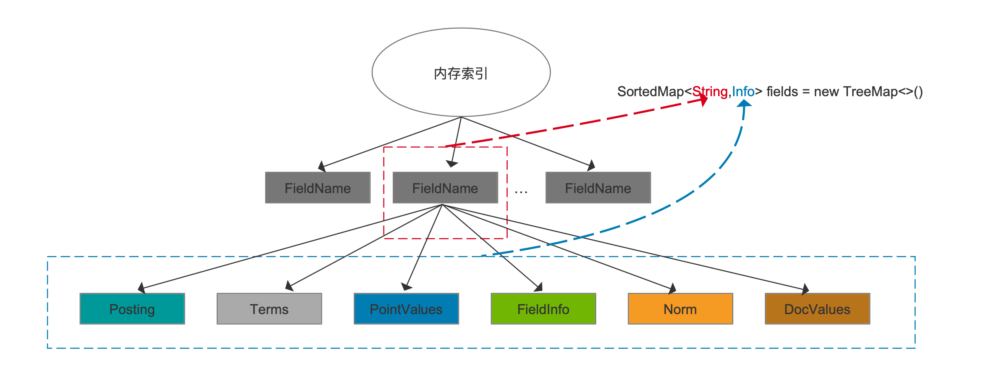
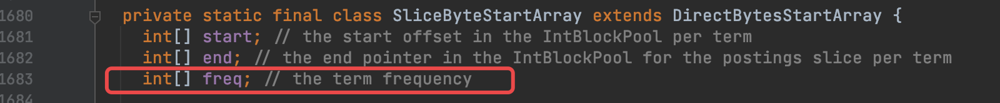
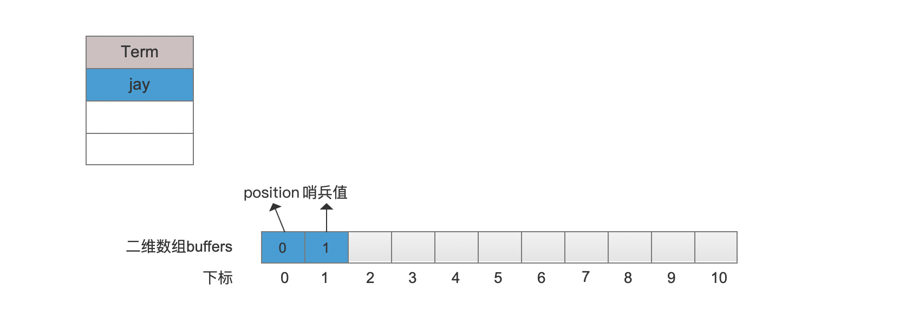
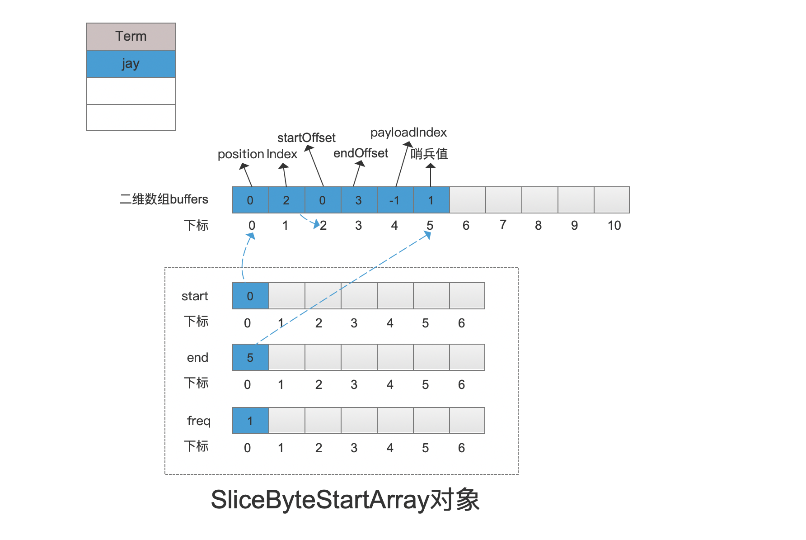
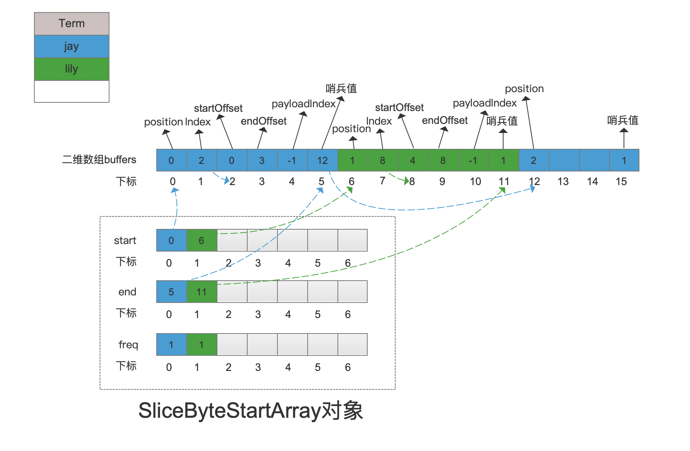
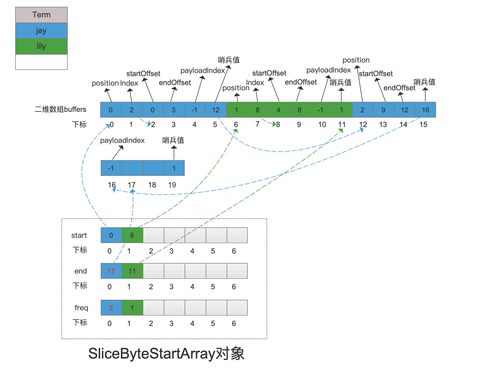

# [MemoryIndex（一）](https://www.amazingkoala.com.cn/Lucene/Index/)（Lucene 8.8.0）

&emsp;&emsp;从本篇文章开始介绍Lucene中提供的基于内存的搜索引擎的内容。我们通过MemoryIndex类的注释简单的了解下。

图1：

&emsp;&emsp;图1中中包含了两个重点内容：

- 单文档：使用MemoryIndex生成的索引是单文档（single-document）的，所有的索引数据都在同一篇文档中
- 使用场景：不适用于数量大并且需要持久化的数据场景；适用于数量较小、瞬时实时的数据、查询频繁的场景，在随后的文章中，我们会介绍MemoryIndex在Elasticsearch中的应用场景

## 内存索引

图2：

&emsp;&emsp;从图1中可以看出，内存索引的层次结构首先按照域名划分，属于同一个域名的索引又按照Posting、Terms、PointValues、FIeldInfo、Norm、DocValues划分（**只列出了部分关键内容**）。

&emsp;&emsp;在源码层面，使用了一个Map来存放所有的内存索引：

图3：

&emsp;&emsp;图3中的TreeMap的key跟value跟图2中的关系如下所示，即域名为key，该域名对应的索引信息为value，在代码中用Info对象存储：

图4：

## 内存索引的数据结构

&emsp;&emsp;接着我们对图4中用蓝色虚线框标注的几个不同类型索引信息分别介绍下其数据结构。

### Posting

&emsp;&emsp;Posting中存放的是倒排信息，基于磁盘的索引中的倒排信息包含了文档号docId、词频frequency、位置position、偏移offset（offset是一个二元组，即startOffset、endOffset）、负载payload共五类信息，由于我们在上文中说到生成的索引在一篇文档中，所以基于内存的索引中只要存储除去文档号docId的其他四种信息即可。

&emsp;&emsp;在源码中，使用了[IntBlockPool](https://www.amazingkoala.com.cn/Lucene/gongjulei/2018/1209/24.html)类来存储Posting的位置position、偏移offset、负载payload这三类信息，而词频frequency则是使用一个额外的数组存放，在下文中介绍termId时再展开介绍。

&emsp;&emsp;对于IntBlockPool类，实际上使用了一个int类型的二维数组buffers来存储Posting。

&emsp;&emsp;对于某个域名对应的Posting，其数据结构如下：

图5：

&emsp;&emsp;由于偏移offset、负载payload可以分别使用参数来决定是否存储，如下所示。故在不同参数下，一共有图5中三种Posting的数据结构。

图6：

&emsp;&emsp;另外在图5中可以看到，并没有真正的存储payload的值，而是存放了一个索引值payloadIndex，该索引值指向另一个数据结构中的某个位置，在那个位置存放着payload的值，后面的文章中会详细展开。如果没有payload值，那么payloadIndex的值置为-1。

#### 哨兵值

&emsp;&emsp;将term的Posing信息写入到二维数组buffers之前，会在二维数组buffers中预分配一段空间连续的分片，哨兵值位于分片中的最后一个位置。

&emsp;&emsp;哨兵值有两个作用：

- 作用一：用来描述**当前分片**是否无法再存储更多的Posting信息。在写入到分片的过程中，如果遇到了哨兵值，说明需要再分配一个新的分片
  - 二维数组buffers中每个数组元素都会被初始化为0，而哨兵值是一个非0的值，故可以通过判断即将写入的位置的数组元素是否为0
- 作用二：哨兵值用来描述新分配的分片大小

##### 新的分片大小的分配规则

&emsp;&emsp;在存储域值时，会使用到ByteBlockPool对象存储，该对象中也有相同的哨兵值的概念，其分配规则也是类似，在后面的文章中我们再详细展开。在本文中，我们只需要知道。除了第一次分配的分配大小为2，随后新的分片的大小总是为4，其原因同样会在后面的文章中展开。

#### termId

&emsp;&emsp;termId是从0开始的递增值，用来唯一代表一个term。termId从0开始递增，每处理一个新的term，termId执行+1操作，新的termId即代表这个term。

&emsp;&emsp;如果我们**依次处理**Jack， Jay， Jay，lily， lucy， lily 这几个term，那么这些term对应的termId如下所示：

表一：

| term | termId |
| :--: | :----: |
| Jack |   0    |
| Jay  |   1    |
| Jay  |   1    |
| lily |   2    |
| lucy |   3    |
| lily |   2    |

&emsp;&emsp;在介绍了termId之后，我们就可以介绍上文中提到的term的词频frequency的存储方式。

&emsp;&emsp;由于有了termId的概念，故使用了一个名字为freq的int 类型的数组存储即可。其中数组下标为termId，数组元素为term的词频frequency。该数组在代码中的定义如下所示：

图7：

&emsp;&emsp;图7中的SliceByteStartArray对象实际也是Info（见图4）对象中的一个变量。

&emsp;&emsp;SliceByteStartArray对象中的另外两个数组，start[ ]跟end[ ]数组，他们的**数组下标同样是termId**，数组元素分别描述了term的Posting信息在二维数组buffers（见图5）的开始跟结束位置。因为**所有term**的Posting信息都存放在同一个二维数组buffers中，故在读取阶段，通过start[ ]跟end[ ]数组获得某个term的Posting信息在二维数组buffers中的起始读取位置跟结束位置。下文会通过例子详细介绍SliceByteStartArray对象。

#### BytesRefHash

&emsp;&emsp;上文中介绍了term的词频frequency、位置position、偏移offset、负载payload的存储方式，term自身的值也是需要存储的，它使用BytesRefHash对象存储。在读取阶段，根据termId就能从BytesRefHash对象中获得term的值。其写入跟读取的方式在文章[ByteRefHash](https://www.amazingkoala.com.cn/Lucene/gongjulei/2019/0218/32.html)中已经详细介绍，故本文不赘述。

#### 例子

&emsp;&emsp;我们通过一个例子来介绍term的倒排信息是如何存储的。

图8：

&emsp;&emsp;图8中，红框标注的两个参数都是true，意思是存储偏移offset跟负载payload的值。

##### 写入逻辑

&emsp;&emsp;在介绍例子之前，我们先概述下写入的逻辑的核心过程：

- 分片**预分配**：如果term从未处理过，那么在二维数组buffers中预分配一个分片，然后写入term的Posting信息
  - 预分配的分片，**第一次分配的分片大小只有2个数组元素大小**。因为在图8中两个参数都为false的情况下，只需要存储位置position，那么再上哨兵值，故只需要2个数组
- 分片**再分配**：如果分片无法再存储更多的Posting信息，那么重新分配一个新的分片
  - 在往分片写入的过程中，如果遇到了哨兵值，说明**当前分片**无法存储更多的信息，需要再分配一个新的分片。**注意的是新的分片不一定在当前分片的下一个位置**，故将**当前分片**的哨兵值改为一个索引值，即二维数组buffers的下标值，该值对应的位置即新的分片在二维数组中的起始位置。下文的例子中会介绍这种情况
- Posting写入顺序：位置position --> 偏移Offset（startOffset、endOffset）--> 负载payload

&emsp;&emsp;根据图8的代码的，域名为"author"的域值在分词后将会生成四个term，并且处理的顺序分别为 jay --> lily --> jay --> lucy。那么首先这几个term对应的termId以及Posting信息如下表所示：

表二：

| Term | TermId | 词频frequency |   偏移Offset    | 位置position | 负载payload |
| :--: | :----: | :-----------: | :-------------: | :----------: | :---------: |
| jay  |   0    |       2       | [0, 3], [9, 12] |    0， 2     |     -1      |
| lily |   1    |       1       |     [4, 8]      |      1       |     -1      |
| lucy |   2    |       1       |    [13, 17]     |      3       |     -1      |

&emsp;&emsp;表二中，为了便于介绍，我们直接列出了所有term 的倒排信息。另外图8中的例子中没有设置负载payload，所以对应的payloadIndex为-1。在实际处理过程中，是通过分词器获取的。

##### 添加第一个term：jay

&emsp;&emsp;由于jay这个term第一次处理，故在二维数组buffers中预分配大小为2个数组元素大小的连续空间：

图9：

###### 写入位置position

图10：

###### 写入偏移Offset、payload

&emsp;&emsp;由于当前分片的下一个写入位置是个哨兵值，故先进行分片再分配，新的分片的大小固定为4个数组元素大小。接着当前分片的哨兵值被替换为一个索引值index，用来描述新的分片在二维数组buffers中的起始位置，即2，然后写入偏移Offset的startOffset跟endOffset：

图11：

###### 写入SliceByteStartArray

&emsp;&emsp;在写入Posting的过程中，会将当前处理的term在二维数组buffers中的起始、结束位置、词频frequency写入到SliceByteStartArray对象（见图7）中：

图12：

##### 添加term：lily

&emsp;&emsp;添加的过程跟添加第一个jay是一样的，故直接给出结果：

图13：

##### 添加第二个term：jay

###### 写入位置position

&emsp;&emsp;由图13可知，当前分片无法存储更多的数据，故先分配一个新的固定大小为4的分片，当前分片的哨兵值更新为12，然后写入位置position。注意的是SliceByteStartArray对象中的信息在写完便宜offset、负载payload后才更新

图14：

###### 写入偏移Offset、payload

&emsp;&emsp;由图3可知，写入偏移offset、payload需要3个数组元素大小，故在写完偏移offset后，先分配新的分配，修改哨兵值为16，然后写入payloadIndex，最后更新SliceByteStartArray中的end、freq数组：

图15：

##### 添加term：lucy

emsp;&emsp;添加的过程跟添加第一个jay是一样的，故直接给出结果：

图16：

## 结语

&emsp;&emsp;本文简单的介绍了MemoryIndex的概念，以及如何存储倒排信息的内容。在随后的文章将进一步介绍term自身的值、负载payload，以及其他类型索引文件的内容。

[点击]()下载附件

