# [BulkScorer（一）](https://www.amazingkoala.com.cn/Lucene/Search/)（Lucene 9.6.0）

&emsp;&emsp;本篇文章介绍在查询阶段，[BulkScorer](https://github.com/apache/lucene/blob/f527eb3b12df6d052d1b6dd107b56ab705a95ab1/lucene/core/src/java/org/apache/lucene/search/BulkScorer.java)相关的知识点，在查询流程中的流程点如下<font color="red">红框</font>所示：

图1：

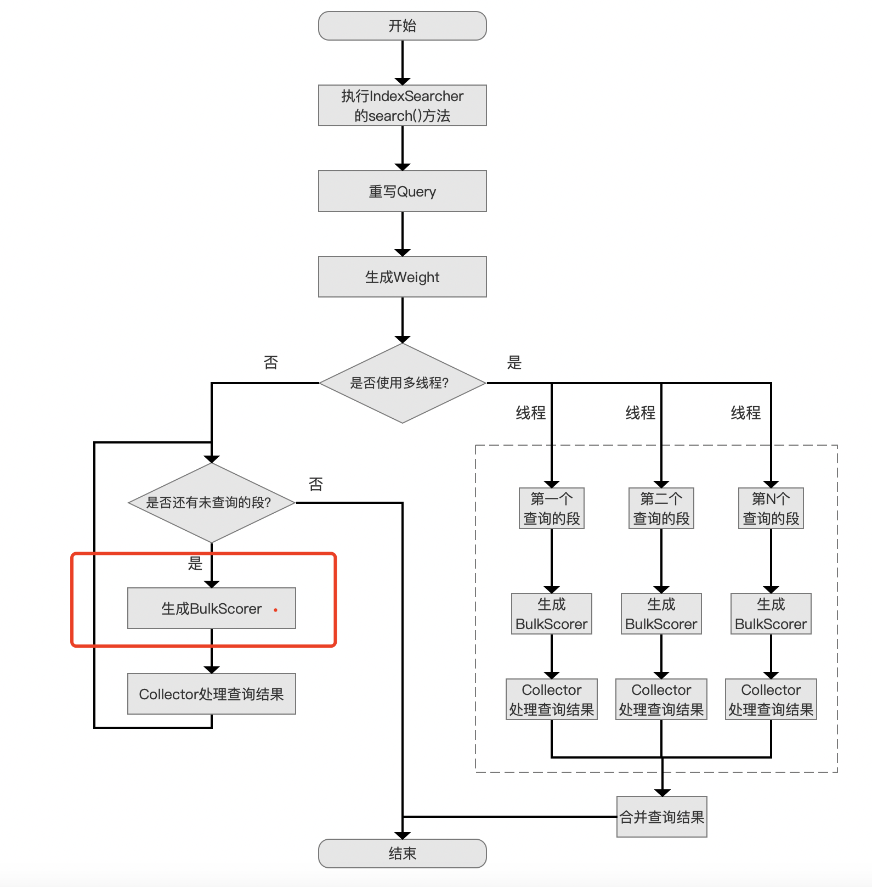

## 父类BulkScorer

&emsp;&emsp;BulkScorer类的定位是一个对满足查询条件的所有文档号进行收集的最初入口。在执行完该类的方法后（见[方法一](###方法一)），Lucene就完成了一个段中文档号的收集工作。我们仅关注下BulkScorer类中下面的两个方法，如下所示：

### 方法一

图2：

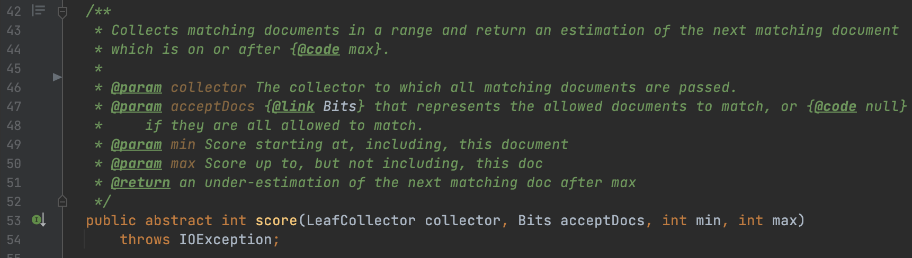

&emsp;&emsp;该方法说的是在某个文档号区间内，即参数`min`和`max`组成的区间，进行文档号的收集，同时使用参数`acceptDocs`过滤掉被删除的文档号，最终满足查询条件的文档号使用参数`collector`收集存储。

#### acceptDocs

&emsp;&emsp;`acceptDocs`是一个基于[位图](https://www.amazingkoala.com.cn/Lucene/gongjulei/2019/0404/45.html)实现，用来描述被删除的文档号信息的对象。由于在Lucene中执行删除文档操作时，并不会去修改现有的索引文件，而是额外的在名为[.liv](https://www.amazingkoala.com.cn/Lucene/suoyinwenjian/2019/0425/54.html)的索引文件中记录被删除的文档号。

&emsp;&emsp;也就说，在方法一中依次处理满足查询条件的文档号时，有些文档号对应的文档尽管是满足查询条件的，但是它已经是被标记为删除的，故需要通过`acceptDocs`进行过滤。

#### collector

&emsp;&emsp;满足查询条件的文档号会使用`collector`进行收集，在`collector`中会对文档号进行排序等操作，详细内容见[Collector（一）](https://www.amazingkoala.com.cn/Lucene/Search/2019/0812/82.html)。另外`collector`是`LeafCollector`对象，说的是对某个段进行收集。

#### min、max

&emsp;&emsp;min和max用于指定一个待遍历的文档号区间，在有些子类实现中如果根据某些条件可以尽可能的降低区间的范围，那么可以降低整个查询时间（在介绍ReqExclBulkScorer时会介绍）。默认的实现中，min的值为0，max的值为Integer.MAX\_VALUE。

### 方法二

图3：


&emsp;&emsp;该方法描述的是遍历所有满足查询条件的文档号的开销，这个取决于不同的BulkScorer子类实现，在下文中再展开介绍。

## BulkScorer的子类

&emsp;&emsp;主要介绍下这几个最常见的子类：

图4：


### DefaultBulkScorer

&emsp;&emsp;DefaultBulkScorer子类中实现图2中[方法一](###方法一)的流程图如下所示：

图5：

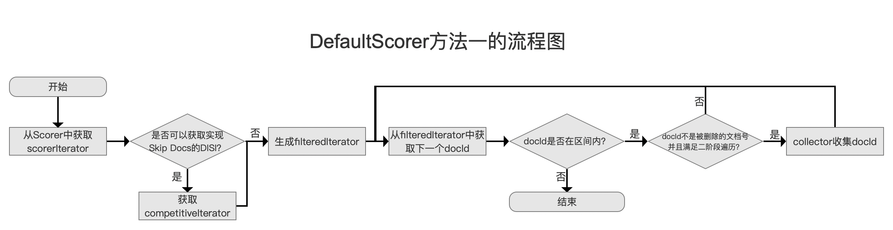

#### 从Scorer中获取scorerIterator

图6：


&emsp;&emsp;Scorer的概念会在以后的文章中详细介绍，在本篇文章中我们只需要暂时知道，该对象会提供一个DocIdSetIterator抽象类（**下文中简称为DISI**）的对象scorerIterator，通过该对象我们就可以获取到满足查询条件的所有文档号，并且在DocIdSetIterator类的不同实现中，获取每一个文档号的逻辑也是不同的。

##### DocIdSetIterator

&emsp;&emsp;DISI是一个有状态的，对non-decreasing类型的文档号集合进行遍历的迭代器，并且集合中的文档号都是满足查询条件的（被删除的文档号也在集合中）。non-decreasing指的是集合中的每个文档号都大于等于排在它前面的文档号。例如下面的集合就是non-decreasing：

```text
{1, 2, 2, 3, 4}
```

&emsp;&emsp;这个类中有四个核心的方法：

###### 方法一（DISI）

图7：

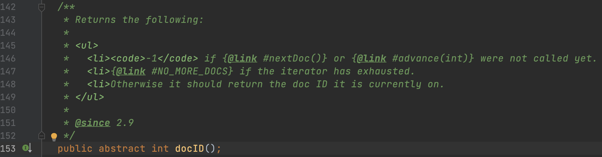

&emsp;&emsp;该方法体现出DISI是具有状态的，它返回DISI当前的状态值，即目前遍历到的文档号。

&emsp;&emsp;注释中说到，如果在调用[nextDoc()](######方法二（DISI）)或者[advance(int)](######方法三（DISI）)方法前就调用当前方法，会返回-1，意思是DISI的最初的状态值是-1，也就是文档号为-1，当然了，该值不是一个合法的文档号。另外如果遍历完所有的文档号，那么当前方法会返回一个`NO_MORE_DOCS`作为结束标志，该值即Integer.MAX\_VALUE。

图11：

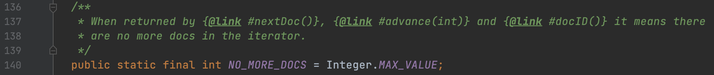

###### 方法二（DISI）

图8：

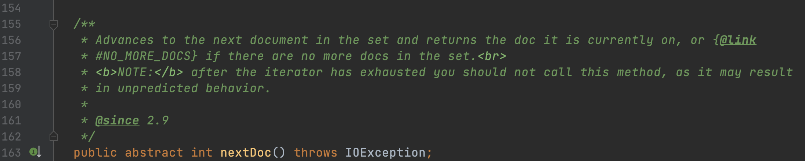

&emsp;&emsp;该方法会基于[docID()](######方法一（DISI）)中的文档号（当前状态值），返回在集合中排在它后面，下一个位置的文档号，随后将状态值更新为该位置的文档号。

&emsp;&emsp;如果DISI当前的状态值已经是集合中的最后一个文档号，那么调用该方法会返回`NO_MORE_DOCS`，并且将状态值更新为`NO_MORE_DOCS`。注意的是，不应该在这种情况下继续调用该方法，否则会导致不可预测行为。

###### 方法三（DISI）

图9：

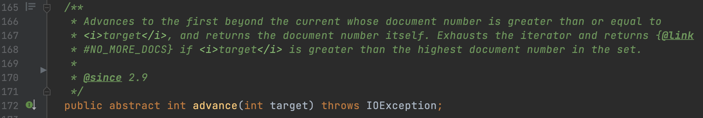

&emsp;&emsp;该方法会返回集合中第一个大于等于target的文档号，并且将状态值更新为这个文档号。

&emsp;&emsp;如果未在集合中找到，那么会返回`NO_MORE_DOCS`。并且将状态值更新为`NO_MORE_DOCS`。

###### 方法四（DISI）

图10：

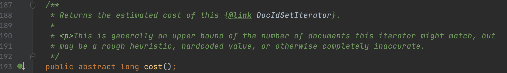

&emsp;&emsp;该方法描述的是遍历DISI中的文档号集合的开销，在有些子类实现中该值就是集合中文档号数量的一个准确值，然而在有些实现则是一个估计值。

##### DocIdSetIterator的子类

&emsp;&emsp;下图给出的是实现比较简单的一个子类：

图12：

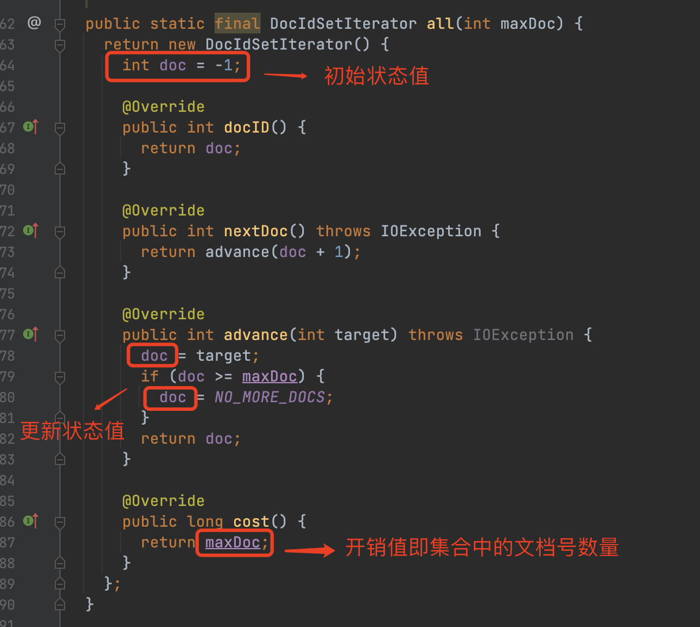

#### 是否可以获取实现Skip Docs的DISI？

图13：

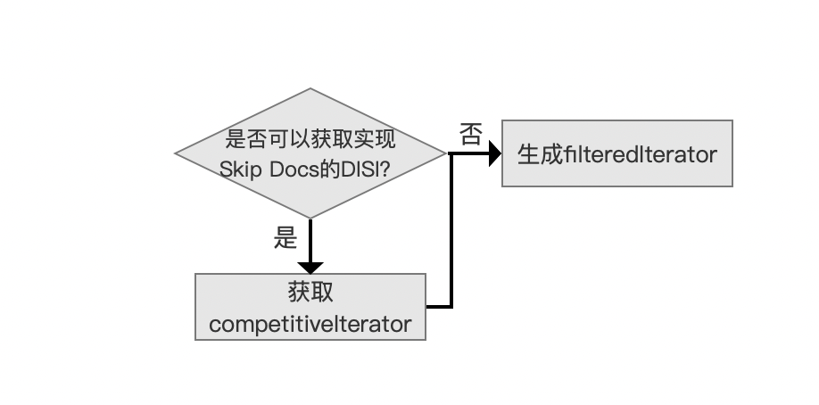

&emsp;&emsp;如果从数据集的角度去思考如何提高查询性能，通常可以通过以下两种方式实现：

1. 减少数据集的规模
2. 收集到足够的结果后，提前退出

&emsp;&emsp;这里的第二点在图5的`collector收集docId`中实现，见[Collector（四）](https://www.amazingkoala.com.cn/Lucene/Search/2019/0815/85.html)。第一点则是通过可以实现Skip Docs的**DISI对象competitiveIterator**结合图6 Scorer中获取的scorerIterator，将这两个DISI对象组合成一个**新的DISI对象filteredIterator**来实现`减少数据集的规模`。

&emsp;&emsp;**注意点：只有在获取TopN的查询中，才有可能获取到实现Skip Docs的DISI对象competitiveIterator**

##### filteredIterator的实现逻辑

&emsp;&emsp;**在收集了TopN篇文档号**，随后继续遍历scorerIterator时，如果根据排序规则，可以添加到TopN中时，就会尝试获取/更新competitiveIterator，通过competitiveIterator实现skip docs。

&emsp;&emsp;目前Lucene中有基于BKD树（[LUCENE-9280](https://issues.apache.org/jira/browse/LUCENE-9280)）以及基于倒排（[LUCENE-10633](https://issues.apache.org/jira/browse/LUCENE-10633)）来获得competitiveIterator。见文章[查询TopN的优化之NumericDocValues（一）](https://www.amazingkoala.com.cn/Lucene/Search/2021/0621/193.html)、[查询TopN的优化之NumericDocValues（二）](https://www.amazingkoala.com.cn/Lucene/Search/2021/0629/195.html)了解基于BKD树获取competitiveIterator。

&emsp;&emsp;下面的例子中，**主要是表达优化思想，并不是真实的实现逻辑**：

图14：

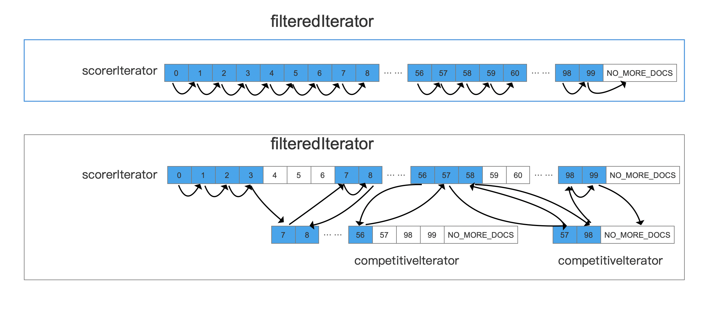

&emsp;&emsp;图14中假设是Top3的查询，如果没能获取competitiveIterator，那么需要遍历集合中所有的文档号。优化后，在收集完Top3后，根据Top3中的竞争力最小的信息（基于排序规则对应的域值）获取一个集合为[7, 99]的competitiveIterator，意思是根据排序规则，在这个集合区间范围外的文档是没有竞争力（non-competitive），也就是没有必要去处理这些文档号。随后在处理完第56篇文档号，再次更新了competitiveIterator。

#### 遍历filteredIterator

图15：

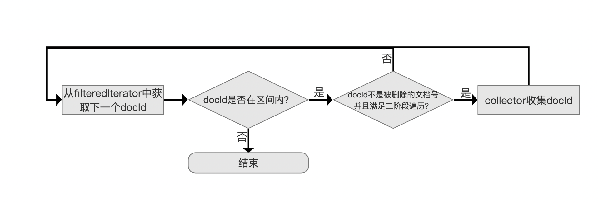

##### docId是否在区间内

&emsp;&emsp;这里的区间指的是[方法一](###方法一)中参数`max`跟`min`组成的区间，由于从filteredIterator中依次获得的文档号是递增的，所以当出现文档号不在区间内时，就可以直接退出遍历。

##### docId不是被删除的文档号并且满足二阶段遍历？

&emsp;&emsp;在这个流程点，我们需要过滤被删除的文档号，尽管这些文档是满足查询条件的。

###### 二阶段遍历

&emsp;&emsp;二阶段遍历在大部分查询场景中不会出现，在此流程点如果二阶段遍历为空，则认为是满足条件的。在文章[二阶段遍历（TwoPhaseIterator）](https://www.amazingkoala.com.cn/Lucene/Search/2020/0723/156.html)中详细的介绍了为什么要使用二阶段遍历，以及给出了某个场景作为例子。这里就不展开介绍了。

##### collector收集docId

&emsp;&emsp;在系列文章[Collector（一）](https://www.amazingkoala.com.cn/Lucene/Search/2019/0812/82.html)中介绍常见的几个Collector，这里就不赘述了。


## 结语

&emsp;&emsp;基于篇幅，剩余的内容将在下一篇文章中展开介绍。

[点击](https://www.amazingkoala.com.cn/attachment/Lucene/Search/BulkScorer/BulkScorer（一）.zip)下载附件