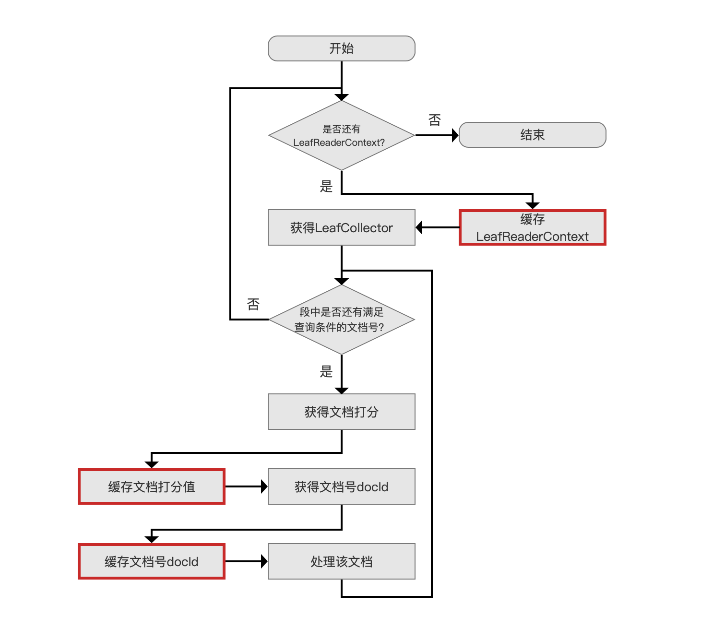
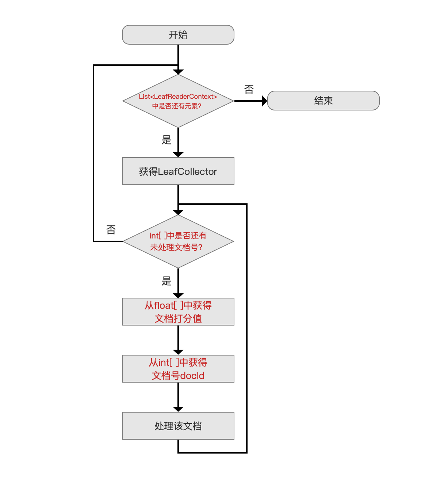
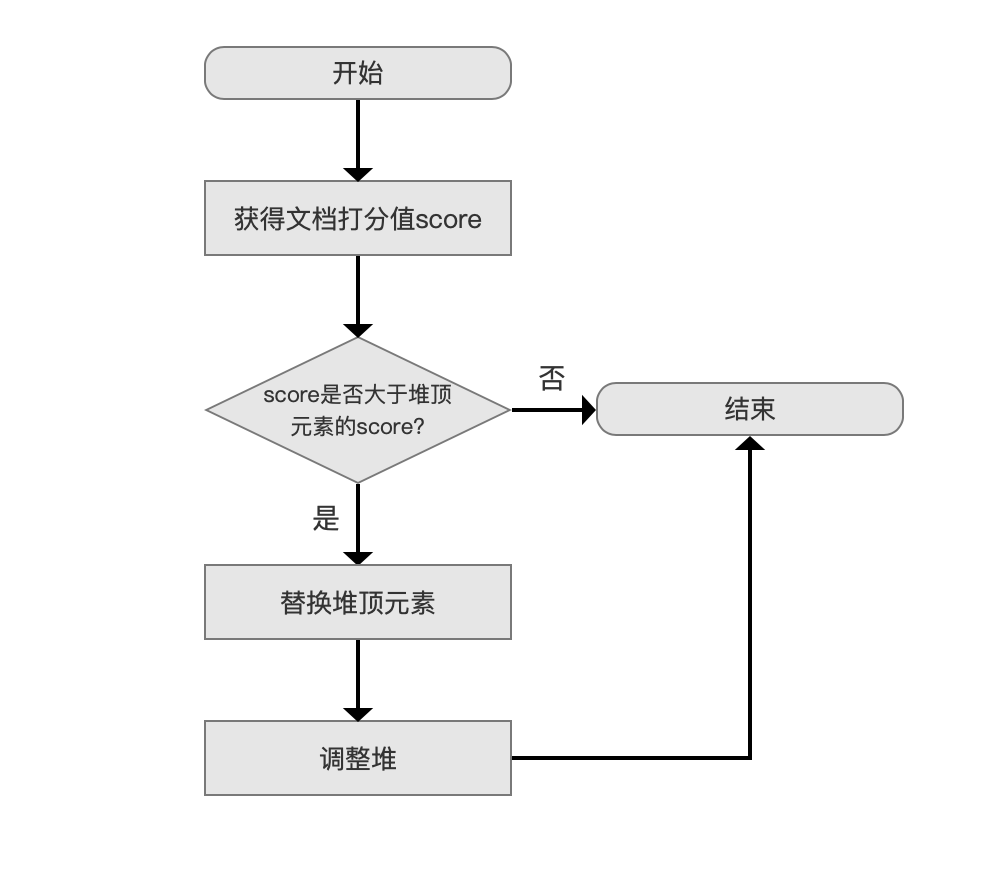
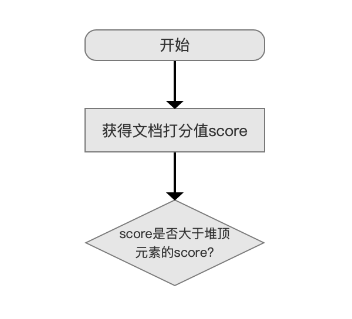
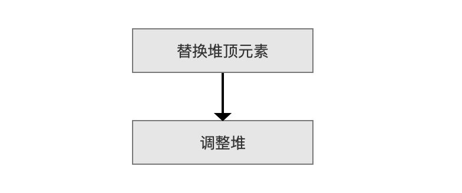
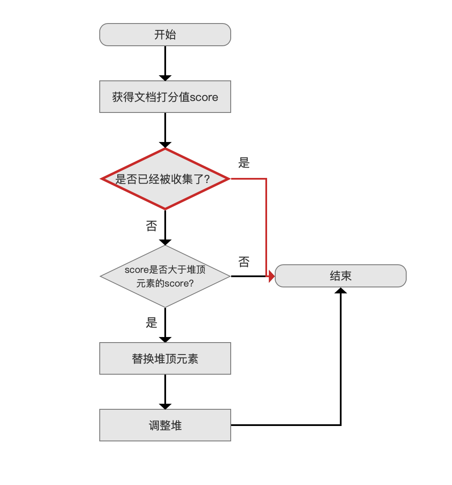

# [Collector（二）](https://www.amazingkoala.com.cn/Lucene/Search/)（Lucene 7.5.0）

&emsp;&emsp;本文承接[Collector（一）](https://www.amazingkoala.com.cn/Lucene/Search/2019/0812/82.html)，继续介绍其他的收集器。

&emsp;&emsp;图1是Lucene常用的几个Collector：

图1：


# FilterCollector

&emsp;&emsp;FilterCollector类是一个抽象类，它用来封装其他的Collector来提供额外的功能。

## PositiveScoresOnlyCollector

&emsp;&emsp;PositiveScoresOnlyCollector首先过滤出文档的打分值大于0的文档号，然后将文档号交给封装的Collector，由于collect方法（collect方法的介绍见[Collector（一）](https://www.amazingkoala.com.cn/Lucene/Search/2019/0812/82.html)）比较简单，故列出：

```java
public void collect(int doc) throws IOException {
    if (scorer.score() > 0) {
        in.collect(doc);
    }
}
```

&emsp;&emsp;其中in是PositiveScoresOnlyCollector封装的Collector，scorer即一个Scorer对象（见[Collector（一）](https://www.amazingkoala.com.cn/Lucene/Search/2019/0812/82.html)）。

## CachingCollector

&emsp;&emsp;CachingCollector可以缓存Collector收集的一次搜索的结果，使得其他的Collector可以复用该Collector的数据。

&emsp;&emsp;**CachingCollector缓存了哪些数据**：

- List&lt;LeafReaderContext&gt;：在[Collector（一）](https://www.amazingkoala.com.cn/Lucene/Search/2019/0812/82.html)中我们提到，LeafReaderContext描述的是一个段内的信息，当索引目录中存在多个段，那么我们需要用List来缓存所有的LeafReaderContext
- List&lt;int[ ]&gt; docs：一个段中可能有多个满足查询条件的文档，所以使用int[ ]来缓存那些文档的文档号，当索引目录中存在多个段时，需要用List来缓存每一个段中的所有文档号集合
- List<float[ ]> scores：一个段中所有满足查询条件的文档的打分值使用float[ ]缓存，当索引目录中存在多个段时，需要用List来缓存每一个段中的所有文档的打分值集合

&emsp;&emsp;图1中**NoScoreCachingCollector、ScoreCachingCollector**两者的区别在于是否缓存文档的打分值。

### CachingCollector缓存流程图

&emsp;&emsp;图2是Collector处理文档的过程，每个流程点在[Collector（一）](https://www.amazingkoala.com.cn/Lucene/Search/2019/0812/82.html)已作介绍，不赘述：

图2：


&emsp;&emsp;CachingCollector缓存流程图跟图2类似，故用红框标记出不同处：

图3：



### CachingCollector复用流程图

图4：



&emsp;&emsp;另外，CachingCollector可以设置允许缓存文档个数最大值。

&emsp;&emsp;在缓存阶段，当缓存的个数超过阈值，那么清空此前缓存的所有数据，另变量cache的值为false，即这次的缓存操作置为失败，故在复用CachingCollector时需先检查cache的值是否为true。

# TopDocsCollector

&emsp;&emsp;TopDocsCollector类在收集完文档后，会返回一个的TopDocs对象，TopDoc对象是什么不重要，在这篇文章中我们只需要知道收集后的文档信息按照某种排序规则有序的存放在TopDoc对象中，该对象为搜索结果的返回值。根据不同的**排序（sorting）**规则，TopDocsCollector派生出图1中的三种子类：

- DiversifiedTopDocsCollector
- TopScoreDocCollector
- TopFieldCollector

&emsp;&emsp;其中，根据一定的**过滤（filtering）**规则，TopScoreDocCollector、TopFieldCollector还分别派生出两个子类：

- TopScoreDocCollector
    - SimpleTopScoreDocCollector
    - PagingTopScoreDocCollector
- TopFieldCollector
    - SimpleFieldCollector
    - PagingFieldCollector

&emsp;&emsp;上文中我们给出了TopDocsCollector的7个子类，结合图2中的流程，他们之间的流程差异仅在于`处理该文档`这个流程点，即collect(int doc)方法的不同的实现（见[Collector（一）](https://www.amazingkoala.com.cn/Lucene/Search/2019/0812/82.html)）

&emsp;&emsp;**故在下文中，只介绍每个Collector的collect(int doc)方法的具体实现**。

## TopScoreDocCollector

&emsp;&emsp;TopScoreDocCollector类的排序规则为 “先打分，后文档号”：

- 先打分：即先通过文档的打分进行排序，打分值越高，排名越靠前
- 后文档号：由于文档号是唯一的，所以当打分值相等时，可以再通过文档的文档号进行排序，文档号越小，排名越靠前。

&emsp;&emsp;根据过滤规则，我们接着介绍TopScoreDocCollector的两个子类：

- SimpleTopScoreDocCollector：无过滤规则
- PagingTopScoreDocCollector：有过滤规则，具体内容在下文展开

### SimpleTopScoreDocCollector

&emsp;&emsp;SimpleTopScoreDocCollector的collect(int doc)流程图：

图5：



#### score是否大于堆顶元素的score?

图6：



&emsp;&emsp;使用优先级队列PriorityQueue来存放满足搜索条件的文档信息（**文档信息至少包含了文档打分score以及文档号docId**），分数最低的文档信息位于堆顶，堆的大小默认为段中的文档总数（用户也可以指定堆的大小，即用户期望的返回结果TopN的N值）。

&emsp;&emsp;**为什么判断条件是score等于堆顶元素的score的情况下也不满足**：

- 因为collect(int doc)方法接受到的文档号总是按照从小到大的顺序，当score等于堆顶元素的score时，当前文档号肯定大于堆顶元素的文档号，根据上文中TopScoreDocCollector的排序规则，故不满足

#### 调整堆

图7：



&emsp;&emsp;`替换堆顶元素`后，我们需要调整堆重新找到分数最低的文档信息，调整的规则同样按照“先分数，后文档号”。

### PagingTopScoreDocCollector

&emsp;&emsp;PagingTopScoreDocCollector是带有过滤规则的Collector，用来实现分页功能。

&emsp;&emsp;在SimpleTopScoreDocCollector中如果满足搜索条件的文档个数有M个，其中N为用户期望返回的个数（即TopN），为了便于理解，我们这里假设M > 2N，那么第一次搜索后，返回的搜索结果，即N篇文档，任意一篇的打分值score都是**大于等于**剩余的（M - N）篇文档中的任意一篇，如果使用了PagingTopScoreDocCollector，我们可以就从 （M - N）篇文档中继续找出N篇文档，即执行第二次搜索。该PagingTopScoreDocCollector可以使得通过多次调用[IndexSearcher.searchAfter(ScoreDoc after, Query query, int TopN)](https://github.com/LuXugang/Lucene-7.5.0/blob/master/solr-7.5.0/lucene/core/src/java/org/apache/lucene/search/IndexSearcher.java)的方法来实现分页功能，其中ScoreDoc对象after即过滤规则。下面给出ScoreDoc类的部分变量：

```java
public class ScoreDoc {
    public float score;
    public int doc;
    ... ... 
}
```

&emsp;&emsp;score为上文N篇文档中分数最低的打分值，doc为对应的文档号，在下文中会介绍如何使用ScoreDoc作为过滤规则来实现分页功能。

&emsp;&emsp;PagingTopScoreDocCollector的collect(int doc)流程图：

图8：



&emsp;&emsp;除了红色的流程点，其他流程点跟SimpleTopScoreDocCollector是一样的，不赘述。

#### 是否已经被收集了？

图9：


&emsp;&emsp;`是否已经被收集了`描述的是该文档号是否已经在前面的搜索中被收集了，判断的条件如下，如果为true，说明该文档已经被收集了：

```java
    score > after.score || (score == after.score && doc <= after.doc)
```

- score：该值描述的当前文档的打分值
- after：该值即上文中的ScoreDoc对象

&emsp;&emsp;由于after.score是前面所有分页搜索的结果中分数最低的文档，所以如果当前文档的打分值大于after.score，必定该篇文档已经在前面某次分页搜索中被收集过了。

&emsp;&emsp;如果score > after.score不为true，还要考虑score == after.score的情况，在图6 中我们知道如果两篇文档的打分值一样，那么文档号较大的不会被收集，所以在如果当前的文档号小于等于after.doc，必定该篇文档已经在前面某次分页搜索中被收集过了。

&emsp;&emsp;从上面的介绍可以看出，如果一个段中有M篇文档满足搜索条件，在使用分页搜索的情况，每一次Collector都需要处理这M篇文档，只是在每一次的分页搜索时选出N篇文档。

# 结语

&emsp;&emsp;基于篇幅原因，剩余的Collector在下一篇文章中展开。

[点击](http://www.amazingkoala.com.cn/attachment/Lucene/Search/Collector/Collector（二）/Collector（二）.zip)下载附件