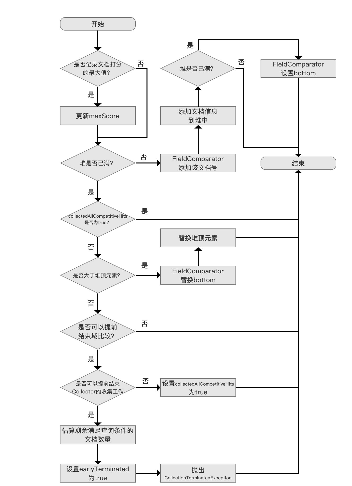
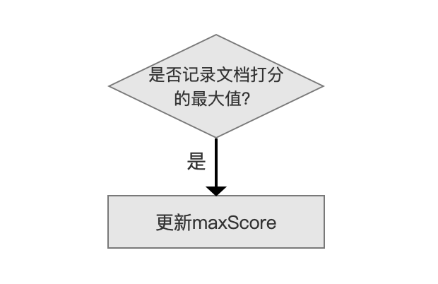
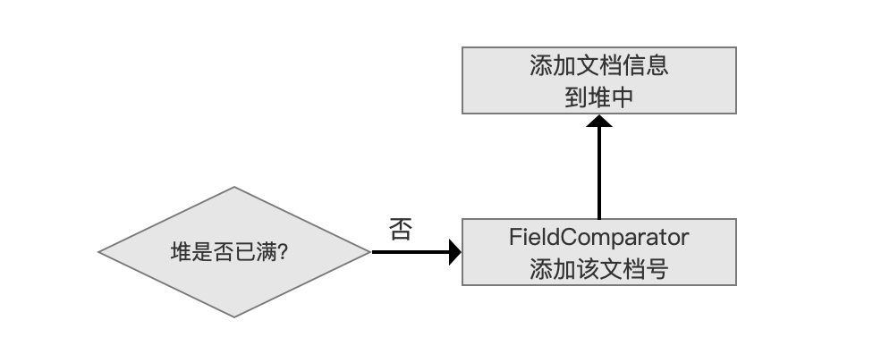
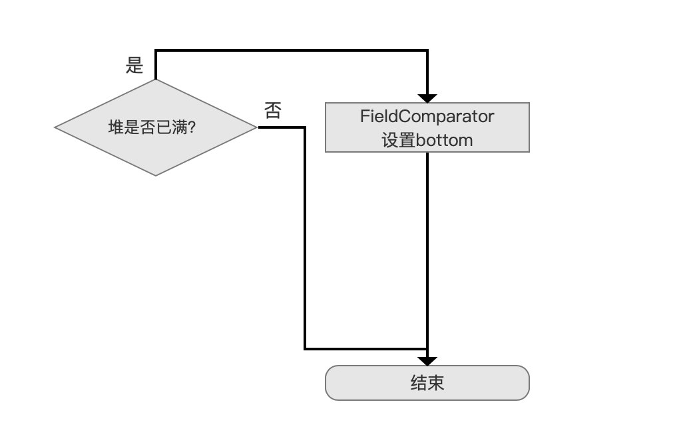
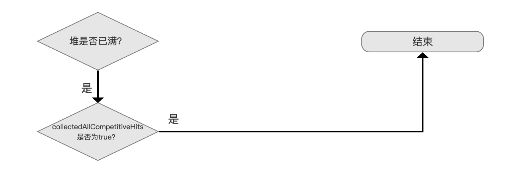
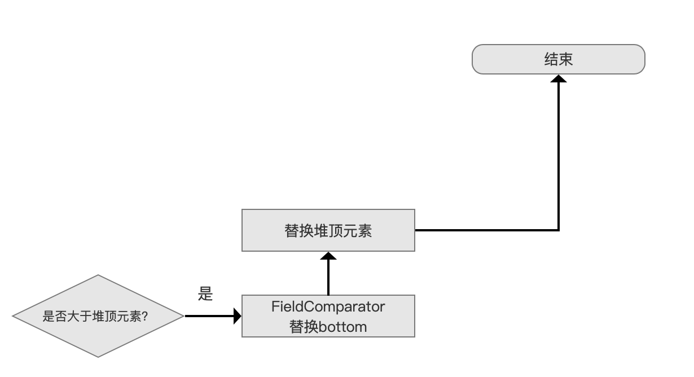
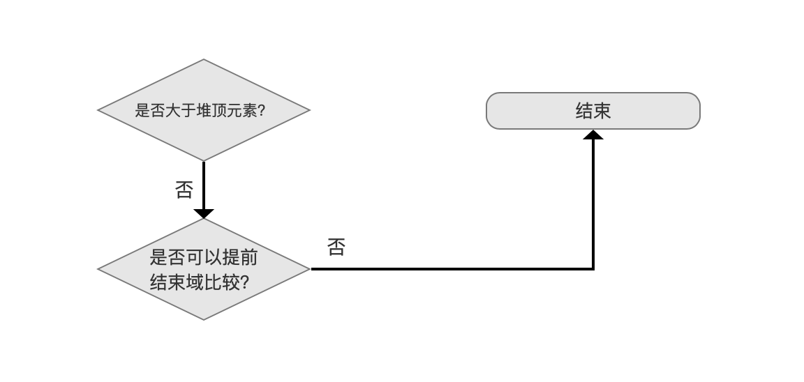
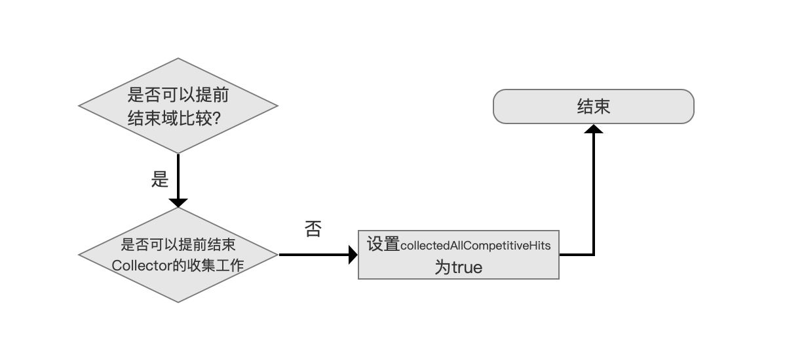
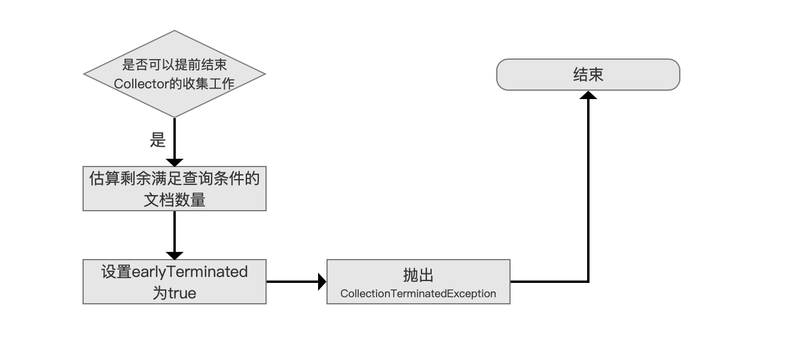
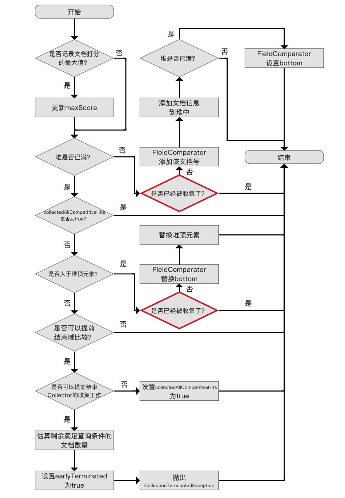

# [Collector（四）](https://www.amazingkoala.com.cn/Lucene/Search/)

&emsp;&emsp;本文承接[Collector（三）](https://www.amazingkoala.com.cn/Lucene/Search/2019/0814/84.html)，继续介绍其他的收集器。

&emsp;&emsp;图1是Lucene常用的几个Collector：

图1：


# TopDocsCollector

## TopFieldCollector

&emsp;&emsp;根据过滤（filtering）规则，TopFieldCollector派生出的两个子类：

- SimpleFieldCollector：无过滤规则
- PagingFieldCollector：有过滤规则，具体内容在下文展开

### SimpleFieldCollector

&emsp;&emsp;SimpleFieldCollector的collect(int doc)方法的流程图：

图2：



[点击]()查看大图

&emsp;&emsp;在介绍每个流程之前，先介绍下TopFieldCollector中的几个变量：

- trackMaxScore：该值是TopFieldCollector类的构造参数，用来描述是否需要记录所有满足查询条件的文档集合中最高的文档打分值，用maxScore用来记录该最大值
- trackDocScores：该值是TopFieldCollector类的构造参数，用来描述是否需要记录所有满足查询条件的文档的文档打分值
- totalHits：该值描述了Collector处理的满足搜索条件的文档数量，每当进入图2的流程，该值就递增一次。

&emsp;&emsp;如果业务中不需要用到文档的打分值或者maxScore，强烈建议另这两个参数为false，因为找出maxScore或者文档的打分值需要遍历所有满足查询条件的文档，无法提前结束Collector工作（canEarlyTerminate），在满足查询提交的文档数量较大的情况下，提前结束Collector的收集工作能显著提高查询性能。canEarlyTerminate会在下文中介绍


#### 记录文档打分值最高的文档

图3：



&emsp;&emsp;如果参数trackMaxScore为true，那么Collector每处理一篇文档，就要记录该文档的打分值score，如果score大于当前maxScore的值，则更新maxScore的值。

#### 添加文档信息

图4：



&emsp;&emsp;使用优先级队列PriorityQueue来存放满足搜索条件的文档信息（**文档信息至少包含了文档打分score以及文档号docId**），分数最低的文档信息位于堆顶，堆的大小默认为段中的文档总数（用户也可以指定堆的大小，即用户期望的返回结果TopN的N值）。

&emsp;&emsp;如果堆没有满，那么将文档号交给FieldComparator，FieldComparator的概念在[FieldComparator](https://www.amazingkoala.com.cn/Lucene/Search/2019/0415/50.html)的文章中介绍了，不赘述，它用来描述文档间的排序关系（**从代码层面讲，通过FieldComparator实现了优先级队列[PriorityQueue的lessThan()](https://github.com/LuXugang/Lucene-7.5.0/blob/master/solr-7.5.0/lucene/core/src/java/org/apache/lucene/search/FieldValueHitQueue.java)方法**），接着添加文档信息到堆中。

#### 设置bottom值

图5：



&emsp;&emsp;在`添加文档信息到堆中`流程后，如果此时堆正好满了，那么我们需要设置bottom的值，即从我们已经处理的文档中找出最差的（the weakest，sorted last），使得当处理下一篇文档时，只需要跟这个最差的文档进行比较即可。

#### 仅统计满足查询条件的文档个数

图6：



&emsp;&emsp;在堆满的情况的下，并且collectedAllCompetitiveHits为true，直接可以退出，尽管直接退出了，还是统计了totalHits的值，所以从collectedAllCompetitiveHits的命名方式也可以看出来只是统计了totalHits。

&emsp;&emsp;**满足下面条件的情况下，collectedAllCompetitiveHits会为true**：

```java
    canEarlyStopComparing == true && canEarlyTerminate == false
```

- canEarlyStopComparing：该值描述了是否可以提前结束域比较，在[Collector（三）](https://www.amazingkoala.com.cn/Lucene/Search/2019/0814/84.html)我们提到，当索引期间通过[IndexWriterConfig.setIndexSort(Sort sort)](https://github.com/LuXugang/Lucene-7.5.0/blob/master/solr-7.5.0/lucene/core/src/java/org/apache/lucene/index/IndexWriterConfig.java)设置的排序规则与搜索期间提供的排序规则一致时，Collector收到的文档集合已经是有序的，在堆已满的情况下，后面处理的文档号就没有比较的必要性了，那么canEarlyStopComparing的值会被true，每次获取一个段的信息时设置canEarlyStopComparing，即调用getLeafCollector(LeafReaderContext context) 时候设置（见[Collector（一）](https://www.amazingkoala.com.cn/Lucene/Search/2019/0812/82.html)）。
- canEarlyTerminate：该值描述了是否可以提前结束Collector的收集工作，canEarlyTerminate设置为true需要满足下面的条件：

```text
trackTotalHits == false && trackMaxScore == false && canEarlyStopComparing
```

&emsp;&emsp;如果满足上面的条件，Lucene会通过抛出异常的方式结束Collector，该异常会被IndexSearcher捕获。这样的好处在于能提高查询性能。比如说某一次查询，我们需要返回Top5，但是满足搜索条件的文档数量有10000W条，那么在Collector中当处理了5篇文档后（文档在段中是有序的），就可以直接返回结果了。

&emsp;&emsp;如果条件不满足，即canEarlyTerminate的值为false，那么尽管我们已经收集了Top5的数据（查询结果不会再变化），但是要继续遍历处理剩余的9995篇文档，因为我们需要记录totalHits（如果trackTotalHits为true）或者需要获得打分值最大的文档（如果trackMaxScore为true），所以此时collectedAllCompetitiveHits为true，继续处理下一篇文档

#### 更新最差的（the weakest，sorted last）文档

图7：



&emsp;&emsp;通过与域比较器（FieldComparator）的bottom值比较，如果比该值更好（competitive），那么先替换bottom，然后重新算出新的bottom，随后还要替换堆顶元素，然后调整堆，算出新的堆顶元素，最后退出继续处理下一篇文档。

#### 无法提前结束域比较

图8：



&emsp;&emsp;由于通过域比较后，当前文档比bottom还要差，那么先通过canEarlyStopComparing判断出能不能提前结束比较，如果canEarlyStopComparing为false，则退出并处理下一篇文档。

&emsp;&emsp;canEarlyStopComparing为false说明段中的文档没有按照搜索期间的排序规则进行排序，所以当前已经收集的TopN未必是最终的搜索结果，所以退出处理下一篇文档。

#### 设置collectedAllCompetitiveHits为true

图9：



&emsp;&emsp;可以提前结束域比较，即canEarlyStopComparing为true，并且不可以提前结束Collector的收集工作，即canEarlyTerminate为false，那么同时满足这两个条件就可以设置collectedAllCompetitiveHits为true了。使得处理下一篇文档时就可以走图6中的流程了。

#### 提前结束Collector的收集工作

图10：



&emsp;&emsp;可以提前结束Collector的收集工作，那么我们先估算剩余满足查询条件的文档数量，通过线性估算出实现，估算方法不展开介绍，没有实际意义。

&emsp;&emsp;接着设置一个earlyTerminated的值为true，用户在得到查询结果后可以通过该值来了解Collector提前结束收集工作这个事件。

&emsp;&emsp;通过抛出[CollectionTerminatedException](https://github.com/LuXugang/Lucene-7.5.0/blob/master/solr-7.5.0/lucene/core/src/java/org/apache/lucene/search/CollectionTerminatedException.java)异常的方式来实现，大家可以点击链接看下源码中对这个异常的解释。

### PagingFieldCollector

&emsp;&emsp;PagingFieldCollector同[Collector（二）](https://www.amazingkoala.com.cn/Lucene/Search/2019/0813/83.html)中的PagingTopScoreDocCollector一样，相对于SimpleFieldCollector实现了分页功能，分页功能的介绍见[Collector（二）](https://www.amazingkoala.com.cn/Lucene/Search/2019/0813/83.html)，不赘述，collect(int doc)的流程图是相似的，并且用红圈标记出不同处。

&emsp;&emsp;PagingFieldCollector的collect(int doc)方法的流程图：

图11：



[点击]()查看大图

#### 是否已经被收集了

&emsp;&emsp;`是否已经被收集了`描述的是该文档号是否已经在前面的搜索中被收集了，判断的条件如下，如果为true，说明该文档已经被收集了：

```java
    topCmp > 0 || (topCmp == 0 && doc <= afterDoc
```

- topCmp：该值描述的当前文档与FileComparator的top值进行比较后的值，top值描述的是之前所有分页搜索的结果中最差的文档，在初始化PagingFieldCollector对象时需要用户提供该值（通过上一次的查询结果就能获得），并设置top的值。如果topCmp > 0，说明当前文档比最差的文档好（competitive），必定该篇文档已经在前面某次分页搜索中被收集过了。
- afterDoc：该值描述的是之前所有分页搜索的结果中最差的文档的文档号，在[Collector（三）](https://www.amazingkoala.com.cn/Lucene/Search/2019/0814/84.html)中我们说到，如果域比较无法区得出排序结果，由于文档号是唯一的，所以再根据文档号进行比较，文档号大的比文档号小的差（uncompetitive），所以在topCmp == 0 情况下，如果当前文档号小于等于afterDoc，必定该篇文档已经在前面某次分页搜索中被收集过了。

# 结语

&emsp;&emsp;在下一篇文档中，我们将继续介绍最后一个Collector，即DiversifiedTopDocsCollector，这将是Collector系列文章的最后一篇。

[点击](http://www.amazingkoala.com.cn/attachment/Lucene/Search/Collector/Collector（四）/Collector（四）.zip)下载附件
